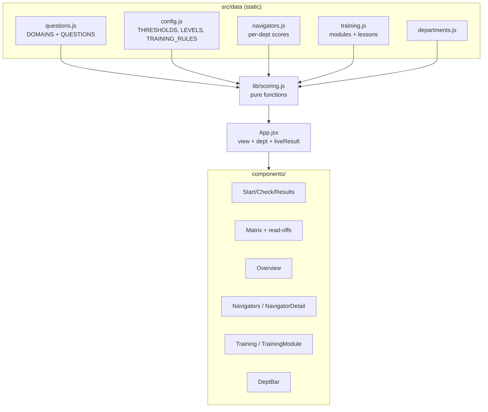
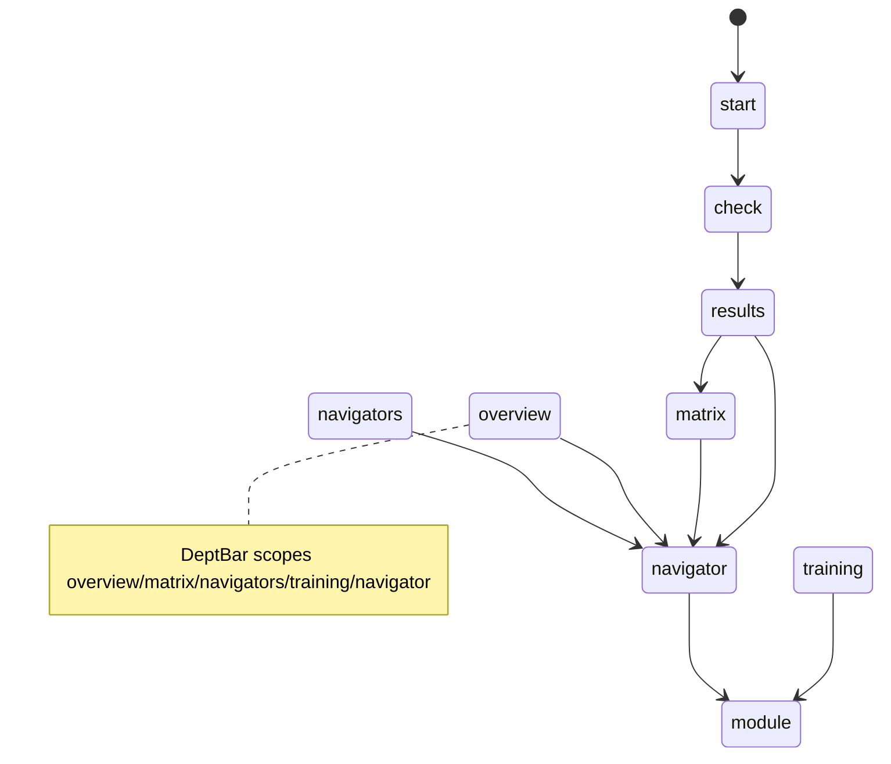

# CLAUDE.md — Quarterly Knowledge Check (Project Knowledge Base)

> **Purpose of this file.** This is the single source of truth for the project: product
> spec, architecture reference, development journal, decision log, and onboarding doc in one.
> A new developer or AI agent should be able to read **only this file** and become productive.
>
> **Maintenance rule (mandatory).** No change is "done" until this file is updated. Whenever a
> feature, architecture, decision, bug, or goal changes, update the relevant section(s) **and**
> add a dated entry to [§7 Development History](#7-development-history). Keep
> [§8 Current System State](#8-current-system-state) and [§15 Current Priorities](#15-current-priorities)
> accurate at all times.
>
> **Last updated:** 2026-06-24 · **Doc maintainer:** Claude (AI agent) + repo owner.
> Assumptions are explicitly marked **[ASSUMPTION]**.

---

## Table of Contents
1. [Project Overview](#1-project-overview)
2. [Product Goals](#2-product-goals)
3. [Product Usage](#3-product-usage)
4. [Feature Inventory](#4-feature-inventory)
5. [Architecture Overview](#5-architecture-overview)
6. [Technical Decisions Log](#6-technical-decisions-log)
7. [Development History](#7-development-history)
8. [Current System State](#8-current-system-state)
9. [Codebase Knowledge](#9-codebase-knowledge)
10. [UX/UI Documentation](#10-uxui-documentation)
11. [Roadmap](#11-roadmap)
12. [Bugs & Known Issues](#12-bugs--known-issues)
13. [Lessons Learned](#13-lessons-learned)
14. [AI Agent Context](#14-ai-agent-context)
15. [Current Priorities](#15-current-priorities)

---

## 1. Project Overview

- **Project name:** Quarterly Knowledge Check (repo: `QuarterKnolwdge`).
- **Product description:** A self-contained web app that runs a quarterly "knowledge check" for
  **patient navigators** (contact-centre agents who handle patient calls) and renders the
  **capability map** it produces. The check asks scenario questions ("a patient calls wanting X,
  situation is Y — what do you do?"), each tagged to a knowledge **domain**, and scores
  **per domain per person** — never a single overall grade.
- **Core mission:** Turn a team's operational knowledge into a clear, actionable capability map
  that drives development — framed as **"development and fit, not pass/fail."**
- **Vision statement:** Become the standing instrument a contact-centre team lead uses each
  quarter to see exactly who is strong where, where the floor-wide gaps are, who can mentor whom,
  and what training to assign — across every department they run.
- **Target audience:**
  - **Primary (demo audience):** management / team leads evaluating the concept.
  - **End users (modelled):** patient navigators (take the check) and their supervisors (read the
    matrix and dashboards).
- **Key value proposition:** A lightweight, no-backend tool that converts a short scenario quiz
  into a per-domain capability matrix plus "so what" read-offs (gaps, mentors, readiness) and
  auto-assigned training — in seconds, with no install or accounts.
- **Main user problems solved:**
  1. Knowledge assessment that tests **application, not recall**.
  2. No single vanity score — **per-domain** signal that's actually actionable.
  3. Surfaces **floor-wide training priorities** and **mentorship capacity** automatically.
  4. **Auto-assigns training** to each navigator based on their weak points.
  5. Extends the same lens across **multiple departments**.

> **Context / origin.** Built from a build brief (`ClaudeCode_Build_Brief.md`) plus a team SOP
> (`SOP Guide.pdf` — the *Aizer Health Pediatric Department* operational report). The SOP is the
> **source of truth** for the knowledge domains and scenario questions. It is a pediatric
> contact-centre operations document; the prototype derives 6 domains and 20 questions from it.

---

## 2. Product Goals

### Short-Term Goals (current)
- Deliver a credible, self-contained **prototype to demo to management**. ✅ Done.
- Derive domains/questions from the real SOP. ✅ Done.
- Per-domain scoring → Learning/Solid/Can-Teach levels with editable thresholds. ✅ Done.
- Capability matrix (hero) with column gaps, can-teach roster, readiness tally. ✅ Done.
- Analytics dashboards (team overview + per-navigator). ✅ Done.
- Auto-assign training by weak point, with previewable mockup content. ✅ Done.
- Department dimension (Pediatrics + 3 mockup departments). ✅ Done.
- A persistent public deployment for showcasing. ✅ Done (GitHub Pages).

### Mid-Term Goals
- **Multi-department live checks:** a real question set per department (each from its own SOP),
  so all four departments become genuine live checks rather than mockups.
- **Mentor pairing (floor-wide):** auto-match Learning ↔ Can-Teach with balanced mentor load.
- **Coverage / bus-factor risk view:** flag domains with only 0–1 teachers (single point of failure).
- **Training completion tracking:** Assigned → In progress → Done states (in-memory for the demo).

### Long-Term Vision
- A production tool with persistence, multiple SOPs/departments, historical trend (quarter over
  quarter), training ROI, and role-based access — the team lead's standing quarterly instrument.

---

## 3. Product Usage

**What users do.** A navigator takes a short scenario check; supervisors read the resulting
capability map and dashboards and act on them (assign training, plan mentorship).

**Typical workflows / user journey:**
1. **Take the check** — Start → step through ~20 domain-tagged multiple-choice scenarios → submit.
2. **See results** — per-domain % and level (Learning/Solid/Can-Teach); no single grade.
3. **Read the matrix** — sample navigators + the taker's new row, color-coded; with column gaps,
   can-teach roster, readiness tally.
4. **Explore analytics** — Team Overview (floor KPIs, distribution, cross-department strength) and
   per-navigator dashboards (strengths, growth areas, assigned training, suggested mentors).
5. **Manage training** — Training tab shows auto-assigned modules by domain cohort and by
   navigator; preview a module's mockup lesson content.
6. **Switch departments** — the department bar re-scopes the matrix/dashboards/training to
   Pediatrics (live) or one of the three mockup departments.

**Expected outcomes:** a supervisor leaves with (a) a clear capability picture per domain and
department, (b) a ranked list of training priorities, (c) named mentors, and (d) per-person
training assignments.

**Real-world use cases / ideal usage:**
- Quarterly capability review in a contact centre.
- Onboarding gap analysis for new navigators.
- Identifying who is "ready for more" (high Can-Teach count).
- Planning a single training session for a whole cohort weak in one domain.

---

## 4. Feature Inventory

> Status legend: **Complete** · **In Progress** · **Planned** · **Deprecated** · **Removed**.

### F1 — Take-the-Check Flow
- **Purpose:** Assess application of SOP knowledge via scenario MCQs.
- **User benefit:** Fast, low-stakes, domain-tagged assessment.
- **Technical implementation:** [src/components/Check.jsx](src/components/Check.jsx) — stepped,
  one scenario per step, progress bar, optional name, Back/Next, submit. Questions from
  [src/data/questions.js](src/data/questions.js).
- **Status:** Complete.
- **Dependencies:** `QUESTIONS`, `DOMAINS`.
- **Notes:** Stepped flow chosen over single-page for demo clarity.

### F2 — Per-Domain Scoring → Level Mapping
- **Purpose:** Convert answers into per-domain % and a 3-level rating; never one total.
- **User benefit:** Actionable, non-punitive signal.
- **Technical implementation:** `scorePerDomain()` and `scoreToLevel()` in
  [src/lib/scoring.js](src/lib/scoring.js); thresholds in [src/data/config.js](src/data/config.js)
  (`THRESHOLDS = { learning: 60, canTeach: 85 }`).
- **Status:** Complete.
- **Dependencies:** `THRESHOLDS`, `LEVELS`.
- **Notes:** `<60` Learning, `60–84` Solid, `85+` Can-Teach. Easy to change in one place.

### F3 — Capability Matrix (hero screen)
- **Purpose:** Navigators × domains grid, color-coded by level; the centrepiece.
- **User benefit:** Whole-floor capability at a glance.
- **Technical implementation:** [src/components/Matrix.jsx](src/components/Matrix.jsx); rows from
  `buildMatrixRows()`. Live taker appears as a highlighted new row; rows are clickable to the
  navigator dashboard.
- **Status:** Complete.
- **Dependencies:** F2, `SAMPLE_NAVIGATORS`, department scope.

### F4 — Matrix Read-offs (column gaps · can-teach roster · readiness tally)
- **Purpose:** The "so what" — turn the grid into priorities.
- **User benefit:** Immediate training/mentorship signal.
- **Technical implementation:** `columnGaps()`, `canTeachRoster()`, `readinessTally()` in
  [src/lib/scoring.js](src/lib/scoring.js). `COLUMN_GAP_THRESHOLD = 0.5`.
- **Status:** Complete.

### F5 — Team Overview Dashboard
- **Purpose:** Floor-wide KPIs + capability distribution + cross-department strength.
- **User benefit:** Leadership "state of the floor" view.
- **Technical implementation:** [src/components/Overview.jsx](src/components/Overview.jsx);
  `floorStats()`, `domainDistribution()`, `departmentMatrix()`.
- **Status:** Complete.

### F6 — Navigators List + Per-Navigator Dashboard
- **Purpose:** Drill into one person's development picture.
- **User benefit:** Coaching-ready individual view.
- **Technical implementation:** [src/components/Navigators.jsx](src/components/Navigators.jsx) and
  [src/components/NavigatorDetail.jsx](src/components/NavigatorDetail.jsx) — strengths, growth
  areas, per-domain bars (worst→best), per-department strip, assigned training, suggested mentors.
- **Status:** Complete.
- **Dependencies:** F2, F8, F10, `departmentMatrix()`, `mentorSuggestions()`.

### F7 — Suggested Mentors (per navigator)
- **Purpose:** For each non-Can-Teach domain, list colleagues who can teach it.
- **User benefit:** Built-in mentorship matching at the individual level.
- **Technical implementation:** `mentorSuggestions()` in [src/lib/scoring.js](src/lib/scoring.js).
- **Status:** Complete.
- **Notes:** Floor-wide mentor *pairing* (load-balanced) is **Planned** (see Roadmap).

### F8 — Auto-Assigned Training
- **Purpose:** Assign training per navigator by weak point (Required for Learning, Stretch for Solid).
- **User benefit:** Turns the matrix into an action plan automatically.
- **Technical implementation:** `trainingForRow()`, `trainingPlan()`, `trainingByDomain()`,
  `trainingStats()` in [src/lib/scoring.js](src/lib/scoring.js); rules in `TRAINING_RULES`
  ([src/data/config.js](src/data/config.js)); [src/components/Training.jsx](src/components/Training.jsx).
- **Status:** Complete.

### F9 — Training Module Preview (mockup content)
- **Purpose:** Previewable lesson content per domain module.
- **User benefit:** Shows what a navigator would actually receive.
- **Technical implementation:** [src/data/training.js](src/data/training.js) (`TRAINING_MODULES`
  with `lessons` + `keyTakeaways`); [src/components/TrainingModule.jsx](src/components/TrainingModule.jsx)
  shows lessons, takeaways, and the auto-assigned cohort.
- **Status:** Complete (content is **mockup**, flagged in-UI; swap for real materials later).

### F10 — Department Dimension
- **Purpose:** Same domains measured across Pediatrics, Adult Medicine, OB/GYN, Behavioural Health.
- **User benefit:** Cross-department capability view; per-department training.
- **Technical implementation:** [src/data/departments.js](src/data/departments.js);
  per-department scores in [src/data/navigators.js](src/data/navigators.js); `deptSamples()`,
  `departmentOverall()`, `departmentMatrix()`; [src/components/DeptBar.jsx](src/components/DeptBar.jsx)
  selector. Live check assesses **Pediatrics only** (`ASSESSED_DEPT`); others are mockups.
- **Status:** Complete (Pediatrics live; other 3 departments = mockup data).

### F11 — Deployment (GitHub Pages)
- **Purpose:** Persistent public URL for showcasing, independent of the dev environment.
- **Technical implementation:** Vite `base: '/QuarterKnolwdge/'` on build; `gh-pages` branch via
  `npx gh-pages -d dist`. Live at **https://travis-holt.github.io/QuarterKnolwdge/**.
- **Status:** Complete.

---

## 5. Architecture Overview

### Frontend Architecture
- **Framework:** React 18.3 (function components + hooks).
- **Build tool:** Vite 5.4 (`@vitejs/plugin-react`).
- **Language:** JavaScript (JSX). No TypeScript.
- **Styling:** A single hand-written stylesheet, [src/styles.css](src/styles.css) (BEM-ish class
  names, CSS variables for the palette). No CSS framework.
- **State management:** Local React state in [src/App.jsx](src/App.jsx) only (`useState`). No
  Redux/Zustand/Context. State is **in-memory** and resets on reload.
- **Routing:** None (no React Router). Navigation is a `view` string in `App` state. Internal
  views: `start · check · results · matrix · overview · navigators · navigator · training · module`.
- **UI systems:** Custom components in [src/components/](src/components/); shared data in
  [src/data/](src/data/); pure logic in [src/lib/scoring.js](src/lib/scoring.js).

**Folder structure**
```
QuarterKnolwdge/
├── index.html               # Vite entry HTML
├── vite.config.js           # base path for Pages set on build only
├── package.json             # scripts: dev/build/preview/test/test:watch
├── README.md                # quick-start + tweak guide
├── CLAUDE.md                # THIS FILE — project knowledge base
├── ClaudeCode_Build_Brief.md# original brief
├── SOP Guide.pdf            # source of truth for domains/questions
└── src/
    ├── main.jsx             # React root
    ├── App.jsx              # view state + dept scope + in-memory live result
    ├── styles.css           # entire stylesheet
    ├── components/          # Nav, Start, Check, Results, Matrix, Overview,
    │                        #   Navigators, NavigatorDetail, Training,
    │                        #   TrainingModule, DeptBar
    ├── data/                # config, questions, navigators, training, departments
    └── lib/
        ├── scoring.js       # all scoring, read-offs, analytics, training logic
        └── scoring.test.js  # Vitest unit tests for scoring.js (38 tests)
```

### Backend Architecture
- **None by design.** No server, API, database, authentication, or storage. The brief mandates a
  self-contained, in-memory prototype. All data is static JS modules under `src/data/`.

### Infrastructure
- **Hosting:** GitHub Pages (project site) from the `gh-pages` branch.
- **Repo:** `github.com/travis-holt/QuarterKnolwdge` (public).
- **Deployment:** Manual — `npm run build` then `npx gh-pages -d dist --dotfiles`.
- **CI/CD:** None. **[ASSUMPTION]** No GitHub Actions (Codespaces token lacks workflow/Pages-admin
  scope; deploys are run manually from the dev environment).
- **Monitoring:** None.
- **Security:** No secrets, no auth, no PII. Sample/illustrative data only. The Pages site is
  public to anyone with the URL.

### Component / data-flow diagram


### View navigation


---

## 6. Technical Decisions Log

### 2026-06-23 — Use React + Vite (not single HTML file)
- **Decision:** Build as a React 18 + Vite SPA.
- **Reasoning:** User chose it over a single-file vanilla app; gives component structure while
  staying backend-free and fast to start.
- **Alternatives considered:** Single self-contained `index.html` with inline JS.
- **Impact:** Requires Node + a build step; enables clean component decomposition.

### 2026-06-23 — Derive all domains/questions from the SOP
- **Decision:** 6 domains, 20 scenario questions sourced from `SOP Guide.pdf`.
- **Reasoning:** Brief mandates SOP as source of truth; tests real application knowledge.
- **Alternatives considered:** Invented generic domains.
- **Impact:** Content is specific and credible; re-keying to a new SOP means editing
  `questions.js` only.

### 2026-06-23 — Per-domain scoring, never a single total
- **Decision:** Scores and levels are per domain; no overall grade anywhere.
- **Reasoning:** Core product principle ("development and fit, not pass/fail").
- **Impact:** All UI and analytics are domain-keyed.

### 2026-06-23 — Centralised tunable knobs in `config.js`
- **Decision:** Thresholds, level labels/colors, palette, and training rules live in one file.
- **Reasoning:** Brief requires thresholds/sample data/questions to be easy to find and edit.
- **Impact:** Demo tweaks are low-risk and localized.

### 2026-06-23 — Store sample data as percentages (not pre-baked levels)
- **Decision:** `SAMPLE_NAVIGATORS` hold per-domain percentages; levels are derived.
- **Reasoning:** Sample rows and the live taker flow through the same `scoreToLevel()`, keeping
  the matrix internally consistent.
- **Impact:** Changing thresholds updates sample and live rows identically.

### 2026-06-23 — Knowledge-only analytics (no invented KPIs)
- **Decision:** Dropped the "knowledge → performance (QA/CSAT/AHT)" correlation view.
- **Reasoning:** User chose to keep everything derived purely from the check; a real correlation
  would require fabricated operational metrics.
- **Alternatives considered:** Add labelled sample KPIs; a knowledge-only "risk proxy".
- **Impact:** No fabricated metrics anywhere; cleaner, more defensible story.

### 2026-06-23 — Traffic-light level colors
- **Decision:** Learning = red (`#c0392b`), Solid = amber (`#e0b13c`), Can-Teach = green (`#3e8e5a`).
- **Reasoning:** User wanted urgency encoding; green best, red worst.
- **Impact:** Applies everywhere via `LEVELS`; training cohort tags intentionally kept off this
  scale (they signal priority, not capability level).

### 2026-06-23 — Department dimension; Pediatrics live, others mockup
- **Decision:** Add 4 departments sharing the same 6 domains; only Pediatrics is assessed by the
  live check.
- **Reasoning:** The SOP covers Pediatrics; other departments need their own question sets later.
- **Alternatives considered:** Fabricate checks for all departments.
- **Impact:** Cross-department views work now; mockup departments are clearly labelled.

### 2026-06-23 — Deploy via `gh-pages` branch (not Actions)
- **Decision:** Publish `dist/` to a `gh-pages` branch with the `gh-pages` npm tool.
- **Reasoning:** The Codespaces token cannot manage Pages settings or push workflow files;
  branch-based publish works with normal repo write access.
- **Impact:** Deploys are a single manual command; `base` must stay `/QuarterKnolwdge/`.

---

## 7. Development History

### 2026-06-23 — Initial prototype build
- **What changed:** Scaffolded Vite+React app; data layer (`config`, `questions`, `navigators`);
  `scoring.js`; components Start/Check/Results/Matrix/Nav; full stylesheet; README.
- **Files affected:** entire initial `src/` tree, `package.json`, `vite.config.js`, `index.html`.
- **Reason:** Deliver the lean prototype from the brief.
- **Result:** End-to-end flow working; 6 domains / 20 questions; matrix + read-offs. (commit `2f72cf1`)

### 2026-06-23 — Analytics dashboards
- **What changed:** Added Team Overview, Navigators list, per-navigator dashboard; `floorStats`,
  `domainDistribution`, `mentorSuggestions`; clickable matrix rows; nav tabs.
- **Files affected:** `App.jsx`, `Nav.jsx`, new `Overview.jsx`/`Navigators.jsx`/`NavigatorDetail.jsx`,
  `scoring.js`, `styles.css`. *(Folded into subsequent commits.)*
- **Reason:** Make it useful to management beyond a raw matrix.
- **Result:** Floor + individual analytics; mentor suggestions.

### 2026-06-23 — Auto-assign training
- **What changed:** `training.js` catalog, `TRAINING_RULES`, training logic, Training tab,
  per-navigator "Assigned training".
- **Files affected:** `data/training.js`, `data/config.js`, `lib/scoring.js`, `components/Training.jsx`,
  `NavigatorDetail.jsx`, `Nav.jsx`, `App.jsx`, `styles.css`.
- **Reason:** Turn weak points into assigned action.
- **Result:** Required/Stretch assignments by weak point.

### 2026-06-23 — Previewable mockup training modules
- **What changed:** Added lesson content + key takeaways to each module; module preview screen;
  Preview buttons; "assigned because <domain> is at <level>" reasons.
- **Files affected:** `data/training.js`, new `components/TrainingModule.jsx`, `Training.jsx`,
  `NavigatorDetail.jsx`, `App.jsx`, `styles.css`. (commit `2041a08`)
- **Reason:** Make training previewable for the demo.
- **Result:** Clickable, previewable modules with cohorts.

### 2026-06-23 — Traffic-light level colors
- **What changed:** Recolored `LEVELS` to red/amber/green.
- **Files affected:** `data/config.js`. (commit `3d4e5d0`)
- **Reason:** Urgency encoding requested by user.
- **Result:** Consistent traffic-light coloring app-wide.

### 2026-06-23 — Department dimension
- **What changed:** Added `departments.js`; restructured `navigators.js` to per-department scores;
  `deptSamples`/`departmentOverall`/`departmentMatrix`; `DeptBar`; cross-department grid in
  Overview; per-department strip in NavigatorDetail.
- **Files affected:** new `data/departments.js`, `data/navigators.js`, `lib/scoring.js`, new
  `components/DeptBar.jsx`, `App.jsx`, `Overview.jsx`, `Matrix.jsx`, `Navigators.jsx`,
  `Training.jsx`, `NavigatorDetail.jsx`, `styles.css`. (commit `13fa39b`)
- **Reason:** Measure strength across departments.
- **Result:** Department-scoped app; Pediatrics live, 3 mockup departments.

### 2026-06-23 — Deployment to GitHub Pages
- **What changed:** Set Vite `base` for builds; published `dist/` to `gh-pages`.
- **Files affected:** `vite.config.js`; `gh-pages` branch.
- **Reason:** Stable public showcase URL.
- **Result:** Live at https://travis-holt.github.io/QuarterKnolwdge/.

### 2026-06-23 — Added this CLAUDE.md knowledge base
- **What changed:** Created the comprehensive project knowledge base.
- **Files affected:** `CLAUDE.md`.
- **Reason:** Permanent project memory + onboarding doc.
- **Result:** Single source of truth established (this file).

### 2026-06-23 — First automated tests (scoring.js)
- **What changed:** Added Vitest as the test runner and a unit-test suite covering all 18 exports
  of `lib/scoring.js` (scoring, level mapping, matrix build, read-offs, department views, training
  assignment, mentor suggestions). Added `test`/`test:watch` npm scripts. Fixtures are built from
  the real data modules and level boundaries are asserted relative to `THRESHOLDS`, so the tests
  survive future tuning of the config "knobs".
- **Files affected:** new `src/lib/scoring.test.js`, `package.json` (scripts + `vitest` devDep).
- **Reason:** Pay down the top technical-debt item — the pure logic was highly testable and had
  zero coverage.
- **Result:** 38 tests passing (`npm test`); production build unaffected (test file is excluded
  from the app bundle).

> **Note on dates:** all work above was completed in a single session dated **2026-06-23**.
> Git commit short-SHAs are referenced where a discrete commit exists; some incremental work was
> folded into later commits.

### 2026-06-24 — Firebase pilot design complete; implementation plan written
- **What happened:** Full design session completed. Spec and implementation plan written,
  reviewed, and committed.
- **Key decisions locked:**
  - **Persistence:** Firebase/Firestore (free Spark tier). Two collections: `roster` + `results`,
    both UUID-keyed (never name-keyed — no typo/collision risk).
  - **Identity:** Navigator selects name from supervisor-managed roster dropdown + enters a
    4-digit PIN. Supervisor enters hardcoded passcode from `config.js`.
  - **Role split:** `navigator` (own dashboard: per-domain breakdown, strengths/gaps, mentor
    suggestions, assigned training) and `supervisor` (full matrix/overview/training, live via
    `onSnapshot`).
  - **Session:** `src/lib/session.js` owns all localStorage state; exposes `{ role, name,
    navigatorId }` contract; swappable for real auth with no downstream changes.
  - **Sample data:** `SAMPLE_NAVIGATORS` removed. Matrix starts empty; fills with real submissions.
  - **Roster management:** Supervisor adds navigators (name + PIN) via "Add Navigator" form in
    the Navigators tab. Roster shows all members including "Not yet taken" state.
- **Design doc:** `docs/superpowers/specs/2026-06-24-firebase-pilot-design.md`
- **Implementation plan:** `docs/superpowers/plans/2026-06-24-firebase-pilot-plan.md`
- **Status:** Ready to implement. Phase 1 (foundation, no Firebase config needed) can start
  immediately. Phases 2–9 blocked on owner creating the Firebase project and providing
  `.env.local` config.

---

## 8. Current System State

- **Working end to end:** take check → per-domain results → matrix → overview → navigator
  dashboards → training (with previewable modules) → department switching. Build is clean and the
  test suite is green (`npm test` → 38 passing).
- **Existing functionality:** all features F1–F11 (see [§4](#4-feature-inventory)) are **Complete**.
- **Experimental / mockup:**
  - Training **content** is mockup (clearly flagged in UI). Logic is real.
  - **Adult Medicine, OB/GYN, Behavioural Health** carry mockup scores; only **Pediatrics** is a
    live check.
- **Test coverage:** `lib/scoring.js` is unit-tested (all 18 exports). Components and the App view
  router are **not** yet tested.
- **Incomplete areas:** no CI, no persistence, no trend/history, no mentor pairing,
  no coverage/bus-factor view, no completion tracking; no component/UI tests.
- **Active integrations:** none yet — Firebase integration is **planned** (design in progress).
- **Deployment status:** live on GitHub Pages; redeploy is manual.
- **Counts (today):** 6 domains · 20 questions · 6 sample navigators (to be removed) · 4 departments · 38 unit
  tests · ~2,300 LOC across `src/`.

---

## 9. Codebase Knowledge

### Important modules
- **[src/lib/scoring.js](src/lib/scoring.js)** — all pure logic. Exports:
  - `scorePerDomain(answers)` → `{ [domainId]: percent }`
  - `scoreToLevel(pct)` → `'learning'|'solid'|'canTeach'`; `levelFor(pct)` → full descriptor
  - `buildMatrixRows(samples, liveResult)` → rows `{ name, isLive, scores, levels }`
  - `columnGaps(rows)`, `canTeachRoster(rows)`, `readinessTally(rows)`
  - `floorStats(rows)`, `domainDistribution(rows)`, `findRow(rows, name)`
  - `deptSamples(samples, deptId)`, `departmentOverall(scores)`, `departmentMatrix(samples, live)`
  - `trainingForRow(row)`, `trainingPlan(rows)`, `trainingByDomain(rows)`, `trainingStats(rows)`
  - `mentorSuggestions(rows, name)`
- **[src/App.jsx](src/App.jsx)** — holds `view`, `liveResult`, `selected` (navigator),
  `moduleDomain`/`moduleReturn`, `selectedDept`. Builds dept-scoped `rows` and `deptMatrix`,
  passes them down. `DEPT_SCOPED_VIEWS` controls when `DeptBar` shows.

### Data modules (the "knobs")
- **[src/data/config.js](src/data/config.js):** `THRESHOLDS`, `LEVELS`, `LEVEL_ORDER`,
  `COLUMN_GAP_THRESHOLD`, `TRAINING_RULES`, `PALETTE`.
- **[src/data/questions.js](src/data/questions.js):** `DOMAINS` (`{id,name,blurb}`), `QUESTIONS`
  (`{id, domainId, scenario, options:[{id,text}], correctOptionId}`).
- **[src/data/navigators.js](src/data/navigators.js):** `SAMPLE_NAVIGATORS`
  (`{name, departments:{[deptId]:{[domainId]:percent}}}`).
- **[src/data/training.js](src/data/training.js):** `TRAINING_MODULES`
  (`{domainId, title, blurb, estMinutes, lessons:[{title,points[]}], keyTakeaways[]}`);
  `moduleForDomain(id)`.
- **[src/data/departments.js](src/data/departments.js):** `DEPARTMENTS`, `ASSESSED_DEPT`,
  `departmentName(id)`.

### Key shapes
```js
// matrix row (department-scoped)
{ name, isLive, scores: {domainId: pct}, levels: {domainId: 'learning'|'solid'|'canTeach'} }
// department-matrix row (cross-department)
{ name, isLive, depts: { [deptId]: { overall, level } | null } }   // null = not assessed
// training assignment
{ domainId, level, priority: 'Required'|'Stretch', goal, module }
```

### Database schemas / API endpoints / env vars
- **None.** No DB, no API, no environment variables. (If persistence is added later, document the
  schema and any `VITE_*` env vars here.)

### Build & run
```bash
npm install          # install deps
npm run dev          # local dev server (http://localhost:5173, base '/')
npm run build        # production build to dist/ (base '/QuarterKnolwdge/')
npm run preview      # preview the production build
npm test             # run the Vitest suite once (CI-style)
npm run test:watch   # run Vitest in watch mode
# deploy:
npx gh-pages -d dist --dotfiles   # publish dist/ to gh-pages branch
```

---

## 10. UX/UI Documentation

- **Design tone:** calm, professional, credible — an internal product explainer for management.
- **Palette (in `config.js` `PALETTE` + CSS vars in `styles.css`):**
  - Background ivory `#f6f1e7`; surface `#fdfaf3`; ink `#23201b`; muted `#6b6358`.
  - Warm clay accent `#c4744f` (buttons, tags, emphasis).
- **Level colors (traffic-light, `LEVELS`):** Learning red `#c0392b`, Solid amber `#e0b13c`,
  Can-Teach green `#3e8e5a`.
- **Component/style system:** single [src/styles.css](src/styles.css), BEM-ish class names
  (`.matrix__cell`, `.kpi__value`, `.deptbar__pill`, …), CSS variables, responsive grids.
- **Layout rules:** centered max-width container (`--maxw: 1080px`); cards with hairline borders +
  soft shadow; the **matrix is the visual centrepiece**.
- **Key user flows:** see [§3](#3-product-usage) and the view diagram in [§5](#5-architecture-overview).
- **Navigation:** top `Nav` tabs (Overview · Take the check · Matrix · Navigators · Training) +
  `DeptBar` department selector on data views.
- **Accessibility:** options use `role="radio"`/`aria-checked`; buttons for clickable rows; color is
  paired with text labels (level names) so meaning isn't color-only. **[ASSUMPTION]** No formal a11y
  audit performed yet.
- **Branding:** none (brief forbids real company names/logos). All data is illustrative.
- **Screenshots:** none stored in-repo. Live reference: https://travis-holt.github.io/QuarterKnolwdge/.

---

## 11. Roadmap

### Planned
- Multi-department **live** checks (a question set per department, each from its own SOP).
- Training **completion tracking** (Assigned → In progress → Done; in-memory for demo).

### Next Priority
- **Mentor pairing (floor-wide):** load-balanced Learning ↔ Can-Teach matches.
- **Coverage / bus-factor:** flag domains with 0–1 teachers (single point of failure).

### Future Ideas
- Quarter-over-quarter **trend** + training ROI narrative.
- **Leadership one-pager export** (print/PDF) for skip-levels.
- Filters by site/shift/tenure (would require richer data).

### Nice-to-Have
- In-app threshold sliders to demo level re-banding live.
- Heatmap intensity toggle (show % inside matrix cells).

### Technical Debt
- `lib/scoring.js` is unit-tested (Vitest, 38 tests). **Components and the App view router are
  still untested** — add component/integration tests next (would need jsdom + Testing Library).
- No CI/CD (manual deploys); now that a `test` script exists, a CI step could run `npm test` —
  consider a Pages GitHub Action when token scope allows.
- Single large `styles.css` — fine for now; revisit if it keeps growing.
- Repo name typo `QuarterKnolwdge` is load-bearing for the Pages `base` path — don't rename
  casually (would break asset URLs).

---

## 12. Bugs & Known Issues

- **No persistence (by design):** reloading clears the live taker's result. *Severity: low (intended).*
  *Workaround:* re-take the check; sample data always present.
- **Pages deploy is manual:** forgetting `npx gh-pages -d dist` after a build leaves the live site
  stale. *Severity: low.* *Workaround:* always run build+deploy together; verify the live bundle
  hash matches the new build.
- **Mockup departments can be mistaken for real data** if the "illustrative mockup data" note is
  overlooked. *Severity: low.* *Mitigation:* DeptBar shows the note; live check-taker shows
  "not assessed" outside Pediatrics.
- **[ASSUMPTION] No known functional bugs** in scoring/read-offs; logic was spot-verified via Node
  but not unit-tested.

---

## 13. Lessons Learned

- **Codespaces dev server is not a showcase channel.** The forwarded `:5173` port 502s when the
  Codespace sleeps. Lesson: deploy to a persistent host (GitHub Pages) for any demo.
- **Codespaces `GITHUB_TOKEN` is scope-limited.** It cannot change Pages settings or push workflow
  files (`workflow` scope). Lesson: use the `gh-pages` branch publish flow, not an Actions deploy,
  in this environment.
- **Project Pages need a `base` path.** Assets 404 unless Vite `base` = `/<repo>/`. Set it only on
  `build` so local dev stays at `/`.
- **One source of truth for derived values pays off.** Storing sample navigators as percentages
  (not levels) kept the matrix consistent when thresholds and traffic-light colors changed.
- **Resolve contradictory requirements explicitly.** "Knowledge → performance link" vs
  "knowledge-only" conflicted; surfacing it avoided building a view that needed fabricated KPIs.
- **Keep priority encoding separate from capability encoding.** Training Required/Stretch tags were
  deliberately kept off the red/amber/green scale to avoid confusion with levels.

---

## 14. AI Agent Context

**Read this before changing anything.**

- **Project conventions:**
  - All tunable values live in [src/data/config.js](src/data/config.js). Prefer editing data files
    over hard-coding in components.
  - Keep all scoring/analytics logic **pure** and in [src/lib/scoring.js](src/lib/scoring.js).
    Components render; they don't compute business logic.
  - Levels are an enum: `'learning' | 'solid' | 'canTeach'`. Use `scoreToLevel()`/`LEVELS`, never
    re-derive bands inline.
  - Domains are referenced by `id`; question/training/navigator data all key on the same domain ids.
- **Coding standards:** React function components + hooks; ES modules; 2-space indent; descriptive
  comments at the top of data/logic files explaining intent and how to edit.
- **Naming conventions:** components `PascalCase.jsx`; data/logic `camelCase.js`; CSS BEM-ish
  (`block__element`, `--modifier`/`is-active`).
- **Architectural patterns:** single-`App` view router (string `view` state); department scope and
  `liveResult` live in `App` and flow down as props; no global store.
- **Common pitfalls:**
  - Don't rename the repo / change Vite `base` without updating the Pages deploy (asset 404s).
  - Don't invent operational KPIs — the product is **knowledge-only** by decision.
  - The live check only assesses **Pediatrics** (`ASSESSED_DEPT`); other departments are mockups.
  - After any build, **deploy** (`npx gh-pages -d dist --dotfiles`) and verify the live bundle hash.
- **Required workflows:**
  1. Make the change. 2. `npm test` (must be green) **and** `npm run build` (must be clean).
     3. Update **this CLAUDE.md** (relevant section + a §7 history entry). 4. Commit
     (Co-Authored-By: Claude). 5. Push. 6. Redeploy + verify the live site.
  - When you touch `lib/scoring.js` (or the data it reads), update/extend `scoring.test.js` too.
- **Important assumptions:** currently no backend/persistence; in-memory state; sample data only;
  no real patient data or company branding. **Firebase integration is in design** — this
  assumption will change once the pilot feature is implemented.
- **To re-key the check to a different SOP:** edit `DOMAINS` + `QUESTIONS` in `questions.js` (and
  optionally `TRAINING_MODULES`); everything else follows automatically.

---

## 15. Current Priorities

1. **Maintain this CLAUDE.md** on every change (highest standing priority).
2. **Complete the Firebase pilot design + implementation** — convert the prototype into a real
   multi-user webapp (design in progress, see §7 entry dated 2026-06-24).
3. **Structure multi-department live checks** (per-department question sets) when additional SOPs
   are provided.

**Active work items:**
- **[READY TO IMPLEMENT]** Firebase pilot. Design complete; plan written.
  - **Phase 1 (no Firebase config needed):** install Firebase SDK, create `.env.local.example`,
    `src/lib/firebase.js`, add `SUPERVISOR_PASSCODE` to `config.js`, create `src/lib/session.js`.
  - **Phases 2–9:** blocked on owner providing Firebase project config for `.env.local`.
  - Full step-by-step plan: `docs/superpowers/plans/2026-06-24-firebase-pilot-plan.md`.

**Blockers:**
- **Firebase config** — owner must create project at console.firebase.google.com and fill in
  `.env.local` from `.env.local.example` before Phases 2–9 can proceed.
- Real per-department question content requires additional SOPs from the owner.
- Real training materials needed to replace mockup module content.

**Upcoming milestones:**
- ✅ First automated tests for `scoring.js` — done 2026-06-23 (Vitest, 38 tests).
- ✅ Firebase pilot design doc + implementation plan — done 2026-06-24.
- Firebase pilot implementation + redeploy (next).
- Next test step after pilot: component/integration tests (jsdom + Testing Library).

---

*End of CLAUDE.md — keep it current. If you changed the project and didn't update this file, the
change isn't done.*
