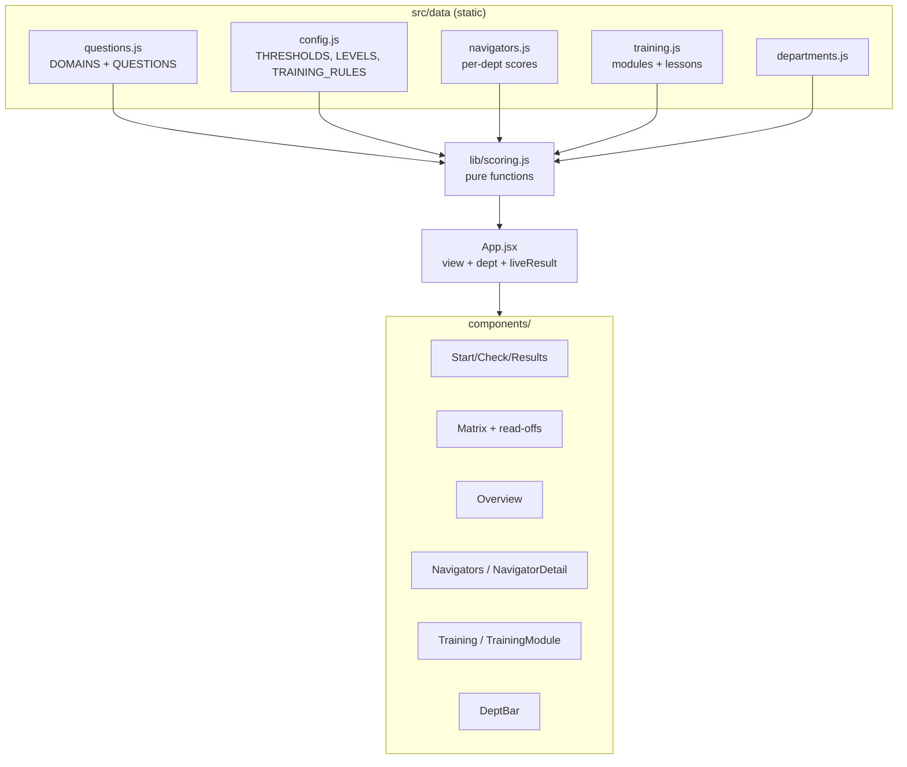
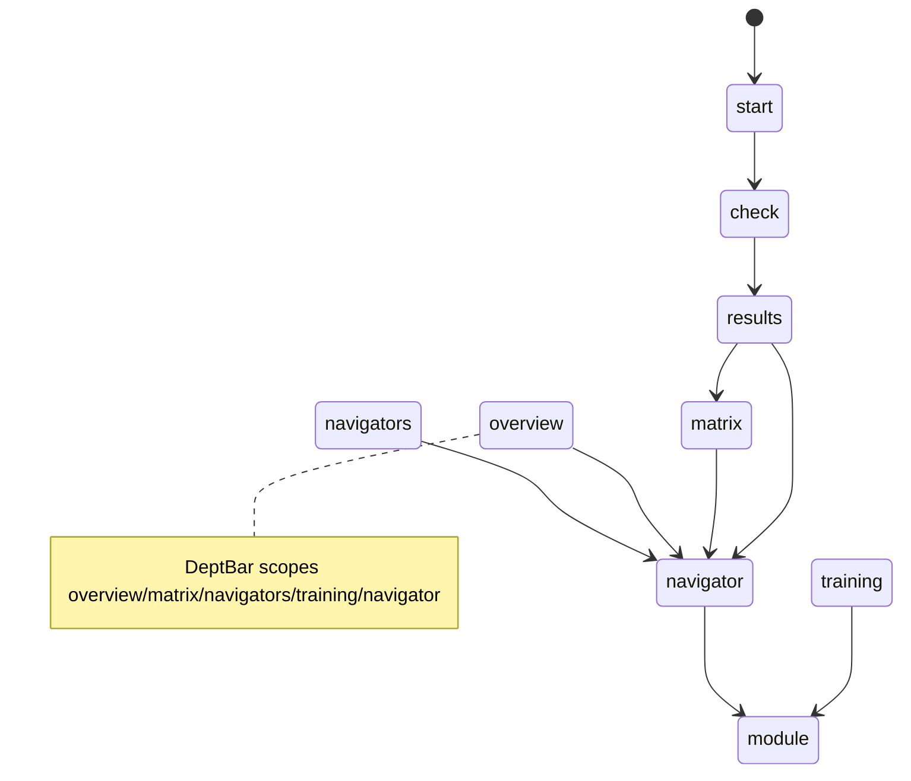

# CLAUDE.md — Knowledge Check (Project Knowledge Base)

> **Purpose of this file.** This is the single source of truth for the project: product
> spec, architecture reference, development journal, decision log, and onboarding doc in one.
> A new developer or AI agent should be able to read **only this file** and become productive.
>
> **Maintenance rule (mandatory).** No change is "done" until this file is updated. Whenever a
> feature, architecture, decision, bug, or goal changes, update the relevant section(s) **and**
> add a dated entry to [docs/HISTORY.md](docs/HISTORY.md) (the development journal; not
> auto-loaded - read it when you need past context). Keep
> [§8 Current System State](#8-current-system-state) and [§15 Current Priorities](#15-current-priorities)
> accurate at all times.
>
> **Last updated:** 2026-07-07 (development history moved to docs/HISTORY.md to cut per-session context cost) ·
> **Doc maintainer:** Claude (AI agent) + repo owner. Assumptions are explicitly marked **[ASSUMPTION]**.

---

## Table of Contents
1. [Project Overview](#1-project-overview)
2. [Product Goals](#2-product-goals)
3. [Product Usage](#3-product-usage)
4. [Feature Inventory](#4-feature-inventory)
5. [Architecture Overview](#5-architecture-overview)
6. [Technical Decisions Log](#6-technical-decisions-log)
7. [Development History](#7-development-history)
8. [Current System State](#8-current-system-state)
9. [Codebase Knowledge](#9-codebase-knowledge)
10. [UX/UI Documentation](#10-uxui-documentation)
11. [Roadmap](#11-roadmap)
12. [Bugs & Known Issues](#12-bugs--known-issues)
13. [Lessons Learned](#13-lessons-learned)
14. [AI Agent Context](#14-ai-agent-context)
15. [Current Priorities](#15-current-priorities)

---

## 1. Project Overview

- **Project name:** Knowledge Check (repo: `QuarterKnolwdge`).
- **Product description:** A self-contained web app that runs a quarterly "knowledge check" for
  **patient navigators** (contact-centre agents who handle patient calls) and renders the
  **capability map** it produces. The check asks scenario questions ("a patient calls wanting X,
  situation is Y — what do you do?"), each tagged to a knowledge **domain**, and scores
  **per domain per person** — never a single overall grade.
- **Core mission:** Turn a team's operational knowledge into a clear, actionable capability map
  that supports readiness decisions, coaching, and training by domain.
- **Vision statement:** Become the standing instrument a contact-centre team lead uses each
  quarter to see exactly who is strong where, where the floor-wide gaps are, who can mentor whom,
  and what training to assign — across every department they run.
- **Target audience:**
  - **Primary (demo audience):** management / team leads evaluating the concept.
  - **End users (modelled):** patient navigators (take the check) and their supervisors (read the
    matrix and dashboards).
- **Key value proposition:** A lightweight, no-backend tool that converts a short scenario quiz
  into a per-domain capability matrix plus "so what" read-offs (gaps, mentors, readiness) and
  auto-assigned training — in seconds, with no install or accounts.
- **Main user problems solved:**
  1. Knowledge assessment that tests **application, not recall**.
  2. No single vanity score — **per-domain** signal that's actually actionable.
  3. Surfaces **floor-wide training priorities** and **mentorship capacity** automatically.
  4. **Auto-assigns training** to each navigator based on their weak points.
  5. Extends the same lens across **multiple departments**.

> **Context / origin.** Built from a build brief (`ClaudeCode_Build_Brief.md`) plus a team SOP
> (`Pediatrics_SOP_Updated.pdf` — the *Aizer Health Pediatric Department* operational report; the
> original `SOP Guide.pdf` is superseded by this updated version). The department SOPs are the
> **source of truth for scenario questions**; since 2026-07-02 the **6 knowledge domains** come
> from the Patient Navigator **role description** (`Patient-Navigators-Job.txt`, owner-provided):
> cross-department call handlers who classify requests, route them, schedule accurately, hold
> scope/privacy boundaries, and document cleanly.

---

## 2. Product Goals

### Short-Term Goals (current)
- Deliver a credible, self-contained **prototype to demo to management**. ✅ Done.
- Derive domains/questions from the real SOP. ✅ Done.
- Per-domain scoring → Learning/Solid/Can-Teach levels with editable thresholds. ✅ Done.
- Capability matrix (hero) with column gaps, can-teach roster, readiness tally. ✅ Done.
- Analytics dashboards (team overview + per-navigator). ✅ Done.
- Auto-assign training by weak point, with previewable mockup content. ✅ Done.
- Department dimension (Pediatrics + 3 mockup departments). ✅ Done.
- A persistent public deployment for showcasing. ✅ Done (Railway).

### Mid-Term Goals
- ✅ **Multi-department live checks:** Pediatrics and OB/GYN are now live checks. Adult Medicine
  and Behavioural Health remain mockups pending their SOPs.
- **Mentor pairing (floor-wide):** auto-match Learning ↔ Can-Teach with balanced mentor load.
- **Coverage / bus-factor risk view:** flag domains with only 0–1 teachers (single point of failure).
- **Training completion tracking:** Assigned → In progress → Done states (in-memory for the demo).

### Long-Term Vision
- A production tool with persistence, multiple SOPs/departments, historical trend (quarter over
  quarter), training ROI, and role-based access — the team lead's standing quarterly instrument.

---

## 3. Product Usage

**What users do.** A navigator takes a short scenario check; supervisors read the resulting
capability map and dashboards and act on them (assign training, plan mentorship).

**Typical workflows / user journey:**
1. **Take the check** — Start → step through ~20 domain-tagged multiple-choice scenarios → submit.
2. **See results** — per-domain % and level (Learning/Solid/Can-Teach); no single grade.
3. **Read the matrix** — sample navigators + the taker's new row, color-coded; with column gaps,
   can-teach roster, readiness tally.
4. **Explore analytics** — Team Overview (floor KPIs, distribution, cross-department strength) and
   per-navigator dashboards (strengths, growth areas, assigned training, suggested mentors).
5. **Manage training** — Training tab shows auto-assigned modules by domain cohort and by
   navigator; preview a module's mockup lesson content.
6. **Switch departments** — the department bar re-scopes the matrix/dashboards/training to
   Pediatrics (live) or one of the three mockup departments.

**Expected outcomes:** a supervisor leaves with (a) a clear capability picture per domain and
department, (b) a ranked list of training priorities, (c) named mentors, and (d) per-person
training assignments.

**Real-world use cases / ideal usage:**
- Quarterly capability review in a contact centre.
- Onboarding gap analysis for new navigators.
- Identifying who is "ready for more" (high Can-Teach count).
- Planning a single training session for a whole cohort weak in one domain.

---

## 4. Feature Inventory

> Status legend: **Complete** · **In Progress** · **Planned** · **Deprecated** · **Removed**.

### F1 — Take-the-Check Flow
- **Purpose:** Assess application of SOP knowledge via scenario MCQs.
- **User benefit:** Fast, low-stakes, domain-tagged assessment.
- **Technical implementation:** [src/components/Check.jsx](src/components/Check.jsx) — stepped,
  one scenario per step, progress bar, optional name, Back/Next, submit. Questions from
  [src/data/questions.js](src/data/questions.js).
- **Status:** Complete.
- **Dependencies:** `QUESTIONS`, `DOMAINS`.
- **Notes:** Stepped flow chosen over single-page for demo clarity.

### F2 — Multi-Signal Scoring → Level Mapping (two axes)
- **Purpose:** Convert answers into per-domain **and** per-competency scores; never one total.
- **User benefit:** Actionable, non-punitive signal on both *what* (domain) and *how* (competency).
- **Technical implementation:** `scorePerDomain(answers, questions)` and
  `scorePerCompetency(answers, questions)` in [src/lib/scoring.js](src/lib/scoring.js) average each
  option's `points` (partial credit, not binary); `scoreToLevel()` maps to the 3 levels. Thresholds
  in [src/data/config.js](src/data/config.js) (`THRESHOLDS = { learning: 60, canTeach: 85 }`).
- **Status:** Complete.
- **Dependencies:** `THRESHOLDS`, `LEVELS`, `COMPETENCIES`.
- **Notes:** `<60` Learning, `60–84` Solid, `85+` Can-Teach (same bands for both axes). Each option
  carries `points` (0–100) + an SOP-referenced `rationale`; the 100-point option is `correctOptionId`.

### F3 — Capability Matrix (hero screen)
- **Purpose:** Navigators × domains grid, color-coded by level; the centrepiece.
- **User benefit:** Whole-floor capability at a glance.
- **Technical implementation:** [src/components/Matrix.jsx](src/components/Matrix.jsx); rows from
  `buildMatrixRows()`. Live taker appears as a highlighted new row; rows are clickable to the
  navigator dashboard.
- **Status:** Complete.
- **Dependencies:** F2, `SAMPLE_NAVIGATORS`, department scope.

### F4 — Matrix Read-offs (column gaps · can-teach roster · readiness tally)
- **Purpose:** The "so what" — turn the grid into priorities.
- **User benefit:** Immediate training/mentorship signal.
- **Technical implementation:** `columnGaps()`, `canTeachRoster()`, `readinessTally()` in
  [src/lib/scoring.js](src/lib/scoring.js). `COLUMN_GAP_THRESHOLD = 0.5`.
- **Status:** Complete.

### F5 — Team Overview Dashboard
- **Purpose:** Floor-wide KPIs + capability distribution + cross-department strength.
- **User benefit:** Leadership "state of the floor" view.
- **Technical implementation:** [src/components/Overview.jsx](src/components/Overview.jsx);
  `floorStats()`, `domainDistribution()`, `departmentMatrix()`.
- **Status:** Complete.

### F6 — Navigators List + Per-Navigator Dashboard
- **Purpose:** Drill into one person's development picture.
- **User benefit:** Coaching-ready individual view.
- **Technical implementation:** [src/components/Navigators.jsx](src/components/Navigators.jsx) and
  [src/components/NavigatorDetail.jsx](src/components/NavigatorDetail.jsx) — strengths, growth
  areas, per-domain bars (worst→best), per-department strip, assigned training, suggested mentors.
- **Status:** Complete.
- **Dependencies:** F2, F8, F10, `departmentMatrix()`, `mentorSuggestions()`.

### F7 — Suggested Mentors (per navigator)
- **Purpose:** For each non-Can-Teach domain, list colleagues who can teach it.
- **User benefit:** Built-in mentorship matching at the individual level.
- **Technical implementation:** `mentorSuggestions()` in [src/lib/scoring.js](src/lib/scoring.js).
- **Status:** Complete.
- **Notes:** Floor-wide mentor *pairing* (load-balanced) is **Planned** (see Roadmap).

### F8 — Auto-Assigned Training
- **Purpose:** Assign training per navigator by weak point (Required for Learning, Stretch for Solid).
- **User benefit:** Turns the matrix into an action plan automatically.
- **Technical implementation:** `trainingForRow()`, `trainingPlan()`, `trainingByDomain()`,
  `trainingStats()` in [src/lib/scoring.js](src/lib/scoring.js); rules in `TRAINING_RULES`
  ([src/data/config.js](src/data/config.js)); [src/components/Training.jsx](src/components/Training.jsx).
- **Status:** Complete.

### F9 — Training Module Preview (mockup content)
- **Purpose:** Previewable lesson content per domain module.
- **User benefit:** Shows what a navigator would actually receive.
- **Technical implementation:** [src/data/training.js](src/data/training.js) (`TRAINING_MODULES`
  with `lessons` + `keyTakeaways`); [src/components/TrainingModule.jsx](src/components/TrainingModule.jsx)
  shows lessons, takeaways, and the auto-assigned cohort.
- **Status:** Complete (content is **mockup**, flagged in-UI; swap for real materials later).

### F10 — Department Dimension
- **Purpose:** Same domains measured across Pediatrics, OB/GYN, Adult Medicine, Behavioural Health.
- **User benefit:** Cross-department capability view; per-department training and question banks.
- **Technical implementation:** [src/data/departments.js](src/data/departments.js) — now exports
  `ASSESSED_DEPTS = ['pediatrics', 'obgyn']`, `DEFAULT_DEPT`, `isAssessed(id)`, and a back-compat
  `ASSESSED_DEPT` alias. [src/data/questions-obgyn.js](src/data/questions-obgyn.js) — 14 sanitized
  OB/GYN seed questions. `deptSamples()`, `departmentOverall()`, `departmentMatrix()`;
  [src/components/DeptBar.jsx](src/components/DeptBar.jsx) selector (shows "live" badge for all
  assessed depts). Navigator picks department at check start (`deptselect` view in `NavigatorApp`);
  can switch departments after without signing out via a nav pill (⇄) or by clicking assessed dept
  cards in the "Strength across departments" strip — clicking calls `handleDeptSelect(deptId)` which
  loads the existing result or starts the check. `NavigatorApp` pre-fetches all assessed dept results
  on mount (`allDeptResults` state) so the strip shows real scores for completed depts immediately.
  Results keyed by composite `${navigatorId}__${department}`; `getActiveQuestions(dept)` filters
  by department field. `sopContextFor(deptId)` in `api/_sop-context.js` grounds all AI features in
  the correct SOP. **All OB/GYN content is sanitized** — generic role labels only, no real provider
  names, phone numbers, or credentials (repo is public).
- **Status:** Complete (**Pediatrics** and **OB/GYN** live; Adult Medicine and Behavioural Health
  = mockup data).
- **Notes:** The 6 domain IDs are shared across all departments and are department-neutral.
  Since the 2026-07-02 redesign they mirror the Patient Navigator job itself: `intake` (Call
  Opening & Identification), `classification` (Call Classification), `routing` (Routing &
  Escalation), `scheduling` (Scheduling & Appointment Rules), `boundaries` (Scope & Privacy),
  `documentation` (Documentation & Follow-through).

### F11 — Deployment (Railway)
- **Purpose:** Persistent public URL + a place to run the Gemini proxy (which GitHub Pages can't).
- **Technical implementation:** `server.js` — Express 5 app that serves `dist/` as static SPA and
  mounts the `/api/*` handlers (same `(req, res)` signature as the Vercel originals; reads `PORT`
  from env, Railway injects it automatically). `railway.toml` — Railpack config (`buildCommand: npm
  run build`, `startCommand: npm start`, `nixpacksConfigPath: nixpacks.toml`). `nixpacks.toml` —
  overrides Railpack's default `npm ci` to `npm install` (avoids `EBADPLATFORM` failures for
  cross-platform optional esbuild packages). `vercel.json` kept for potential future Vercel use.
  Env vars set in Railway service Variables: `VITE_FIREBASE_*` (build-time, baked into bundle),
  `GEMINI_API_KEYS`, `GENERATION_SECRET` (server-only, never bundled). `"engines": { "node":
  ">=20.0.0" }` in `package.json` tells Railpack/Nixpacks to use Node 20 (vitest@4 and vite@8
  require it; Railway's default is Node 18).
- **Status:** Complete (code). **[ASSUMPTION]** Owner sets env vars in Railway project Variables
  before the first deploy (VITE_FIREBASE_* must be present at build time).
- **Notes:** Replaced GitHub Pages (no server support) and Vercel (owner chose Railway). The
  `/QuarterKnolwdge/` base-path hack is retired; app serves at root. For local `/api` dev, run
  `node server.js` after `npm run build`, or just test via Railway deploy.

### F12 — Competency Axis (9 competencies)
- **Purpose:** Measure *how* a navigator thinks/decides/communicates, across all domains.
- **User benefit:** Capability signal orthogonal to topic — surfaces e.g. weak Escalation even when
  domain scores look fine.
- **Technical implementation:** [src/data/competencies.js](src/data/competencies.js) (`COMPETENCIES`
  ×9); `scorePerCompetency()` + `competencyDistribution()` in scoring.js; competency breakdown on
  `NavigatorDetail`, competency distribution on `Overview`. Stored as `results.competencyScores`.
- **Status:** Complete.

### F13 — Two-Layer Coaching (post-check)
- **Purpose:** Immediate, specific feedback after a check — rule-based baseline + optional AI layer.
- **User benefit:** The navigator leaves knowing exactly what to reinforce and why; AI layer adds
  personalized 2–3 sentence coaching grounded in what they actually got wrong.
- **Technical implementation:** [src/components/Coaching.jsx](src/components/Coaching.jsx) — on mount,
  fires `POST /api/generate-coaching` (async) and shows a skeleton while Gemini generates; renders
  AI coaching notes per weak competency above the per-question review when ready; silently falls back
  to rule-based view if the call fails or returns nothing. Rule-based layer (competency chips +
  per-question rationale review) is always present.
  [api/generate-coaching.js](api/generate-coaching.js) — Gemini proxy (same key rotation as
  `generate-scenarios`); builds a digest of missed questions with authored rationales as grounding;
  validates output (only known competency IDs with non-empty strings); returns `{ coaching: {...} }`.
  Temperature 0.4 for consistency; only coaches competencies below `canTeach` threshold. Advisory
  only — never touches a score or Firestore.
- **Status:** Complete (Phase 2 — first AI-in-the-live-path feature).

### F15 — AI Interview Simulation (roleplay + grading)
- **Purpose:** Let navigators practice handling a patient call before a real one — low-stakes,
  repeatable, domain-targeted. After saving, Gemini grades the call and delivers a score + feedback.
- **User benefit:** Gemini acts as a patient caller; the navigator types responses exactly as they
  would on the phone. Every call is different (randomly generated scenario from the SOP). Navigators
  can discard sessions they don't want saved, or save and receive an AI score (0–100) with specific
  strengths and improvements grounded in the SOP.
- **Technical implementation:**
  - [api/interview-turn.js](api/interview-turn.js) — two-mode Gemini proxy: **init** generates
    caller scenario + opening line; **turn** continues the call in character.
  - [api/grade-interview.js](api/grade-interview.js) — new grading endpoint. Takes the full
    transcript + scenario + domain, calls `gemini-2.5-flash` at temperature 0.3 grounded in
    `SOP_CONTEXT`, returns `{ grade: { score, summary, strengths[], improvements[] } }`. Score is
    clamped 0–100 and validated before returning.
  - [src/components/Interview.jsx](src/components/Interview.jsx) — phases: `setup → loading →
    active → saving → grading → reviewed` (or `discarded` if navigator chooses not to save).
    Active phase header has two buttons: **"Save & get feedback"** (saves to Firestore, then grades)
    and **"Discard"** (ends the call without saving anything). The reviewed screen shows the score
    (color-coded green/amber/red), summary, strengths (green card), and improvements (amber card).
    Grade is written back to the Firestore interview doc via `updateInterviewGrade` so supervisors
    can see it too.
  - `updateInterviewGrade(id, grade)` added to [src/lib/db.js](src/lib/db.js).
- **Status:** Complete (Phase 1 roleplay + Phase 2 grading). Supervisor override is **Planned**.
- **Notes:** Scores are advisory — they do not feed `scorePerDomain` or the capability matrix.
  The navigator no longer picks a domain at setup (removed 2026-06-29 to cut choice friction);
  `startInterview` picks a random domain just to anchor the AI scenario, then goes straight to the call.
- **Supervisor access:** `SupervisorApp` passes `navigatorId` to `NavigatorDetail`. The "Practice
  sessions" panel shows each saved session; the header row now includes the score badge (color-coded).
  Expanding a session shows the grade breakdown (summary, what went well, areas to develop) above the
  full transcript. The panel is hidden in the navigator's own dashboard.

### F16 — "Spot the Error" QA Audit Assessment
- **Purpose:** A **scored** QA-audit assessment — navigators act as a QA auditor over AI-generated
  flawed agent transcripts, identifying each SOP violation. **Feeds the capability matrix** (changed
  2026-07-01 from advisory-only training). Offered as a top-level **alternative to the MCQ check** at
  a post-department assessment-type chooser, and also per-domain from the training plan.
- **User benefit:** A real, low-friction assessment of applied domain knowledge that moves the
  navigator's rating — finding others' mistakes tests SOP mastery more sharply than recall.
- **Two modes (both in `SpotTheError.jsx`, driven by `mode` + `domains` props):**
  - **`full`** — the Start-level alternative to MCQ: **one item per domain** across all 6 domains,
    producing a complete per-domain profile. Saved as the primary result (full replacement).
  - **`domain`** — the training-plan launch: `SPOT_ASSESSMENT_SIZE` (=5) items for **one** domain;
    merges just that domain score into the existing result.
- **Technical implementation:**
  - `api/generate-audit.js` — Gemini generates a ~10-turn Patient/Agent transcript with exactly
    one planted SOP violation, plus `errorIndex`, `hint`, and `modelExplanation` (structured JSON
    schema output, temp 0.8). Validation ensures `errorIndex` always lands on an Agent turn.
    (`hint` is now unused by the assessment UI but still returned.)
  - Pure scoring in `scoring.js`: `scoreSpotTheError(picks)` → overall share correct (0–100);
    `scoreSpotTheErrorByDomain(graded)` → `{ domainId: percent }` from `[{domainId, correct}]`.
    Click-accuracy only. Same 0–100 scale as the main check, so results feed domain scores directly.
  - `src/components/SpotTheError.jsx` — phases: `loading` (fires one `/api/generate-audit` call per
    planned item in parallel via `Promise.allSettled`, keeps whatever succeeds; full-mode domains
    that fail to generate backfill to 0) → `active` (one item at a time; **one click per item**,
    then a correct/wrong reveal + Next; each item shows its domain tag) → `review` (overall score +
    level badge, a per-domain breakdown in full mode, and a per-item list of the actual error + what
    the SOP says) → `saving` → `done`. No hints, no reflection, no AI coaching.
  - **Score feed:** `SpotTheError` calls `onComplete(domainScores, mode)`;
    `NavigatorApp.handleSpotComplete` saves the scores (full → replace whole profile; domain →
    merge just that domain), appends a `resultHistory` trend point, and records a `kind:'practice'`
    completion per assessed domain. Local state updates immediately so the dashboard/matrix reflect
    the new ratings without a round-trip.
  - **Entry:** `AssessmentTypeChooser` in `NavigatorApp` (view `typeselect`, shown after
    `deptselect`) → MCQ (`check`) or Spot the Error (`spotfull`). Per-domain launch is still the
    "Spot the Error" step on each assigned training domain in `MyTraining.jsx` (view `audit`).
  - **Coexistence:** MCQ and Spot results are stored in separate docs and both kept — a navigator
    takes either or both, and switches which one the dashboard reflects via `AssessmentBar` (see the
    2026-07-01 "MCQ + Spot the Error results coexist" history entry).
  - **Completion tracking (supervisor):** `subscribeCompletions` in `SupervisorApp` builds
    `completionMap: { [navigatorId]: Set<domainId> }`. "✓ Practiced" badges appear in
    `Training.jsx` (by-navigator section) and `NavigatorDetail.jsx` (assigned training panel).
- **Status:** Complete (scored assessment; MCQ-or-Spot chooser + full-profile mode).
- **Files:** `api/generate-audit.js`, `src/components/SpotTheError.jsx`; edited `src/lib/{scoring,
  scoring.test}.js`, `src/data/config.js`, `src/components/NavigatorApp.jsx`, `src/styles.css`.
- **Notes:** Full mode scores each domain from a single item (0 or 100), so the profile is coarse by
  design (owner's choice: 1 item/domain for speed). `api/coach-audit.js` + `POST /api/coach-audit`
  remain in the repo but are **no longer wired**. One error per transcript (multi-error = v2).
- **Audit bank (2026-07-03, pilot-feedback fix):** transcripts are now pre-generated into a
  Firestore `audits` collection with the question-bank review-gate model (draft → active →
  archived). Supervisor UI `AuditBank.jsx` (Questions tab, below the Question Bank): per-domain
  coverage read-off, pooled generation, transcript review with the planted error highlighted.
  `SpotTheError.jsx` draws shuffled `active` bank items first (instant start, no repeats within
  one assessment) and only live-generates domains the bank can't cover. Fixes the 40-70 s
  loading wait and lets unrealistic transcripts be curated out. db helpers: `subscribeAudits`,
  `getActiveAudits`, `saveDraftAudits`, `activateAudit`, `archiveAudit`, `deleteAudit`.

### F17 — Longitudinal Capability Trends & Training Impact
- **Purpose:** Quarter-over-quarter trend views for domain/competency scores and training impact.
- **User benefit:** Supervisors and navigators see whether scores are growing; training ROI is
  quantified per domain.
- **Technical implementation:** New `resultHistory` Firestore collection (append-only snapshot on
  every `saveResult`). Pure functions in `scoring.js`: `buildTrend(history, { synthesize })` →
  per-domain and overall sparkline series (prepends `TREND_SYNTH_POINTS` illustrative leading points
  when real history < 2); `trainingImpact(history, completions, domainId)` → before/after/delta;
  `teamTrend(allHistory)` → floor solidPlusRate + avgReadiness per time bucket.
  UI: `src/components/Sparkline.jsx` (inline SVG polyline, no dep); trend panel in
  `NavigatorDetail.jsx` (per-domain sparklines + delta badges, fetched via `getResultHistory`);
  team-trend widget in `Overview.jsx` (solidPlusRate + avgReadiness over time via `subscribeResultHistory`).
- **Status:** Complete.
- **Files:** new `src/components/Sparkline.jsx`; edited `src/lib/scoring.js`, `src/lib/scoring.test.js`,
  `src/lib/db.js`, `src/components/{NavigatorDetail,Overview,NavigatorApp,SupervisorApp}.jsx`.

### F18 — Evidence-Based Competency Dossier
- **Purpose:** Per-navigator view tying each competency rating to the exact SOP scenarios they
  answered — what they chose, what was best, and the authored rationale.
- **User benefit:** Turns "you're Learning in Escalation" into a specific, coaching-ready evidence
  record — "here are the 4 questions that drove that rating and what you got wrong."
- **Technical implementation:** `buildDossier(row, answers, questions, interviews, completions)` in
  `scoring.js` → `{ byCompetency, byDomain }`. Competency cards in `NavigatorDetail.jsx` are now
  expandable (clicking the header reveals the question-level evidence). `answers` and `questions`
  props thread from both role apps; `answers` is stored on the result doc by `saveResult`.
- **Status:** Complete.
- **Files:** edited `src/lib/scoring.js`, `src/lib/scoring.test.js`,
  `src/components/{NavigatorDetail,NavigatorApp,SupervisorApp}.jsx`, `src/styles.css`.

### F19 — Supervisor Action Center
- **Purpose:** Unified dashboard aggregating who needs attention and why.
- **User benefit:** Supervisors open one tab and see ranked: critical gaps, training overdue,
  declining trends, failed practice, and navigators ready for more. Each row is clickable.
- **Technical implementation:** `buildActionCenter(rows, { history, interviews, completions })` in
  `scoring.js` → five category arrays. New `src/components/ActionCenter.jsx`. Supervisor tab
  `action` + nav entry "Action Center" + render block in `SupervisorApp.jsx`. New
  `subscribeInterviews(cb, onError)` live subscription in `db.js`; passes `allInterviews` +
  `deptHistory` to ActionCenter.
- **Status:** Complete.
- **Files:** new `src/components/ActionCenter.jsx`; edited `src/lib/{scoring,scoring.test,db}.js`,
  `src/components/{SupervisorApp,Nav}.jsx`, `src/styles.css`.

### F20 — Adaptive, AI-Personalized Development Paths
- **Purpose:** Per-domain 5-step development sequences (coaching → practice → interview → module → mini-check)
  with AI reordering via Gemini.
- **User benefit:** Navigator follows a clear step-by-step path per weak domain. A "Personalize my
  path" button calls Gemini to reorder + annotate the steps based on their actual score profile.
  Mini re-check validates mastery in 4 domain-filtered questions; on completion, a new history
  snapshot is appended (moves the trend line).
- **Technical implementation:**
  - `buildDevPath(row, completions, interviews)` in `scoring.js` → per-domain `{ domainId, steps:
    [{kind, status}], percentComplete }`. Status derived from completions (by kind) + interview grades.
  - New `api/sequence-path.js` — Gemini proxy (temp 0.3, structured JSON, `validateSequenceResponse`
    exported helper). Mounted in `server.js` as `POST /api/sequence-path`. Advisory: falls back to
    rule-based order on failure. Supports `coaching`, `practice`, `interview`, `module`, and
    `minicheck` step kinds.
  - `src/components/MyTraining.jsx` rewritten: flat list → path stepper per domain; "Personalize my
    path" button calls `/api/sequence-path` and merges AI step order with computed status.
  - Mini-check mode in `src/components/Check.jsx`: `miniDomain` + `limit` props filter questions to
    one domain (using `useMemo`). On submit, writes `saveCompletion(.., kind:'minicheck')` and
    optionally `saveResult` (to add a trend point on pass).
  - `MINICHECK_SIZE = 4`, `MINICHECK_PASS = 60` in `config.js`.
- **Status:** Complete.
- **Files:** new `api/sequence-path.js`, `api/sequence-path.test.js`; edited `server.js`,
  `src/lib/{scoring,scoring.test}.js`, `src/data/config.js`, `src/components/{MyTraining,Check,NavigatorApp}.jsx`,
  `src/styles.css`.

### F21 — Mentor Matching Engine (persisted pairings + outcomes)
- **Purpose:** Load-balanced mentor-mentee pairings with Firestore persistence and outcome delta tracking.
- **User benefit:** Supervisor sees suggested pairings (Learning/Solid mentees → least-loaded Can-Teach
  mentors, capped at `MENTOR_MAX_LOAD`), assigns with one click, and tracks score improvement over time.
- **Technical implementation:**
  - `buildMentorMatches(rows, { maxLoad })` in `scoring.js` → `{ pairings, load, unmatched }`.
    Learning mentees prioritized over Solid; least-loaded mentor first; unmatched when no teacher
    or mentor at cap.
  - `pairingOutcomes(savedPairings, rows)` → enriches each pairing with `{ currentScore, delta, improved }`.
  - New `pairings` Firestore collection + `db.js` exports: `savePairing`, `subscribePairings`,
    `updatePairingStatus`. Collection rule added to `firestore.rules` (Phase 0).
  - New `src/components/Mentorship.jsx`: suggested pairings grid (Assign button → `savePairing`),
    active pairings list with delta badges, mentor capacity read-off.
  - Supervisor tab `mentorship` + nav entry "Mentorship" + render block in `SupervisorApp.jsx`.
- **Status:** Complete.
- **Files:** new `src/components/Mentorship.jsx`; edited `src/lib/{scoring,scoring.test,db}.js`,
  `src/components/{SupervisorApp,Nav}.jsx`, `firestore.rules`, `src/styles.css`.

### F22 — Real-Time Voice Practice Call (Gemini Live API)
- **Purpose:** A genuine voice phone call with the AI patient — the caller speaks, the navigator
  speaks back, both in real time, no typing. Separate from the F15 text chat (the navigator picks
  voice **or** chat at the Practice entry — they're never mixed in one UI).
- **User benefit:** The closest thing to a real call. Bidirectional streaming audio, interruptible
  (barge-in), grounded in the same persona/scenario as the chat practice. The transcript is still
  captured under the hood and graded by the existing `/api/grade-interview`, so a voice call
  produces the same score + strengths/improvements review as a chat call.
- **Why this design (vs the first attempt):** v1 bolted browser TTS + Web-Speech STT onto the chat
  UI. It felt glitchy — STT auto-sent on every pause (cutting the navigator off), the caller's text
  bubble appeared *before* its audio (spoiling the line), and chat's turn-based model had no place
  for a real call's rhythm. The owner correctly called out that chat and voice shouldn't share a
  UI. Rebuilt on the **Gemini Live API** (real-time, streaming, interruptible) as its own screen.
- **Technical implementation:**
  - **Server relay — `api/live-relay.js`** (`attachLiveRelay(server)` in `server.js`): a `ws`
    `WebSocketServer` at **`/api/live`**. Browser ⇄ relay ⇄ Gemini Live
    (`BidiGenerateContent` over WSS). The relay holds the key (never exposed to the browser),
    validates the secret via `isValidSecret()` (new non-Express helper in `_auth.js`), and builds
    the patient persona server-side with `buildSystemInstruction()` (reused from `interview-turn.js`).
    The relay start payload includes the selected department and the generated opening line so the
    Live session starts from the same fresh scenario/init output instead of inventing a colder opener.
    Model: **`gemini-3.1-flash-live-preview`** — the gemini-3 Live model, verified to open a session
    on the project keys (a `bidiGenerateContent` model; text flash models like `gemini-3.5-flash`
    can't do the real-time call). Enables `inputAudioTranscription` + `outputAudioTranscription`
    so the relay can forward a text transcript for grading. Protocol is small JSON both ways
    (`start` / `audio` / `ready` / `transcript` / `interrupted` / `turnComplete` / `error`).
  - **Client — `src/components/VoiceCall.jsx`:** gets the scenario+callerName+opening line from the
    existing `/api/interview-turn` init, opens the relay socket, captures mic via
    `getUserMedia({echoCancellation,noiseSuppression,autoGainControl})` → `ScriptProcessorNode`
    → downsample to 16kHz PCM16 → base64 → relay. Caller audio (24kHz PCM16) is decoded into
    scheduled `AudioBufferSource`s on a 24kHz `AudioContext` for gapless playback; an `interrupted`
    message flushes the queue (barge-in). An animated orb shows speaking/listening state. Live
    transcript fragments are whitespace-normalized before captions/grading. End call → coalesced
    transcript → `saveInterview` → `/api/grade-interview` → same reviewed screen as chat.
  - **Entry chooser:** `PracticeChooser` in `NavigatorApp.jsx` — the Practice tab shows two cards
    (Voice call / Text chat); `practiceMode` state routes to `<VoiceCall>` or `<Interview>` and
    resets when the navigator leaves the tab.
- **Status:** Complete. Server relay verified headlessly end-to-end (node client → relay → Gemini →
  caller audio + transcript). **In-browser mic capture/playback must be tested in Chrome/Edge** —
  not verifiable in the headless codespace; Web Audio mic capture is also Chromium-reliable, so the
  text-chat option remains the cross-browser fallback.
- **Files affected:** new `api/live-relay.js`, `src/components/VoiceCall.jsx`; edited `server.js`,
  `api/_auth.js` (added `isValidSecret`), `src/components/NavigatorApp.jsx`, `src/styles.css`,
  `package.json` (`ws` dependency).

### F23 — Adaptive Learning Feedback Loop
- **Purpose:** Make the platform progressively smarter from stored evidence without uncontrolled
  self-learning. The system analyzes historical results, question health, completions, interviews,
  and supervisor feedback, then proposes review-safe improvements.
- **User benefit:** Supervisors get explainable next-best training recommendations, question review
  signals, recurring AI-quality risks, and a proposal queue. Navigators receive coaching/path prompts
  that can use their prior practice evidence when available.
- **Technical implementation:**
  - Pure functions in [src/lib/scoring.js](src/lib/scoring.js): `buildLearningSignals`,
    `buildQuestionImprovementSuggestions`, `adaptiveTrainingRecommendations`, and `feedbackInsights`.
    These return evidence and reasons only; they never mutate scores, active questions, or training.
  - New Firestore collections via [src/lib/db.js](src/lib/db.js): `supervisorFeedback` and
    `learningProposals`, with save/subscribe/status helpers. `firestore.rules` explicitly permits
    both pilot-grade collections.
  - New supervisor UI [src/components/LearningLoop.jsx](src/components/LearningLoop.jsx), reached from
    the "Learning Loop" nav tab. It shows adaptive next steps, question improvement signals,
    supervisor feedback risks, and pending human-review proposals.
  - New [src/components/FeedbackControls.jsx](src/components/FeedbackControls.jsx) lets supervisors
    mark generated or advisory items as `helpful`, `inaccurate`, `needsAdjustment`, `approved`, or
    `rejected`. Added to Learning Loop, flagged question cards, and supervisor-visible interview
    grades.
  - Question revision suggestions create proposal records first. Approval creates a **draft** question
    (`source: 'learning-loop'`) that still must pass the existing Question Bank activation gate.
  - `api/generate-coaching.js` and `api/sequence-path.js` accept optional stored learning evidence
    (prior results, completions, interviews, feedback summaries) so advisory prose/path rationales can
    become more specific over time.
- **Status:** Complete.
- **Safety:** AI and learning-loop output is advisory. No raw check score can be edited, no generated
  question becomes active without supervisor review, and no training-plan change is silently applied.

### F24 — SOP Manager (adder / builder / refiner)
- **Purpose:** Make department SOPs live, supervisor-managed data instead of hardcoded strings —
  add, structure, refine, version, and activate SOPs from the UI. The active SOP grounds all AI
  features for its department.
- **User benefit:** Supervisors onboard a new department (Behavioral Health, Internal Medicine)
  or absorb a floor-rule change by pasting a document — no code deploy. The refiner flags every
  contradiction/outdated rule between new material and the current SOP (e.g. the BH psych-nurse →
  provider-direct routing change).
- **Technical implementation:**
  - **Firestore `sops` collection** — versioned docs `{ department, title, body, version,
    status: draft|active|archived, source: manual|ai-build|ai-refine, createdAt, activatedAt }`.
    At most one active doc per department (`activateSop` archives the rest in one batch).
    `db.js`: `subscribeSops`, `saveSopDraft`, `updateSop`, `activateSop`, `archiveSop`,
    `deleteSop`. Rule added to `firestore.rules`.
  - **[api/_sop-store.js](api/_sop-store.js)** — server-side cached reader (firebase web SDK in
    Node, named app `sop-store`, defensive init from `process.env.VITE_FIREBASE_*`, anonymous
    sign-in tolerated to fail). `getLiveSopSync(dept)` is a SYNC cache read (60s TTL, lazy
    non-blocking refresh) so `sopContextFor()` stays synchronous and none of the 7 AI handlers
    changed. Returns null → hardcoded fallback.
  - **`sopContextFor(deptId)` resolution order:** live active SOP → hardcoded dept context →
    Pediatrics. Role context (`NAVIGATOR_ROLE_CONTEXT`) is always prepended.
  - **[api/refine-sop.js](api/refine-sop.js)** — `POST /api/refine-sop`, two modes (temp 0.2,
    JSON output, key rotation, exported pure validators `validateSopRefineResponse` /
    `validateSopFile` / `validateSopAudit` + 22 tests):
    **build** `{rawText|file, department}` → `{sop:{title, body, notes[], audit}}` structures a
    raw document into the 6-domain SOP layout; **refine** `{rawText|file, currentSop,
    department}` → `{sop:{title, body, changes:[{type: contradiction|outdated|addition|
    clarification, summary}], audit}}` merges new material into the active SOP (new material
    wins, every diff flagged). **File upload (2026-07-03):** `file = { data: base64, mimeType:
    'application/pdf' }` is passed to Gemini natively as a document part (handles scanned PDFs;
    ≤10 MB); `server.js` JSON body limit raised to 20mb. **Fidelity audit:** a second Gemini
    pass (temp 0.1) compares the draft against the source and returns `audit = { omissions[],
    inventions[] }` — source rules missing from the draft and draft statements not traceable to
    the source. Best-effort (null on failure, never blocks). Text inputs capped at 48k chars.
  - **[src/components/SopManager.jsx](src/components/SopManager.jsx)** — supervisor "SOPs" tab
    (dept-scoped via DeptBar, works for non-assessed depts too). Redesigned 2026-07-03:
    drag-and-drop **upload zone** (PDF → base64 → Gemini; TXT/MD read into the paste area; Word
    → "export as PDF" hint), **active-version hero** (pulsing LIVE badge, meta chips: version /
    source / date / section count / word count), **parsed document view** (`parseSopSections`
    renders ALL-CAPS headings as numbered styled sections with rule rows instead of a raw
    `<pre>`; collapsed with a fade + "Read full document"), **version timeline** (rail-dot list
    for drafts/archived), **fidelity chips + detail panels** on AI drafts (✓ passed / ⚠ N
    findings; omissions amber, inventions red — persisted on the draft doc via `saveSopDraft`'s
    new `notes`/`changes`/`audit` fields so they survive reload). Editing the ACTIVE version
    always saves a NEW draft version — active docs are never mutated.
- **Safety:** AI output is always a **draft** the supervisor reviews and activates — the endpoint
  never writes Firestore; nothing goes live without a human click. Same review-gate philosophy as
  F14/F23.
- **Status:** Complete. Verified live: build mode structured a raw BH guide; refine mode caught
  the psych-nurse contradiction + refill-continuity addition while preserving untouched rules.
  C1 is now active in Firebase: Anonymous auth is enabled, the current Firestore rules/indexes are
  deployed, and `sops` saves are allowed for signed-in anonymous app users. `firebase.json` maps the
  deploy command to `firestore.rules` + `firestore.indexes.json`; pass `--project <id>` if the
  Firebase CLI has no active project alias.
- **Files:** new `api/{_sop-store,refine-sop,refine-sop.test}.js`,
  `src/components/SopManager.jsx`; edited `src/lib/db.js`, `api/_sop-context.js`, `server.js`,
  `firestore.rules`, `firebase.json`, `src/components/{SupervisorApp,Nav}.jsx`, `src/styles.css`.

### F25 — Call QA Test (hard rubric-graded voice test)
- **Purpose:** Turn the voice practice call into a real, reliably-graded pass/fail test scored
  against the owner-provided call quality guide (`Aizer_Health_Navigator_Quality_Guide_SOP.pdf`,
  a scanned PDF — transcribed via Gemini native PDF input).
- **User benefit:** Navigators take a graded QA test call (separate Practice-tab card, alongside
  Voice call / Text chat). They get a hard PASS/FAIL, a per-category scorecard, the exact criteria
  they lost points on, and auto-fail alerts. Supervisors see a "QA TEST · PASS/FAIL" badge on the
  session in NavigatorDetail plus the full grade breakdown.
- **Reliability design (the core of the feature):** the AI never produces a score.
  1. **Fixed binary rubric** ([api/_qa-rubric.js](api/_qa-rubric.js)): the guide's 100-point
     scorecard as structured data — 9 categories / 20 criteria (Opening 10 · Verification 10 ·
     Call Control 10 · Doc Reason 10 · Communication 15 · Active Listening 10 · Knowledge 15 ·
     Scheduling 15 · Closing 5) + 3 auto-fails (HIPAA/verification, clinical scope, conduct).
     Timing metrics from the guide (<5s answer, 11s dead air, 2-min hold) are not transcript-
     observable and are folded into observable call-control criteria instead. The guide's
     internal Closing inconsistency (5 vs 10 pts) resolved in favor of the 100-point scorecard.
  2. **Gemini returns only verdicts** (`MET`/`NOT_MET`/`NA`) per criterion at **temperature 0**
     with a **verbatim evidence quote** each ([api/grade-call-qa.js](api/grade-call-qa.js),
     `POST /api/grade-call-qa`; scored output → no lite-model fallback; one retry on malformed
     shape).
  3. **Deterministic trust gates + scoring in code** (`scoreQa`): MET without evidence that
     verifies against the transcript (normalized substring + single-turn word-set fallback) →
     NOT_MET; NA on a core (always-expected) criterion → NOT_MET; auto-fail stands only with
     verified evidence (anti-hallucination), and zeroes the score. Score = earned/applicable
     points; **pass = ≥85 (`QA_PASS_THRESHOLD`) with zero auto-fails**. Same verdicts in → same
     result out.
  4. `buildGradeProjection` maps the scorecard onto the existing interview `grade` shape
     (score/summary/strengths/improvements) so all existing supervisor UI renders it unchanged;
     the full scorecard is stored as a new `qa` field via `updateInterviewGrade(id, grade, qa)`.
     Strengths/improvements carry the verified transcript quote for each finding.
  4b. **Confidence / supervisor-review layer (2026-07-06, `assessQa`):** a deterministic
     assessment on top of the scorecard returns `recommendation`
     (`pass`/`needs_review`/`fail`), `confidence`, `safetyRisk`, and `reviewFlags` (low
     transcript confidence, unverified grader evidence, possible-unsafe-behavior for
     unverified auto-fail reports, thin rubric coverage, safety-critical criterion missed,
     borderline score, auto-fail supervisor confirmation). Borderline, low-confidence,
     unconfirmed-unsafe, and pass-over-a-safety-miss results are flagged NEEDS REVIEW instead
     of a confident verdict — the AI score is decision support, not the final word. Stored on
     the `qa` field (`qa.review`) and rendered in both the navigator results screen and the
     supervisor session panel.
  5. **Transcript fairness layer (2026-07-03):** Gemini Live's transcription has no domain
     vocabulary, so it mis-hears SOP proper nouns ("Aizer Health" → "Isr Pediatrics", provider /
     queue / street names, "PE") and the literal grader then failed navigators for terms they
     actually said right. `api/_qa-glossary.js` snaps those mis-hearings to the canonical SOP term
     **before grading** — bounded to a curated glossary (explicit aliases + high-threshold
     single-word fuzzy on distinctive proper nouns), so it can never emit a word outside the
     glossary (no hallucination). `grade-call-qa.js` corrects the transcript first, then grades /
     verifies evidence against the corrected text, and the grader prompt now carries the canonical
     vocabulary + abbreviation equivalences (PE = physical exam, TE = telephone encounter, …) so a
     synonym never costs a criterion. The grader also gets **scoped FAIRNESS RULES**: don't fail a
     criterion on a mis-transcribed/synonymous term, and accept a natural mutual close for the
     closing pleasantry criterion (`close-anything-thanks` reworded) — while verification, scope,
     routing, scheduling, and SOP-knowledge stay strict.
- **UI:** `VoiceCall.jsx` gains a `mode='practice'|'test'` prop — test mode has its own copy
  ("graded hard, no partial credit"), grading via `/api/grade-call-qa` (60s timeout), and a
  results screen: PASS/FAIL banner, score, auto-fail cards with the quoted offending line,
  per-category bars, and a "Points you lost" list. Third `PracticeChooser` card ("Call QA Test",
  🎯) routes `practiceMode='test'`.
- **Navigator assessment entry (2026-07-03):** The Call QA Test is also a first-class option in
  `AssessmentTypeChooser` after department selection, alongside Multiple choice and Spot the
  Error. That route reuses `VoiceCall mode='test'`, returns to the dashboard from the review
  screen, and shows the latest department-scoped QA test as a small PASS/FAIL dashboard card
  (score, date, Retake). The Practice-tab card remains available. As of later 2026-07-03, this
  route also writes a `results` doc with `assessmentType:'qa'`; `scoreQaAcrossDomains(qa)` applies
  the QA score to all six domain scores so the matrix, training plan, trend history, and navigator
  dashboard update from the Call QA Test.
- **Status:** Complete. Live-verified (see the 2026-07-03 history entry): a strong fixture call
  graded 100/PASS twice with identical per-criterion verdicts; a bad fixture call (read lab
  results + gave med advice + sarcasm + no verification) triggered the auto-fails and failed at 0.
- **Notes:** Call QA now feeds the capability matrix from both the assessment chooser and Practice tab,
  while still storing the full scorecard on the interview doc. The QA rubric is not yet tagged to
  the six SOP domains, so the one full-call QA score is applied evenly to all six domains. Advisory
  practice grading (`grade-interview`) is unchanged. Domain-practice analytics ignore interview
  docs that have `qa`, so the random scenario domain used to generate the voice call cannot count
  as domain practice evidence. Supervisor override remains Planned.
- **Files:** new `api/{_qa-rubric,grade-call-qa,grade-call-qa.test,_qa-glossary,_qa-glossary.test}.js`;
  edited `server.js`, `src/lib/{db,scoring,scoring.test}.js`,
  `src/components/{VoiceCall,NavigatorApp,NavigatorDetail,Interview}.jsx`, `src/styles.css`.

### F14 — Question Bank + Gemini Scenario Generation (review gate)
- **Purpose:** Grow the check from the SOP; questions are live Firestore data, not a static file.
- **User benefit:** Supervisors generate, review, and curate the assessment without a code change.
- **Technical implementation:** Firestore `questions` collection (`draft`/`active`/`archived`);
  `db.js` CRUD (`subscribeQuestions`, `getActiveQuestions`, `saveDraftQuestions`, `activate/archive/
  delete/updateQuestion`, `seedQuestionsIfEmpty`); supervisor UI
  [QuestionBank.jsx](src/components/QuestionBank.jsx) + [QuestionEditor.jsx](src/components/QuestionEditor.jsx);
  server [api/generate-scenarios.js](api/generate-scenarios.js) (Gemini `gemini-2.5-flash`,
  structured JSON output, validated/repaired; rotates across multiple keys on rate-limit). Only
  **active** questions appear in the check; AI drafts require human activation.
- **Status:** Complete. Owner sets `GEMINI_API_KEYS`/`GEMINI_API_KEY` + `GENERATION_SECRET` in
  Railway for deployed AI features.

---

## 5. Architecture Overview

### Frontend Architecture
- **Framework:** React 18.3 (function components + hooks).
- **Build tool:** Vite 5.4 (`@vitejs/plugin-react`).
- **Language:** JavaScript (JSX). No TypeScript.
- **Styling:** A single hand-written stylesheet, [src/styles.css](src/styles.css) (BEM-ish class
  names, CSS variables for the palette). No CSS framework.
- **State management:** Local React state (`useState`). No Redux/Zustand/Context. [App.jsx](src/App.jsx)
  owns the **session** (role + name + navigatorId) only and routes to one of two role apps:
  [SupervisorApp.jsx](src/components/SupervisorApp.jsx) (live Firestore data) or
  [NavigatorApp.jsx](src/components/NavigatorApp.jsx) (the signed-in navigator's own data). Each role
  app owns its own `view` state and data subscriptions.
- **Routing:** None (no React Router). Navigation is a `view` string inside each role app.
  Supervisor views: `overview · matrix · navigators · navigator · training · module`. Navigator
  views: `check · dashboard · training · module`. The Start **gate** (role select → navigator
  dropdown+PIN creation/login / supervisor passcode) shows when there is no session.
- **UI systems:** Custom components in [src/components/](src/components/); shared data in
  [src/data/](src/data/); pure logic in [src/lib/scoring.js](src/lib/scoring.js).

**Folder structure**
```
QuarterKnolwdge/
├── index.html               # Vite entry HTML
├── vite.config.js           # base '/' (served at root)
├── vercel.json              # Vercel config (kept; Railway is the active host)
├── railway.toml             # Railway/Railpack config (build + start + nixpacksConfigPath)
├── nixpacks.toml            # overrides npm ci → npm install (avoids EBADPLATFORM)
├── server.js                # Express server: serves dist/ + mounts /api/* handlers
├── package.json             # scripts: dev/build/preview/test/test:watch/start; engines node>=20
├── README.md                # quick-start + tweak guide
├── CLAUDE.md                # THIS FILE — project knowledge base
├── SOP Guide.pdf            # source of truth for domains/questions
├── .env.local.example       # Firebase + Gemini env template (copy → .env.local, gitignored)
├── firestore.rules          # pilot-grade Firestore security rules (roster/results/questions)
├── api/                     # API handlers (originally Vercel serverless; now served by Express)
│   ├── generate-scenarios.js#   Gemini proxy (holds GEMINI_API_KEY; validates output)
│   ├── generate-coaching.js #   Gemini post-check coaching notes
│   ├── interview-turn.js    #   Gemini roleplay (init + turn)
│   ├── grade-interview.js   #   Gemini practice-call grading
│   ├── generate-audit.js    #   Gemini "Spot the Error" transcript
│   ├── coach-audit.js       #   Gemini audit-reflection coaching
│   ├── sequence-path.js     #   Gemini dev-path step reordering
│   ├── live-relay.js        #   WebSocket relay → Gemini Live API (real-time voice call)
│   ├── health.js            #   deploy/health check
│   ├── _gemini-client.js    #   shared getApiKeys/callGemini/geminiWithRotation (helper, not a route)
│   └── _sop-context.js      #   SOP grounding text (helper, not a route)
└── src/
    ├── main.jsx             # React root
    ├── App.jsx              # session + role routing (thin shell)
    ├── styles.css           # entire stylesheet
    ├── components/          # Nav, Start, Check, Coaching, Matrix, Overview, Navigators,
    │                        #   NavigatorDetail, Training, MyTraining, TrainingModule,
    │                        #   QuestionBank, QuestionEditor, DeptBar, SupervisorApp,
    │                        #   NavigatorApp, EmptyState, Footer,
    │                        #   Reveal + CountUp (presentation-layer motion primitives)
    ├── data/                # config, questions (DOMAINS + SEED_QUESTIONS), competencies,
    │                        #   navigators (placeholder), training, departments
    └── lib/
        ├── firebase.js      # Firebase app init + Firestore instance (defensive)
        ├── db.js            # ALL Firestore reads/writes (roster + results + questions)
        ├── session.js       # localStorage session layer (isolated, swappable for real auth)
        ├── useInView.js     # IntersectionObserver hook (scroll-reveal trigger)
        ├── useCountUp.js    # rAF count-up hook (reduced-motion aware)
        ├── scoring.js       # all scoring (2 axes), read-offs, analytics, training logic
        └── scoring.test.js  # Vitest unit tests for scoring.js
```

### Backend Architecture
- **Firebase / Firestore (pilot).** The app persists data to Cloud Firestore (free Spark tier).
  Three collections: `roster` (navigator list), `results` (submissions, now incl.
  `competencyScores`), and `questions` (supervisor-managed scenario bank: `draft`/`active`/
  `archived`) — all UUID-keyed. All Firestore access is isolated in [src/lib/db.js](src/lib/db.js);
  init in [src/lib/firebase.js](src/lib/firebase.js) (reads `VITE_FIREBASE_*` from `.env.local`).
- **Express server + `/api` handlers.** [server.js](server.js) is the Railway entry point: an
  Express 5 app that serves `dist/` as static files (SPA catch-all via `/*splat`) and mounts
  the REST Gemini handlers plus [api/health.js](api/health.js) as Express routes. The handlers use
  the same `(req, res)` Node.js signature they had as Vercel functions — no changes needed.
  `api/_gemini-client.js` keeps `GEMINI_API_KEYS` **server-side only** (never bundled), calls
  Gemini with structured-JSON/text outputs, and rotates keys on 429/403/503/500. Helper modules are
  `_`-prefixed (`api/_sop-context.js`, `api/_auth.js`). REST endpoints are gated by
  `GENERATION_SECRET` — pilot-grade.
- **No auth system** (by design for the pilot): navigators pick their name from the roster and
  create a 4-digit PIN on first sign-in when the roster row has none; returning navigators enter
  that PIN. Supervisors enter `SUPERVISOR_PASSCODE`. Session persistence is localStorage only,
  isolated in [src/lib/session.js](src/lib/session.js). Security rules in `firestore.rules` are
  pilot-grade (open per-collection) — replace with real auth before production.
- **Pre-pilot state (historical):** the original prototype was fully in-memory; then a static
  GitHub-Pages + Firestore pilot with no server; then Vercel serverless; now Railway + Express.

### Infrastructure
- **Hosting:** **Railway** — runs the Express server (`server.js`) which serves the Vite build
  and the `/api` routes from a single persistent Node.js container. Auto-deploys on push to `main`.
- **Repo:** `github.com/travis-holt/QuarterKnolwdge` (public).
- **Deployment:** Railway (Git-connected to `main`). Railpack detects Node.js; `railway.toml`
  sets `buildCommand: npm run build`, `startCommand: npm start`, and points to `nixpacks.toml`
  which overrides the install step from `npm ci` to `npm install` (prevents `EBADPLATFORM` errors
  for cross-platform optional esbuild packages). Requires `engines.node >=20.0.0` (set in
  `package.json`) because vitest@4 and vite@8 require Node 20+; Railway defaults to Node 18.
  Env vars in Railway service Variables: `VITE_FIREBASE_*` (client, build-time — must be set
  BEFORE first build), `GEMINI_API_KEYS` + `GENERATION_SECRET` (server-only, never bundled).
  **Historical:** GitHub Pages (retired — no server) → Vercel (owner chose Railway instead).
- **CI/CD:** None beyond Railway's build. **[ASSUMPTION]** No GitHub Actions.
- **Monitoring:** None (Railway console shows logs + metrics).
- **Security:** `GEMINI_API_KEYS`/`GENERATION_SECRET` are server-only Railway env vars and never
  in the bundle. No PII; sample/illustrative data only. Site is public to anyone with the URL.

### Component / data-flow diagram


### View navigation


---

## 6. Technical Decisions Log

### 2026-06-23 — Use React + Vite (not single HTML file)
- **Decision:** Build as a React 18 + Vite SPA.
- **Reasoning:** User chose it over a single-file vanilla app; gives component structure while
  staying backend-free and fast to start.
- **Alternatives considered:** Single self-contained `index.html` with inline JS.
- **Impact:** Requires Node + a build step; enables clean component decomposition.

### 2026-06-23 — Derive all domains/questions from the SOP
- **Decision:** 6 domains, 20 scenario questions sourced from `SOP Guide.pdf`.
- **Reasoning:** Brief mandates SOP as source of truth; tests real application knowledge.
- **Alternatives considered:** Invented generic domains.
- **Impact:** Content is specific and credible; re-keying to a new SOP means editing
  `questions.js` only.

### 2026-06-23 — Per-domain scoring, never a single total
- **Decision:** Scores and levels are per domain; no overall grade anywhere.
- **Reasoning:** Keep the signal actionable and domain-keyed, including when thresholds are used
  for readiness or mini-check decisions.
- **Impact:** All UI and analytics are domain-keyed.

### 2026-06-23 — Centralised tunable knobs in `config.js`
- **Decision:** Thresholds, level labels/colors, palette, and training rules live in one file.
- **Reasoning:** Brief requires thresholds/sample data/questions to be easy to find and edit.
- **Impact:** Demo tweaks are low-risk and localized.

### 2026-06-23 — Store sample data as percentages (not pre-baked levels)
- **Decision:** `SAMPLE_NAVIGATORS` hold per-domain percentages; levels are derived.
- **Reasoning:** Sample rows and the live taker flow through the same `scoreToLevel()`, keeping
  the matrix internally consistent.
- **Impact:** Changing thresholds updates sample and live rows identically.

### 2026-06-23 — Knowledge-only analytics (no invented KPIs)
- **Decision:** Dropped the "knowledge → performance (QA/CSAT/AHT)" correlation view.
- **Reasoning:** User chose to keep everything derived purely from the check; a real correlation
  would require fabricated operational metrics.
- **Alternatives considered:** Add labelled sample KPIs; a knowledge-only "risk proxy".
- **Impact:** No fabricated metrics anywhere; cleaner, more defensible story.

### 2026-06-23 — Traffic-light level colors
- **Decision:** Learning = red (`#c0392b`), Solid = amber (`#e0b13c`), Can-Teach = green (`#3e8e5a`).
- **Reasoning:** User wanted urgency encoding; green best, red worst.
- **Impact:** Applies everywhere via `LEVELS`; training cohort tags intentionally kept off this
  scale (they signal priority, not capability level).

### 2026-06-23 — Department dimension; Pediatrics live, others mockup
- **Decision:** Add 4 departments sharing the same 6 domains; Pediatrics and OB/GYN are assessed by
  the live check.
- **Reasoning:** The Pediatrics SOP covers Pediatrics; OB/GYN later received a sanitized question
  set. Adult Medicine and Behavioural Health still need their own question sets later.
- **Alternatives considered:** Fabricate checks for all departments.
- **Impact:** Cross-department views work now; mockup departments are clearly labelled.

### 2026-06-24 — Firebase pilot: roster+PIN identity, UUID keys, role-split apps
- **Decision:** No login. Navigator picks their name from a supervisor-managed roster dropdown and
  uses a 4-digit PIN (created on first sign-in when blank); supervisor enters
  `SUPERVISOR_PASSCODE`. Firestore `roster` + `results` collections are UUID-keyed. `App.jsx` is a
  thin session router delegating to `SupervisorApp` / `NavigatorApp`. All Firestore access isolated
  in `db.js`; all session access in `session.js`.
- **Reasoning:** Roster dropdown eliminates name typos/collisions; PIN stops navigators opening each
  other's dashboards; UUID keys make same-name collisions impossible; role-split apps make the
  navigator's lack of access to team views *structural*, not just hidden UI; isolating db/session
  keeps the eventual swap to real auth a one-module change.
- **Alternatives considered:** free-text name entry (typo/collision risk); single App with
  conditional rendering (weaker privacy boundary); name-keyed documents (collisions).
- **Impact:** `SAMPLE_NAVIGATORS` removed; empty states added; `scoring.js` untouched (Firestore
  rows match the existing `{name, scores}` shape exactly).

### 2026-06-24 — Defensive Firebase init (never crash without config)
- **Decision:** `firebase.js` only initialises when `VITE_FIREBASE_*` config is present, wrapped in
  try/catch; exports `isFirebaseConfigured`. All `db.js` calls are gated on it.
- **Reasoning:** Lets the full UI be built, tested, and committed *before* the owner creates the
  Firebase project — the app boots to a clean "not connected" state instead of a white-screen crash.
- **Impact:** Safe to commit now; safe to run locally; deploy is the only step that waits on config.

### 2026-06-23 — Deploy via `gh-pages` branch (not Actions)
- **Decision:** Publish `dist/` to a `gh-pages` branch with the `gh-pages` npm tool.
- **Reasoning:** The Codespaces token cannot manage Pages settings or push workflow files;
  branch-based publish works with normal repo write access.
- **Impact:** Deploys are a single manual command; `base` must stay `/QuarterKnolwdge/`.
- **Superseded 2026-06-24** by the Vercel migration (serverless functions need a server host).

### 2026-06-24 — Competency engine: 9 competencies as a second axis + points-based scoring
- **Decision:** Keep the 6 SOP domains AND add 9 competencies (capability axis), both derived from
  the same answers. Each option carries `points` (0–100, partial credit) + an SOP `rationale`
  instead of binary right/wrong. Competencies reuse the existing 3-level traffic-light system.
- **Reasoning:** Measures *how* a navigator thinks/decides/communicates, not just topic recall;
  partial credit rewards defensible judgement. Reusing levels keeps the UI consistent.
- **Alternatives considered:** replace domains with competencies (loses topic signal); a separate
  4-level Beginner→Expert scale (more config, inconsistent colours) — **[ASSUMPTION]** owner can opt
  into 4-level later.
- **Impact:** `scoring.js` functions take `questions` as a param; `results` gain `competencyScores`;
  new `Coaching` view + competency panels; tests grew 38 → 46.

### 2026-06-24 — Live Gemini scenario generation via a serverless proxy
- **Decision:** SOP→scenario generation is a live in-app feature. A server-side function holds
  the Gemini key and returns validated drafts; the question bank moves to a Firestore
  `questions` collection with a supervisor **review gate** (draft → active). Hosting migrates from
  GitHub Pages to a server platform (one place for the SPA + `/api`).
- **Reasoning:** A key can't ship in a public static bundle; generation is *authoring-time* quality
  control, so a human gate must sit between AI output and a live assessment.
- **Alternatives considered:** offline one-off generation shipped as static data (less flexible);
  client-side Gemini calls (key exposure — rejected); Cloudflare Worker / Firebase Blaze (owner
  chose Railway).
- **Impact:** New `api/*`; `db.js` gains questions CRUD; `Check`/`NavigatorApp` read the active bank
  (seed fallback); `scoring.js` is questions-parametrised. Pilot-grade endpoint auth via the
  supervisor passcode (`GENERATION_SECRET`).

### 2026-06-25 — Migrate hosting to Railway (Express server wrapping the /api handlers)
- **Decision:** Deploy on Railway instead of Vercel. Wrap the existing `api/*` handlers in an
  Express 5 server (`server.js`) that also serves the Vite build as a static SPA. Add
  `railway.toml` + `nixpacks.toml` for Railpack config.
- **Reasoning:** Owner chose Railway. The `api/*` handlers use the standard Node.js `(req, res)`
  signature which Express accepts directly — no rewrite needed. Railway runs a persistent container
  (not serverless) so Express is the natural wrapper.
- **Alternatives considered:** Vercel (owner chose Railway); Cloudflare Workers (different runtime,
  would require rewriting the handlers).
- **Impact:** New `server.js`, `railway.toml`, `nixpacks.toml`; `express` added as a dependency;
  `"start": "node server.js"` added to package.json scripts; `"engines": { "node": ">=20.0.0" }`
  added to signal Node 20 to Railpack (vitest@4 + vite@8 require it; Railway default is Node 18).
  `nixpacks.toml` overrides `npm ci` → `npm install` to avoid `EBADPLATFORM` errors for
  cross-platform optional esbuild packages (netbsd-arm64, darwin-arm64, etc.) that npm records in
  the lockfile but can't install on Linux x64. Express 5 requires named wildcards so the SPA
  catch-all is `/*splat` not `*`.

---

### 2026-06-30 — Voice practice call: Gemini Live API + WS relay, separate from chat
- **Decision:** Build the voice practice call on the **Gemini Live API** (real-time bidirectional
  streaming audio) via a server-side **WebSocket relay** at `/api/live`, as its own screen
  (`VoiceCall.jsx`) — separate from the F15 text chat, chosen by the navigator at a Practice entry
  chooser.
- **Reasoning:** A first attempt bolted one-shot Gemini TTS + browser Web-Speech STT onto the chat
  UI. It was glitchy by construction: STT auto-sent on pauses, the caller's text appeared before
  its audio, and chat's turn-based model has no rhythm for a live call. Owner correctly identified
  that chat and voice shouldn't share a UI. The Live API is purpose-built for fluid, interruptible
  voice. A relay is mandatory because the browser can't hold the Gemini key — the browser talks
  only to our server, which opens the upstream Live socket. Verified before building: the key opens
  a Live session and completes a full audio round-trip. **Model = `gemini-3.1-flash-live-preview`**
  (the gemini-3 Live model) — picked via `listModels` over the `bidiGenerateContent` set after
  confirming it opens a session; `gemini-2.5-flash-native-audio-*` are stable fallbacks. Note
  `gemini-3.5-flash` exists but is text-only (no bidi), so it can't power the voice call.
- **Alternatives considered:** one-shot TTS + browser STT bolted onto chat (built first, rejected —
  glitchy, wrong paradigm); browser `speechSynthesis` for caller voice (robotic, and still leaves
  the turn-taking problem); third-party realtime voice (ElevenLabs/Deepgram — new account, new
  billing, no benefit over Live on the existing keys).
- **Impact:** New `api/live-relay.js` (`ws` WebSocketServer attached to the Express http server) +
  `src/components/VoiceCall.jsx` (mic capture, downsample to 16kHz, 24kHz scheduled playback,
  barge-in). `ws` added as a dependency. The chat `Interview.jsx` is untouched and remains the
  reliable, cross-browser, gradeable path. **Live API has its own preview quota** — fine for a
  demo, but a heavier-traffic production rollout would need to confirm Live tier limits/billing.

---

## 7. Development History

The full dated development journal lives in [docs/HISTORY.md](docs/HISTORY.md) - moved out
of this file on 2026-07-07 to cut per-session context cost (it was ~55% of the file).

- **Add new history entries to `docs/HISTORY.md`** (newest first, same dated format), not here.
- Everything else about the maintenance rule is unchanged: keep Sections 4/6/8/15 of this file
  accurate, and no change is "done" until the docs reflect it.
- Recent context (as of 2026-07-07): 2026-07-06 stability audit + F25 hardening pass;
  2026-07-03 Call QA Test (F25) + pilot-feedback fixes + audit bank; 2026-07-02 domain
  redesign + SOP Manager (F24). Details for all of these are in HISTORY.md.

---

## 8. Current System State

- **Working end to end (logic + UI):** supervisor adds navigators / generates+curates questions
  (per department) → navigators sign in → **pick department** (Pediatrics or OB/GYN) → **choose an
  assessment type** (MCQ scenario check **or** full-profile Spot the Error) → take it → MCQ lands on
  **coaching**, Spot lands on its results/dashboard → per-domain (+ per-competency for MCQ) results
  persist to Firestore (composite key `${navigatorId}__${department}`) **and** to the append-only
  `resultHistory` collection (powers trend views) → supervisor matrix/overview update live per dept
  → navigator/training dashboards → **switch departments** → practice interview → per-domain "Spot
  the Error" assessment → path stepper + mini re-check per weak domain → supervisor Action Center +
  Mentorship tabs → practice call offered as **voice (real-time) or text chat, plus the graded
  Call QA Test** → navigator "My history" tab (attempt history + answer review). Build clean,
  tests green (`npm test` → **358 passing**, 14 test files).
- **Existing functionality:** features F1–F25 (see [§4](#4-feature-inventory)) are **Complete** in
  code. F17 adds longitudinal trends + Sparkline. F18 adds dossier evidence per competency. F19
  adds the supervisor Action Center. F20 adds AI-sequenced dev paths + mini re-check. F21 adds
  the mentor matching engine with persisted pairings + outcome tracking. F22 adds a real-time
  voice practice call (Gemini Live API via a WebSocket relay), alongside the existing text chat.
  F23 adds the controlled adaptive learning loop: supervisor feedback, learning proposals,
  question-improvement signals, and explainable next-best training recommendations. F25 adds the
  hard rubric-graded Call QA Test (pass/fail voice test against the owner's call quality guide).
- **SOP grounding:** Pediatrics AI features ground against `Pediatrics_SOP_Updated.pdf`; OB/GYN AI
  features ground against the sanitized `SOP_CONTEXT_OBGYN` in `api/_sop-context.js` (faithful to
  OB/GYN workflow but with generic role labels — no PII; repo is public). `SOP Guide.pdf` superseded.
- **Interview caller consistency:** `api/interview-turn.js` turn temperature reduced to 0.5 and a
  `CRITICAL` consistency rule added to the system instruction — callers no longer hallucinate
  contradictory facts mid-call. The shared caller system prompt is department-aware; the voice-call
  relay also passes the generated opening line into Gemini Live so the spoken opener matches the
  fresh scenario init.
- **Department switching (navigator UX):** navigators can switch departments without signing out.
  A ⇄ pill in the nav bar (hidden mid-check) returns to the dept picker. Assessed dept cards in
  the "Strength across departments" strip are clickable buttons — clicking jumps directly to that
  dept's dashboard (if result exists) or check (if not). All assessed dept results are pre-fetched
  on mount so the strip shows real scores, not "Take the check →", for depts already completed.
- **Experimental / mockup:**
  - Training **content** is mockup (flagged in UI). Logic is real.
  - **Adult Medicine and Behavioural Health** are not assessed; **Pediatrics and OB/GYN** are live.
- **Test coverage:** **358 tests** across **14 test files**: `scoring.test.js` (all exports incl. `optionPoints`,
  including F17–F21 functions: buildTrend, trainingImpact, teamTrend, buildDossier, buildActionCenter,
  buildDevPath, buildMentorMatches, pairingOutcomes, buildLearningSignals,
  buildQuestionImprovementSuggestions, adaptiveTrainingRecommendations, feedbackInsights +
  malformed-input edge cases), `session.test.js`,
  `db.test.js` (incl. audit-bank helpers), `api/api-handlers.test.js`, `api/generate-audit.test.js`,
  `api/_gemini-client.test.js`, `api/sequence-path.test.js` (9 tests for `validateSequenceResponse`),
  `api/refine-sop.test.js`, `api/grade-call-qa.test.js` (25 tests for the QA-test rubric pipeline),
  `api/_qa-glossary.test.js` (16 tests for the transcript-correction glossary),
  `src/components/components.test.jsx`, `src/lib/apiFetch.test.js` (apiFetch/`fetchErrorMessage`/`runPooled`),
  `api/_auth.test.js` (secret gate), `api/grade-interview.test.js` (`coerceGrade`).
  The F22 voice call (relay + Web Audio) is verified by live
  end-to-end probe rather than unit tests — audio I/O isn't unit-testable headlessly. Role-app
  integration tests remain the only other untested area.
- **Client fetch layer:** `src/lib/apiFetch.js` — shared helper for all `/api` calls (AbortController
  timeout, SUPERVISOR_PASSCODE injection, Content-Type, error-body parsing). Used by Interview.jsx,
  SpotTheError.jsx, Coaching.jsx, and SupervisorApp.jsx.
- **Server secret validation:** `api/_auth.js` — shared `validateSecret(req, res)` helper used by
  the REST Gemini handlers; centralises the `GENERATION_SECRET || SUPERVISOR_PASSCODE` fallback logic.
- **Branding:** product name is **Knowledge Check** everywhere in the UI. `public/favicon.png`
  is active (linked in `index.html`). `public/logo.png` exists in the repo but is no longer
  referenced. `styles.css` has orphaned `.start__logo`/`.nav__logo`/`logo-float` rules from
  the 2026-06-28 commit — safe to delete in a future cleanup pass.
- **Known code quality items (non-blocking, from code review 2026-06-25):**
  - ~~Dead import `createRequire` in `server.js:6`~~ — **removed 2026-06-25**.
  - ~~`getApiKeys`/`callGemini`/`geminiWithRotation` duplicated across all `api/` handlers~~ —
    **extracted to `api/_gemini-client.js` 2026-06-26** (REST Gemini handlers now import it).
  - ~~Redundant condition in `SpotTheError.jsx:157`~~ — **simplified 2026-06-26**.
  - ~~Interview score colours referenced undefined CSS vars (`--can-teach`/`--solid`/`--learning`)~~
    — **fixed 2026-06-26**: `--level-*` vars now defined in `:root`; colours come from
    `interviewScoreColor()` in `config.js`.
  - ~~`SUPERVISOR_PASSCODE` duplicated across 6 handlers~~ — **extracted to `api/_auth.js` 2026-06-26**.
  - ~~AbortController/fetch pattern duplicated across 4 client components~~ — **extracted to
    `src/lib/apiFetch.js` 2026-06-26**.
  - ~~Mixed `.then()` vs `async/await` in Coaching.jsx~~ — **standardised to `async/await` 2026-06-26**.
- **Active integrations:** **Firebase / Firestore** (live) + **Gemini via Railway Express server**
  (`GEMINI_API_KEYS` set in Railway Variables; all 7 REST AI endpoints live + the `/api/live`
  WebSocket relay for the real-time voice call).
- **Deployment status:** **Railway** (Git-connected to `main`). Railway auto-deploys on push.
  `VITE_FIREBASE_*` and `GEMINI_API_KEYS` confirmed set in Railway Variables. No `GENERATION_SECRET`
  needed — server falls back to `SUPERVISOR_PASSCODE`.
- **Question health:** active questions in the Question Bank now show a colored health dot once
  they hit 10+ responses. Sub-20% correct rate triggers a "Review Required" flag with a "Can-Teach
  signal" if expert-level navigators are also failing — the Reverse QA feature. Raw `answers` are
  now stored on every new result doc; legacy docs (pre-this-change) are skipped silently.
- **Counts (today):** 6 domains (job-aligned 2026-07-02: intake · classification · routing ·
  scheduling · boundaries · documentation) · 9 competencies · 21 Pediatrics + 16
  OB/GYN = **37** seed questions (bank grows in Firestore per dept) · 4 departments (**Pediatrics
  + OB/GYN live**, 2 mockup) · **358** unit tests (14 test files) · **11** Firestore collections
  (`roster`, `results`, `resultHistory`, `questions`, `audits`, `interviews`, `completions`,
  `pairings`, `supervisorFeedback`, `learningProposals`, `sops`) ·
  **10** REST serverless functions (`generate-scenarios`, `generate-coaching`, `interview-turn`,
  `grade-interview`, `grade-call-qa`, `generate-audit`, `coach-audit`, `sequence-path`,
  `refine-sop`, `health`) +
  **1** WebSocket relay (`live-relay.js` → `/api/live`) · **5** shared API helpers
  (`api/_gemini-client.js`, `api/_auth.js`, `api/_sop-store.js`, `api/_qa-rubric.js`,
  `api/_qa-glossary.js`) · **1** shared client fetch helper (`src/lib/apiFetch.js`).

---

## 9. Codebase Knowledge

### Important modules
- **[src/lib/scoring.js](src/lib/scoring.js)** — all pure logic. Exports:
  - `scorePerDomain(answers, questions?)` → `{ [domainId]: percent }` (points-based; defaults to seed)
  - `scorePerCompetency(answers, questions?)` → `{ [competencyId]: percent|null }` (null = untagged)
  - `scoreToLevel(pct)` → `'learning'|'solid'|'canTeach'`; `levelFor(pct)` → full descriptor
  - `buildMatrixRows(samples, liveResult)` → rows `{ name, isLive, scores, levels,
    competencyScores, competencyLevels }`
  - `columnGaps(rows)`, `canTeachRoster(rows)`, `readinessTally(rows)`
  - `floorStats(rows)`, `domainDistribution(rows)`, `competencyDistribution(rows)`, `findRow(rows, name)`
  - `deptSamples(samples, deptId)`, `departmentOverall(scores)`, `departmentMatrix(samples, live)`
  - `trainingForRow(row)`, `trainingPlan(rows)`, `trainingByDomain(rows)`, `trainingStats(rows)`
  - `mentorSuggestions(rows, name)`
  - **Note:** `scorePerDomain`/`scorePerCompetency` take the active `questions` bank as a param;
    components pass the Firestore active bank, falling back to `SEED_QUESTIONS`.
- **[src/App.jsx](src/App.jsx)** — thin session router only. Reads `getSession()` on mount;
  routes to `<Start>`, `<SupervisorApp>`, or `<NavigatorApp>` based on `session.role`. All view
  state, Firestore subscriptions, and data live inside the role apps.

### Data modules (the "knobs")
- **[src/data/config.js](src/data/config.js):** `THRESHOLDS`, `LEVELS`, `LEVEL_ORDER`,
  `COLUMN_GAP_THRESHOLD`, `TRAINING_RULES`, `PALETTE`.
- **[src/data/questions.js](src/data/questions.js):** `DOMAINS` (`{id,name,blurb}` — since
  2026-07-02 the 6 job-aligned ids: `intake`, `classification`, `routing`, `scheduling`,
  `boundaries`, `documentation`), `SEED_QUESTIONS` (`{id, domainId, competencies:[id], scenario,
  options:[{id,text,points,rationale}], correctOptionId}`); `QUESTIONS` is a back-compat alias of
  `SEED_QUESTIONS`. The seed seeds Firestore on first run and is the offline fallback; the live
  bank is the `questions` collection.
- **[src/data/competencies.js](src/data/competencies.js):** `COMPETENCIES` (9 × `{id,name,blurb}`),
  `competencyName(id)`, `COMPETENCY_IDS` (Set, for validating tags).
- **[src/data/navigators.js](src/data/navigators.js):** placeholder only — `SAMPLE_NAVIGATORS`
  was removed in the Firebase pilot. Navigator data now comes from Firestore.
- **[src/data/training.js](src/data/training.js):** `TRAINING_MODULES`
  (`{domainId, title, blurb, estMinutes, lessons:[{title,points[]}], keyTakeaways[]}`);
  `moduleForDomain(id)`.
- **[src/data/departments.js](src/data/departments.js):** `DEPARTMENTS`, `ASSESSED_DEPTS`
  (`['pediatrics','obgyn']`), `DEFAULT_DEPT`, `isAssessed(id)`, `departmentName(id)`; `ASSESSED_DEPT`
  kept as a back-compat alias.

### Key shapes
```js
// matrix row (two axes)
{ name, isLive,
  scores: {domainId: pct}, levels: {domainId: 'learning'|'solid'|'canTeach'},
  competencyScores: {competencyId: pct}, competencyLevels: {competencyId: level} }
// department-matrix row (cross-department)
{ name, isLive, depts: { [deptId]: { overall, level } | null } }   // null = not assessed
// question (Firestore `questions` doc + seed)
{ domainId, competencies:[id], scenario, options:[{id,text,points,rationale}],
  correctOptionId, status:'draft'|'active'|'archived', source, createdAt }
// training assignment
{ domainId, level, priority: 'Required'|'Stretch', goal, module }
```

### Database schemas / API endpoints / env vars
- **Firestore collections** (UUID-keyed; levels never stored — always derived client-side):
  - `roster/{uuid}` → `{ name, pin, createdAt }` — navigator list; blank `pin` means the navigator
    creates it on first sign-in.
  - `results/{key}` → `{ name, navigatorId, department, assessmentType, scores:{domainId:pct},
    competencyScores:{compId:pct}, answers, submittedAt }`. Key is `${navigatorId}__${department}`
    for MCQ (legacy back-compat), `${navigatorId}__${department}__spot` for Spot the Error, and
    `${navigatorId}__${department}__qa` for Call QA Test, so a navigator can hold all three result
    types per department. Supervisor views dedupe to the most-recent per navigator+department. Older
    docs may lack `competencyScores`/`assessmentType` (tolerated; treated as MCQ).
  - `questions/{uuid}` → the question shape above. Only `status:'active'` appears in the check.
  - `supervisorFeedback/{uuid}` → `{ targetType, targetId, status, note, context, createdAt }`.
    Status is one of `helpful`, `inaccurate`, `needsAdjustment`, `approved`, `rejected`.
  - `learningProposals/{uuid}` → `{ type, title, target, payload, reasons, status, createdAt,
    reviewedAt }`. Proposals are review-only; approving a question proposal creates a draft, not an
    active question.
  - `sops/{uuid}` → `{ department, title, body, version, status: 'draft'|'active'|'archived',
    source: 'manual'|'ai-build'|'ai-refine', createdAt, activatedAt? }`. At most one active doc per
    department; the active body grounds the server's AI features (read via `api/_sop-store.js`).
- **Serverless endpoints:**
  - `POST /api/generate-scenarios` `{ domainId, count, secret }` → `{ questions }` (validated drafts).
  - `POST /api/generate-coaching` `{ answers, questions, competencyScores, name, completions?,
    interviews?, priorResults?, feedbackSummary?, secret }` → `{ coaching: { [compId]: string } }`
    (personalised AI notes per weak competency; optional stored learning evidence makes notes more
    specific over time; advisory only).
  - `POST /api/interview-turn` `{ domain, secret }` (init, no scenario) → `{ scenario, callerName, reply }`. `{ domain, scenario, callerName, history, navigatorMessage, secret }` (turn) → `{ reply }`.
  - `POST /api/grade-interview` `{ domain, scenario, transcript, name, secret }` → `{ grade: { score:number(0–100), summary:string, strengths:string[], improvements:string[] } }`. Gemini reviews the full transcript against the SOP; temp 0.3 for consistency. Advisory only.
  - `POST /api/generate-audit` `{ domain, secret }` → `{ transcript, errorIndex, hint, modelExplanation }` (~10-turn flawed transcript for the "Spot the Error" exercise).
  - `POST /api/coach-audit` `{ domain, modelExplanation, navigatorAnswer, name, secret }` → `{ reply }` (warm 2–3 sentence mentor coaching note; advisory only).
  - `POST /api/refine-sop` — `{ mode:'build', rawText, department, secret }` → `{ sop: { title, body, notes[] } }` (structures a raw document into the 6-domain SOP layout); `{ mode:'refine', rawText, currentSop, department, secret }` → `{ sop: { title, body, changes:[{type, summary}] } }` (merges new material into the active SOP, flagging contradictions/outdated rules/additions/clarifications). Output is always saved client-side as a draft — the endpoint never writes Firestore.
  - `GET /api/health` → `{ ok }`.
- **WebSocket endpoint:**
  - `WS /api/live` — real-time voice practice call relay (F22). Client sends `{type:'start',
    secret, callerName, scenario, department, openingLine}` then streams `{type:'audio', data}`
    (base64 PCM16 @16kHz mic frames); relay forwards to Gemini Live and streams back
    `{type:'ready'|'audio'|'transcript'|'interrupted'|'turnComplete'|'error'}`. Key held
    server-side; persona built via `buildSystemInstruction()`. Model
    `gemini-3.1-flash-live-preview`.
- **Env vars:** client (gitignored `.env.local`, build-time) `VITE_FIREBASE_*`; **server-only**
  (Railway service Variables — never `VITE_`-prefixed) `GEMINI_API_KEYS` (comma-separated; rotated on
  rate-limit) or single `GEMINI_API_KEY`. `GENERATION_SECRET` is optional — server falls back to
  `SUPERVISOR_PASSCODE` when not set. **VITE_FIREBASE_* must be in Railway Variables before the
  first build** — they're baked into the JS bundle at build time.
- **db.js API** (the only Firestore surface): roster — `addToRoster`, `getRoster`,
  `subscribeRoster(cb,onError?)`, `updateRosterEntry(id,patch)`, `setRosterStatus(id,status)`;
  results — `getResult(navigatorId, department?, assessmentType?)`,
  `saveResult(navigatorId, name, scores, competencyScores?, department?, answers?, assessmentType?)`,
  `clearResult(navigatorId, department?)` (deletes MCQ + Spot + QA docs),
  `subscribeResults(cb,onError?)`; questions — `subscribeQuestions(cb,onError?)`,
  `getActiveQuestions()`, `seedQuestionsIfEmpty(seed)`, `saveDraftQuestions(drafts, source?)`,
  `updateQuestion(id,patch)`, `activateQuestion(id)`, `archiveQuestion(id)`, `deleteQuestion(id)`;
  interviews — `saveInterview(navigatorId, name, domainId, scenario, callerName, transcript)`,
  `getInterviews(navigatorId)`, `updateInterviewGrade(id, grade)`;
  completions — `saveCompletion(navigatorId, name, domainId)`, `getCompletions(navigatorId)`,
  `subscribeCompletions(cb, onError?)`; learning loop — `saveSupervisorFeedback`,
  `subscribeSupervisorFeedback`, `saveLearningProposal`, `updateLearningProposalStatus`,
  `subscribeLearningProposals`; SOPs — `subscribeSops`, `saveSopDraft`, `updateSop`,
  `activateSop(id, department)` (batch-archives the previous active version), `archiveSop`,
  `deleteSop`.
- **Secrets:** `SUPERVISOR_PASSCODE` is in the repo (pilot-acceptable); `GEMINI_API_KEYS` is a
  server-only Railway Variable, never committed or bundled.

### Build & run
```bash
npm install          # install deps
npm run dev          # local dev (http://localhost:5173, base '/'); /api NOT available here
npm run build        # production build to dist/ (base '/')
npm start            # run the Express server locally (serves dist/ + /api); needs .env.local
npm run preview      # preview the production build (Vite only, no /api)
npm test             # run the Vitest unit suite once (CI-style)
npm run test:watch   # run Vitest in watch mode
npm run test:e2e     # run the Playwright browser tests (auto-builds + starts the server; needs .env.local)
# first-time e2e setup: npm i (installs @playwright/test) && npx playwright install chromium
# deploy: push to main → Railway auto-deploys. Set env vars in Railway service Variables.
# To test /api locally: npm run build && npm start (uses server.js + .env.local for secrets)
```

---

## 10. UX/UI Documentation

- **Design tone:** premium "refined-light" — calm, professional, credible, but visibly polished
  (Stripe/Notion/Attio register). Elevated from the original flat look on 2026-06-25 (see §7) while
  keeping the warm ivory/clay identity; a dark theme was explicitly rejected for trust/fit.
- **Palette (core in `config.js` `PALETTE`; full token set in `styles.css` `:root`):**
  - Background ivory `#f4eee1`; surface `#fffdf7` (+ `--surface-2/3`); ink `#23201b` (+ soft/faint).
  - Warm clay accent `#c4744f` (+ `--accent-strong/deep`); used as `--grad-accent` on primary
    buttons, the nav mark, KPI values/rails, and progress/readiness bars.
  - **Depth system:** elevation scale (`--shadow-xs…lg`, `--shadow-glow`), focus `--ring`, glass
    tokens (`--glass-bg/border/blur`), radius scale, and a top-sheen on cards.
  - **Atmosphere:** warm radial mesh + slow ambient-glow drift + faint SVG noise on `body`.
- **Level colors (traffic-light, `LEVELS`):** Learning red `#c0392b`, Solid amber `#e0b13c`,
  Can-Teach green `#3e8e5a` (unchanged — priority/level encoding kept off the brand gradient).
- **Motion:** tokens `--ease-out/spring`, `--dur-1/2/3`; CSS helpers `.reveal/.is-in`,
  `.view-enter`, `.stagger > *`; dependency-free hooks `useInView`/`useCountUp` + `Reveal`/`CountUp`
  components (no animation library). KPIs count up; sections fade/stagger in on view; bars animate
  their width. All gated by `prefers-reduced-motion` (durations **and** delays neutralised).
- **Component/style system:** single [src/styles.css](src/styles.css) (~2.2k lines), BEM-ish class
  names (`.matrix__cell`, `.kpi__value`, `.deptbar__pill`, …), CSS variables, responsive grids.
- **Layout rules:** centered max-width container (`--maxw: 1100px`); layered cards with hairline
  borders + multi-layer warm shadow; the **matrix is the visual centrepiece**.
- **Start gate:** premium product-name hero with stable summary chips, animated capability-map
  preview, and role-entry cards; no scenario-count chip or "development and fit, not pass/fail"
  positioning on the welcome screen.
- **Key user flows:** see [§3](#3-product-usage) and the view diagram in [§5](#5-architecture-overview).
- **Navigation:** top `Nav` tabs (Overview · Take the check · Matrix · Navigators · Training) +
  `DeptBar` department selector on data views.
- **Accessibility:** options use `role="radio"`/`aria-checked`; buttons for clickable rows; color is
  paired with text labels (level names) so meaning isn't color-only. **[ASSUMPTION]** No formal a11y
  audit performed yet.
- **Branding:** none (brief forbids real company names/logos). All data is illustrative.
- **Screenshots:** none stored in-repo. Live reference: https://travis-holt.github.io/QuarterKnolwdge/.

---

## 11. Roadmap

### Planned
- Multi-department **live** checks (a question set per department, each from its own SOP).
- Training **completion tracking** ✅ done (F16 "Spot the Error" closes this item with Firestore-persisted completions + supervisor checkmarks).

### Next Priority
- **Mentor pairing (floor-wide):** load-balanced Learning ↔ Can-Teach matches.
- **Coverage / bus-factor:** flag domains with 0–1 teachers (single point of failure).

### Future Ideas
- Quarter-over-quarter **trend** + training ROI narrative.
- **Leadership one-pager export** (print/PDF) for skip-levels.
- Filters by site/shift/tenure (would require richer data).

### Nice-to-Have
- In-app threshold sliders to demo level re-banding live.
- Heatmap intensity toggle (show % inside matrix cells).

### Technical Debt
- **358 tests** across 14 test files as of 2026-07-06. **Role-app integration tests** (`SupervisorApp`,
  `NavigatorApp`, `App`) remain the only untested area — adding those is the next coverage priority.
- **Vite 5.4.21 carries known moderate advisories** (`server.fs.deny` bypass on Windows, optimized-deps
  `.map` path traversal, esbuild dev-server request exposure). The fix is a semver-major upgrade to
  Vite 8 (+ plugin-react major) — deliberately deferred from the 2026-07-06 stability pass; these are
  dev-server-side issues, not production-bundle issues, so risk in deployment is low.
- ~~Components, role apps, and API handlers untested~~ — **resolved 2026-06-26**: component tests
  (jsdom + Testing Library), API handler pure-function tests, and db.js mocked tests all added.
- ~~`getApiKeys`/`callGemini`/`geminiWithRotation` duplicated 6×~~ — **extracted to
  `api/_gemini-client.js` 2026-06-26**; REST Gemini handlers import it.
- ~~**Dead import:** `createRequire` imported in `server.js:6`~~ — removed 2026-06-25.
- ~~**Redundant condition** in `SpotTheError.jsx:157`~~ — simplified 2026-06-26.
- ~~`SUPERVISOR_PASSCODE` secret validation duplicated 6×~~ — **extracted to `api/_auth.js` 2026-06-26**.
- ~~AbortController/fetch pattern duplicated 4×~~ — **extracted to `src/lib/apiFetch.js` 2026-06-26**.
- No CI/CD (manual deploys via Railway push). A GitHub Actions step running `npm test` on PR
  would catch regressions.
- Single large `styles.css` — fine for now; revisit if it keeps growing.
- Repo name typo `QuarterKnolwdge` is in the Railway/GitHub remote URL — don't rename without
  updating Railway's Git integration.

---

## 12. Bugs & Known Issues

- **~~No persistence~~ (resolved):** results persist in Firestore and survive reloads.
- **~~Silent Firestore subscription errors~~ (resolved 2026-06-24):** `subscribeRoster` and
  `subscribeResults` now accept an `onError` callback; `SupervisorApp` shows a red banner on
  connection loss instead of silently staling.
- **~~Duplicate navigator names~~ (resolved 2026-06-24):** `AddNavigatorForm` performs a
  case-insensitive check against the live roster before writing; blocks duplicates with an inline
  error message.
- **Passcode/PIN are client-side (pilot):** `SUPERVISOR_PASSCODE` is in the public repo and PINs are
  readable/writable in Firestore by signed-in pilot clients; a determined user could bypass the gate. *Severity: low for a trusted pilot.*
  *Mitigation:* documented; must move to real auth before production.
- **Visible PINs in Navigators tab:** supervisor can see set navigator PINs in plain text and blank
  rows show "Not set yet." *Severity: low.* A "Show PIN" toggle could be added before any broader
  rollout.
- **Silent save failure for navigator:** if `saveResult` fails after submission, the navigator sees
  their results from local state but the supervisor's matrix doesn't update. *Severity: low for
  pilot.* A future toast notification would improve this.
- **Non-assessed departments are empty:** Adult Medicine and Behavioural Health are not assessed yet;
  they show an empty state until SOP-backed question sets exist. *Severity: low (intended for pilot).*
- **~~Pages deploy is manual~~ (resolved):** Railway auto-deploys on push to `main`; no manual
  gh-pages step needed.
- **Mockup departments can be mistaken for real data** if the "illustrative mockup data" note is
  overlooked. *Severity: low.* *Mitigation:* DeptBar shows the note.
- **~~Interview caller hallucinating facts~~ (resolved 2026-06-25):** Gemini was generating
  caller facts (age, birthday) fresh each turn at temperature 0.8 instead of recalling what it had
  already stated. Fixed: consistency rule added to `buildSystemInstruction`; temperature lowered to 0.5.
- **No known functional bugs** in scoring/read-offs after the 2026-06-30 contract-fix pass.

---

## 13. Lessons Learned

- **Codespaces dev server is not a showcase channel.** The forwarded `:5173` port 502s when the
  Codespace sleeps. Lesson: deploy to a persistent host (GitHub Pages) for any demo.
- **Codespaces `GITHUB_TOKEN` is scope-limited.** It cannot change Pages settings or push workflow
  files (`workflow` scope). Lesson: use the `gh-pages` branch publish flow, not an Actions deploy,
  in this environment.
- **Project Pages need a `base` path.** Assets 404 unless Vite `base` = `/<repo>/`. Set it only on
  `build` so local dev stays at `/`.
- **One source of truth for derived values pays off.** Storing sample navigators as percentages
  (not levels) kept the matrix consistent when thresholds and traffic-light colors changed.
- **Resolve contradictory requirements explicitly.** "Knowledge → performance link" vs
  "knowledge-only" conflicted; surfacing it avoided building a view that needed fabricated KPIs.
- **Keep priority encoding separate from capability encoding.** Training Required/Stretch tags were
  deliberately kept off the red/amber/green scale to avoid confusion with levels.
- **Railway defaults to Node 18; modern tooling needs 20+.** vitest@4 and vite@8 both require
  Node 20+. Set `"engines": {"node":">=20.0.0"}` in `package.json` — Nixpacks/Railpack reads it.
- **`npm ci` and cross-platform lockfiles don't mix.** When a lockfile is generated on one OS/CPU,
  it records optional packages for all platforms (esbuild has ~27 platform variants). `npm ci` on
  Railway then fails with `EBADPLATFORM` for incompatible ones. Fix: override the install command
  to `npm install` via `nixpacks.toml` — it skips incompatible optional packages gracefully.
- **Partial `npm install` updates don't always sync the lockfile.** After upgrading packages,
  do a clean wipe (`rm -rf node_modules package-lock.json`) before `npm install` to guarantee
  the lockfile reflects all transitive deps cleanly. Partial runs leave gaps.
- **Express 5 requires named wildcards.** A bare `*` in `app.get('*', …)` crashes at startup
  with `PathError: Missing parameter name`. Use `/*splat` (or any `/*name` form) instead.

---

## 14. AI Agent Context

**Read this before changing anything.**

- **Active tooling (not part of the app):** the repo owner runs **ponytail** (token-reduction
  "lazy senior dev" plugin) in Claude Code (`~/.claude/`) and Codex (`~/.codex/`) user-level
  environments, not in this repo. It auto-injects a "favour reuse / stdlib / one-liners over new
  abstractions" ruleset every session (default mode `full`). Adjust via `/ponytail
  lite|full|ultra|off` or disable with `stop ponytail`. It shapes *how* code is written here; it
  changes nothing about the app.

- **In-repo harness (`.claude/`):** this repo carries a tailored **SAFe Agentic Workflow** harness
  (commands, agents, skills) — see the 2026-06-29 §7 entry and
  [.claude/README.md](.claude/README.md). It's workflow scaffolding for AI sessions, not app code.
  Key touch-points: the `fe-developer`/`qas`/`tech-writer`/`system-architect`/`rte` agents and the
  auto-loaded `safe-workflow`/`pattern-discovery`/`testing-patterns`/`git-advanced` skills.
  **Branch ceremony removed 2026-06-30** — this is a solo, auto-deploy, no-CI project, so work is
  committed straight to `main` (Railway deploys on push). The branch/PR slash commands
  (`/start-work`, `/pre-pr`, `/end-work`) still exist but are optional; the only remaining
  `.claude/settings.json` hooks are a commit-format reminder and a block on pushing with
  uncommitted changes. All gates are `npm test` + `npm run build`.

- **Project conventions:**
  - All tunable values live in [src/data/config.js](src/data/config.js). Prefer editing data files
    over hard-coding in components.
  - Keep all scoring/analytics logic **pure** and in [src/lib/scoring.js](src/lib/scoring.js).
    Components render; they don't compute business logic.
  - Levels are an enum: `'learning' | 'solid' | 'canTeach'`. Use `scoreToLevel()`/`LEVELS`, never
    re-derive bands inline.
  - Domains are referenced by `id`; question/training/navigator data all key on the same domain ids.
- **Coding standards:** React function components + hooks; ES modules; 2-space indent; descriptive
  comments at the top of data/logic files explaining intent and how to edit.
- **Naming conventions:** components `PascalCase.jsx`; data/logic `camelCase.js`; CSS BEM-ish
  (`block__element`, `--modifier`/`is-active`).
- **Architectural patterns:** single-`App` view router (string `view` state); department scope and
  `liveResult` live in `App` and flow down as props; no global store.
- **Common pitfalls:**
  - **Never** `VITE_`-prefix `GEMINI_API_KEYS` — that would bundle the keys into the public client.
    They are server-only env vars used by `/api`.
  - The `/api` routes only run under `npm start` (Express) or on Railway — plain `npm run dev`
    (Vite only) won't serve them. To test Generate locally: `npm run build && npm start`.
  - Scoring takes the active `questions` bank as a param — don't re-import a static list inside the
    scoring path; pass the bank through (seed fallback is fine).
  - Keep the two axes distinct: domains = topic, competencies = capability. Both reuse `scoreToLevel`.
  - Don't invent operational KPIs — the product is **knowledge-only** by decision.
  - The live check assesses **Pediatrics and OB/GYN** (`ASSESSED_DEPTS`; use `isAssessed(id)`);
    Adult Medicine and Behavioural Health are mockups.
- **Required workflows:**
  1. Make the change. 2. `npm test` (green) **and** `npm run build` (clean); `node --check` any
     edited `api/*`. 3. Update **this CLAUDE.md** (relevant section + a §7 history entry). 4. Commit
     (Co-Authored-By: Claude). 5. Push to `main` (Railway auto-deploys).
  - When you touch `lib/scoring.js` (or the data it reads), update/extend `scoring.test.js` too.
- **Important assumptions:** Firebase pilot is live. Gemini generation is code-complete; `GEMINI_API_KEYS`
  is set in Railway Variables — generation should be live after the next deploy. `GENERATION_SECRET`
  is not required (server falls back to `SUPERVISOR_PASSCODE`). No real patient data or company
  branding. Auth is PIN/passcode (pilot-grade); must move to real auth before production.
- **To re-key the check to a different SOP:** edit `DOMAINS` in `questions.js`, refresh
  `api/_sop-context.js`, and either edit `SEED_QUESTIONS` or generate a new bank in the Question Bank
  UI; competencies + everything else follow automatically.

---

## 15. Current Priorities

1. **Maintain this CLAUDE.md** on every change (highest standing priority).
2. **Role-app integration tests** — the only remaining coverage gap. `SupervisorApp`, `NavigatorApp`,
   and `App` are the untested area; adding those is the next coverage milestone.
3. **Supervisor grade override** — allow supervisors to adjust the AI-given score on a saved practice session.

**Active work items:**
- **Pilot-feedback follow-ups (2026-07-03):** generate + activate audit transcripts per domain in
  the new Audit Bank (Questions tab) so
  Spot the Error starts instantly; get the specifics of the colour-scheme feedback (item was
  recorded without detail).
- **Gemini capacity (2026-07-03 diagnosis):** free tier is **5 RPM per key per model** (probed
  live; the 4 keys are confirmed independent projects → ~20 RPM pool). Real fix = enable billing
  on one Google project and put that key first in `GEMINI_API_KEYS` (~$1-2/day at pilot volume;
  no code change). Until approved, the flash-lite overflow lane (chat turns + coaching) and the
  audit bank are the stopgaps; more free accounts add only 5 RPM each.
- **Question bank regeneration** — the reset bank holds only the 37 seeds; supervisors should
  generate + activate additional scenarios per new domain via the Question Bank UI (the
  generation prompt now enforces distractor quality — regenerating also addresses the
  "too obvious" pilot feedback).
- **SOP content** — paste the real Pediatrics / OB/GYN SOPs (and later Behavioral Health /
  Internal Medicine) into the new SOPs tab and activate, taking grounding control away from the
  hardcoded `_sop-context.js` fallbacks. Note: live SOPs in Firestore may hold real provider
  names (not in the public repo), but rules are pilot-grade — treat PII accordingly until real
  auth lands.

**Blockers:**
- Adult Medicine and Behavioural Health remain mockup — each needs an owner-provided SOP before
  they can become live checks.
- Real training materials needed to replace mockup module content.

**Upcoming milestones:**
- ✅ First automated tests for `scoring.js` — done 2026-06-23 (Vitest, now 46 tests).
- ✅ Firebase pilot implemented + deployed live — done 2026-06-24.
- ✅ Competency engine + Gemini scenario generation (code) — done 2026-06-24.
- ✅ Railway deployment: Express server + build fixes — done 2026-06-25.
- ✅ Full SOP context + GENERATION_SECRET removed — done 2026-06-25.
- ✅ Generative AI coaching (Phase 2, first feature) — done 2026-06-25.
- ✅ AI interview simulation (roleplay phase) — done 2026-06-25.
- ✅ "Spot the Error" QA audit training + completion tracking (F16) — done 2026-06-25.
- ✅ SOP replaced with Pediatrics_SOP_Updated.pdf — done 2026-06-25.
- ✅ Interview caller consistency fix — done 2026-06-25.
- ✅ Interview discard option + AI grading after save (F15 Phase 2) — done 2026-06-25.
- ✅ Craft pass: shared `api/_gemini-client.js` + latent CSS-var fix — done 2026-06-26.
- ✅ OB/GYN live check (multi-department) — done 2026-06-26.
- ✅ Question Health / SOP Drift flags — done 2026-06-26 (60 tests).
- ✅ Navigator department switching UX — done 2026-06-26 (nav pill + clickable dept cards + all-dept pre-fetch).
- ✅ Code-audit pass: DRY cleanup + test coverage expansion — done 2026-06-26 (130 tests, 5 test files,
  `apiFetch` helper, `_auth.js` helper, Vite v5.4.21 CVE patch, `scorePerDomain/scorePerCompetency`
  default-args defensive fix).
- ✅ F17–F21: longitudinal trends, dossier, action center, adaptive dev paths, mentor matching — done
  2026-06-29 (206 tests, 8 test files, new `sequence-path` endpoint, `resultHistory` + `pairings` collections).
- ✅ Contract-fix pass: sequence auth, dev-path interview wiring, action-center fields, mini-check
  evidence preservation, README/current-doc cleanup — done 2026-06-30 (208 tests, 8 test files).
- Role-app integration tests (`SupervisorApp`, `NavigatorApp`, `App`) — next coverage priority.
- Supervisor grade override for practice sessions — next interview feature.

---

*End of CLAUDE.md — keep it current. If you changed the project and didn't update this file, the
change isn't done.*
