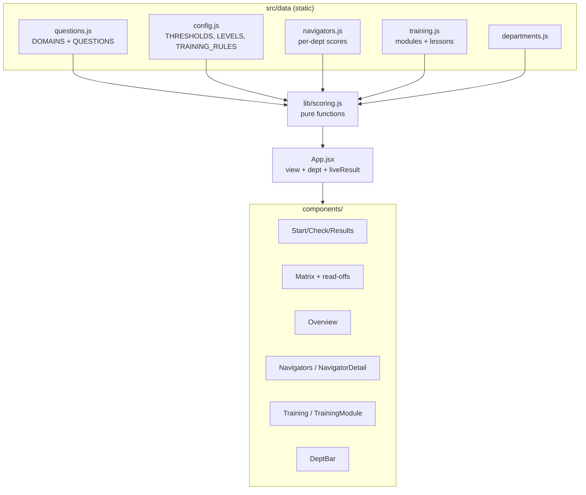
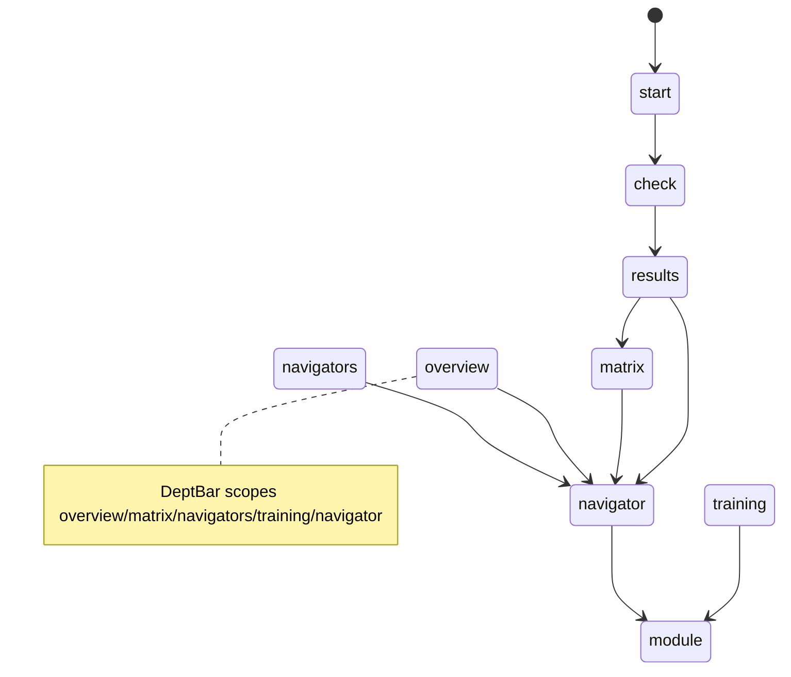

# CLAUDE.md — Quarterly Knowledge Check (Project Knowledge Base)

> **Purpose of this file.** This is the single source of truth for the project: product
> spec, architecture reference, development journal, decision log, and onboarding doc in one.
> A new developer or AI agent should be able to read **only this file** and become productive.
>
> **Maintenance rule (mandatory).** No change is "done" until this file is updated. Whenever a
> feature, architecture, decision, bug, or goal changes, update the relevant section(s) **and**
> add a dated entry to [§7 Development History](#7-development-history). Keep
> [§8 Current System State](#8-current-system-state) and [§15 Current Priorities](#15-current-priorities)
> accurate at all times.
>
> **Last updated:** 2026-06-25 (full SOP context; GENERATION_SECRET removed; Gemini generation live) ·
> **Doc maintainer:** Claude (AI agent) + repo owner. Assumptions are explicitly marked **[ASSUMPTION]**.

---

## Table of Contents
1. [Project Overview](#1-project-overview)
2. [Product Goals](#2-product-goals)
3. [Product Usage](#3-product-usage)
4. [Feature Inventory](#4-feature-inventory)
5. [Architecture Overview](#5-architecture-overview)
6. [Technical Decisions Log](#6-technical-decisions-log)
7. [Development History](#7-development-history)
8. [Current System State](#8-current-system-state)
9. [Codebase Knowledge](#9-codebase-knowledge)
10. [UX/UI Documentation](#10-uxui-documentation)
11. [Roadmap](#11-roadmap)
12. [Bugs & Known Issues](#12-bugs--known-issues)
13. [Lessons Learned](#13-lessons-learned)
14. [AI Agent Context](#14-ai-agent-context)
15. [Current Priorities](#15-current-priorities)

---

## 1. Project Overview

- **Project name:** Quarterly Knowledge Check (repo: `QuarterKnolwdge`).
- **Product description:** A self-contained web app that runs a quarterly "knowledge check" for
  **patient navigators** (contact-centre agents who handle patient calls) and renders the
  **capability map** it produces. The check asks scenario questions ("a patient calls wanting X,
  situation is Y — what do you do?"), each tagged to a knowledge **domain**, and scores
  **per domain per person** — never a single overall grade.
- **Core mission:** Turn a team's operational knowledge into a clear, actionable capability map
  that drives development — framed as **"development and fit, not pass/fail."**
- **Vision statement:** Become the standing instrument a contact-centre team lead uses each
  quarter to see exactly who is strong where, where the floor-wide gaps are, who can mentor whom,
  and what training to assign — across every department they run.
- **Target audience:**
  - **Primary (demo audience):** management / team leads evaluating the concept.
  - **End users (modelled):** patient navigators (take the check) and their supervisors (read the
    matrix and dashboards).
- **Key value proposition:** A lightweight, no-backend tool that converts a short scenario quiz
  into a per-domain capability matrix plus "so what" read-offs (gaps, mentors, readiness) and
  auto-assigned training — in seconds, with no install or accounts.
- **Main user problems solved:**
  1. Knowledge assessment that tests **application, not recall**.
  2. No single vanity score — **per-domain** signal that's actually actionable.
  3. Surfaces **floor-wide training priorities** and **mentorship capacity** automatically.
  4. **Auto-assigns training** to each navigator based on their weak points.
  5. Extends the same lens across **multiple departments**.

> **Context / origin.** Built from a build brief (`ClaudeCode_Build_Brief.md`) plus a team SOP
> (`SOP Guide.pdf` — the *Aizer Health Pediatric Department* operational report). The SOP is the
> **source of truth** for the knowledge domains and scenario questions. It is a pediatric
> contact-centre operations document; the prototype derives 6 domains and 20 questions from it.

---

## 2. Product Goals

### Short-Term Goals (current)
- Deliver a credible, self-contained **prototype to demo to management**. ✅ Done.
- Derive domains/questions from the real SOP. ✅ Done.
- Per-domain scoring → Learning/Solid/Can-Teach levels with editable thresholds. ✅ Done.
- Capability matrix (hero) with column gaps, can-teach roster, readiness tally. ✅ Done.
- Analytics dashboards (team overview + per-navigator). ✅ Done.
- Auto-assign training by weak point, with previewable mockup content. ✅ Done.
- Department dimension (Pediatrics + 3 mockup departments). ✅ Done.
- A persistent public deployment for showcasing. ✅ Done (Railway).

### Mid-Term Goals
- **Multi-department live checks:** a real question set per department (each from its own SOP),
  so all four departments become genuine live checks rather than mockups.
- **Mentor pairing (floor-wide):** auto-match Learning ↔ Can-Teach with balanced mentor load.
- **Coverage / bus-factor risk view:** flag domains with only 0–1 teachers (single point of failure).
- **Training completion tracking:** Assigned → In progress → Done states (in-memory for the demo).

### Long-Term Vision
- A production tool with persistence, multiple SOPs/departments, historical trend (quarter over
  quarter), training ROI, and role-based access — the team lead's standing quarterly instrument.

---

## 3. Product Usage

**What users do.** A navigator takes a short scenario check; supervisors read the resulting
capability map and dashboards and act on them (assign training, plan mentorship).

**Typical workflows / user journey:**
1. **Take the check** — Start → step through ~20 domain-tagged multiple-choice scenarios → submit.
2. **See results** — per-domain % and level (Learning/Solid/Can-Teach); no single grade.
3. **Read the matrix** — sample navigators + the taker's new row, color-coded; with column gaps,
   can-teach roster, readiness tally.
4. **Explore analytics** — Team Overview (floor KPIs, distribution, cross-department strength) and
   per-navigator dashboards (strengths, growth areas, assigned training, suggested mentors).
5. **Manage training** — Training tab shows auto-assigned modules by domain cohort and by
   navigator; preview a module's mockup lesson content.
6. **Switch departments** — the department bar re-scopes the matrix/dashboards/training to
   Pediatrics (live) or one of the three mockup departments.

**Expected outcomes:** a supervisor leaves with (a) a clear capability picture per domain and
department, (b) a ranked list of training priorities, (c) named mentors, and (d) per-person
training assignments.

**Real-world use cases / ideal usage:**
- Quarterly capability review in a contact centre.
- Onboarding gap analysis for new navigators.
- Identifying who is "ready for more" (high Can-Teach count).
- Planning a single training session for a whole cohort weak in one domain.

---

## 4. Feature Inventory

> Status legend: **Complete** · **In Progress** · **Planned** · **Deprecated** · **Removed**.

### F1 — Take-the-Check Flow
- **Purpose:** Assess application of SOP knowledge via scenario MCQs.
- **User benefit:** Fast, low-stakes, domain-tagged assessment.
- **Technical implementation:** [src/components/Check.jsx](src/components/Check.jsx) — stepped,
  one scenario per step, progress bar, optional name, Back/Next, submit. Questions from
  [src/data/questions.js](src/data/questions.js).
- **Status:** Complete.
- **Dependencies:** `QUESTIONS`, `DOMAINS`.
- **Notes:** Stepped flow chosen over single-page for demo clarity.

### F2 — Multi-Signal Scoring → Level Mapping (two axes)
- **Purpose:** Convert answers into per-domain **and** per-competency scores; never one total.
- **User benefit:** Actionable, non-punitive signal on both *what* (domain) and *how* (competency).
- **Technical implementation:** `scorePerDomain(answers, questions)` and
  `scorePerCompetency(answers, questions)` in [src/lib/scoring.js](src/lib/scoring.js) average each
  option's `points` (partial credit, not binary); `scoreToLevel()` maps to the 3 levels. Thresholds
  in [src/data/config.js](src/data/config.js) (`THRESHOLDS = { learning: 60, canTeach: 85 }`).
- **Status:** Complete.
- **Dependencies:** `THRESHOLDS`, `LEVELS`, `COMPETENCIES`.
- **Notes:** `<60` Learning, `60–84` Solid, `85+` Can-Teach (same bands for both axes). Each option
  carries `points` (0–100) + an SOP-referenced `rationale`; the 100-point option is `correctOptionId`.

### F3 — Capability Matrix (hero screen)
- **Purpose:** Navigators × domains grid, color-coded by level; the centrepiece.
- **User benefit:** Whole-floor capability at a glance.
- **Technical implementation:** [src/components/Matrix.jsx](src/components/Matrix.jsx); rows from
  `buildMatrixRows()`. Live taker appears as a highlighted new row; rows are clickable to the
  navigator dashboard.
- **Status:** Complete.
- **Dependencies:** F2, `SAMPLE_NAVIGATORS`, department scope.

### F4 — Matrix Read-offs (column gaps · can-teach roster · readiness tally)
- **Purpose:** The "so what" — turn the grid into priorities.
- **User benefit:** Immediate training/mentorship signal.
- **Technical implementation:** `columnGaps()`, `canTeachRoster()`, `readinessTally()` in
  [src/lib/scoring.js](src/lib/scoring.js). `COLUMN_GAP_THRESHOLD = 0.5`.
- **Status:** Complete.

### F5 — Team Overview Dashboard
- **Purpose:** Floor-wide KPIs + capability distribution + cross-department strength.
- **User benefit:** Leadership "state of the floor" view.
- **Technical implementation:** [src/components/Overview.jsx](src/components/Overview.jsx);
  `floorStats()`, `domainDistribution()`, `departmentMatrix()`.
- **Status:** Complete.

### F6 — Navigators List + Per-Navigator Dashboard
- **Purpose:** Drill into one person's development picture.
- **User benefit:** Coaching-ready individual view.
- **Technical implementation:** [src/components/Navigators.jsx](src/components/Navigators.jsx) and
  [src/components/NavigatorDetail.jsx](src/components/NavigatorDetail.jsx) — strengths, growth
  areas, per-domain bars (worst→best), per-department strip, assigned training, suggested mentors.
- **Status:** Complete.
- **Dependencies:** F2, F8, F10, `departmentMatrix()`, `mentorSuggestions()`.

### F7 — Suggested Mentors (per navigator)
- **Purpose:** For each non-Can-Teach domain, list colleagues who can teach it.
- **User benefit:** Built-in mentorship matching at the individual level.
- **Technical implementation:** `mentorSuggestions()` in [src/lib/scoring.js](src/lib/scoring.js).
- **Status:** Complete.
- **Notes:** Floor-wide mentor *pairing* (load-balanced) is **Planned** (see Roadmap).

### F8 — Auto-Assigned Training
- **Purpose:** Assign training per navigator by weak point (Required for Learning, Stretch for Solid).
- **User benefit:** Turns the matrix into an action plan automatically.
- **Technical implementation:** `trainingForRow()`, `trainingPlan()`, `trainingByDomain()`,
  `trainingStats()` in [src/lib/scoring.js](src/lib/scoring.js); rules in `TRAINING_RULES`
  ([src/data/config.js](src/data/config.js)); [src/components/Training.jsx](src/components/Training.jsx).
- **Status:** Complete.

### F9 — Training Module Preview (mockup content)
- **Purpose:** Previewable lesson content per domain module.
- **User benefit:** Shows what a navigator would actually receive.
- **Technical implementation:** [src/data/training.js](src/data/training.js) (`TRAINING_MODULES`
  with `lessons` + `keyTakeaways`); [src/components/TrainingModule.jsx](src/components/TrainingModule.jsx)
  shows lessons, takeaways, and the auto-assigned cohort.
- **Status:** Complete (content is **mockup**, flagged in-UI; swap for real materials later).

### F10 — Department Dimension
- **Purpose:** Same domains measured across Pediatrics, Adult Medicine, OB/GYN, Behavioural Health.
- **User benefit:** Cross-department capability view; per-department training.
- **Technical implementation:** [src/data/departments.js](src/data/departments.js);
  per-department scores in [src/data/navigators.js](src/data/navigators.js); `deptSamples()`,
  `departmentOverall()`, `departmentMatrix()`; [src/components/DeptBar.jsx](src/components/DeptBar.jsx)
  selector. Live check assesses **Pediatrics only** (`ASSESSED_DEPT`); others are mockups.
- **Status:** Complete (Pediatrics live; other 3 departments = mockup data).

### F11 — Deployment (Railway)
- **Purpose:** Persistent public URL + a place to run the Gemini proxy (which GitHub Pages can't).
- **Technical implementation:** `server.js` — Express 5 app that serves `dist/` as static SPA and
  mounts the `/api/*` handlers (same `(req, res)` signature as the Vercel originals; reads `PORT`
  from env, Railway injects it automatically). `railway.toml` — Railpack config (`buildCommand: npm
  run build`, `startCommand: npm start`, `nixpacksConfigPath: nixpacks.toml`). `nixpacks.toml` —
  overrides Railpack's default `npm ci` to `npm install` (avoids `EBADPLATFORM` failures for
  cross-platform optional esbuild packages). `vercel.json` kept for potential future Vercel use.
  Env vars set in Railway service Variables: `VITE_FIREBASE_*` (build-time, baked into bundle),
  `GEMINI_API_KEYS`, `GENERATION_SECRET` (server-only, never bundled). `"engines": { "node":
  ">=20.0.0" }` in `package.json` tells Railpack/Nixpacks to use Node 20 (vitest@4 and vite@8
  require it; Railway's default is Node 18).
- **Status:** Complete (code). **[ASSUMPTION]** Owner sets env vars in Railway project Variables
  before the first deploy (VITE_FIREBASE_* must be present at build time).
- **Notes:** Replaced GitHub Pages (no server support) and Vercel (owner chose Railway). The
  `/QuarterKnolwdge/` base-path hack is retired; app serves at root. For local `/api` dev, run
  `node server.js` after `npm run build`, or just test via Railway deploy.

### F12 — Competency Axis (9 competencies)
- **Purpose:** Measure *how* a navigator thinks/decides/communicates, across all domains.
- **User benefit:** Capability signal orthogonal to topic — surfaces e.g. weak Escalation even when
  domain scores look fine.
- **Technical implementation:** [src/data/competencies.js](src/data/competencies.js) (`COMPETENCIES`
  ×9); `scorePerCompetency()` + `competencyDistribution()` in scoring.js; competency breakdown on
  `NavigatorDetail`, competency distribution on `Overview`. Stored as `results.competencyScores`.
- **Status:** Complete.

### F13 — Rule-Based Coaching (post-check)
- **Purpose:** Immediate, specific feedback after a check — no LLM.
- **User benefit:** The navigator leaves knowing exactly what to reinforce and why.
- **Technical implementation:** [src/components/Coaching.jsx](src/components/Coaching.jsx) — per-question
  review (your choice + points + best answer + both authored rationales) and competency strengths/gaps.
  Shown between submit and the dashboard.
- **Status:** Complete.

### F14 — Question Bank + Gemini Scenario Generation (review gate)
- **Purpose:** Grow the check from the SOP; questions are live Firestore data, not a static file.
- **User benefit:** Supervisors generate, review, and curate the assessment without a code change.
- **Technical implementation:** Firestore `questions` collection (`draft`/`active`/`archived`);
  `db.js` CRUD (`subscribeQuestions`, `getActiveQuestions`, `saveDraftQuestions`, `activate/archive/
  delete/updateQuestion`, `seedQuestionsIfEmpty`); supervisor UI
  [QuestionBank.jsx](src/components/QuestionBank.jsx) + [QuestionEditor.jsx](src/components/QuestionEditor.jsx);
  serverless [api/generate-scenarios.js](api/generate-scenarios.js) (Gemini `gemini-2.5-flash`,
  structured JSON output, validated/repaired; rotates across multiple keys on rate-limit). Only
  **active** questions appear in the check; AI drafts require human activation.
- **Status:** Complete (code). **[ASSUMPTION]** Owner sets `GEMINI_API_KEY` + `GENERATION_SECRET` on Vercel.

---

## 5. Architecture Overview

### Frontend Architecture
- **Framework:** React 18.3 (function components + hooks).
- **Build tool:** Vite 5.4 (`@vitejs/plugin-react`).
- **Language:** JavaScript (JSX). No TypeScript.
- **Styling:** A single hand-written stylesheet, [src/styles.css](src/styles.css) (BEM-ish class
  names, CSS variables for the palette). No CSS framework.
- **State management:** Local React state (`useState`). No Redux/Zustand/Context. [App.jsx](src/App.jsx)
  owns the **session** (role + name + navigatorId) only and routes to one of two role apps:
  [SupervisorApp.jsx](src/components/SupervisorApp.jsx) (live Firestore data) or
  [NavigatorApp.jsx](src/components/NavigatorApp.jsx) (the signed-in navigator's own data). Each role
  app owns its own `view` state and data subscriptions.
- **Routing:** None (no React Router). Navigation is a `view` string inside each role app.
  Supervisor views: `overview · matrix · navigators · navigator · training · module`. Navigator
  views: `check · dashboard · training · module`. The Start **gate** (role select → navigator
  dropdown+PIN / supervisor passcode) shows when there is no session.
- **UI systems:** Custom components in [src/components/](src/components/); shared data in
  [src/data/](src/data/); pure logic in [src/lib/scoring.js](src/lib/scoring.js).

**Folder structure**
```
QuarterKnolwdge/
├── index.html               # Vite entry HTML
├── vite.config.js           # base '/' (served at root)
├── vercel.json              # Vercel config (kept; Railway is the active host)
├── railway.toml             # Railway/Railpack config (build + start + nixpacksConfigPath)
├── nixpacks.toml            # overrides npm ci → npm install (avoids EBADPLATFORM)
├── server.js                # Express server: serves dist/ + mounts /api/* handlers
├── package.json             # scripts: dev/build/preview/test/test:watch/start; engines node>=20
├── README.md                # quick-start + tweak guide
├── CLAUDE.md                # THIS FILE — project knowledge base
├── SOP Guide.pdf            # source of truth for domains/questions
├── .env.local.example       # Firebase + Gemini env template (copy → .env.local, gitignored)
├── firestore.rules          # pilot-grade Firestore security rules (roster/results/questions)
├── api/                     # API handlers (originally Vercel serverless; now served by Express)
│   ├── generate-scenarios.js#   Gemini proxy (holds GEMINI_API_KEY; validates output)
│   ├── health.js            #   deploy/health check
│   └── _sop-context.js      #   SOP grounding text (helper, not a route)
└── src/
    ├── main.jsx             # React root
    ├── App.jsx              # session + role routing (thin shell)
    ├── styles.css           # entire stylesheet
    ├── components/          # Nav, Start, Check, Coaching, Matrix, Overview, Navigators,
    │                        #   NavigatorDetail, Training, MyTraining, TrainingModule,
    │                        #   QuestionBank, QuestionEditor, DeptBar, SupervisorApp,
    │                        #   NavigatorApp, EmptyState, Footer,
    │                        #   Reveal + CountUp (presentation-layer motion primitives)
    ├── data/                # config, questions (DOMAINS + SEED_QUESTIONS), competencies,
    │                        #   navigators (placeholder), training, departments
    └── lib/
        ├── firebase.js      # Firebase app init + Firestore instance (defensive)
        ├── db.js            # ALL Firestore reads/writes (roster + results + questions)
        ├── session.js       # localStorage session layer (isolated, swappable for real auth)
        ├── useInView.js     # IntersectionObserver hook (scroll-reveal trigger)
        ├── useCountUp.js    # rAF count-up hook (reduced-motion aware)
        ├── scoring.js       # all scoring (2 axes), read-offs, analytics, training logic
        └── scoring.test.js  # Vitest unit tests for scoring.js (46 tests)
```

### Backend Architecture
- **Firebase / Firestore (pilot).** The app persists data to Cloud Firestore (free Spark tier).
  Three collections: `roster` (navigator list), `results` (submissions, now incl.
  `competencyScores`), and `questions` (supervisor-managed scenario bank: `draft`/`active`/
  `archived`) — all UUID-keyed. All Firestore access is isolated in [src/lib/db.js](src/lib/db.js);
  init in [src/lib/firebase.js](src/lib/firebase.js) (reads `VITE_FIREBASE_*` from `.env.local`).
- **Express server + `/api` handlers.** [server.js](server.js) is the Railway entry point: an
  Express 5 app that serves `dist/` as static files (SPA catch-all via `/*splat`) and mounts
  [api/generate-scenarios.js](api/generate-scenarios.js) and [api/health.js](api/health.js) as
  Express routes. The handlers use the same `(req, res)` Node.js signature they had as Vercel
  functions — no changes needed. `generate-scenarios.js` holds the `GEMINI_API_KEYS`
  **server-side only** (never bundled), calls `gemini-2.5-flash` with structured-JSON output,
  validates/repairs each scenario, and rotates keys on 429/503. Helper modules are `_`-prefixed
  (`api/_sop-context.js`). The endpoint is gated by `GENERATION_SECRET` — pilot-grade.
- **No auth system** (by design for the pilot): navigators pick their name from the roster + a
  4-digit PIN; supervisors enter `SUPERVISOR_PASSCODE`. Session persistence is localStorage only,
  isolated in [src/lib/session.js](src/lib/session.js). Security rules in `firestore.rules` are
  pilot-grade (open per-collection) — replace with real auth before production.
- **Pre-pilot state (historical):** the original prototype was fully in-memory; then a static
  GitHub-Pages + Firestore pilot with no server; now Vercel + serverless for the Gemini proxy.

### Infrastructure
- **Hosting:** **Railway** — runs the Express server (`server.js`) which serves the Vite build
  and the `/api` routes from a single persistent Node.js container. Auto-deploys on push to `main`.
- **Repo:** `github.com/travis-holt/QuarterKnolwdge` (public).
- **Deployment:** Railway (Git-connected to `main`). Railpack detects Node.js; `railway.toml`
  sets `buildCommand: npm run build`, `startCommand: npm start`, and points to `nixpacks.toml`
  which overrides the install step from `npm ci` to `npm install` (prevents `EBADPLATFORM` errors
  for cross-platform optional esbuild packages). Requires `engines.node >=20.0.0` (set in
  `package.json`) because vitest@4 and vite@8 require Node 20+; Railway defaults to Node 18.
  Env vars in Railway service Variables: `VITE_FIREBASE_*` (client, build-time — must be set
  BEFORE first build), `GEMINI_API_KEYS` + `GENERATION_SECRET` (server-only, never bundled).
  **Historical:** GitHub Pages (retired — no server) → Vercel (owner chose Railway instead).
- **CI/CD:** None beyond Railway's build. **[ASSUMPTION]** No GitHub Actions.
- **Monitoring:** None (Railway console shows logs + metrics).
- **Security:** `GEMINI_API_KEYS`/`GENERATION_SECRET` are server-only Railway env vars and never
  in the bundle. No PII; sample/illustrative data only. Site is public to anyone with the URL.

### Component / data-flow diagram


### View navigation


---

## 6. Technical Decisions Log

### 2026-06-23 — Use React + Vite (not single HTML file)
- **Decision:** Build as a React 18 + Vite SPA.
- **Reasoning:** User chose it over a single-file vanilla app; gives component structure while
  staying backend-free and fast to start.
- **Alternatives considered:** Single self-contained `index.html` with inline JS.
- **Impact:** Requires Node + a build step; enables clean component decomposition.

### 2026-06-23 — Derive all domains/questions from the SOP
- **Decision:** 6 domains, 20 scenario questions sourced from `SOP Guide.pdf`.
- **Reasoning:** Brief mandates SOP as source of truth; tests real application knowledge.
- **Alternatives considered:** Invented generic domains.
- **Impact:** Content is specific and credible; re-keying to a new SOP means editing
  `questions.js` only.

### 2026-06-23 — Per-domain scoring, never a single total
- **Decision:** Scores and levels are per domain; no overall grade anywhere.
- **Reasoning:** Core product principle ("development and fit, not pass/fail").
- **Impact:** All UI and analytics are domain-keyed.

### 2026-06-23 — Centralised tunable knobs in `config.js`
- **Decision:** Thresholds, level labels/colors, palette, and training rules live in one file.
- **Reasoning:** Brief requires thresholds/sample data/questions to be easy to find and edit.
- **Impact:** Demo tweaks are low-risk and localized.

### 2026-06-23 — Store sample data as percentages (not pre-baked levels)
- **Decision:** `SAMPLE_NAVIGATORS` hold per-domain percentages; levels are derived.
- **Reasoning:** Sample rows and the live taker flow through the same `scoreToLevel()`, keeping
  the matrix internally consistent.
- **Impact:** Changing thresholds updates sample and live rows identically.

### 2026-06-23 — Knowledge-only analytics (no invented KPIs)
- **Decision:** Dropped the "knowledge → performance (QA/CSAT/AHT)" correlation view.
- **Reasoning:** User chose to keep everything derived purely from the check; a real correlation
  would require fabricated operational metrics.
- **Alternatives considered:** Add labelled sample KPIs; a knowledge-only "risk proxy".
- **Impact:** No fabricated metrics anywhere; cleaner, more defensible story.

### 2026-06-23 — Traffic-light level colors
- **Decision:** Learning = red (`#c0392b`), Solid = amber (`#e0b13c`), Can-Teach = green (`#3e8e5a`).
- **Reasoning:** User wanted urgency encoding; green best, red worst.
- **Impact:** Applies everywhere via `LEVELS`; training cohort tags intentionally kept off this
  scale (they signal priority, not capability level).

### 2026-06-23 — Department dimension; Pediatrics live, others mockup
- **Decision:** Add 4 departments sharing the same 6 domains; only Pediatrics is assessed by the
  live check.
- **Reasoning:** The SOP covers Pediatrics; other departments need their own question sets later.
- **Alternatives considered:** Fabricate checks for all departments.
- **Impact:** Cross-department views work now; mockup departments are clearly labelled.

### 2026-06-24 — Firebase pilot: roster+PIN identity, UUID keys, role-split apps
- **Decision:** No login. Navigator picks their name from a supervisor-managed roster dropdown and
  enters a 4-digit PIN; supervisor enters `SUPERVISOR_PASSCODE`. Firestore `roster` + `results`
  collections are UUID-keyed. `App.jsx` is a thin session router delegating to `SupervisorApp` /
  `NavigatorApp`. All Firestore access isolated in `db.js`; all session access in `session.js`.
- **Reasoning:** Roster dropdown eliminates name typos/collisions; PIN stops navigators opening each
  other's dashboards; UUID keys make same-name collisions impossible; role-split apps make the
  navigator's lack of access to team views *structural*, not just hidden UI; isolating db/session
  keeps the eventual swap to real auth a one-module change.
- **Alternatives considered:** free-text name entry (typo/collision risk); single App with
  conditional rendering (weaker privacy boundary); name-keyed documents (collisions).
- **Impact:** `SAMPLE_NAVIGATORS` removed; empty states added; `scoring.js` untouched (Firestore
  rows match the existing `{name, scores}` shape exactly).

### 2026-06-24 — Defensive Firebase init (never crash without config)
- **Decision:** `firebase.js` only initialises when `VITE_FIREBASE_*` config is present, wrapped in
  try/catch; exports `isFirebaseConfigured`. All `db.js` calls are gated on it.
- **Reasoning:** Lets the full UI be built, tested, and committed *before* the owner creates the
  Firebase project — the app boots to a clean "not connected" state instead of a white-screen crash.
- **Impact:** Safe to commit now; safe to run locally; deploy is the only step that waits on config.

### 2026-06-23 — Deploy via `gh-pages` branch (not Actions)
- **Decision:** Publish `dist/` to a `gh-pages` branch with the `gh-pages` npm tool.
- **Reasoning:** The Codespaces token cannot manage Pages settings or push workflow files;
  branch-based publish works with normal repo write access.
- **Impact:** Deploys are a single manual command; `base` must stay `/QuarterKnolwdge/`.
- **Superseded 2026-06-24** by the Vercel migration (serverless functions need a server host).

### 2026-06-24 — Competency engine: 9 competencies as a second axis + points-based scoring
- **Decision:** Keep the 6 SOP domains AND add 9 competencies (capability axis), both derived from
  the same answers. Each option carries `points` (0–100, partial credit) + an SOP `rationale`
  instead of binary right/wrong. Competencies reuse the existing 3-level traffic-light system.
- **Reasoning:** Measures *how* a navigator thinks/decides/communicates, not just topic recall;
  partial credit rewards defensible judgement. Reusing levels keeps the UI consistent.
- **Alternatives considered:** replace domains with competencies (loses topic signal); a separate
  4-level Beginner→Expert scale (more config, inconsistent colours) — **[ASSUMPTION]** owner can opt
  into 4-level later.
- **Impact:** `scoring.js` functions take `questions` as a param; `results` gain `competencyScores`;
  new `Coaching` view + competency panels; tests grew 38 → 46.

### 2026-06-24 — Live Gemini scenario generation via a serverless proxy
- **Decision:** SOP→scenario generation is a live in-app feature. A server-side function holds
  the Gemini key and returns validated drafts; the question bank moves to a Firestore
  `questions` collection with a supervisor **review gate** (draft → active). Hosting migrates from
  GitHub Pages to a server platform (one place for the SPA + `/api`).
- **Reasoning:** A key can't ship in a public static bundle; generation is *authoring-time* quality
  control, so a human gate must sit between AI output and a live assessment.
- **Alternatives considered:** offline one-off generation shipped as static data (less flexible);
  client-side Gemini calls (key exposure — rejected); Cloudflare Worker / Firebase Blaze (owner
  chose Railway).
- **Impact:** New `api/*`; `db.js` gains questions CRUD; `Check`/`NavigatorApp` read the active bank
  (seed fallback); `scoring.js` is questions-parametrised. Pilot-grade endpoint auth via the
  supervisor passcode (`GENERATION_SECRET`).

### 2026-06-25 — Migrate hosting to Railway (Express server wrapping the /api handlers)
- **Decision:** Deploy on Railway instead of Vercel. Wrap the existing `api/*` handlers in an
  Express 5 server (`server.js`) that also serves the Vite build as a static SPA. Add
  `railway.toml` + `nixpacks.toml` for Railpack config.
- **Reasoning:** Owner chose Railway. The `api/*` handlers use the standard Node.js `(req, res)`
  signature which Express accepts directly — no rewrite needed. Railway runs a persistent container
  (not serverless) so Express is the natural wrapper.
- **Alternatives considered:** Vercel (owner chose Railway); Cloudflare Workers (different runtime,
  would require rewriting the handlers).
- **Impact:** New `server.js`, `railway.toml`, `nixpacks.toml`; `express` added as a dependency;
  `"start": "node server.js"` added to package.json scripts; `"engines": { "node": ">=20.0.0" }`
  added to signal Node 20 to Railpack (vitest@4 + vite@8 require it; Railway default is Node 18).
  `nixpacks.toml` overrides `npm ci` → `npm install` to avoid `EBADPLATFORM` errors for
  cross-platform optional esbuild packages (netbsd-arm64, darwin-arm64, etc.) that npm records in
  the lockfile but can't install on Linux x64. Express 5 requires named wildcards so the SPA
  catch-all is `/*splat` not `*`.

---

## 7. Development History

### 2026-06-23 — Initial prototype build
- **What changed:** Scaffolded Vite+React app; data layer (`config`, `questions`, `navigators`);
  `scoring.js`; components Start/Check/Results/Matrix/Nav; full stylesheet; README.
- **Files affected:** entire initial `src/` tree, `package.json`, `vite.config.js`, `index.html`.
- **Reason:** Deliver the lean prototype from the brief.
- **Result:** End-to-end flow working; 6 domains / 20 questions; matrix + read-offs. (commit `2f72cf1`)

### 2026-06-23 — Analytics dashboards
- **What changed:** Added Team Overview, Navigators list, per-navigator dashboard; `floorStats`,
  `domainDistribution`, `mentorSuggestions`; clickable matrix rows; nav tabs.
- **Files affected:** `App.jsx`, `Nav.jsx`, new `Overview.jsx`/`Navigators.jsx`/`NavigatorDetail.jsx`,
  `scoring.js`, `styles.css`. *(Folded into subsequent commits.)*
- **Reason:** Make it useful to management beyond a raw matrix.
- **Result:** Floor + individual analytics; mentor suggestions.

### 2026-06-23 — Auto-assign training
- **What changed:** `training.js` catalog, `TRAINING_RULES`, training logic, Training tab,
  per-navigator "Assigned training".
- **Files affected:** `data/training.js`, `data/config.js`, `lib/scoring.js`, `components/Training.jsx`,
  `NavigatorDetail.jsx`, `Nav.jsx`, `App.jsx`, `styles.css`.
- **Reason:** Turn weak points into assigned action.
- **Result:** Required/Stretch assignments by weak point.

### 2026-06-23 — Previewable mockup training modules
- **What changed:** Added lesson content + key takeaways to each module; module preview screen;
  Preview buttons; "assigned because <domain> is at <level>" reasons.
- **Files affected:** `data/training.js`, new `components/TrainingModule.jsx`, `Training.jsx`,
  `NavigatorDetail.jsx`, `App.jsx`, `styles.css`. (commit `2041a08`)
- **Reason:** Make training previewable for the demo.
- **Result:** Clickable, previewable modules with cohorts.

### 2026-06-23 — Traffic-light level colors
- **What changed:** Recolored `LEVELS` to red/amber/green.
- **Files affected:** `data/config.js`. (commit `3d4e5d0`)
- **Reason:** Urgency encoding requested by user.
- **Result:** Consistent traffic-light coloring app-wide.

### 2026-06-23 — Department dimension
- **What changed:** Added `departments.js`; restructured `navigators.js` to per-department scores;
  `deptSamples`/`departmentOverall`/`departmentMatrix`; `DeptBar`; cross-department grid in
  Overview; per-department strip in NavigatorDetail.
- **Files affected:** new `data/departments.js`, `data/navigators.js`, `lib/scoring.js`, new
  `components/DeptBar.jsx`, `App.jsx`, `Overview.jsx`, `Matrix.jsx`, `Navigators.jsx`,
  `Training.jsx`, `NavigatorDetail.jsx`, `styles.css`. (commit `13fa39b`)
- **Reason:** Measure strength across departments.
- **Result:** Department-scoped app; Pediatrics live, 3 mockup departments.

### 2026-06-23 — Deployment to GitHub Pages
- **What changed:** Set Vite `base` for builds; published `dist/` to `gh-pages`.
- **Files affected:** `vite.config.js`; `gh-pages` branch.
- **Reason:** Stable public showcase URL.
- **Result:** Live at https://travis-holt.github.io/QuarterKnolwdge/.

### 2026-06-23 — Added this CLAUDE.md knowledge base
- **What changed:** Created the comprehensive project knowledge base.
- **Files affected:** `CLAUDE.md`.
- **Reason:** Permanent project memory + onboarding doc.
- **Result:** Single source of truth established (this file).

### 2026-06-23 — First automated tests (scoring.js)
- **What changed:** Added Vitest as the test runner and a unit-test suite covering all 18 exports
  of `lib/scoring.js` (scoring, level mapping, matrix build, read-offs, department views, training
  assignment, mentor suggestions). Added `test`/`test:watch` npm scripts. Fixtures are built from
  the real data modules and level boundaries are asserted relative to `THRESHOLDS`, so the tests
  survive future tuning of the config "knobs".
- **Files affected:** new `src/lib/scoring.test.js`, `package.json` (scripts + `vitest` devDep).
- **Reason:** Pay down the top technical-debt item — the pure logic was highly testable and had
  zero coverage.
- **Result:** 38 tests passing (`npm test`); production build unaffected (test file is excluded
  from the app bundle).

> **Note on dates:** all work above was completed in a single session dated **2026-06-23**.
> Git commit short-SHAs are referenced where a discrete commit exists; some incremental work was
> folded into later commits.

### 2026-06-24 — Post-review robustness fixes (subscription errors + duplicate names)
- **What changed:** Two issues found in a systematic code review were fixed.
  1. **Silent Firestore subscription errors (moderate):** `subscribeRoster` and `subscribeResults`
     in `db.js` now accept an optional `onError` callback (defaulting to `console.error`).
     `SupervisorApp.jsx` passes a shared handler that sets `subscribeError` state and renders a
     red banner: *"Lost connection to the database — data may be stale."* `NavigatorApp.jsx` logs
     the error (mentor suggestions silently stop updating — non-critical for the pilot).
  2. **Duplicate navigator names (minor):** `AddNavigatorForm` in `Navigators.jsx` now receives
     the live `roster` prop and performs a case-insensitive name-equality check before calling
     `addToRoster`. Shows *"A navigator with that name already exists."* inline.
- **Files affected:** `src/lib/db.js`, `src/components/SupervisorApp.jsx`,
  `src/components/NavigatorApp.jsx`, `src/components/Navigators.jsx`, `src/styles.css`
  (`.subscribe-error` banner style added).
- **Verification:** `npm test` → 38 passing; `npm run build` → clean.

### 2026-06-24 — Firebase pilot design complete; implementation plan written
- **What happened:** Full design session completed. Spec and implementation plan written,
  reviewed, and committed.
- **Key decisions locked:**
  - **Persistence:** Firebase/Firestore (free Spark tier). Two collections: `roster` + `results`,
    both UUID-keyed (never name-keyed — no typo/collision risk).
  - **Identity:** Navigator selects name from supervisor-managed roster dropdown + enters a
    4-digit PIN. Supervisor enters hardcoded passcode from `config.js`.
  - **Role split:** `navigator` (own dashboard: per-domain breakdown, strengths/gaps, mentor
    suggestions, assigned training) and `supervisor` (full matrix/overview/training, live via
    `onSnapshot`).
  - **Session:** `src/lib/session.js` owns all localStorage state; exposes `{ role, name,
    navigatorId }` contract; swappable for real auth with no downstream changes.
  - **Sample data:** `SAMPLE_NAVIGATORS` removed. Matrix starts empty; fills with real submissions.
  - **Roster management:** Supervisor adds navigators (name + PIN) via "Add Navigator" form in
    the Navigators tab. Roster shows all members including "Not yet taken" state.
- **Design doc:** `docs/superpowers/specs/2026-06-24-firebase-pilot-design.md`
- **Implementation plan:** `docs/superpowers/plans/2026-06-24-firebase-pilot-plan.md`
- **Status:** Design complete. (Implementation followed — see next entry.)

### 2026-06-24 — Firebase pilot IMPLEMENTED (all code, awaiting Firebase config)
- **What changed:** Built the entire Firebase pilot end to end (Phases 1–9 of the plan). The app is
  now a role-based multi-user webapp backed by Firestore.
  - **New libs:** `src/lib/firebase.js` (defensive init — never crashes the app if config is
    absent), `src/lib/db.js` (all Firestore reads/writes: roster + results), `src/lib/session.js`
    (isolated localStorage session).
  - **Start gate** (`Start.jsx`): role select → navigator (roster dropdown + PIN) / supervisor
    (passcode). PIN validated against the roster entry; passcode against `SUPERVISOR_PASSCODE`.
  - **Role split:** `App.jsx` reduced to a thin session/role router. New `SupervisorApp.jsx`
    (live `onSnapshot` results + roster, full management views) and `NavigatorApp.jsx` (own
    dashboard + my-training only; structurally no route to team views).
  - **Roster management:** `Navigators.jsx` gained an "Add navigator" form (name + 4-digit PIN →
    `addToRoster`) and shows "Not yet taken" for roster members without a submission.
  - **Navigator privacy:** `NavigatorDetail` renders mentor names as plain text (no drill-in) and
    hides the back button when used as a navigator's own dashboard; `TrainingModule` hides the
    cohort list for navigators (`showCohort={false}`); new `MyTraining.jsx` for the navigator's
    own plan. `Check.jsx` gained `hideName`/`greetingName` (navigator is already identified).
  - **Sample data removed:** `SAMPLE_NAVIGATORS` deleted; matrix starts empty and fills from
    Firestore. New `EmptyState.jsx` covers no-submissions, non-assessed-department, and
    not-configured cases. `Footer.jsx` extracted (sample-data wording removed). `Results.jsx`
    removed (navigator now lands directly on the richer dashboard).
  - **Config/setup:** `SUPERVISOR_PASSCODE` added to `config.js`; `.env.local.example` and
    `firestore.rules` added; `firebase` SDK added to `package.json`.
- **Files affected:** new `src/lib/firebase.js`, `src/lib/db.js`, `src/lib/session.js`,
  `src/components/{SupervisorApp,NavigatorApp,Start,Navigators,Nav,Check,NavigatorDetail,
  TrainingModule,MyTraining,EmptyState,Footer,Matrix}.jsx`, `src/App.jsx`, `src/data/{config,
  navigators}.js`, `src/styles.css`, `.env.local.example`, `firestore.rules`, `package.json`.
  `src/lib/scoring.js` and `scoring.test.js` unchanged.
- **Verification:** `npm test` → 38 passing; `npm run build` → clean; `npm run dev` → all modules
  transform and serve (200). Defensive Firebase init verified to not crash without config.
- **Status:** Code complete and **deployed to GitHub Pages**. Firebase project is live (`quarterly-knowledge-check`); `.env.local` is configured; supervisor and navigator flows verified working end-to-end.

### 2026-06-24 — Competency engine + Gemini scenario generation on Vercel (Phases 1a–1d)
- **What changed:** Turned the check into a two-axis, scenario-based competency platform that grows
  its own question bank from the SOP via Gemini.
  - **1a — Vercel migration:** `vite.config.js` base → `/`; added `vercel.json` + `api/health.js`;
    retired the gh-pages base-path hack.
  - **1b — Competency engine:** new `src/data/competencies.js` (9 competencies). All 18 seed
    questions upgraded to per-option `points`+`rationale` and `competencies` tags (and renamed
    `QUESTIONS` → `SEED_QUESTIONS`, with a back-compat alias). `scoring.js` refactored:
    `scorePerDomain(answers, questions)` is now points-based, new `scorePerCompetency()` +
    `competencyDistribution()`, `buildMatrixRows()` carries both axes. New `Coaching.jsx`
    (rule-based post-check feedback); competency panels on `NavigatorDetail` + `Overview`;
    `db.saveResult` stores `competencyScores`. Tests 38 → **46**.
  - **1c — Question bank in Firestore:** new `questions` collection + `db.js` CRUD
    (`subscribeQuestions`, `getActiveQuestions`, `saveDraftQuestions`, `activate/archive/delete/
    updateQuestion`, `seedQuestionsIfEmpty`). `Check`/`NavigatorApp` read the **active** bank (seed
    fallback). New supervisor `QuestionBank.jsx` + `QuestionEditor.jsx` (review gate) + "Questions"
    nav tab. `firestore.rules` extended.
  - **1d — Gemini generation:** `api/generate-scenarios.js` (gemini-2.5-flash, structured JSON,
    validate/repair, multi-key rotation on 429/503) + `api/_sop-context.js`. Supervisor "Generate"
    → drafts → review → activate. (2.0-flash returns a free-tier limit of 0 on the project keys, so
    2.5-flash is used.)
- **Files affected:** new `api/{generate-scenarios,health,_sop-context}.js`, `vercel.json`,
  `src/data/competencies.js`, `src/components/{Coaching,QuestionBank,QuestionEditor}.jsx`; edited
  `src/lib/{scoring,scoring.test,db}.js`, `src/data/questions.js`,
  `src/components/{Check,NavigatorApp,SupervisorApp,NavigatorDetail,Overview,Nav}.jsx`,
  `src/styles.css`, `vite.config.js`, `firestore.rules`, `.env.local.example`.
- **Verification:** `npm test` → **46 passing**; `npm run build` → clean; `npm run dev` → 200;
  `node --check` on all `api/*` → OK.
- **Status:** Code complete. **[ASSUMPTION]** Awaiting owner to link Vercel + set `GEMINI_API_KEY`
  / `GENERATION_SECRET`; until then the in-app Generate button is the only feature that needs the
  backend — the rest runs on the existing Firebase config.

### 2026-06-25 — Railway deployment: Express server + build fixes
- **What changed:** Migrated hosting from Vercel → Railway. Three rounds of build fixes were
  needed before the Railway pipeline passed.
  - **Migration:** `server.js` (Express 5, serves `dist/` + mounts `/api/*` handlers),
    `railway.toml` (Railpack config: build + start + nixpacksConfigPath), `express` dep +
    `"start"` script + `"engines": {"node":">=20.0.0"}` in `package.json`.
  - **Express 5 wildcard fix:** SPA catch-all initially written as `app.get('*', …)`. Express 5
    (path-to-regexp v8) rejects a bare `*` wildcard — requires a named param. Changed to
    `app.get('/*splat', …)`.
  - **Node version (Round 1):** Railway defaulted to Node 18; vitest@4 + vite@8 require Node 20+.
    Fixed: added `"engines": {"node":">=20.0.0"}` to `package.json` to tell Nixpacks/Railpack to
    select Node 20.
  - **Lockfile sync (Round 2):** Previous partial `npm install` runs left the lockfile missing
    esbuild@0.28.1 entries. Fixed: wiped `node_modules` + `package-lock.json` and ran a clean
    `npm install` to fully regenerate the lockfile with both esbuild@0.21.5 (vite@5 dep) and
    esbuild@0.28.1 (vitest@4 dep).
  - **EBADPLATFORM (Round 3):** The clean lockfile includes all platform-specific esbuild
    optional packages (netbsd-arm64, darwin-arm64, win32-x64, …). `npm ci` on Railway's Linux
    x64 fails when it encounters packages for incompatible platforms, even if they're optional.
    Fixed: `nixpacks.toml` overrides Railpack's install step from `npm ci` to `npm install`, which
    gracefully skips incompatible optional packages.
- **Files affected:** new `server.js`, `railway.toml`, `nixpacks.toml`; `package.json`,
  `package-lock.json`.
- **Verification:** `npm test` → 46 passing; `node --check server.js` OK; pushed to `main`;
  Railway build in progress (nixpacks.toml override awaiting confirmation).
- **Status:** Code complete; awaiting Railway deploy confirmation.

### 2026-06-25 — Full SOP context + remove GENERATION_SECRET requirement
- **What changed:** Two improvements to the Gemini scenario generation pipeline.
  1. **Full SOP context (`api/_sop-context.js`):** replaced the old distilled ~50-line summary with
     the complete final SOP ("Pediatrics Department.pdf" — 12 pages). Now includes every provider's
     exact booking rules (slot durations, double-booking constraints, demographic comfort, specialist
     schedules), the full referral decision tree (PE UTD/not-UTD × in/out-of-Aizer's 5 specialties ×
     emergency/non-emergency), Sally Carilli escalation triggers, all insurance indicators and
     plan-specific rules, immunization/lab routing with nurse schedules, arrival instruction nuances,
     family/sibling booking mechanics, and the full contact directory. Gemini now has sufficient
     grounding to generate high-specificity scenario questions for every domain.
  2. **Remove GENERATION_SECRET env var requirement (`api/generate-scenarios.js`):** the server now
     falls back to `SUPERVISOR_PASSCODE` (imported from `src/data/config.js`) when `GENERATION_SECRET`
     is not set. The client already sends `SUPERVISOR_PASSCODE` as the secret — there was never a
     meaningful distinction. Eliminates the need for an extra Railway Variable.
- **Files affected:** `api/_sop-context.js` (full rewrite), `api/generate-scenarios.js`
  (import `SUPERVISOR_PASSCODE`; fallback logic replacing the hard error).
- **Verification:** `node --check api/generate-scenarios.js` → OK; `node --check api/_sop-context.js` → OK.
- **Status:** Complete. `GEMINI_API_KEYS` (already set in Railway) is the only server-side variable
  needed for generation to work; no `GENERATION_SECRET` required.

### 2026-06-25 — Premium "refined-light" visual overhaul (design system + motion)
- **What changed:** A non-functional, presentation-layer redesign elevating the app to a polished
  SaaS feel while keeping the warm ivory/clay identity (chosen over a dark theme for trust/fit).
  No business logic, data shapes, or routing changed.
  - **Design tokens (`styles.css` `:root`):** extended palette (surfaces, ink tiers, accent
    strong/deep), an elevation scale (`--shadow-xs…lg`, `--shadow-glow`, focus `--ring`), gradient
    tokens (`--grad-accent` etc.), glass tokens (`--glass-bg/border/blur`), a radius scale, and
    motion tokens (`--ease-out/spring`, `--dur-1/2/3`). All **existing variable names preserved**
    so the rest of the sheet kept working.
  - **Atmosphere:** layered warm radial mesh on `body`, a slow-drifting ambient glow
    (`body::before`, `ambient-drift`), and an ultra-faint SVG-noise overlay (`body::after`).
  - **Type:** Inter loaded via `index.html` (system-font fallback retained); tighter display scale.
  - **Primitives:** layered `.card` (top-sheen `::before`, `--interactive` lift, `--glass`
    variant), gradient `.btn--primary` with spring press + `:focus-visible` ring, animated
    `.linkbtn` underline, frosted sticky `.nav` with gradient app-mark, elevated dept pills, depth
    on tags/chips/inputs, global input focus rings.
  - **Motion utilities (new, dependency-free):** `src/lib/useInView.js` (IntersectionObserver),
    `src/lib/useCountUp.js` (rAF ease-out), and components `src/components/Reveal.jsx` +
    `CountUp.jsx`. CSS helpers `.reveal/.is-in`, `.view-enter`, `.stagger > *`. **No animation
    library added** (bundle already large; CSS + tiny hooks cover the brief).
  - **Screens:** Start gate (gradient hero, glass role cards w/ icons + hover reveal, staggered
    domain list, skeleton loading state), Matrix (depth pills + cell hover, row hover, live-row
    glow, staggered read-offs), Overview (KPI widgets with **count-up** + accent rail, gradient
    bars), plus `view-enter`/`stagger` entrances on Navigators/NavigatorDetail/Training/MyTraining/
    Coaching/Check/QuestionBank/TrainingModule and a premium `EmptyState` (glyph) + `.skeleton`
    loaders.
  - **A11y/perf:** `prefers-reduced-motion` neutralises animations **and delays**; animations use
    transform/opacity (GPU); color still paired with text labels.
- **Files affected:** new `src/lib/{useInView,useCountUp}.js`, `src/components/{Reveal,CountUp}.jsx`;
  edited `index.html`, `src/styles.css`, and `src/components/{Start,Matrix,Overview,EmptyState,
  NavigatorDetail,Navigators,Training,MyTraining,Coaching,Check,QuestionBank,TrainingModule}.jsx`
  (Nav restyled via CSS only).
  `lib/scoring.js`, data modules, and `scoring.test.js` untouched.
- **Verification:** `npm test` → **46 passing**; `npm run build` → clean; built app serves 200
  (root + CSS); new tokens/fonts confirmed in the bundle.
- **Status:** Complete (code). Presentation-only; safe to deploy with the rest.

---

## 8. Current System State

- **Working end to end (logic + UI):** supervisor adds navigators / generates+curates questions →
  navigators sign in → take the active check → land on **coaching** → per-domain **and**
  per-competency results persist to Firestore → supervisor matrix/overview update live (incl.
  competency distribution) → navigator/training dashboards → department switching. Build clean,
  tests green (`npm test` → **46 passing**).
- **Existing functionality:** features F1–F14 (see [§4](#4-feature-inventory)) are **Complete** in
  code. F11 (Vercel) + F14 (Gemini generation) need the owner's Vercel/env setup to run live.
- **Experimental / mockup:**
  - Training **content** is mockup (flagged in UI). Logic is real.
  - **Adult Medicine, OB/GYN, Behavioural Health** are not assessed; only **Pediatrics** is live.
- **Test coverage:** `lib/scoring.js` is unit-tested (46 tests, incl. competency scoring). Components,
  the role apps, and the serverless function are **not** yet tested.
- **Incomplete areas:** no CI, no trend/history, no mentor pairing, no coverage/bus-factor view, no
  completion tracking; no component/UI tests; open-ended/interview/generative-coaching = Phase 2.
- **Active integrations:** **Firebase / Firestore** (live) + **Gemini via Railway Express server**
  (code complete; `GEMINI_API_KEYS` confirmed set in Railway Variables; live on next deploy).
- **Deployment status:** **Railway** (Git-connected to `main`). Railway auto-deploys on push.
  `VITE_FIREBASE_*` and `GEMINI_API_KEYS` confirmed set in Railway Variables. No `GENERATION_SECRET`
  needed — server falls back to `SUPERVISOR_PASSCODE`.
- **Counts (today):** 6 domains · 9 competencies · 18 seed questions (bank now grows in Firestore) ·
  4 departments (Pediatrics live) · **46** unit tests · **3** Firestore collections
  (`roster`, `results`, `questions`) · 2 serverless functions.

---

## 9. Codebase Knowledge

### Important modules
- **[src/lib/scoring.js](src/lib/scoring.js)** — all pure logic. Exports:
  - `scorePerDomain(answers, questions?)` → `{ [domainId]: percent }` (points-based; defaults to seed)
  - `scorePerCompetency(answers, questions?)` → `{ [competencyId]: percent|null }` (null = untagged)
  - `scoreToLevel(pct)` → `'learning'|'solid'|'canTeach'`; `levelFor(pct)` → full descriptor
  - `buildMatrixRows(samples, liveResult)` → rows `{ name, isLive, scores, levels,
    competencyScores, competencyLevels }`
  - `columnGaps(rows)`, `canTeachRoster(rows)`, `readinessTally(rows)`
  - `floorStats(rows)`, `domainDistribution(rows)`, `competencyDistribution(rows)`, `findRow(rows, name)`
  - `deptSamples(samples, deptId)`, `departmentOverall(scores)`, `departmentMatrix(samples, live)`
  - `trainingForRow(row)`, `trainingPlan(rows)`, `trainingByDomain(rows)`, `trainingStats(rows)`
  - `mentorSuggestions(rows, name)`
  - **Note:** `scorePerDomain`/`scorePerCompetency` take the active `questions` bank as a param;
    components pass the Firestore active bank, falling back to `SEED_QUESTIONS`.
- **[src/App.jsx](src/App.jsx)** — thin session router only. Reads `getSession()` on mount;
  routes to `<Start>`, `<SupervisorApp>`, or `<NavigatorApp>` based on `session.role`. All view
  state, Firestore subscriptions, and data live inside the role apps.

### Data modules (the "knobs")
- **[src/data/config.js](src/data/config.js):** `THRESHOLDS`, `LEVELS`, `LEVEL_ORDER`,
  `COLUMN_GAP_THRESHOLD`, `TRAINING_RULES`, `PALETTE`.
- **[src/data/questions.js](src/data/questions.js):** `DOMAINS` (`{id,name,blurb}`),
  `SEED_QUESTIONS` (`{id, domainId, competencies:[id], scenario, options:[{id,text,points,
  rationale}], correctOptionId}`); `QUESTIONS` is a back-compat alias of `SEED_QUESTIONS`. The seed
  seeds Firestore on first run and is the offline fallback; the live bank is the `questions` collection.
- **[src/data/competencies.js](src/data/competencies.js):** `COMPETENCIES` (9 × `{id,name,blurb}`),
  `competencyName(id)`, `COMPETENCY_IDS` (Set, for validating tags).
- **[src/data/navigators.js](src/data/navigators.js):** placeholder only — `SAMPLE_NAVIGATORS`
  was removed in the Firebase pilot. Navigator data now comes from Firestore.
- **[src/data/training.js](src/data/training.js):** `TRAINING_MODULES`
  (`{domainId, title, blurb, estMinutes, lessons:[{title,points[]}], keyTakeaways[]}`);
  `moduleForDomain(id)`.
- **[src/data/departments.js](src/data/departments.js):** `DEPARTMENTS`, `ASSESSED_DEPT`,
  `departmentName(id)`.

### Key shapes
```js
// matrix row (two axes)
{ name, isLive,
  scores: {domainId: pct}, levels: {domainId: 'learning'|'solid'|'canTeach'},
  competencyScores: {competencyId: pct}, competencyLevels: {competencyId: level} }
// department-matrix row (cross-department)
{ name, isLive, depts: { [deptId]: { overall, level } | null } }   // null = not assessed
// question (Firestore `questions` doc + seed)
{ domainId, competencies:[id], scenario, options:[{id,text,points,rationale}],
  correctOptionId, status:'draft'|'active'|'archived', source, createdAt }
// training assignment
{ domainId, level, priority: 'Required'|'Stretch', goal, module }
```

### Database schemas / API endpoints / env vars
- **Firestore collections** (UUID-keyed; levels never stored — always derived client-side):
  - `roster/{uuid}` → `{ name, pin, createdAt }` — supervisor-managed navigator list.
  - `results/{uuid}` → `{ name, navigatorId, scores:{domainId:pct}, competencyScores:{compId:pct},
    submittedAt }`. Shares the navigator's roster UUID (a retake overwrites cleanly). Older docs may
    lack `competencyScores` (tolerated).
  - `questions/{uuid}` → the question shape above. Only `status:'active'` appears in the check.
- **Serverless endpoint:** `POST /api/generate-scenarios` `{ domainId, count, secret }` → `{ questions }`
  (validated drafts). `GET /api/health` → `{ ok }`.
- **Env vars:** client (gitignored `.env.local`, build-time) `VITE_FIREBASE_*`; **server-only**
  (Railway service Variables — never `VITE_`-prefixed) `GEMINI_API_KEYS` (comma-separated; rotated on
  rate-limit) or single `GEMINI_API_KEY`. `GENERATION_SECRET` is optional — server falls back to
  `SUPERVISOR_PASSCODE` when not set. **VITE_FIREBASE_* must be in Railway Variables before the
  first build** — they're baked into the JS bundle at build time.
- **db.js API** (the only Firestore surface): roster — `addToRoster`, `getRoster`,
  `subscribeRoster(cb,onError?)`; results — `getResult`, `saveResult(navigatorId, name, scores,
  competencyScores?)`, `subscribeResults(cb,onError?)`; questions — `subscribeQuestions(cb,onError?)`,
  `getActiveQuestions()`, `seedQuestionsIfEmpty(seed)`, `saveDraftQuestions(drafts, source?)`,
  `updateQuestion(id,patch)`, `activateQuestion(id)`, `archiveQuestion(id)`, `deleteQuestion(id)`.
- **Secrets:** `SUPERVISOR_PASSCODE` is in the repo (pilot-acceptable); `GEMINI_API_KEYS` is a
  server-only Railway Variable, never committed or bundled.

### Build & run
```bash
npm install          # install deps
npm run dev          # local dev (http://localhost:5173, base '/'); /api NOT available here
npm run build        # production build to dist/ (base '/')
npm start            # run the Express server locally (serves dist/ + /api); needs .env.local
npm run preview      # preview the production build (Vite only, no /api)
npm test             # run the Vitest suite once (CI-style)
npm run test:watch   # run Vitest in watch mode
# deploy: push to main → Railway auto-deploys. Set env vars in Railway service Variables.
# To test /api locally: npm run build && npm start (uses server.js + .env.local for secrets)
```

---

## 10. UX/UI Documentation

- **Design tone:** premium "refined-light" — calm, professional, credible, but visibly polished
  (Stripe/Notion/Attio register). Elevated from the original flat look on 2026-06-25 (see §7) while
  keeping the warm ivory/clay identity; a dark theme was explicitly rejected for trust/fit.
- **Palette (core in `config.js` `PALETTE`; full token set in `styles.css` `:root`):**
  - Background ivory `#f4eee1`; surface `#fffdf7` (+ `--surface-2/3`); ink `#23201b` (+ soft/faint).
  - Warm clay accent `#c4744f` (+ `--accent-strong/deep`); used as `--grad-accent` on primary
    buttons, the nav mark, KPI values/rails, and progress/readiness bars.
  - **Depth system:** elevation scale (`--shadow-xs…lg`, `--shadow-glow`), focus `--ring`, glass
    tokens (`--glass-bg/border/blur`), radius scale, and a top-sheen on cards.
  - **Atmosphere:** warm radial mesh + slow ambient-glow drift + faint SVG noise on `body`.
- **Level colors (traffic-light, `LEVELS`):** Learning red `#c0392b`, Solid amber `#e0b13c`,
  Can-Teach green `#3e8e5a` (unchanged — priority/level encoding kept off the brand gradient).
- **Motion:** tokens `--ease-out/spring`, `--dur-1/2/3`; CSS helpers `.reveal/.is-in`,
  `.view-enter`, `.stagger > *`; dependency-free hooks `useInView`/`useCountUp` + `Reveal`/`CountUp`
  components (no animation library). KPIs count up; sections fade/stagger in on view; bars animate
  their width. All gated by `prefers-reduced-motion` (durations **and** delays neutralised).
- **Component/style system:** single [src/styles.css](src/styles.css) (~2.2k lines), BEM-ish class
  names (`.matrix__cell`, `.kpi__value`, `.deptbar__pill`, …), CSS variables, responsive grids.
- **Layout rules:** centered max-width container (`--maxw: 1100px`); layered cards with hairline
  borders + multi-layer warm shadow; the **matrix is the visual centrepiece**.
- **Key user flows:** see [§3](#3-product-usage) and the view diagram in [§5](#5-architecture-overview).
- **Navigation:** top `Nav` tabs (Overview · Take the check · Matrix · Navigators · Training) +
  `DeptBar` department selector on data views.
- **Accessibility:** options use `role="radio"`/`aria-checked`; buttons for clickable rows; color is
  paired with text labels (level names) so meaning isn't color-only. **[ASSUMPTION]** No formal a11y
  audit performed yet.
- **Branding:** none (brief forbids real company names/logos). All data is illustrative.
- **Screenshots:** none stored in-repo. Live reference: https://travis-holt.github.io/QuarterKnolwdge/.

---

## 11. Roadmap

### Planned
- Multi-department **live** checks (a question set per department, each from its own SOP).
- Training **completion tracking** (Assigned → In progress → Done; in-memory for demo).

### Next Priority
- **Mentor pairing (floor-wide):** load-balanced Learning ↔ Can-Teach matches.
- **Coverage / bus-factor:** flag domains with 0–1 teachers (single point of failure).

### Future Ideas
- Quarter-over-quarter **trend** + training ROI narrative.
- **Leadership one-pager export** (print/PDF) for skip-levels.
- Filters by site/shift/tenure (would require richer data).

### Nice-to-Have
- In-app threshold sliders to demo level re-banding live.
- Heatmap intensity toggle (show % inside matrix cells).

### Technical Debt
- `lib/scoring.js` is unit-tested (Vitest, 38 tests). **Components and the App view router are
  still untested** — add component/integration tests next (would need jsdom + Testing Library).
- No CI/CD (manual deploys); now that a `test` script exists, a CI step could run `npm test` —
  consider a Pages GitHub Action when token scope allows.
- Single large `styles.css` — fine for now; revisit if it keeps growing.
- Repo name typo `QuarterKnolwdge` is load-bearing for the Pages `base` path — don't rename
  casually (would break asset URLs).

---

## 12. Bugs & Known Issues

- **~~No persistence~~ (resolved):** results persist in Firestore and survive reloads.
- **~~Silent Firestore subscription errors~~ (resolved 2026-06-24):** `subscribeRoster` and
  `subscribeResults` now accept an `onError` callback; `SupervisorApp` shows a red banner on
  connection loss instead of silently staling.
- **~~Duplicate navigator names~~ (resolved 2026-06-24):** `AddNavigatorForm` performs a
  case-insensitive check against the live roster before writing; blocks duplicates with an inline
  error message.
- **Passcode/PIN are client-side (pilot):** `SUPERVISOR_PASSCODE` is in the public repo and PINs are
  readable in Firestore; a determined user could bypass the gate. *Severity: low for a trusted pilot.*
  *Mitigation:* documented; must move to real auth before production.
- **Visible PINs in Navigators tab:** supervisor can see all navigator PINs in plain text (by
  design — supervisor assigns and shares them). *Severity: low.* A "Show PIN" toggle could be added
  before any broader rollout.
- **Silent save failure for navigator:** if `saveResult` fails after submission, the navigator sees
  their results from local state but the supervisor's matrix doesn't update. *Severity: low for
  pilot.* A future toast notification would improve this.
- **Non-assessed departments are empty:** only Pediatrics has live data; other departments show an
  empty state. *Severity: low (intended for pilot).*
- **~~Pages deploy is manual~~ (resolved):** Railway auto-deploys on push to `main`; no manual
  gh-pages step needed.
- **Mockup departments can be mistaken for real data** if the "illustrative mockup data" note is
  overlooked. *Severity: low.* *Mitigation:* DeptBar shows the note.
- **No known functional bugs** in scoring/read-offs (38 unit tests green).

---

## 13. Lessons Learned

- **Codespaces dev server is not a showcase channel.** The forwarded `:5173` port 502s when the
  Codespace sleeps. Lesson: deploy to a persistent host (GitHub Pages) for any demo.
- **Codespaces `GITHUB_TOKEN` is scope-limited.** It cannot change Pages settings or push workflow
  files (`workflow` scope). Lesson: use the `gh-pages` branch publish flow, not an Actions deploy,
  in this environment.
- **Project Pages need a `base` path.** Assets 404 unless Vite `base` = `/<repo>/`. Set it only on
  `build` so local dev stays at `/`.
- **One source of truth for derived values pays off.** Storing sample navigators as percentages
  (not levels) kept the matrix consistent when thresholds and traffic-light colors changed.
- **Resolve contradictory requirements explicitly.** "Knowledge → performance link" vs
  "knowledge-only" conflicted; surfacing it avoided building a view that needed fabricated KPIs.
- **Keep priority encoding separate from capability encoding.** Training Required/Stretch tags were
  deliberately kept off the red/amber/green scale to avoid confusion with levels.
- **Railway defaults to Node 18; modern tooling needs 20+.** vitest@4 and vite@8 both require
  Node 20+. Set `"engines": {"node":">=20.0.0"}` in `package.json` — Nixpacks/Railpack reads it.
- **`npm ci` and cross-platform lockfiles don't mix.** When a lockfile is generated on one OS/CPU,
  it records optional packages for all platforms (esbuild has ~27 platform variants). `npm ci` on
  Railway then fails with `EBADPLATFORM` for incompatible ones. Fix: override the install command
  to `npm install` via `nixpacks.toml` — it skips incompatible optional packages gracefully.
- **Partial `npm install` updates don't always sync the lockfile.** After upgrading packages,
  do a clean wipe (`rm -rf node_modules package-lock.json`) before `npm install` to guarantee
  the lockfile reflects all transitive deps cleanly. Partial runs leave gaps.
- **Express 5 requires named wildcards.** A bare `*` in `app.get('*', …)` crashes at startup
  with `PathError: Missing parameter name`. Use `/*splat` (or any `/*name` form) instead.

---

## 14. AI Agent Context

**Read this before changing anything.**

- **Project conventions:**
  - All tunable values live in [src/data/config.js](src/data/config.js). Prefer editing data files
    over hard-coding in components.
  - Keep all scoring/analytics logic **pure** and in [src/lib/scoring.js](src/lib/scoring.js).
    Components render; they don't compute business logic.
  - Levels are an enum: `'learning' | 'solid' | 'canTeach'`. Use `scoreToLevel()`/`LEVELS`, never
    re-derive bands inline.
  - Domains are referenced by `id`; question/training/navigator data all key on the same domain ids.
- **Coding standards:** React function components + hooks; ES modules; 2-space indent; descriptive
  comments at the top of data/logic files explaining intent and how to edit.
- **Naming conventions:** components `PascalCase.jsx`; data/logic `camelCase.js`; CSS BEM-ish
  (`block__element`, `--modifier`/`is-active`).
- **Architectural patterns:** single-`App` view router (string `view` state); department scope and
  `liveResult` live in `App` and flow down as props; no global store.
- **Common pitfalls:**
  - **Never** `VITE_`-prefix `GEMINI_API_KEYS` — that would bundle the keys into the public client.
    They are server-only env vars used by `/api`.
  - The `/api` routes only run under `npm start` (Express) or on Railway — plain `npm run dev`
    (Vite only) won't serve them. To test Generate locally: `npm run build && npm start`.
  - Scoring takes the active `questions` bank as a param — don't re-import a static list inside the
    scoring path; pass the bank through (seed fallback is fine).
  - Keep the two axes distinct: domains = topic, competencies = capability. Both reuse `scoreToLevel`.
  - Don't invent operational KPIs — the product is **knowledge-only** by decision.
  - The live check only assesses **Pediatrics** (`ASSESSED_DEPT`); other departments are mockups.
- **Required workflows:**
  1. Make the change. 2. `npm test` (green) **and** `npm run build` (clean); `node --check` any
     edited `api/*`. 3. Update **this CLAUDE.md** (relevant section + a §7 history entry). 4. Commit
     (Co-Authored-By: Claude). 5. Push to `main` (Railway auto-deploys).
  - When you touch `lib/scoring.js` (or the data it reads), update/extend `scoring.test.js` too.
- **Important assumptions:** Firebase pilot is live. Gemini generation is code-complete; `GEMINI_API_KEYS`
  is set in Railway Variables — generation should be live after the next deploy. `GENERATION_SECRET`
  is not required (server falls back to `SUPERVISOR_PASSCODE`). No real patient data or company
  branding. Auth is PIN/passcode (pilot-grade); must move to real auth before production.
- **To re-key the check to a different SOP:** edit `DOMAINS` in `questions.js`, refresh
  `api/_sop-context.js`, and either edit `SEED_QUESTIONS` or generate a new bank in the Question Bank
  UI; competencies + everything else follow automatically.

---

## 15. Current Priorities

1. **Maintain this CLAUDE.md** on every change (highest standing priority).
2. **Verify Generate flow end-to-end:** after this push, hit `/api/health` on the Railway URL, then
   go to Question Bank → pick a domain → Generate → confirm SOP-grounded scenarios come back →
   review → activate → verify they appear in the check.
3. **Component/integration tests** — highest unresolved tech debt given role-routing, the gate, the
   coaching flow, and the question-bank UI (jsdom + Testing Library).
4. **Phase 2 (needs the same serverless layer):** AI-graded open-ended responses, interview
   simulation, generative coaching, finer per-signal sub-scoring.

**Active work items:**
- Verify Generate → review → activate flow on Railway after this push.

**Blockers:**
- Real per-department question content requires additional SOPs from the owner.
- Real training materials needed to replace mockup module content.

**Upcoming milestones:**
- ✅ First automated tests for `scoring.js` — done 2026-06-23 (Vitest, now 46 tests).
- ✅ Firebase pilot implemented + deployed live — done 2026-06-24.
- ✅ Competency engine + Gemini scenario generation (code) — done 2026-06-24.
- ✅ Railway deployment: Express server + build fixes — done 2026-06-25.
- ✅ Full SOP context + GENERATION_SECRET removed — done 2026-06-25.
- Verify Generate → review → activate flow on Railway — next step.
- Component/integration tests (jsdom + Testing Library) — next technical priority.

---

*End of CLAUDE.md — keep it current. If you changed the project and didn't update this file, the
change isn't done.*
