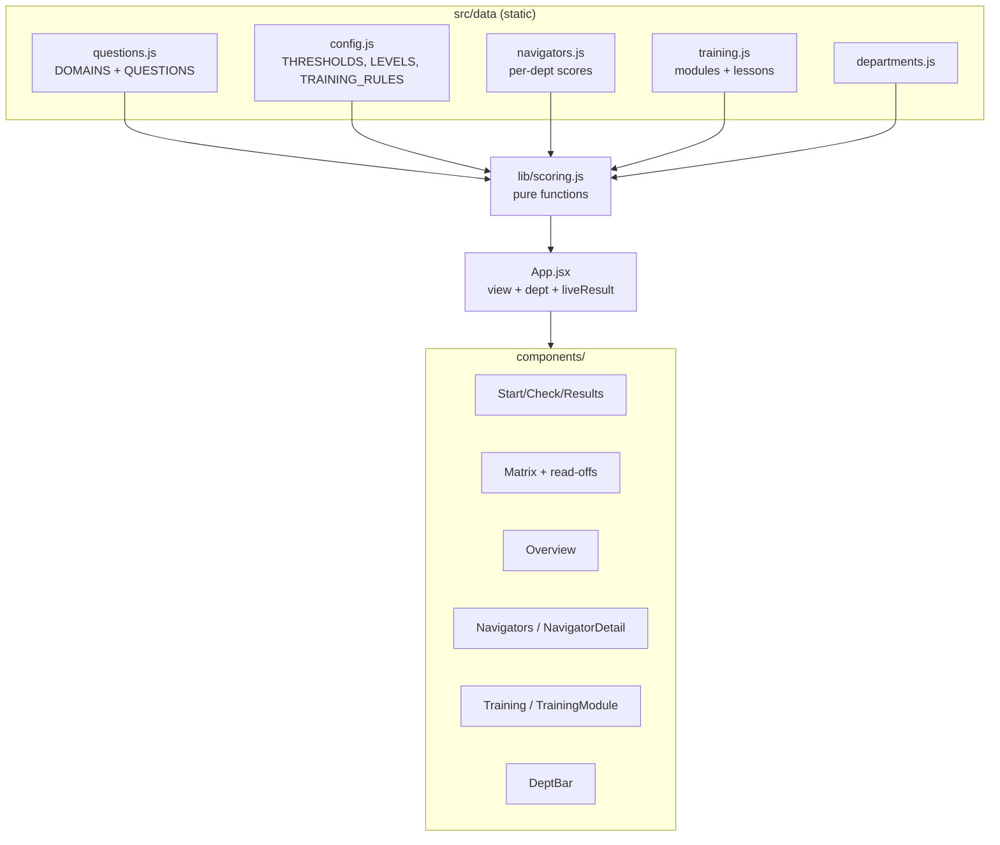
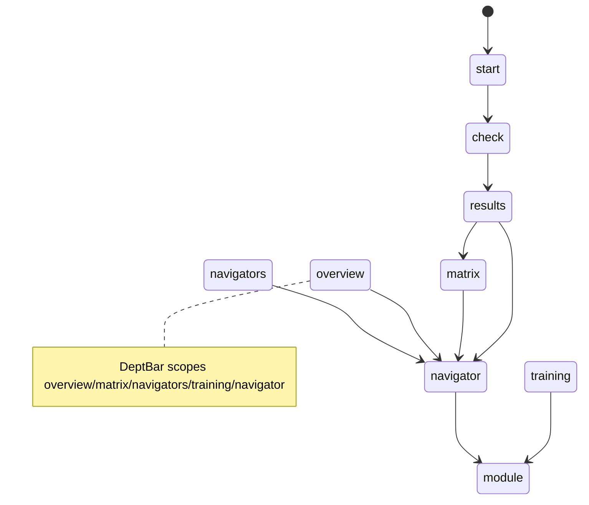

# CLAUDE.md — Knowledge Check (Project Knowledge Base)

> **Purpose of this file.** This is the single source of truth for the project: product
> spec, architecture reference, development journal, decision log, and onboarding doc in one.
> A new developer or AI agent should be able to read **only this file** and become productive.
>
> **Maintenance rule (mandatory).** No change is "done" until this file is updated. Whenever a
> feature, architecture, decision, bug, or goal changes, update the relevant section(s) **and**
> add a dated entry to [docs/HISTORY.md](docs/HISTORY.md) (the development journal; not
> auto-loaded - read it when you need past context). Keep
> [§8 Current System State](#8-current-system-state) and [§15 Current Priorities](#15-current-priorities)
> accurate at all times.
>
> **Last updated:** 2026-07-23 (**LIVE-CONTRACT EVIDENCE CORRECTION — prompt v8.**
> Draft PR #41 remains **NOT merged, NOT deployed, and NOT ready**. A real dedicated-key,
> non-production live-contract run reproduced malformed `MET` responses with empty evidence. The
> prompt contradicted the shared response shape by telling identity criteria not to populate
> free-text evidence even though every MET requires a quote. Prompt **`call-qa-grader-v8`** now
> requires one contiguous caller quote for MET identity responses solely to satisfy response shape;
> structured `identityEvidence` remains the only identity-credit authority. The OB/GYN rubric
> remains `qa-rubric-obgyn-v1` (100 points, 85 pass); parser, DOB, disclosure, calibration
> thresholds, and scoring are unchanged. The targeted live cases for separate one-word identity and
> an authorized third party passed under v8. The full v8 smoke passed 18/20 cases but cases 15 and
> 20 hit upstream HTTP 429, so it emitted FAILED and does not satisfy the gate. v8 is a new
> calibration population; no human fixtures exist, readiness remains `INSUFFICIENT_DATA`, and
> dedicated capacity plus owner decisions are still required. No migration, production write,
> private provisioning, historical rewrite, merge, deploy,
> auto-merge, or ready-state change. See docs/HISTORY.md. ·
> **Prior update:** 2026-07-23 (**CORRECTION PASS #7 FOLLOW-UP 2 — auxiliary confirmation structure.**
> Draft PR #41 remains **NOT merged, NOT deployed, and NOT ready**. Against independently reviewed
> head `e6fd39d`, the focused pass-7 file ran 31 tests with **5 failures / 26 passes** before the
> correction: four auxiliary-led confirmation disclosures were suppressed and the end-to-end
> pre-identity confirmation could not verify `af-hipaa`. `isInformationRequestInterrogative()` now
> distinguishes clause structure rather than exempting every auxiliary-led clause: genuine requests
> for the caller to supply information remain non-disclosures, while first-person `confirm`/`verify`
> clauses that reveal protected facts and auxiliary/declarative confirmation tags remain
> disclosures. Identity candidates, DOB ownership, chronology, refusal handling, quote mapping,
> prompt/schema, rubric, historical scoring, and calibration logic are unchanged. Prompt remains
> `call-qa-grader-v7`; OB/GYN rubric remains `qa-rubric-obgyn-v1`. Final focused gate: **33/33**;
> final unit gate: **2,226 tests across 85 files**. No migration, production write,
> private provisioning, historical rewrite, merge, deploy, auto-merge, or ready-state change. See
> docs/HISTORY.md and docs/GRADING_INVARIANTS.md §0n. ·
> **Prior update:** 2026-07-23 (**CORRECTION PASS #7 FOLLOW-UP — auxiliary-led information questions.**
> Draft PR #41 remains **NOT merged, NOT deployed, and NOT ready**. Against independently reviewed
> head `c2ef411`, the focused pass-7 file ran 24 tests with **5 failures / 19 passes** before the
> correction: `is/was/can/do` information questions were misclassified as disclosures and an
> `af-hipaa` allegation on the pre-verification question could false-zero the call. One narrow,
> deterministic `isInformationRequestInterrogative()` helper now excludes clauses that BEGIN with
> `what/when/where/who/why/how` or the auxiliary set
> `is/are/was/were/do/does/did/can/could/would/have/has/may`. It does not use a trailing `?` and does
> not exempt disclosures that state a protected fact before a confirmation tag (`Your appointment
> is Tuesday, correct?`, `Your results were normal, right?`, `You are scheduled with Dr. Reyes,
> okay?`). The final focused file is 25/25 and the full unit gate is **2,218 tests across 85 files**.
> This is server-only detector enforcement: prompt remains `call-qa-grader-v7`; OB/GYN rubric remains
> `qa-rubric-obgyn-v1`; Pediatrics and historical grades remain unchanged. Calibration remains
> `INSUFFICIENT_DATA` and a real dedicated-key live smoke remains required. No migration, production
> write, private provisioning, historical rewrite, merge, deploy, auto-merge, or ready-state change.
> See docs/HISTORY.md and docs/GRADING_INVARIANTS.md §0n. ·
> **Prior update:** 2026-07-23 (**CORRECTION PASS #7 — non-null candidate binding, caller-owned DOB
> rejection, quoted-disclosure chronology.**
> Draft PR #41 remains **NOT merged, NOT deployed, and NOT ready**. Against independently reviewed
> head `6b876d2`, the initial 13 focused regressions reproduced all three remaining blockers before
> the fix (`api/qaCorrectionPass7.test.js`: 7 failed / 6 preservation cases passed); two caller-
> ownership variants were then added to the final 15-test file. All fixes are pure
> SERVER-SIDE enforcement/docs — **no model-visible prompt or schema change** — so the prompt stays
> `call-qa-grader-v7` and the OB/GYN rubric stays `qa-rubric-obgyn-v1` (100 points, 85 pass;
> criteria/weights/applicability/auto-fail definitions unchanged). A complete identity now requires
> firstName, lastName, and DOB to resolve to the SAME non-null candidate. One shared deterministic
> DOB-ownership decision drives model evidence and independent chronology: explicit caller ownership
> cannot satisfy a third-party patient, while patient-linked wording remains valid.
> `classifyAfHipaaEvidence()` returns the unique mapped turn/clause, and auto-zero authority compares
> identity completion to THAT quote, never another detector hit; information-request questions are
> not disclosures. Numeric weighting still awaits owner sign-off; calibration remains
> `INSUFFICIENT_DATA`; a real dedicated-key live smoke remains required. No migration, production
> write, private provisioning, historical rewrite, merge, deploy, or ready-state change. See
> docs/HISTORY.md and docs/GRADING_INVARIANTS.md §0n. Final unit gate: **2,208 tests across 85 files**. ·
> **Prior update:** 2026-07-22 (**CORRECTION PASS #6 — independent identity chronology, refusal-aware
> disclosure, candidate binding, exact DOB span, surname particles, provider grammar, bidirectional
> consistency, privacy-gated smoke.**
> Draft PR #41 remains **NOT merged, NOT deployed, and NOT ready**. Against independently reviewed
> head `9c2da51`, 20 focused adversarial tests reproduced the blockers before the fix
> (`api/qaCorrectionPass6.test.js`). All fixes are pure SERVER-SIDE enforcement or smoke/docs — **no
> model-visible contract change** (the prompt text and response schema are untouched), so the prompt
> stays **`call-qa-grader-v7`** and the OB/GYN rubric stays **`qa-rubric-obgyn-v1`** (100 points, 85
> pass, criteria/weights/applicability/auto-fail definitions unchanged); Pediatrics and historical
> grades are unchanged/immutable. (1) **af-hipaa no longer trusts the model-selected identity
> occurrence.** A new INDEPENDENT, transcript-wide `earliestCompleteIdentity()` derives the earliest
> turn a complete single-patient identity exists — never the model's selected claims — so a model
> that submits only a LATER repetition can no longer make the server believe verification happened
> after a disclosure. af-hipaa verifies (zeroes) ONLY when the independent earliest identity is
> unambiguous and lands at/after the first disclosure; identity provably before → no zero; ambiguous
> / unprovable → critical review. (2) **Disclosure detection is refusal- and clause-aware.** A
> privacy-preserving refusal ("I cannot confirm whether your appointment is Tuesday until I verify
> you") is no longer a disclosure; the af-hipaa quote must map to exactly ONE navigator turn and ONE
> clause, that clause is classified (a governing refusal vetoes it), and the quote must itself carry
> the disclosure content — a detached benign fragment does not verify. (3) **Identity claims bind to
> ONE discrete candidate.** `resolveIdentityCandidates()` groups claims into candidates (designation
> or coherent field sequence); a first name from candidate A and a last name from an
> explicitly-switched candidate B fail closed, and a caller and patient who merely share a name are an
> ambiguous subject. (4) **DOB ownership uses the exact quoted occurrence** (the verified caller
> quote), not the first identical date in the turn; a duplicate quote fails closed. (5) **Lowercase
> surname particles survive in designations** ("Maria de la Cruz" keeps "de la Cruz") while ordinary
> lowercase prose is still dropped. (6) **Provider-name detection covers OB-GYN/obstetrician and the
> "name of the <provider>" direction.** (7) **Identity-verdict contradictions are reconciled, never
> silently deducted** — a NOT_MET identity/order criterion the server proves satisfied is credited and
> routed to mandatory review (a `verify-before-access` MET while `verify-three` NOT_MET is still a
> malformed retry). (8) **The live smoke gates every early-disclosure case on a PRIVACY-SPECIFIC
> result** (a verified af-hipaa or a critical deterministic-privacy-conflict review, never a generic
> fail) and now runs **20 synthetic cases**. Numeric weighting still awaits owner sign-off;
> calibration remains `INSUFFICIENT_DATA`. No migration, production write, private provisioning,
> historical rewrite, merge, deploy, or ready-state change. See docs/HISTORY.md and
> docs/GRADING_INVARIANTS.md §0m. Final unit gate: **2,193 tests across 84 files**. ·
> **Prior update:** 2026-07-22 (**CORRECTION PASS #5 — af-hipaa trust, DOB ownership quote,
> patient sequences, name components, provider detection, verdict consistency, live smoke.**
> Draft PR #41 remains **NOT merged, NOT deployed, and NOT ready**. Against independently reviewed
> head `da26baa`, 20 focused adversarial tests failed before implementation changes
> (`api/qaCorrectionPass5.test.js`). (1) A model **OMISSION** of the structured identity arrays can
> no longer create a false VERIFIED `af-hipaa`: an incomplete/missing/unprovable canonical identity
> is UNCERTAINTY, so a triggered HIPAA auto-fail verifies (and zeroes the call) ONLY when the server
> can prove positive chronology — the quote is a detected protected disclosure in an identified
> navigator turn AND canonical identity is COMPLETE and completed at or after that disclosure — and
> never when it would contradict a proven "verified before access". The incomplete case forces a
> mandatory critical supervisor-review conflict instead of an automatic zero. (2) `verifyIdentifierClaim`
> now PRESERVES the verified caller quote (it previously returned the bare value), so a multi-turn
> third-party DOB whose ownership language lives in the caller's own answer ("Her DOB is …", "the
> patient's DOB is …", "Maria's date of birth is …") is credited, while a phone/address elsewhere in
> the turn still cannot bypass ownership and a bare DOB to a generic question on a third-party call
> still fails closed. (3) Typed field answers are grouped into discrete candidate SEQUENCES with
> deterministic subject-switch cues, so a first name from patient A and a last name from an explicitly
> announced second patient B fail closed rather than merging. (4) Name-component splitting is
> conservative: two tokens → first/last; a bounded, documented surname-particle list ("de la Cruz",
> "del Rio") is recognised; a 3+-token name with an unrecognised middle ("Maria Elena Alvarez") is
> ambiguous and FAILS CLOSED — the surname is never guessed. (5) Provider FULL-NAME questions
> ("your OB's last name", "the doctor's first and last name", "spell the midwife's last name") now
> take precedence over the patient-name detector via optional field qualifiers and an expanded
> clinician-term list, so a clinician name is never taken as the patient's. (6) Verification verdicts
> must be logically consistent: `verify-before-access` MET while `verify-three` is NOT_MET is
> impossible and now trips the malformed-response retry (the reverse remains legal). (7) The live
> contract smoke asserts the COMPLETE privacy-relevant state per case (verdicts, `qa.autoFails`,
> `qa.unverifiedAutoFails`, the deterministic-privacy-conflict flag, and `qa.review.recommendation`),
> adds five explicit HIPAA/chronology cases (**15 synthetic cases total**), and the dedicated-key
> resolver no longer masks a populated singular key when the plural env var is set-but-empty. All
> fixes are pure SERVER-SIDE enforcement or smoke/docs — **no model-visible contract change**, so the
> prompt stays **`call-qa-grader-v7`** and the OB/GYN rubric stays **`qa-rubric-obgyn-v1`** (100
> points, 85 pass, unchanged criteria/weights/applicability/auto-fail definitions). Pediatrics is
> unchanged and historical grades remain immutable/separate by provenance. Numeric weighting still
> awaits owner sign-off; calibration remains `INSUFFICIENT_DATA`. No migration, production write,
> private provisioning, historical rewrite, merge, deploy, or ready-state change. See docs/HISTORY.md
> and docs/GRADING_INVARIANTS.md §0l. Final unit gate: **2,163 tests across 83 files**. ·
> **Prior update:** 2026-07-22 (**CORRECTION PASS #4 — canonical identity + HIPAA chronology.**
> Draft PR #41 remains **NOT merged, NOT deployed, and NOT ready**. Against independently reviewed
> head `fe54788`, 16 focused adversarial tests failed before implementation changes. The correction
> replaces unioned person tokens with discrete patient candidates (exact repeats deduplicate;
> shared names/multiple children/switches fail closed), enforces first/last field semantics and the
> explicit multi-token-surname rule (first token = given name; remainder = surname), and binds DOB
> ownership through transcript-level patient state starting from the verified claim span. Thus
> `your DOB` after naming another patient fails while an explicit patient-linked DOB or coherent
> direct-patient sequence can pass; phone/address text cannot bypass ownership. ONE canonical
> identity/disclosure chronology drives `verify-three`, `verify-before-access`, and `af-hipaa`.
> A triggered HIPAA fail verifies only when its navigator quote is itself a detected protected
> disclosure before identity completion. A deterministic early-disclosure conflict that the model
> reports false forces critical supervisor review but does not automatically zero the call, because
> the bounded phrase detector is not comprehensive; uncertain language also remains review-only.
> Raw validation now requires `triggered: false` auto-fails to carry empty evidence AND note before
> normalization. This response requirement is model-visible, so prompt v6 →
> **`call-qa-grader-v7`**; the OB/GYN rubric remains **`qa-rubric-obgyn-v1`** (100 points, 85 pass,
> unchanged criteria/weights/applicability/auto-fail definitions), Pediatrics is unchanged, and
> historical grades remain immutable/separate by provenance. The live contract smoke reads ONLY
> `CALL_QA_LIVE_SMOKE_API_KEY(S)`: VERIFIED is exit 0 + exact marker; FAILED and NOT_RUN are
> nonzero; `--allow-skip` prints SKIPPED but never satisfies a merge/release gate. It remains ten
> synthetic cases, pinned model, no Firestore/private bank, and no calibration authority.
> Calibration remains `INSUFFICIENT_DATA` until real adjudicated human evidence exists; numeric
> weighting still awaits owner sign-off. No migration, production write, private provisioning,
> historical rewrite, merge, deploy, or ready-state change. See docs/HISTORY.md and
> docs/GRADING_INVARIANTS.md §0k. Final unit gate: **2,128 tests across 82 files**. ·
> **Prior update:** 2026-07-22 (**CORRECTION PASS #3 — identity coherence + provenance.** Still a
> **DRAFT PR against `main`, NOT merged and NOT deployed** (PR #41). A third independent review
> attacked the trust boundaries the second pass introduced and found eight more issues; each was
> reproduced with a failing adversarial test first (`api/qaVerificationSubject.test.js` +
> additions to `api/qaVerificationPipeline.test.js` / `api/_qa-calibration.test.js`) and then
> fixed. (1) **The three identifiers are now bound to ONE patient identity.** `resolvePatientSubject`
> resolves the single patient from the whole call; a name value must be a token of that patient's
> name, a DOB is attributed to the nearest preceding name designation (a caller's own DOB can no
> longer pair with a different patient's name), and two people named as the patient fails closed.
> `scoreQa` evaluates ONE canonical identity array and feeds BOTH `verify-three` and
> `verify-before-access`, and `validateQaResponse` rejects the two identity criteria carrying
> DIFFERENT arrays — so they can never be credited from different identities. A privacy-safe,
> value-free `audit` record accompanies the evaluation. (2) **Name ownership no longer accepts
> ordinary English.** A stopword set removes request/scheduling/clinical/weekday words, a
> full-person DESIGNATION must be Title-cased (so "I am really scared" is not a name), the bare
> "who is" patient alternative is gone, and a provider-name question is distinguished from a
> patient-name question. (3) **One-word name answers verify** ("First name?" → "Maria.") without
> weakening the two-word minimum for ordinary evidence. (4) **The identity contract is CALLER-ONLY
> everywhere** — the response schema `role` enum is `['caller']`, the evidence-role rules no longer
> invite navigator turns, and validation rejects a navigator-role identity claim; prompt moves to
> **`call-qa-grader-v6`**. (5) **A MET identity criterion with a missing/empty/partial/duplicate
> structured payload trips the malformed-response RETRY** rather than becoming a navigator
> deduction. (6) **A protected-disclosure match now takes PRECEDENCE over a generic safe prefix**
> inside a single clause ("Okay your labs are normal." is a disclosure). (7) **Raw validation
> rejects non-string `evidence`/`note`** instead of coercing them to "". (8) **Historical
> calibration resolves by the RECORDED rubric version**, with an explicit
> (department, rubricVersion, promptVersion) compatibility matrix
> (`callQaProvenanceCompatible`): a genuine OB/GYN v3 record graded under the shared `qa-rubric-v2`
> validates its OLD closing ids under the shared rubric, while impossible tuples (v3 +
> `qa-rubric-obgyn-v1`; a NEW OB/GYN run claiming the shared rubric) are rejected. The OB/GYN
> rubric stays **`qa-rubric-obgyn-v1`** (no criterion/point/weight/applicability/auto-fail change);
> only the model-visible prompt contract moved (v5 → v6). A new opt-in, non-production
> `npm run qa:live-contract-smoke` runs ten synthetic transcripts through the real prompt/schema/
> validator against the pinned grader model (no Firestore, no private bank) — it remains a
> pre-merge/release gate and was NOT executed here (no non-production key available). **Correction
> to the earlier doc claim:** the disclosure detector's failure mode is NOT only a lost criterion —
> an UNDER-match (a phrasing it misses) can let a claimed MET survive, so it is a trust gate, not a
> comprehensive PHI detector. Unit suite 2036 → **2077 across 82 files**; no Firestore migration,
> no production write, no historical grade rewritten, no deploy. See docs/HISTORY.md 2026-07-22 and
> docs/GRADING_INVARIANTS.md §0j. ·
> **Prior update:** 2026-07-21 (**CORRECTION PASS #2 — Call QA verification integrity.** Still a
> **DRAFT PR against `main`, NOT merged and NOT deployed.** A second independent review probed
> the trust boundaries rather than the authored fixtures and found eight ways the pipeline could
> be fooled or could mislead a supervisor. Each was reproduced with a failing test first
> (`api/qaVerificationIntegrity.test.js`, 86 tests, 52 of which failed against the previous head)
> and then fixed, with `api/qaVerificationPipeline.test.js` (20 tests) running the same
> adversarial cases end to end through the real grading pipeline. (1) **Protected disclosures are
> now detected per CLAUSE, not per turn** — a turn that merely began safely ("Let me open your
> chart. I can see Dr. Smith ordered an ultrasound.") was classified safe, so identifiers
> collected afterwards could satisfy `verify-before-access` despite a real earlier disclosure;
> splitting is conservative and abbreviations/initials/decimals do not end a clause, the whole
> turn is re-checked as a safety net, and `findProtectedDisclosure()` reports turn index, clause
> index, clause text and category in transcript order. (2) **Name claims must be proven to be the
> PATIENT'S** — a navigator self-introduction ("this is Dana"), a provider surname ("Dr. Reyes")
> and an unrelated mention previously satisfied all three identifiers together; identifiers must
> now come from a caller-side turn AND sit inside a patient-identity span (self-identification,
> explicit third-party designation, or an answer to the navigator's patient-name question), with
> the third-party designation taking precedence over a self-identification in the same turn.
> Authorized third parties are fully supported, including "Can I have **his** first name, last
> name, and date of birth?" → "Sure, Liam Carter, March 2nd 2021." (3) **An identity criterion
> never persists or displays model-authored evidence** — scoring already ignored the free-text
> quote, but it was still stored and rendered, so a valid structured claim plus an invented
> sentence ("The patient was fully verified.") reached the supervisor panel as a quotation;
> identity criteria now carry a **privacy-safe server-derived summary** (which identifiers
> verified, in which turn — never the values), tagged `evidenceSource: 'server-derived'` and
> rendered as a statement, with the raw model claim kept on `modelJudgment` for audit only.
> (4) **`parseDateOfBirth` is a real date parser** — spoken forms ("March second nineteen
> ninety-one", "the second of March nineteen ninety-one") are accepted rather than costing a
> navigator verification credit, and the calendar is validated (February 29 only in a real leap
> year; no February 30/31, April 31, month 13 or day 0). Unsupported forms (two-digit years,
> digit-by-digit dictation, relative wording) are documented and fail closed to review; the
> birth-year range is unchanged (1800–2099) and no new age policy was invented. (5) **Malformed
> model output is rejected BEFORE normalization** — duplicate ids silently overwrote verdicts and
> unknown/extra criteria and auto-fail ids vanished, so the exact-set check saw only cleaned
> output and the retry never ran; validation is now strict on the raw response and every
> auto-fail id must be answered exactly once, with a quote when triggered. (6) **Prompt-version
> support is truthful** — v3 was declared supported while calibration rejected it; interpretable
> and producible are now separate (`isSupportedStoredPromptVersion` / `isCurrentPromptVersion`),
> genuine stored evidence may carry any supported version, an authored synthetic example must
> carry the current one, and populations never blend. (7) **A metadata-less historical result uses
> the HISTORICAL SHARED rubric** — `profileForGradedAttempt({}, 'obgyn')` returned the NEW OB/GYN
> profile, which would summarize a pre-versioning attempt against `close-offer-help`, a criterion
> it was never scored on; the stored department describes the CALL, not the rubric, and can no
> longer select a profile. (8) **Rubric interpretability is resolved at RENDER time** — the UI
> trusted a stored `scoringUnavailable` boolean that a future-rubric record would never carry, so
> stale `domainScores` rendered; one reusable selector `resolveQaScoringState()` now derives it
> from the attempt's own metadata and the stored flag is not consulted in either direction.
> **VERSIONING:** the rubric stays **`qa-rubric-obgyn-v1`** (no criterion, point, weight,
> applicability or auto-fail changed; still 100 points, still passes at 85), but the prompt moves
> to **`call-qa-grader-v5`** because the MODEL-VISIBLE contract changed again — the prompt now
> states the patient-identity ownership rules, accepts spoken DOBs, and requires every auto-fail
> id. Strict validation of the existing v4 schema alone would not have required a bump. No
> `identitySubject` field was added to the model schema: the server must establish ownership
> independently regardless of what the model declares, so it would add contract surface without
> adding trust. Unit suite 1923 → **2036 across 80 files**. **No Firestore migration, no
> production write, no private-bank change, no historical grade rewritten, no rules change.**
> See docs/HISTORY.md 2026-07-21 "Call QA verification integrity" and
> docs/GRADING_INVARIANTS.md §0i) ·
> **Prior update:** 2026-07-21 (**department-based Call QA rubric profiles; OB/GYN is the first
> dedicated department profile** — **DRAFT PR against `main`, NOT merged and NOT deployed.**
> The Call QA rubric is no longer one shared rubric assumed correct for every department.
> `getQaRubricProfile(department)` in `src/data/qaRubricProfiles.js` is **the single
> authoritative resolution point**; department behavior is profile DATA (criteria, points,
> `core` applicability, auto-fails, per-criterion evidence policies, grader instructions), not
> `department === 'obgyn'` branches. `gradeCallQaTranscript` resolves the profile ONCE from the
> **server-authoritative** department on the stored attempt and threads that one object through
> prompt construction, validation, repairs, scoring, category totals, core/NA handling,
> auto-fails, deterministic findings, review, and the QA domain/competency projections;
> `validateQaResponse` stamps its version and **`scoreQa` throws** on a mismatched criterion set,
> so validate-against-A / score-against-B cannot happen silently. Pediatrics reuses the
> historical shared rubric **verbatim** (`qa-rubric-v2`, zero behavior change); `obgyn` is
> `qa-rubric-obgyn-v1`; an unsupported department **fails closed** (422, grader never called) —
> no `?? 'pediatrics'` default remains in the scored path. **OB/GYN rubric: still exactly 100
> points, still passes at 85, every category weight unchanged.** Opening still requires the
> navigator's own first name (and now an offer of assistance; "Aizer Health" or "Aizer Women's
> Health"); **verification is exactly first name + last name + DOB** with phone/address never
> substituting and volunteered/multi-turn identifiers counting — the **same single constant**
> renders into `verify-three`, `verify-before-access` and the **`af-hipaa`** auto-fail so they
> cannot diverge; **empathy** and **hold narration** become **conditional** (`core: false`) so a
> routine call with no emotional cue and no hold yields NA rather than a deduction, while a real
> cue or a real unexplained hold is still NOT_MET; **active listening** accepts natural
> recognition of the request; **documentation** drops Pediatrics-only PE/newborn examples; and
> **closing** replaces `close-survey` (3) + `close-anything-thanks` (2) with ONE 5-point
> **`close-offer-help`** requiring an explicit offer of further assistance — thanks, goodbye, a
> mutual close, or survey wording alone earn **0**, survey wording is score-neutral, and the
> "any polite sign-off counts" grader allowance is removed for OB/GYN (retained for Pediatrics).
> A new narrow **`identity-verification` evidence policy** lets only those two verification
> criteria verify a quote from a caller turn (MET credit only; never auto-fails; never an
> unrelated criterion; order preserved so identifiers collected after a protected disclosure
> cannot retroactively satisfy verification-before-access). Every graded attempt now records
> `qa.gradingMetadata.rubricDepartment` + `rubricVersion`, and `profileForGradedAttempt()`
> renders/calibrates a historical result under the rubric that actually graded it — **no
> Firestore migration, no historical grade rewritten, no private-bank change, no deploy.**
> Calibration/coverage/pilot-smoke/corpus are department-aware, and rubric drift is now measured
> **within** a department (two departments legitimately carry two rubric versions).
> **CORRECTION PASS (same day, after independent review — 10 blockers):** the grader prompt no
> longer contradicts the identity policy (evidence ROLE rules are rendered from the profile;
> the global "never a caller line" sentence and the generic survey example are gone);
> `CALL_QA_PROMPT_VERSION` is now **`call-qa-grader-v4`**; identity verification is a REAL
> structured contract (`api/_qa-identity-verification.js` — the grader submits
> `{field,value,role,turnIndex,quote}` per identifier against `[n]`-indexed turns and the server
> re-derives every claim; a phone number or address can never be a DOB; all three identifiers are
> required and must be distinct); `verify-before-access` is decided by real transcript ORDER via
> ONE centralized protected-disclosure detector and **fails closed to review** when the order
> cannot be proven; the validate→repair→score **profile binding is enforced** by a deterministic
> profile `signature` (criterion IDs are explicitly NOT identity) plus exact criterion-set
> integrity; an **unknown recorded rubric version never becomes Pediatrics** (explicit
> `scoringUnavailable` state in summaries, UI, automation and calibration); the OB/GYN repair
> branch uses the resolved profile's repairable set; pilot smoke **refuses** cross-department
> label translation and uses real per-department fixtures; and empathy applicability keys on
> expressed affect, never Women's Health subject matter.
> Unit suite 1735 → **1923** across 78 files; build clean incl. the private-runtime bundle scan;
> 12/12 safe Playwright E2E; Firestore Rules 76/76; `qa:pilot-smoke` VERIFIED; `qa:calibrate` /
> `qa:coverage` remain `INSUFFICIENT_DATA` (0 human-pilot fixtures — the correct expected state,
> **not** a passing calibration result). See docs/HISTORY.md 2026-07-21) ·
> **Prior update:** 2026-07-21 (**one official capability status per navigator per department** —
> **MERGED to `main` as `01a7f27` (PR #40) on 2026-07-21 and auto-deployed to Railway.**
> this REVERSES the original 2026-06-23 "never a single overall grade" principle. Each department
> assessment now resolves to exactly one official status from the **arithmetic mean of all six
> domain scores**, in four non-overlapping bands: `0–39` **Critical** · `40–64` **Learning** ·
> `65–89` **Solid** · `90–100` **Can-Teach** (palette Burgundy → Orange → Gold → Green, with a light
> `tint` per band for diagnostics). Supervisors read "72% Overall · Solid" instead of reconciling six
> separate per-domain classifications. All six domain percentages remain visible as **diagnostic
> evidence** — driving targeted training, coaching, development paths, trends, critical-gap alerts,
> question-health evidence and mentor qualification — but a domain is never rendered as its own
> official level. A domain below 40 is flagged **"Critical gap"** even when the overall status is
> higher. Thresholds stay centralized in `config.js`; `overallScore`/`overallLevel`/`overallStatus`
> in `scoring.js` are the single canonical calculation (`departmentOverall` is now a thin alias).
> Safety rails: an **incomplete profile** (any of the six domains missing/non-numeric) is labelled
> "Incomplete" and can never be promoted to Solid or Can-Teach; **mentoring** requires Can-Teach
> overall AND ≥90% in that specific domain; **training** is assigned purely from domain scores, so a
> Can-Teach-overall navigator still receives a Required assignment for a weak domain; **Critical** is
> a developmental/supervisory signal, never an automatic employment decision; and status is never
> communicated by colour alone. **No Firestore migration** — everything derives at runtime from the
> `scores` object result documents already carry, and legacy result/pairing records keep rendering.
> **Merge-blocker review pass (same day):** three defects in the first implementation are fixed —
> (1) a MISSING domain was being coerced to `0` and read as `'critical'`, fabricating gaps, training,
> column gaps, learning signals, mentor suggestions and alerts; a missing domain is now an explicit
> unassessed `null` band and only a RECORDED 0–39 is a Critical gap; (2) an incomplete profile was
> double-counted (as `incomplete` AND inside Learning/Critical) and could inflate the floor average,
> so `overallScore` now returns null unless all six domains are numeric, `partialAverage` is a
> separate diagnostic field, distribution buckets are mutually exclusive and sum exactly to total,
> and official KPIs use complete profiles only; (3) competency scores were being passed through the
> new four-band capability mapper, producing `NaN` distribution counts and dropping sub-40
> competencies from the Overview — competencies now keep their ORIGINAL thresholds via
> `competencyScoreToLevel`/`COMPETENCY_THRESHOLDS`.
> **Final cleanup pass (same day):** repaired the remaining Latin-1 round-trip damage (corrupted
> arrows and box-drawing rules in two test files, plus a pre-existing instance in
> `tests/firestore-rules/call-qa-interviews.rules.mjs`) and **widened `scripts/check-encoding.mjs`**
> from a single hard-coded lead pair to the full continuation class, so the guard now catches every
> double-encoded 3-byte sequence (arrows, box drawing, math, punctuation) rather than curly quotes
> alone; fixed the guard's own Windows blind spot (`.pathname` gave `/C:/...` as a cwd, so
> `git ls-files` failed with ENOENT and the repo scan silently never ran on Windows); and made
> `departmentMatrix()` keep **Incomplete distinct from Unassessed** — a cell is null only at 0 of 6
> domains, while 1–5 of 6 returns a real cell labelled `Incomplete` with `assessedDomains`, so an
> in-progress assessment is no longer indistinguishable from an untaken one.
> Unit suite 1417 → **1572** across 73 files (all green, including the encoding guard for the first
> time); build clean; 12/12 safe Playwright E2E; Firestore Rules **76/76** (51 + 25).
> See docs/HISTORY.md 2026-07-20) ·
> **Prior same-day update:** 2026-07-20 (**department-controlled training modules** — PR #38 merged onto the
> latest `main` after PR #37, the answer-length balance, and PR #39 (OB/GYN Spot-the-Error bank v5),
> which are all preserved intact. The first PR #38 implementation fixed the content leak but gave
> `TrainingModule` a **private department state** plus a module-local selector, which allowed three
> integrity failures found in pre-merge review: a completion could be saved under a different
> department than the content reviewed; supervisor content could diverge from the cohort `deptRows`;
> and every unsupported department silently fell back to Pediatrics. `department` is now a
> **controlled prop and the sole source of truth** — no local state, no local selector, no default.
> `NavigatorApp`/`SupervisorApp` own the department; content, rows/cohort, navigator links and the
> completion department all derive from it. `onComplete(kind, department)` carries the department
> actually rendered and `completeLearningStep` rejects a mismatch without writing. Adult Medicine and
> Behavioural Health render "Training content is not available for this department yet." The catalog
> metadata and pure filtering helpers are unchanged; both regression directions and every current-floor
> SOP rule still hold. Unit suite 1374 → **1417** across 71 files. See docs/HISTORY.md 2026-07-20) ·
> **Earlier update:** 2026-07-19 (OB/GYN Spot-the-Error bank v5 — all 30 calls are individually authored as literal ten-turn transcripts in their six domain files; the shared transcript builder is removed, error turns are distributed 8/8/7/7 across Agent indices 2/4/6/8, chart-opening placement varies, post-error patients continue naturally, and human-review metadata records the subtle trap plus two correct distractor decisions for every call; an audit-only marker refreshes already-migrated environments without rewriting MCQs) ·
> **Earlier same-day update:** 2026-07-19 (OB/GYN Spot-the-Error bank v4 — all 30 calls were expanded into multi-fact scenarios with approved greetings and whole-chart language, but subsequent review found the shared structure, fixed error position, and direct-correction follow-ups still made the target too easy) ·
> **Earlier update:** 2026-07-19 (OB/GYN answer-length balancing — conspicuously long correct MCQ options and indexed Spot-the-Error lines were shortened without changing scenarios, distractors, correct mappings, workflow violations, or scoring; regression tests prevent answer length from revealing the target, and a new marker-gated bank version upserts the concise wording on already-migrated environments) ·
> **Earlier update:** 2026-07-19 (OB/GYN current-floor assessment bank v3 — the owner-confirmed Women's Health SOP v1.0 now drives a curated 24-item MCQ bank and 30-item Spot-the-Error bank; all 24 executable workflow rules and all 14 audit workflow types are covered; a marker-gated migration archives stale active non-manual OB/GYN content without deleting history or touching Pediatrics/manual drafts; exact SOP/rule/source provenance and deterministic one-Agent-error guards are enforced by tests) ·
> **Earlier update:** 2026-07-19 (PR #34 recovery + cleanup — the rich, SOP-grounded training modules
> (F9) are now flattened into the intended structure: the full `TRAINING_MODULES` catalog lives
> directly in `src/data/training.js` (Pediatrics same-day-sick correction applied in the data, not a
> runtime patch), the rich renderer directly in `src/components/TrainingModule.jsx`, and the
> training-only CSS directly in `src/styles.css`. The temporary recovery wrappers
> (`TrainingModuleRich.jsx`, `training-rich-catalog.js`), the imported legacy global stylesheet
> (`styles-pr34-base.css`) and its cascade-layer shim (`styles-training.css`), and the standalone
> `training-current-floor.test.js` were removed; its source-authority guards were merged into
> `training.test.js`. OB/GYN content is authored against the owner-confirmed current-floor Women's
> Health SOP v1.0 (2026-07-17): OB Portal / Rebecca Wood / Waiting List Portal routing, no `PSS OB`,
> serious-symptom escalation (High Priority TE → OB Portal → OB Urgent Calls Intermedia channel,
> never L&D dispatch), New OB pairing + OB Verified, and TE discipline. Training remains advisory
> (nothing scored/persisted). PR #35 and PR #36 work is untouched. **Content-precision follow-up
> (same day):** OB/GYN routing now teaches that **routine GYN scheduling is handled DIRECTLY**
> (Annual GYN UTD rule + provider template), not routed to OB Portal — the "almost everything → OB
> Portal" reduction is removed; and a serious-symptom escalation (decreased fetal movement) keeps an
> **unrelated prenatal-vitamin refill on its own separate TE** instead of "noting the vitamins too"
> in the serious-symptom note. Two regression tests lock both. See docs/HISTORY.md 2026-07-19.
> Prior — **Last updated:** 2026-07-18 (PR #35 merge-readiness pass — current main (`d4ee320`, PR #33) merged
> in with the full calibration/readiness architecture preserved; grader prompt version is now
> `call-qa-grader-v3` with its single source of truth in `api/_qa-grading-versions.js`; calibration/
> pilot-smoke run on committed non-production synthetic descriptors or an ignored local
> private-bank manifest (never the private Firestore bank) and coverage honestly reports
> `runtime-bank-evidence-missing` without one; private scenarios now require a validated
> `callerCaseFile` caller contract (server-side persona injection only — never the browser, history
> projection, or bundle); server scenario selection is randomized (recent-exclusion preserved,
> injectable RNG); content version status separates active-SOP/fallback/rule-set/source-authority
> concepts with exact active-SOP matching; deterministic audit validation is context-aware
> (chart facts + preceding Patient turn) while keeping the exactly-one-Agent-error guarantee; 14
> OB/GYN audit workflow generation smoke tests added; mojibake removed with a standing encoding
> guard; and an Admin-only dry-run private provisioning tool added. **Provisioning executed
> 2026-07-18 by an authorized operator:** 15 freshly authored private OB/GYN scenarios validated
> 15/15 locally, dry-run verified, then applied to production `callQaScenariosPrivate`
> (15 created, 0 updated, 0 deactivated); the read-only pre-publish `results` integrity scan
> passed (17 documents, 17 clean, 0 flagged) and the tightened Firestore rules were deployed to
> production. Scenario content and operator credentials live only in gitignored operator
> material — nothing private is committed. Remaining live smoke requirements are listed in §15.
> Same-day follow-up: **scored Call QA rollout is OB/GYN-only** —
> `CALL_QA_ROLLOUT_DEPARTMENTS = ['obgyn']` in `src/data/callQaScenarios.js` governs the relay's
> test-mode gate, the phase flow (Pediatrics runs a two-phase MCQ → Spot assessment; historical
> Pediatrics QA attempts stay readable but no scored Pediatrics Call QA is offered or required),
> the private-bank minimum (15 active OB/GYN scenarios only — the provisioning tool rejects
> non-rollout departments), OB/GYN private scenarios now require complete non-null provenance
> (current rule-set version, owner-confirmed authority, `sourceSopVersion` pinned exactly to the
> current-floor `OBGYN_SOP_VERSION`, non-empty valid
> rule IDs), and coverage/pilot-smoke report the rollout scope honestly; CI now also runs
> `qa:pilot-smoke`, `qa:calibrate`, and `qa:coverage` (offline, no secrets).
> Same-day reliability follow-up: scored Call QA grading now has a strict shared upstream budget:
> 40s per attempt, at most 2 actual Gemini fetches across every configured key and malformed-output
> recovery, and an 85s total deadline. A subsequent PR #36 blocker pass restores safe 403 key
> rotation (auth only when every attempted call is 403) and gives the saved-attempt client a 100s
> request timeout with bounded 2s/5s/10s/15s retries inside a 150s total wait. It remains pinned to
> exactly one grader model.
> See docs/HISTORY.md 2026-07-18. Prior: Call QA answer secrecy + caller-observable grading — every runtime
> scenario-instance field now comes from the client-denied `callQaScenariosPrivate` store; the public
> repo contains only anonymous aggregate coverage requirements; raw server attempts are unreadable to
> navigators and history is an allowlisted API projection; the caller/browser receive only a neutral,
> minimal public projection; grading uses the immutable private attempt snapshot; OB/GYN grading
> accepts caller-observable outcomes and deterministic checks require explicit contradictions rather
> than internal-term narration — see F25, §8, and grading invariants §0e).
> Prior: Spot the Error deferred-feedback redesign — the active phase no
> longer reveals correct/wrong per item; the navigator picks the message AND types a required
> "why is this the error" explanation (pick changeable until Next), and all verdicts + their typed
> reasoning appear only on the end-of-assessment review screen — see F16. Scoring model unchanged
> (click accuracy only; explanations are display-only, not persisted). Prior: visual polish pass — two-voice typography: Fraunces display serif
> on page-level headlines + variable Inter for UI; fixed the documented mobile nav overflow with a
> swipeable pill row; CSS-only nav gem mark + refined footer; warm scrollbars, global focus rings,
> uppercase-label tracking; deleted the orphaned logo rules — see §10. Prior: PR 2 — server-authoritative Call QA transcript: the scored Call QA
> test is now captured, finalized, loaded, graded, and persisted by the SERVER. The `/api/live`
> relay derives navigator identity from the verified token, loads the curated scenario server-side,
> creates a server-owned attempt before the call, captures Gemini Live's transcription events,
> checkpoints them, runs a bounded End-Call drain handshake, and finalizes explicit capture states;
> `/api/grade-call-qa` now takes ONLY `{ attemptId }`, loads the stored transcript + trusted scenario
> snapshot, grades that (all PR-1 invariants preserved), and persists idempotently via a grading
> lease; the browser never submits or writes a scored transcript/grade; `firestore.rules` blocks
> navigators from creating/mutating server Call QA attempts; new pure server modules
> `api/_call-qa-transcript.js` + `api/_call-qa-attempts.js`, DI-testable relay, and a chained
> emulator rules suite — see F25 + docs/GRADING_INVARIANTS.md §0a. Prior: PR 1 — Call QA evidence integrity + model auditability:
> single-navigator-turn contiguous evidence verification, EVIDENCE/ABSENCE grader basis, unresolved
> negatives forcing supervisor review, preserved raw model judgment, a pinned auditable grader model
> (`CALL_QA_GRADER_MODEL`, no scored model fallback), versioned `qa.gradingMetadata`, and non-final
> "AI recommendation pending review" labels — see F25 + docs/GRADING_INVARIANTS.md §0; then the
> result document-ID/body ownership binding + navigator own-row
> identity fix; supervisor Question Bank redesigned as a collapsible review workspace, hardened
> across three follow-up passes — async-load-aware tab defaults + a sort-label fix; failure-safe
> persistence actions + a truly modal generation dialog + an empty-department tab fix + edit-error
> placement + roving-tabindex tab keyboard nav; then modal focus-restoration timing, department-
> scoped transient messages, truly-immutable per-request generation tags, keyboard focus
> containment during generation, and Edit disabled during any pending action; then a top-level
> Assessment Bank selector so Scenario Questions and Spot the Error no longer share one scrolling
> page — implemented in PR #30) ·
> **Same-day foundation (2026-07-17):** OB/GYN current-floor operating model v2 adds explicit source
> authority, 24 executable workflow rules, versioned MCQ/audit content, a 14-workflow audit taxonomy,
> a private-bank contract requiring at least 15 OB/GYN Call QA scenarios, deterministic guards, and
> non-destructive stale/legacy review labels. Runtime Call QA instances are deliberately absent from
> the public repo and must be privately provisioned before deployment. See F14, F16, F25, and section 8.
>
> **Doc maintainer:** Claude (AI agent) + repo owner. Assumptions are explicitly marked **[ASSUMPTION]**.

---

## Table of Contents
1. [Project Overview](#1-project-overview)
2. [Product Goals](#2-product-goals)
3. [Product Usage](#3-product-usage)
4. [Feature Inventory](#4-feature-inventory)
5. [Architecture Overview](#5-architecture-overview)
6. [Technical Decisions Log](#6-technical-decisions-log)
7. [Development History](#7-development-history)
8. [Current System State](#8-current-system-state)
9. [Codebase Knowledge](#9-codebase-knowledge)
10. [UX/UI Documentation](#10-uxui-documentation)
11. [Roadmap](#11-roadmap)
12. [Bugs & Known Issues](#12-bugs--known-issues)
13. [Lessons Learned](#13-lessons-learned)
14. [AI Agent Context](#14-ai-agent-context)
15. [Current Priorities](#15-current-priorities)

---

## 1. Project Overview

- **Project name:** Knowledge Check (repo: `QuarterKnolwdge`).
- **Product description:** A self-contained web app that runs a quarterly "knowledge check" for
  **patient navigators** (contact-centre agents who handle patient calls) and renders the
  **capability map** it produces. The check asks scenario questions ("a patient calls wanting X,
  situation is Y — what do you do"), each tagged to a knowledge **domain**, and scores
  **per domain per person**. Each department assessment then produces **one official overall
  capability status** for supervisor clarity, calculated from the arithmetic mean of all six
  domain scores; the individual domain percentages remain visible as diagnostic evidence for
  targeted training, coaching, trends, critical-gap alerts, and safe mentor qualification.
- **Core mission:** Turn a team's operational knowledge into a clear, actionable capability map
  that supports readiness decisions, coaching, and training by domain.
- **Vision statement:** Become the standing instrument a contact-centre team lead uses each
  quarter to see exactly who is strong where, where the floor-wide gaps are, who can mentor whom,
  and what training to assign — across every department they run.
- **Target audience:**
  - **Primary (demo audience):** management / team leads evaluating the concept.
  - **End users (modelled):** patient navigators (take the check) and their supervisors (read the
    matrix and dashboards).
- **Key value proposition:** A lightweight, no-backend tool that converts a short scenario quiz
  into a per-domain capability matrix plus "so what" read-offs (gaps, mentors, readiness) and
  auto-assigned training — in seconds, with no install or accounts.
- **Main user problems solved:**
  1. Knowledge assessment that tests **application, not recall**.
  2. **One unambiguous official status per navigator per department**, backed by an actionable
     **per-domain** breakdown — supervisors get a clear answer *and* the evidence behind it.
  3. Surfaces **floor-wide training priorities** and **mentorship capacity** automatically.
  4. **Auto-assigns training** to each navigator based on their weak points.
  5. Extends the same lens across **multiple departments**.

> **Context / origin.** Built from a build brief (`ClaudeCode_Build_Brief.md`) plus a team SOP
> (`Pediatrics_SOP_Updated.pdf` — the *Aizer Health Pediatric Department* operational report; the
> original `SOP Guide.pdf` is superseded by this updated version). The department SOPs are the
> **source of truth for scenario questions**; since 2026-07-02 the **6 knowledge domains** come
> from the Patient Navigator **role description** (`Patient-Navigators-Job.txt`, owner-provided):
> cross-department call handlers who classify requests, route them, schedule accurately, hold
> scope/privacy boundaries, and document cleanly.

---

## 2. Product Goals

### Short-Term Goals (current)
- Deliver a credible, self-contained **prototype to demo to management**. ✅ Done.
- Derive domains/questions from the real SOP. ✅ Done.
- Per-domain scoring → **one official overall status** (Critical/Learning/Solid/Can-Teach) per
  department, with editable thresholds; domain percentages kept as diagnostic evidence. ✅ Done.
- Capability matrix (hero) with an Overall column, column gaps, domain-mentor roster, and
  overall-status readiness ranking. ✅ Done.
- Analytics dashboards (team overview + per-navigator). ✅ Done.
- Auto-assign training by weak point, with previewable SOP-grounded module content. ✅ Done.
- Department dimension (Pediatrics + 3 mockup departments). ✅ Done.
- A persistent public deployment for showcasing. ✅ Done (Railway).

### Mid-Term Goals
- ✅ **Multi-department live checks:** Pediatrics and OB/GYN are now live checks. Adult Medicine
  and Behavioural Health remain mockups pending their SOPs.
- **Mentor pairing (floor-wide):** auto-match weaker navigators to qualified mentors (Can-Teach
  overall **and** ≥90% in the domain) with balanced mentor load.
- **Coverage / bus-factor risk view:** flag domains with only 0–1 qualified mentors (single point
  of failure).
- **Training completion tracking:** Assigned → In progress → Done states (in-memory for the demo).

### Long-Term Vision
- A production tool with persistence, multiple SOPs/departments, historical trend (quarter over
  quarter), training ROI, and role-based access — the team lead's standing quarterly instrument.

---

## 3. Product Usage

**What users do.** A navigator takes a short scenario check; supervisors read the resulting
capability map and dashboards and act on them (assign training, plan mentorship).

**Typical workflows / user journey:**
1. **Take the check** — Start → step through ~20 domain-tagged multiple-choice scenarios → submit.
2. **See results** — one official overall status (Critical/Learning/Solid/Can-Teach) from the
   six-domain average, plus every per-domain % as the diagnostic evidence behind it.
3. **Read the matrix** — every navigator's one official Overall status beside the six diagnostic
   domain scores; with column gaps, the domain-mentor roster, and the overall-status readiness
   ranking.
4. **Explore analytics** — Team Overview (navigator-level KPIs, official status distribution,
   diagnostic domain distribution, cross-department strength) and per-navigator dashboards
   (strongest domains, priority focus areas, critical domain gaps, assigned training, mentors).
5. **Manage training** — Training tab shows auto-assigned modules by domain cohort and by
   navigator; preview a module's mockup lesson content.
6. **Switch departments** — the department bar re-scopes the matrix/dashboards/training to
   Pediatrics (live) or one of the three mockup departments.

**Expected outcomes:** a supervisor leaves with (a) a clear capability picture per domain and
department, (b) a ranked list of training priorities, (c) named mentors, and (d) per-person
training assignments.

**Real-world use cases / ideal usage:**
- Quarterly capability review in a contact centre.
- Onboarding gap analysis for new navigators.
- Identifying who is "ready for more" (high Can-Teach count).
- Planning a single training session for a whole cohort weak in one domain.

---

## 4. Feature Inventory

> Status legend: **Complete** · **In Progress** · **Planned** · **Deprecated** · **Removed**.

### F1 — Take-the-Check Flow
- **Purpose:** Assess application of SOP knowledge via scenario MCQs.
- **User benefit:** Fast, low-stakes, domain-tagged assessment.
- **Technical implementation:** [src/components/Check.jsx](src/components/Check.jsx) — stepped,
  one scenario per step, progress bar, optional name, Back/Next, submit. Questions from
  [src/data/questions.js](src/data/questions.js).
- **Status:** Complete.
- **Dependencies:** `QUESTIONS`, `DOMAINS`.
- **Notes:** Stepped flow chosen over single-page for demo clarity.

### F2 — Scoring → ONE official status + diagnostic domain evidence
- **Purpose:** Convert answers into per-domain **and** per-competency scores, then resolve the six
  domain scores into **exactly one official capability status per navigator per department**.
- **User benefit:** Supervisors get a single unambiguous answer ("72% Overall · Solid") plus the
  per-domain evidence that explains it, instead of six separate classifications to reconcile.
- **Technical implementation:** `scorePerDomain(answers, questions)` and
  `scorePerCompetency(answers, questions)` in [src/lib/scoring.js](src/lib/scoring.js) average each
  option's `points` (partial credit, not binary). `scoreToLevel()` is the **one canonical band
  mapping**; `overallScore()` / `overallLevel()` / `overallStatus()` are the **one canonical overall
  calculation** (`departmentOverall()` is a thin alias, so a single averaging formula exists).
  Thresholds live only in [src/data/config.js](src/data/config.js)
  (`THRESHOLDS = { critical: 40, solid: 65, canTeach: 90 }`).
- **Bands (non-overlapping):** `0–39` **Critical** · `40–64` **Learning** · `65–89` **Solid** ·
  `90–100` **Can-Teach**. Palette progresses Burgundy `#8B1E2D` → Orange `#C9682C` → Gold `#D8A72E`
  → Green `#347A4D`; each level also carries a light `tint` used for diagnostic domain cells.
  Status is **never** communicated by colour alone — every surface renders the percentage and the
  written label.
- **Overall formula:** sum of the six configured domain scores ÷ six, **rounded only after the
  complete average**, within a single department, from a single instrument's stored `scores`
  (MCQ / Spot / Call QA are never blended, and departments are never averaged together). Derived at
  runtime — **no Firestore migration**.
- **Missing-domain safety (hardened 2026-07-20 review):** `overallScore()` returns **null unless
  all six domains are numeric** — a partial profile has NO official score and NO official level.
  `{intake: 100}` is **Incomplete**, not "100% Can-Teach" and not "Learning". `overallStatus()`
  distinguishes three mutually exclusive states — `unassessed` (nothing scored) · `!complete`
  (Incomplete, no official level) · `complete` (exactly one official level). Because an incomplete
  profile has no level at all, `overallLevel === 'canTeach'` already implies completeness, so every
  downstream mentor / readiness / question-health check inherits that safety.
  `partialAverage(scores)` exposes the mean of the evidence that exists, but it is **explicitly
  diagnostic**: it is never called an overall score, never rendered with a level, and never feeds an
  official KPI.
- **THE GOVERNING INVARIANT (2026-07-21):** *Missing evidence must never be represented as failure,
  mastery, or a real 0%. Only a genuinely measured numeric zero is a Critical result.* This applies
  end to end — bank coverage, per-domain scoring, official status, training empty states, floor
  aggregates, trend series, and every label. Concretely:
  - **Bank coverage.** `assessmentBankCoverage(questions)` / `isAssessmentBankComplete()` require at
    least one *scoreable* question (`isScoreableQuestion`) for every configured domain. The navigator
    MCQ phase is **blocked** — with a "this assessment isn't ready yet" screen naming the uncovered
    domains — rather than scoring a bank that cannot measure all six. Nothing is persisted.
    A partially-populated live bank is **never topped up from the seed bank**, because mixing
    outdated seed content with current managed content inside one graded assessment is worse than
    blocking. The seed bank is used only when the live bank is entirely empty.
  - **A failed bank READ is not an empty bank (2026-07-21).** `loadBankForDept()` in `NavigatorApp`
    distinguishes three outcomes: a successful non-empty read uses the live bank; a successful
    **empty** read legitimately falls back to the department's committed seed bank; and a **rejected**
    read means the bank status is *unknown*, so it renders its own retryable
    "couldn't load the question bank" connection-error state (`view === 'bankUnavailable'`) and
    permits neither starting the MCQ nor saving a result. Seed fallback is allowed **only after a
    successful read confirms the live bank is empty** — never on an error, because a stale seed
    assessment could otherwise be graded and stored as if it were current. The read error is logged
    (message only, never the payload) rather than swallowed, and the navigator can retry without
    signing out. The read error is normalized through `safeErrorMessage()`
    ([src/lib/safeError.js](src/lib/safeError.js)) before logging: `err?.message ?? err` would fall
    through to the raw rejection value, and a non-Error object could carry question content, options,
    answer keys, a Firestore snapshot or a request payload straight into `console.error`. Only an
    `Error`'s own message or a string rejection is logged (truncated); anything else becomes a
    generic label. Arbitrary objects are never serialized and stack traces are never logged. The
    department id is kept — it is not assessment content.
  - **Unscoreable questions provide no evidence at all.** `isScoreableQuestion()` (known domain +
    at least one option) now gates **both** `scorePerDomain` and `scorePerCompetency`. A malformed
    question contributes neither a domain score nor a competency score; a competency exercised only
    by unscoreable questions returns `null`. A *measurable* question still yields a genuine `0` when
    the navigator leaves it unanswered or picks a zero-point/nonexistent option.
  - **Per-domain scoring.** `scorePerDomain()` returns **null** for a domain with no scoreable
    questions ("nothing to answer") and a genuine **0** for a domain that was measured and earned
    nothing. `scorePerDomain(answers, bank, { strict: true })` throws
    `IncompleteAssessmentBankError` (carrying `missing`) instead of returning a profile with holes.
  - **Training empty states.** `trainingEmptyStateReason(row)` resolves an empty assignment list to
    `unassessed` / `incomplete` / `mastered` / `has-assignments`; `hasMasteredAllDomains(row)` is
    true only for a complete profile with every domain ≥ 90. No surface may treat
    `assignments.length === 0` as mastery, and mentoring is never suggested to an incomplete or
    unassessed navigator.
  - **Aggregates.** `floorStats().avgOverallScore` / `.solidPlusRate` and
    `domainDistribution().avgScore` are **null** when there is no eligible evidence, and render as
    `—`/`N/A` (never `0%`). `teamTrend()` omits timepoints with zero complete profiles, and
    `buildTrend()` puts **null** (a gap in the sparkline) where a historical domain score is
    missing. Counts stay genuine zeroes — "zero navigators are Critical" is a real fact. A complete
    floor whose real average is 0 still displays `0%`.
  - **Synthetic trend points are scaffolding, never evidence (2026-07-21).** `buildTrend()` prepends
    illustrative `simulated: true` points when real history is thin, and they may still be *drawn*
    (they are labelled "(illustrative)"). They must never be described as measured, as historical
    evidence, as a prior result, or as the navigator's last score. The flattened
    `overallSeries`/`domainSeries` arrays deliberately cannot convey provenance, so any
    "last measured" style caption reads **`latestRealOverall`** / **`latestRealDomainValues`**
    (plus `hasRealMeasurements`), which are computed from real, non-simulated snapshots only and are
    `null` when no real measurement exists — in which case the caption is omitted entirely.
    `latestMeasured()` in `formatScore.js` remains a generic, **provenance-unaware** array helper and
    must not be used for such captions. A genuine historical `0` is a real measurement and still
    captions "last measured 0%".
  - **Only finite numeric evidence may appear as a percentage (2026-07-21).** `Math.round(null)` is
    `0`, so any label rounding a possibly-null value silently fabricates a measured zero. All
    score/percentage labels go through one shared formatter,
    [src/lib/formatScore.js](src/lib/formatScore.js) — `formatPercent()` (genuine `0` → `"0%"`;
    finite → rounded; null/undefined/NaN/non-numeric → `"N/A"`), `formatSeriesCurrent()`,
    `latestMeasured()` and `isMeasured()`. `trendOverall()` returns **null** (not 0) when a snapshot
    has no measurable evidence, and `buildTrend().overallSeries` is `(number|null)[]` for the same
    reason. `Sparkline` splits its line around gaps and dots isolated readings rather than plotting
    them at zero. `NavigatorDetail` labels the **latest snapshot** — showing `N/A` when the most
    recent check measured nothing, with a separate "last measured X%" caption, so an older reading
    is never presented as current.
- **Missing evidence is never a zero (hardened 2026-07-20 review):** `domainBand(pct)` returns
  **null** for a missing or non-numeric domain — never `'critical'`. Only a genuinely recorded
  number in 0–39 is a Critical gap. An absent domain therefore produces **no** critical-gap alert,
  **no** required/critical training assignment, **no** column gap, **no** distribution band count,
  **no** Learning Loop weak-domain signal, **no** mentor suggestion or pairing, and **no** Action
  Center entry. A recorded `0` still does all of those things — the two cases are deliberately
  distinguishable everywhere, and regression-tested as such.
- **Competency axis is separate:** `competencyScoreToLevel()` + `COMPETENCY_THRESHOLDS`
  (`<60` Learning · `60–84` Solid · `85+` Can-Teach) keep the competency axis on its **original**
  bands. The capability re-band deliberately did not touch competencies. Never call the capability
  `scoreToLevel()` on a competency score: it would silently re-band every rating and emit a
  `'critical'` id the competency distribution has no bucket for (which produced `NaN` counts and
  dropped sub-40 competencies from the Overview until the 2026-07-20 review fixed it).
- **Status:** Complete.
- **Dependencies:** `THRESHOLDS`, `LEVELS`, `LEVEL_ORDER`, `COMPETENCIES`.
- **Notes:** Domain scores keep the same bands, but only as **diagnostic ranges** driving tints and
  training priority — a domain is never rendered as "Routing · Solid". Competency scores remain a
  **separate axis**, presented explicitly as competency analysis rather than the department status.
  Each option carries `points` (0–100) + an SOP-referenced `rationale`; the 100-point option is
  `correctOptionId`.

### F3 — Capability Matrix (hero screen)
- **Purpose:** Navigator × **Overall** + six domain columns; the centrepiece.
- **User benefit:** One official status per navigator at a glance, with the diagnostic scores that
  produced it in the same row.
- **Technical implementation:** [src/components/Matrix.jsx](src/components/Matrix.jsx); rows from
  `buildMatrixRows()`. The **Overall** cell renders `<OverallBadge>` (strong level colour + % +
  label); each domain cell renders `<DomainScore>` — the raw percentage on a light score-range tint,
  with a **"Critical gap"** warning below 40 — never a Learning/Solid/Can-Teach pill. Shared badge
  primitives live in [src/components/OverallStatus.jsx](src/components/OverallStatus.jsx). The
  legend lists all four levels with their ranges and states that it primarily describes the official
  Overall status while domain colours are diagnostic score ranges. Live taker appears as a
  highlighted new row; rows are clickable to the navigator dashboard.
- **Status:** Complete.
- **Dependencies:** F2, department scope.

### F4 — Matrix Read-offs (column gaps · domain mentors · readiness)
- **Purpose:** The "so what" — turn the grid into priorities.
- **User benefit:** Immediate training/mentorship signal.
- **Technical implementation:** `columnGaps()`, `domainMentorRoster()`, `readinessTally()` in
  [src/lib/scoring.js](src/lib/scoring.js). `COLUMN_GAP_THRESHOLD = 0.5`.
- **Status:** Complete.
- **Notes:** A **column gap** is now "a majority of navigators score **below 65%**" (Critical +
  Learning bands, with the critical count reported separately) rather than "sit at Learning".
  `readinessTally()` ranks by **official overall status, then overall score**, and exposes
  `readyForMore` (true only for overall Can-Teach) plus `canTeachDomainCount` as supporting depth —
  it no longer counts Can-Teach cells as the classification. `canTeachRoster` remains as a
  backward-compatible alias of `domainMentorRoster` (see F7).

### F5 — Team Overview Dashboard
- **Purpose:** Floor-wide **navigator-level** KPIs + official status distribution + domain
  diagnostics + cross-department strength.
- **User benefit:** Leadership "state of the floor" view in terms of people, not cells.
- **Technical implementation:** [src/components/Overview.jsx](src/components/Overview.jsx);
  `floorStats()`, `overallDistribution()`, `domainDistribution()`, `departmentMatrix()`.
- **KPIs:** % of navigators Solid or above · navigators Can-Teach overall · **navigators Critical
  overall** (highlighted) · average overall score · navigators assessed. The old cell-based KPIs
  ("avg Can-Teach domains / navigator", "domains have a teacher", solid-rate across every domain
  cell) are **removed**.
- **Eligible profiles (hardened 2026-07-20 review):** every official-status KPI is computed over
  **complete six-domain profiles only**. `floorStats().assessed` counts complete profiles — the
  population the KPIs actually describe — while `rowCount`, `incompleteCount` and `unassessedCount`
  report the rest. A one-domain `{intake: 100}` therefore cannot inflate the floor average, and an
  unassessed navigator is never counted as assessed. The Overview renders an eligibility note
  explaining any exclusion.
- **Distribution:** an official overall-status distribution sits above the per-domain panel and is
  **mutually exclusive** — each navigator lands in exactly one of Critical / Learning / Solid /
  Can-Teach / Incomplete / Unassessed, so `critical + learning + solid + canTeach + incomplete +
  unassessed === total` exactly. (Before the 2026-07-20 review an incomplete row was counted twice:
  once as `incomplete` and again inside Learning or Critical.) The per-domain panel is explicitly a
  **diagnostic score distribution**, reports each domain's average score and sub-40 count, and
  carries its own `unassessed` bucket so an unscored domain is never bucketed into a band (which
  previously produced `NaN`).
- **Cross-department table (fixed 2026-07-20 cleanup):** `departmentMatrix()` returns null for a
  department cell **only when it is fully unassessed** (0 of 6 domains). An **incomplete**
  department (1–5 of 6) returns a real cell — `overall: null`, `level: null`, `complete: false`,
  `label: 'Incomplete'`, plus `assessedDomains`/`totalDomains` — so the table shows "—/Incomplete"
  with an "X of 6 domains scored" tooltip instead of collapsing an in-progress assessment into
  "Not assessed". Both `Overview`'s "Strength by department" table and `NavigatorDetail`'s
  department strip pass that metadata to `OverallBadge`; omitting it would make the badge mistake
  an incomplete department for an unassessed one. `partialAverage` is never rendered there as an
  official percentage.
- **Status:** Complete.

### F6 — Navigators List + Per-Navigator Dashboard
- **Purpose:** Drill into one person's development picture.
- **User benefit:** Coaching-ready individual view, headed by one official status.
- **Technical implementation:** [src/components/Navigators.jsx](src/components/Navigators.jsx) and
  [src/components/NavigatorDetail.jsx](src/components/NavigatorDetail.jsx).
  **Roster cards** show `Name` + `91% Overall · Can-Teach` and keep a six-segment domain score strip
  (each segment a score-range tint, tooltip = domain name + percentage); the old
  "3 Can-Teach" / "2 Learning · 3 Solid · 1 Can-Teach" counters are **removed**, and a Critical
  overall card is visibly urgent (`.nav-card--critical`) while still readable.
  **NavigatorDetail** headers a single `<OverallBadge>` (`91% Overall` / `Can-Teach`); the
  "can teach N of 6 domains" lede and the Can-Teach-domain counter are gone. Sections are named from
  raw scores — **Strongest domains**, **Priority focus areas**, **Critical domain gaps** — and each
  per-domain card shows its percentage with neutral wording (`Critical gap` / `Focus area` /
  `Developing` / `Strong score`), never an official level badge.
- **Status:** Complete.
- **Dependencies:** F2, F8, F10, `departmentMatrix()`, `mentorSuggestions()`.

### F7 — Suggested Mentors (per navigator)
- **Purpose:** For each domain a navigator has not mastered, list colleagues **qualified** to mentor it.
- **User benefit:** Built-in mentorship matching that cannot recommend an unsafe mentor.
- **Technical implementation:** `domainMentorRoster()` + `mentorSuggestions()` in
  [src/lib/scoring.js](src/lib/scoring.js).
- **Mentor safety rule (both conditions required):** a navigator may mentor a domain only when
  (1) their **official overall status is Can-Teach** AND (2) they scored **≥ 90% in that specific
  domain**. So overall 94 + Routing 95 → eligible Routing mentor; overall 94 + Routing 62 → not
  eligible for Routing; overall 84 + Routing 100 → not an official mentor at all. The domain itself
  is never described as "Can-Teach" — the domain score is only the subject qualification.
- **Status:** Complete.
- **Notes:** `canTeachRoster` is kept as a deprecated alias so older callers keep working.

### F8 — Auto-Assigned Training
- **Purpose:** Assign training per navigator by **individual domain score** — never by the official
  overall status.
- **User benefit:** Turns the matrix into an action plan automatically, and a strong average never
  hides a weak domain.
- **Technical implementation:** `trainingForRow()`, `trainingPlan()`, `trainingByDomain()`,
  `trainingStats()`, `buildDevPath()`, `adaptiveTrainingRecommendations()` in
  [src/lib/scoring.js](src/lib/scoring.js); rules in `TRAINING_RULES`
  ([src/data/config.js](src/data/config.js)); [src/components/Training.jsx](src/components/Training.jsx),
  [src/components/MyTraining.jsx](src/components/MyTraining.jsx),
  [src/components/TrainingModule.jsx](src/components/TrainingModule.jsx) (cohort).
- **Assignment rules by domain score:** `0–39` **Critical** (required, rank 0) · `40–64`
  **Required** (required, rank 1) · `65–89` **Stretch** (optional, rank 2) · `90–100` no automatic
  assignment. `isRequiredAssignment()` treats Critical + Required as mandatory.
- **Independence from the overall status:** a navigator who is **Can-Teach overall (91%) can still
  carry a Required assignment for Routing at 58%** — this is correct and covered by tests. Training
  explanations cite the measured score ("Assigned because Routing scored 54%", or "Immediate focus
  because Routing scored 34%"), never a level name.
- **Status:** Complete.

### F9 — Rich Training Modules (SOP-grounded, interactive)
- **Purpose:** A full training module per knowledge domain that teaches the navigator *decision*
  — the exact phrasing, the routing, and the documentation — not SOP-wording recall.
- **User benefit:** Each module is a practice surface: a branching **live call simulation** with a
  department toggle, "Say / Not" script pairs, annotated call examples, a model TE document,
  "where calls go wrong" mistake→consequence→instead cards, a pin-this quick-reference, and
  interactive decision drills — advisory only (nothing scored or persisted).
- **Technical implementation:** [src/data/training.js](src/data/training.js) holds the full
  `TRAINING_MODULES` catalog directly (one entry per domain: `lessons`
  [with optional `script`/`example`/`doc`], `mistakes`, `quickRef`, `drill`, `simulations`,
  `keyTakeaways`); the assignment logic still only reads `domainId`.
  [src/components/TrainingModule.jsx](src/components/TrainingModule.jsx) renders every block and
  owns the interactive state: the `CallSimulator` (branching Patient/Navigator turns → strong/mixed/
  weak debrief, restart) and the `Drill` (pick locks the question, each question independent).
  Supervisors see the auto-assigned cohort (clickable to the navigator dashboard); navigators pass
  `showCohort={false}` so other navigators' names never appear, and get the completion control
  (which surfaces a save failure as an inline error).
- **Department scoping (hotfix 2026-07-19 — CONTROLLED by the parent).** The `department` prop is
  the **sole source of truth**. `TrainingModule` holds **no department state** and renders **no
  department selector**: `NavigatorApp` passes its active `dept` and `SupervisorApp` passes
  `selectedDept`, and the module renders only that department. Content, the `rows`/cohort it is
  given, navigator links, and the department a completion is recorded under therefore cannot
  diverge; changing department is a parent action (the supervisor department bar is deliberately not
  rendered in the module view, so it cannot even change while a module is open). `CallSimulator`
  receives the single simulation already chosen for that department and holds no department state.
  The department scopes lessons, lesson points, script pairs, annotated examples, model documents,
  mistakes, quick-reference rows, drills, simulations, feedback/endings, and key takeaways.
  **Completion integrity:** `onComplete(completionKind, department)` carries the department the
  module actually rendered, and `NavigatorApp.completeLearningStep(kind, completionDepartment)`
  rejects a mismatch (`Training department changed. Reopen the module and try again.`) — nothing is
  written, the error surfaces inline, and the action stays retryable, so a navigator can never be
  credited for content they did not review. **Unsupported departments:** only `pediatrics` and
  `obgyn` have authored content; the `department` prop has **no default**, and Adult Medicine,
  Behavioural Health, or a missing value render "Training content is not available for this
  department yet." — never a silent Pediatrics fallback, and with no simulation, drills, quick-ref,
  takeaways, cohort, or completion control (Back is preserved). Catalog items declare an
  optional `departments` array of **stable IDs** (`'pediatrics'` / `'obgyn'`; a missing field means
  genuinely shared); points and takeaways are a plain string (shared) or `{ text, departments }`
  (scoped); a wholly single-department lesson is scoped as a unit and drops out entirely for the
  other department. Display labels like `OB-GYN` remain simulation labels only and are never used
  as identifiers (a catalog test enforces this). Filtering goes through one pure, directly
  unit-tested helper set — `scopeForDept`, `belongsToDept`, `itemDepartments`, `itemText`,
  `TRAINING_DEPARTMENTS` — which includes shared + selected-department items, excludes
  other-department items, and is safe on missing arrays. **No runtime keyword inference and no
  per-term filters.** A department-prop change or a module change resets the simulation node,
  simulation history, and all drill answers; `CallSimulator`/`Drill` reset on the identity of their
  memoized per-(module, department) inputs rather than a React `key`, because a keyed element among
  unkeyed siblings under this parent mis-reconciles and leaves two simulators mounted.
- **Content authority:** modules are grounded in the real department SOPs — Pediatrics (Aizer Health
  Pediatrics operational SOP) and **OB/GYN authored against the owner-confirmed current-floor
  Women's Health Patient Navigator SOP v1.0, 2026-07-17**. OB/GYN encodes: chart-first scheduling
  (Encounters / Medical Summary RTO / last note / open TEs, never the patient's wording); **routing
  that splits two ways** — **routine GYN scheduling is handled DIRECTLY** (Annual GYN "up to date"
  rule + the correct provider template, *not* OB Portal), while **OB Portal** owns the clinical /
  uncertain lane (clinical questions, triage, missing/unclear orders, labs, results, procedures,
  transfer review, pregnancy-related clinical questions, and scheduling exceptions); **Rebecca Wood**
  (all MFM) and the **Waiting List Portal** (Dr. Bank annual/fertility — never scheduled directly);
  **no `PSS OB`** language and **no "almost everything → OB Portal"** reduction; the serious-symptom
  workflow (gather without triaging → High Priority TE to OB Portal → the *Women's Health OB Urgent
  Calls* Intermedia channel → follow the clinical team, never dispatch to Labor & Delivery or decide
  urgency) — and **an unrelated request raised in the same call (e.g. a prenatal-vitamin refill) gets
  its OWN separate TE, never folded into the serious-symptom note**; an open OB/GYN Urgent slot is
  **not** authorization; New OB = a back-to-back same-day 30-min sonogram + 30-min provider visit with
  the second record **OB Verified**, reliable LMP → New OB directly, unknown/unreliable LMP → 15-min
  Confirmation of Pregnancy; and TE discipline (Take Action for the same issue, a separate TE for a
  different one, priority via the High Priority checkbox never the typed word "urgent"). Pediatrics
  keeps the corrected same-day-sick rule: a same-day sick visit books **only on the day itself** — a
  correct path offers availability today, and when tomorrow suits the parent better it instructs the
  parent to call tomorrow for that day's availability; pre-booking a future-day "same-day" slot is
  never taught as correct.
- **Status:** Complete. Grounded in the department SOPs (not mockup filler). Content and graphs are
  guarded by [src/data/training.test.js](src/data/training.test.js) (catalog integrity, graph
  reachability/termination/strong-ending, source-authority destinations, L&D-only-on-wrong-paths,
  the Pediatrics future-day-booking guard, the **routine-GYN-is-direct / no "almost everything → OB
  Portal"** guard, the **serious-symptom-keeps-an-unrelated-refill-on-its-own-TE** guard, and the
  2026-07-19 **department-scoping** guards — scoping-helper unit tests, valid-stable-department-ID
  and no-display-string-as-ID checks, a per-department usable-content guard [every domain yields
  ≥1 lesson, exactly 1 simulation, and ≥1 drill / mistake / quick-ref row / takeaway for BOTH
  departments], and cross-department leak guards over named routes, providers and workflows) and
  behavior by [src/components/trainingModule.test.jsx](src/components/trainingModule.test.jsx)
  (content blocks, simulation paths, drill interaction, **no local department selector**, controlled
  Pediatrics/OB-GYN rendering, both confirmed-regression strings, provider/route hiding in both
  directions, per-block scoping, department-prop and module-switch resets, single-simulator-mounted,
  unsupported departments with no Pediatrics fallback, cohort/content agreement, navigator privacy,
  supervisor cohort navigation, and the completion callback carrying the rendered department plus a
  rejected mismatch) and at the CALLER level by
  [src/components/trainingDepartmentIntegrity.test.jsx](src/components/trainingDepartmentIntegrity.test.jsx)
  (NavigatorApp persisting `saveCompletion(..., 'pediatrics')` / `(..., 'obgyn')` matching the
  rendered content, a mismatched completion rejected and never written, save failures staying
  visible/retryable, navigator peer-name privacy, SupervisorApp content+cohort switching together
  with no in-module control able to desync them, and unsupported departments rendering no fallback).

### F10 — Department Dimension
- **Purpose:** Same domains measured across Pediatrics, OB/GYN, Adult Medicine, Behavioural Health.
- **User benefit:** Cross-department capability view; per-department training and question banks.
- **Technical implementation:** [src/data/departments.js](src/data/departments.js) — now exports
  `ASSESSED_DEPTS = ['pediatrics', 'obgyn']`, `DEFAULT_DEPT`, `isAssessed(id)`, and a back-compat
  `ASSESSED_DEPT` alias. [src/data/questions-obgyn.js](src/data/questions-obgyn.js) — 14 sanitized
  OB/GYN seed questions. `deptSamples()`, `departmentOverall()`, `departmentMatrix()`;
  [src/components/DeptBar.jsx](src/components/DeptBar.jsx) selector (shows "live" badge for all
  assessed depts). Navigator picks department at check start (`deptselect` view in `NavigatorApp`);
  can switch departments after without signing out via a nav pill (⇄) or by clicking assessed dept
  cards in the "Strength across departments" strip — clicking calls `handleDeptSelect(deptId)` which
  loads the existing result or starts the check. `NavigatorApp` pre-fetches all assessed dept results
  on mount (`allDeptResults` state) so the strip shows real scores for completed depts immediately.
  Results keyed by composite `${navigatorId}__${department}`; `getActiveQuestions(dept)` filters
  by department field. `sopContextFor(deptId)` in `api/_sop-context.js` grounds all AI features in
  the correct SOP. Approved operational provider/staff names may remain when a workflow depends on
  them; patient PII, credentials, and private contact details must never be committed (repo is public).
- **Status:** Complete (**Pediatrics** and **OB/GYN** live; Adult Medicine and Behavioural Health
  = mockup data).
- **Notes:** The 6 domain IDs are shared across all departments and are department-neutral.
  Since the 2026-07-02 redesign they mirror the Patient Navigator job itself: `intake` (Call
  Opening & Identification), `classification` (Call Classification), `routing` (Routing &
  Escalation), `scheduling` (Scheduling & Appointment Rules), `boundaries` (Scope & Privacy),
  `documentation` (Documentation & Follow-through).

### F11 — Deployment (Railway)
- **Purpose:** Persistent public URL + a place to run the Gemini proxy (which GitHub Pages can't).
- **Technical implementation:** `server.js` — Express 5 app that serves `dist/` as static SPA and
  mounts the `/api/*` handlers (same `(req, res)` signature as the Vercel originals; reads `PORT`
  from env, Railway injects it automatically). `railway.toml` — Railpack config (`buildCommand: npm
  run build`, `startCommand: npm start`, `nixpacksConfigPath: nixpacks.toml`). `nixpacks.toml` —
  pins deployment to the committed lockfile with deterministic `npm ci`. `vercel.json` is kept
  for potential future Vercel use. Env vars set in Railway service Variables:
  `VITE_FIREBASE_*` (build-time), `FIREBASE_SERVICE_ACCOUNT_JSON`,
  `SUPERVISOR_PASSCODE_SERVER`, `SESSION_SIGNING_SECRET`, and `GEMINI_API_KEYS` (server-only).
  `"engines": { "node": "^20.19.0 || >=22.12.0" }` matches Vite 8's supported Node range.
- **Status:** Complete (code). **[ASSUMPTION]** Owner sets env vars in Railway project Variables
  before the first deploy (VITE_FIREBASE_* must be present at build time).
- **Notes:** Replaced GitHub Pages (no server support) and Vercel (owner chose Railway). The
  `/QuarterKnolwdge/` base-path hack is retired; app serves at root. For local `/api` dev, run
  `node server.js` after `npm run build`, or just test via Railway deploy.

### F12 — Competency Axis (9 competencies)
- **Purpose:** Measure *how* a navigator thinks/decides/communicates, across all domains.
- **User benefit:** Capability signal orthogonal to topic — surfaces e.g. weak Escalation even when
  domain scores look fine.
- **Technical implementation:** [src/data/competencies.js](src/data/competencies.js) (`COMPETENCIES`
  ×9); `scorePerCompetency()` + `competencyDistribution()` in scoring.js; competency breakdown on
  `NavigatorDetail`, competency distribution on `Overview`. Stored as `results.competencyScores`.
- **Status:** Complete.

### F13 — Two-Layer Coaching (post-check)
- **Purpose:** Immediate, specific feedback after a check — rule-based baseline + optional AI layer.
- **User benefit:** The navigator leaves knowing exactly what to reinforce and why; AI layer adds
  personalized 2–3 sentence coaching grounded in what they actually got wrong.
- **Technical implementation:** [src/components/Coaching.jsx](src/components/Coaching.jsx) — on mount,
  fires `POST /api/generate-coaching` (async) and shows a skeleton while Gemini generates; renders
  AI coaching notes per weak competency above the per-question review when ready; silently falls back
  to rule-based view if the call fails or returns nothing. Rule-based layer (competency chips +
  per-question rationale review) is always present.
  [api/generate-coaching.js](api/generate-coaching.js) — Gemini proxy (same key rotation as
  `generate-scenarios`); builds a digest of missed questions with authored rationales as grounding;
  validates output (only known competency IDs with non-empty strings); returns `{ coaching: {...} }`.
  Temperature 0.4 for consistency; only coaches competencies below `canTeach` threshold. Advisory
  only — never touches a score or Firestore.
- **Status:** Complete (Phase 2 — first AI-in-the-live-path feature).

### F15 — AI Interview Simulation (roleplay + grading)
- **Purpose:** Let navigators practice handling a patient call before a real one — low-stakes,
  repeatable, domain-targeted. After saving, Gemini grades the call and delivers a score + feedback.
- **User benefit:** Gemini acts as a patient caller; the navigator types responses exactly as they
  would on the phone. Every call is different (randomly generated scenario from the SOP). Navigators
  can discard sessions they don't want saved, or save and receive an AI score (0–100) with specific
  strengths and improvements grounded in the SOP.
- **Technical implementation:**
  - [api/interview-turn.js](api/interview-turn.js) — two-mode Gemini proxy: **init** generates
    caller scenario + opening line; **turn** continues the call in character.
  - [api/grade-interview.js](api/grade-interview.js) — new grading endpoint. Takes the full
    transcript + scenario + domain, calls the shared Gemini REST model (`gemini-2.5-flash`) at temperature 0.3 grounded in
    `SOP_CONTEXT`, returns `{ grade: { score, summary, strengths[], improvements[] } }`. Score is
    clamped 0–100 and validated before returning.
  - [src/components/Interview.jsx](src/components/Interview.jsx) — phases: `setup → loading →
    active → saving → grading → reviewed` (or `discarded` if navigator chooses not to save).
    Active phase header has two buttons: **"Save & get feedback"** (saves to Firestore, then grades)
    and **"Discard"** (ends the call without saving anything). The reviewed screen shows the score
    (color-coded green/amber/red), summary, strengths (green card), and improvements (amber card).
    Grade is written back to the Firestore interview doc via `updateInterviewGrade` so supervisors
    can see it too.
  - `updateInterviewGrade(id, grade)` added to [src/lib/db.js](src/lib/db.js).
- **Status:** Complete (Phase 1 roleplay + Phase 2 grading + supervisor grade override — 2026-07-08).
- **Notes:** Scores are advisory — they do not feed `scorePerDomain` or the capability matrix.
  The navigator no longer picks a domain at setup (removed 2026-06-29 to cut choice friction);
  `startInterview` picks a random domain just to anchor the AI scenario, then goes straight to the call.
- **Supervisor access:** `SupervisorApp` passes `navigatorId` to `NavigatorDetail`. The "Practice
  sessions" panel shows each saved session; the header row now includes the score badge (color-coded).
  Expanding a session shows the grade breakdown (summary, what went well, areas to develop) above the
  full transcript. The panel is hidden in the navigator's own dashboard.
- **Supervisor grade override (2026-07-08):** in the supervisor-only Practice sessions panel, an
  "Override score" inline form lets a supervisor adjust the AI practice score (0–100) with a required
  short reason. `updateInterviewGradeOverride(id, {score, reason})` (`db.js`) writes a `gradeOverride`
  field `{ score, reason, overriddenAt, overriddenBy:'supervisor' }` — the original `grade` is
  **never overwritten**. The effective (override) score is displayed with "Original AI score: X" and
  the reason shown alongside; sessions without an override render exactly as before. Override scores
  are **advisory only** — they do NOT feed the capability matrix, `resultHistory`, MCQ/Spot scores,
  the deterministic Call QA rubric, or any navigator-facing assessment score. `overriddenBy` is a
  pilot-grade placeholder until real per-user auth. Real production auth remains the gate for
  attributing overrides to a specific supervisor.

### F16 — "Spot the Error" QA Audit Assessment
- **OB/GYN individually authored bank v5 (2026-07-19):** each of the 30 stable audit IDs now owns a complete literal ten-turn transcript in its domain file; the shared `buildAudit()` frame and reusable verification/chart/wrap-up pools are gone. Error turns are distributed across Agent indices 2/4/6/8 (8/8/7/7), chart-opening language appears at varied decision points, non-greeting Agent messages and final Agent actions are unique, and the Patient turn after the error continues the call instead of explaining the rule. Each case carries a human-review record naming its subtle trap and two valid distractor decisions. The two exact approved greetings, current-floor provenance, all 14 workflows, deterministic one-error guards, length neutrality, five-per-domain balance, and stable IDs remain intact. Audit bank version `obgyn-current-floor-audit-bank-v5-individually-authored-2026-07-19` uses a new audit-only migration marker so existing environments refresh audits without rewriting MCQs.
- **Superseded v4 attempt (2026-07-19):** v4 added more facts and surface variation, but still expanded every case through a shared frame, fixed every error at turn 6, and often let the next Patient line restate the rule. It is retained only in history and is replaced by v5.
- **Curated current-floor OB/GYN bank v3 (2026-07-19):** 30 pre-authored audits (5 per domain) cover every one of the 14 existing OB/GYN audit workflow types. Each expands to exactly 10 alternating turns, carries current SOP/rule/source provenance, and has one context-verifiable Agent error; the same marker migration archives stale active non-manual OB/GYN audits and activates these stable IDs.
- **Answer-length balance (2026-07-19):** indexed error lines were made no longer than the longest surrounding Agent turn, while preserving the same single deterministic workflow violation. A bank test enforces that visual-length guard, and the follow-up content-migration marker upserts the concise bank on environments that already ran the initial v3 migration.
- **OB/GYN executable audit contract (2026-07-17):** OB/GYN generation uses the selected entries
  from the 14-workflow taxonomy in `src/data/auditWorkflows.js`, resolves stable rule IDs from
  `src/data/obgynWorkflowRules.js`, and sends only those rules plus resolved SOP grounding to
  Gemini. Saved audits carry `sourceSopVersion`, `sourceRuleVersion`, `sourceAuthority`, `ruleIds`,
  `workflowType`, `errorKind`, `expectedCorrection`, and `requiredChartFacts`. Validation requires
  exactly ten alternating turns, an Agent `errorIndex`, and exactly one Agent statement/action that
  deterministically contradicts a selected rule; it no longer silently moves a Patient index. The
  human SOP remains the operational source and the structured table is its executable assessment
  layer.
- **Purpose:** A **scored** QA-audit assessment — navigators act as a QA auditor over AI-generated
  flawed agent transcripts, identifying each SOP violation. **Feeds the capability matrix** (changed
  2026-07-01 from advisory-only training). Offered as a top-level **alternative to the MCQ check** at
  a post-department assessment-type chooser, and also per-domain from the training plan.
- **User benefit:** A real, low-friction assessment of applied domain knowledge that moves the
  navigator's rating — finding others' mistakes tests SOP mastery more sharply than recall.
- **Two modes (both in `SpotTheError.jsx`, driven by `mode` + `domains` props):**
  - **`full`** — the Start-level alternative to MCQ: **one item per domain** across all 6 domains,
    producing a complete per-domain profile. Saved as the primary result (full replacement).
  - **`domain`** — the training-plan launch: `SPOT_ASSESSMENT_SIZE` (=5) items for **one** domain;
    merges just that domain score into the existing result.
- **Technical implementation:**
  - `api/generate-audit.js` — Gemini generates a ~10-turn Patient/Agent transcript with exactly
    one planted SOP violation, plus `errorIndex`, `hint`, `modelExplanation`, `workflowType`,
    `errorKind`, and `difficulty` (structured JSON schema output, temp 0.8). Validation ensures
    `errorIndex` always lands on an Agent turn and shared content guards reject lookup-order
    preference grading plus the stale "refill blocked by PE" rule. (`hint` is now unused by the
    assessment UI but still returned.)
  - Pure scoring in `scoring.js`: `scoreSpotTheError(picks)` → overall share correct (0–100);
    `scoreSpotTheErrorByDomain(graded)` → `{ domainId: percent }` from `[{domainId, correct}]`.
    Click-accuracy only. Same 0–100 scale as the main check, so results feed domain scores directly.
  - `src/components/SpotTheError.jsx` — phases: `loading` (fires one `/api/generate-audit` call per
    planned item in parallel; **generation is all-or-nothing** — a full-mode run that cannot produce
    an item for every domain fails rather than proceeding, so a domain that could not be generated is
    **never backfilled as a navigator zero**) → `active` (one item at a time; the navigator **picks the
    message AND types a required "why is this the error" explanation** before Next commits the
    answer — the pick stays changeable until then, and **no correct/wrong feedback is shown during
    the run** (deferred-feedback redesign 2026-07-17); each item shows its domain tag) → `review`
    (overall score + level badge, a per-domain breakdown in full mode, and a per-item list showing
    the correct/missed verdict — the first time any verdict appears — the navigator's pick when
    missed, the actual error + what the SOP says, and the navigator's typed reasoning; explanations
    are display-only in the review, not graded or persisted) → `saving` → `done`. No hints, no AI
    coaching. Click accuracy remains the whole score.
  - **Score feed:** `SpotTheError` calls `onComplete(domainScores, mode)`;
    `NavigatorApp.handleSpotComplete` saves the scores (full → replace whole profile; domain →
    merge just that domain), appends a `resultHistory` trend point, and records a `kind:'practice'`
    completion per assessed domain. Local state updates immediately so the dashboard/matrix reflect
    the new ratings without a round-trip.
  - **Entry:** `PhaseHub` in `NavigatorApp` (view `phases`, shown after `deptselect`)
    full-profile Spot the Error is now **Phase 2** of the sequenced department assessment.
    Per-domain launch is still the "Spot the Error" step on each assigned training domain in
    `MyTraining.jsx` (view `audit`).
  - **Coexistence:** MCQ and Spot results are stored in separate docs and both kept — a navigator
    takes either or both, and switches which one the dashboard reflects via `AssessmentBar` (see the
    2026-07-01 "MCQ + Spot the Error results coexist" history entry).
  - **Completion tracking (supervisor):** completions are department-scoped; `subscribeCompletions` in `SupervisorApp` filters to the selected department before it builds
    `completionMap: { [navigatorId]: Set<domainId> }`. "✓ Practiced" badges appear in
    `Training.jsx` (by-navigator section) and `NavigatorDetail.jsx` (assigned training panel).
- **Status:** Complete (scored assessment; full-profile mode now serves as Phase 2 of the sequenced flow).
- **Files:** `api/generate-audit.js`, `src/components/SpotTheError.jsx`; edited `src/lib/{scoring,
  scoring.test}.js`, `src/data/config.js`, `src/components/NavigatorApp.jsx`, `src/styles.css`.
- **Notes:** Full mode scores each domain from a single item (0 or 100), so the profile is coarse by
  design (owner's choice: 1 item/domain for speed). `api/coach-audit.js` + `POST /api/coach-audit`
  remain in the repo but are **no longer wired**. One error per transcript (multi-error = v2).
  - **Audit bank (2026-07-03, pilot-feedback fix):** transcripts are now pre-generated into a
  Firestore `audits` collection with the question-bank review-gate model (draft → active →
  archived). Supervisor UI `AuditBank.jsx` (Questions tab, in its own "Spot the Error" panel of
  the `AssessmentBankSelector` tablist described below): per-domain
  coverage read-off, per-workflow coverage for the selected domain, balanced-vs-specific
  generation modes, transcript review with the planted error highlighted, and activation blocks
  for guard-flagged content. `SpotTheError.jsx` draws shuffled `active` bank items first and now
  round-robins workflow types in single-domain mode so a navigator does not get five refill-style
  items when other workflow types are available. Balanced generation and coverage math ignore
  archived audit docs so retired refill-heavy content cannot steer future batches. db helpers:
  `subscribeAudits`, `getActiveAudits`, `saveDraftAudits`, `activateAudit`, `archiveAudit`,
  `deleteAudit`, `runContentQualityFixesMigration`.

### F17 — Longitudinal Capability Trends & Training Impact
- **Purpose:** Quarter-over-quarter trend views for domain/competency scores and training impact.
- **User benefit:** Supervisors and navigators see whether scores are growing; training ROI is
  quantified per domain.
- **Technical implementation:** New `resultHistory` Firestore collection (append-only snapshot on
  every `saveResult`). Pure functions in `scoring.js`: `buildTrend(history, { synthesize })` →
  per-domain and overall sparkline series (prepends `TREND_SYNTH_POINTS` illustrative leading points
  when real history < 2); `trainingImpact(history, completions, domainId)` → before/after/delta;
  `teamTrend(allHistory)` → per time bucket: `avgOverallScore`, `solidPlusRate`, `canTeachRate`,
  `criticalCount`, `assessed` — all computed from each navigator's **official overall status**, no
  longer from a count of Can-Teach domain cells. The existing assessment-type comparability rule is
  preserved, so MCQ and Spot the Error snapshots are never mixed inside one navigator's series.
  UI: `src/components/Sparkline.jsx` (inline SVG polyline, no dep); trend panel in
  `NavigatorDetail.jsx` (per-domain sparklines + delta badges, fetched via `getResultHistory`);
  team-trend widget in `Overview.jsx` (average overall score + Solid-or-above rate over time via
  `subscribeResultHistory`).
- **Status:** Complete.
- **Files:** new `src/components/Sparkline.jsx`; edited `src/lib/scoring.js`, `src/lib/scoring.test.js`,
  `src/lib/db.js`, `src/components/{NavigatorDetail,Overview,NavigatorApp,SupervisorApp}.jsx`.

### F18 — Evidence-Based Competency Dossier
- **Purpose:** Per-navigator view tying each competency rating to the exact SOP scenarios they
  answered — what they chose, what was best, and the authored rationale.
- **User benefit:** Turns "you're Learning in Escalation" into a specific, coaching-ready evidence
  record — "here are the 4 questions that drove that rating and what you got wrong."
- **Technical implementation:** `buildDossier(row, answers, questions, interviews, completions)` in
  `scoring.js` → `{ byCompetency, byDomain }`. Competency cards in `NavigatorDetail.jsx` are now
  expandable (clicking the header reveals the question-level evidence). `answers` and `questions`
  props thread from both role apps; `answers` is stored on the result doc by `saveResult`.
- **Status:** Complete.
- **Files:** edited `src/lib/scoring.js`, `src/lib/scoring.test.js`,
  `src/components/{NavigatorDetail,NavigatorApp,SupervisorApp}.jsx`, `src/styles.css`.

### F19 — Supervisor Action Center
- **Purpose:** Unified dashboard aggregating who needs attention and why.
- **User benefit:** Supervisors open one tab and see ranked: **Critical overall** navigators first,
  then critical domain gaps, Learning overall, training overdue, declining trends, failed practice,
  and who is ready for more. Each row is clickable.
- **Technical implementation:** `buildActionCenter(rows, { history, interviews, completions })` in
  `scoring.js` → category arrays. New `src/components/ActionCenter.jsx`. Supervisor tab
  `action` + nav entry "Action Center" + render block in `SupervisorApp.jsx`. New
  `subscribeInterviews(cb, onError)` live subscription in `db.js`; passes `allInterviews` +
  `deptHistory` to ActionCenter.
- **Categories:** `criticalOverall` (official overall status below 40 — rendered first, with
  "Immediate supervisor attention recommended") · `criticalDomainGaps` (any domain below 40, shown
  even when the navigator's overall status is healthy — e.g. *Overall 72% Solid · Routing 32%
  Critical domain gap*) · `learningOverall` · `trainingOverdue` (critical assignments escalate to
  `severity:'high'`) · `decliningTrends` · `failedPractice` · `readyForMore` (**only** navigators
  whose `overallLevel === 'canTeach'`, shown as "94% overall · Can-Teach" rather than a Can-Teach
  domain count). `criticalGaps` is retained as a deprecated alias of `criticalDomainGaps`.
- **Not an employment decision:** Critical is a developmental and supervisory signal only. It never
  triggers automatic employment decisions, punitive actions, account restrictions, suspensions, or
  access removal, and the UI says so.
- **Status:** Complete.
- **Files:** new `src/components/ActionCenter.jsx`; edited `src/lib/{scoring,scoring.test,db}.js`,
  `src/components/{SupervisorApp,Nav}.jsx`, `src/styles.css`.

### F20 — Adaptive, AI-Personalized Development Paths
- **Purpose:** Per-domain 5-step development sequences (coaching → practice → interview → module → mini-check)
  with AI reordering via Gemini.
- **User benefit:** Navigator follows a clear step-by-step path per weak domain. A "Personalize my
  path" button calls Gemini to reorder + annotate the steps based on their actual score profile.
  Mini re-check validates mastery in 4 domain-filtered questions; on completion, a new history
  snapshot is appended (moves the trend line).
- **Technical implementation:**
  - `buildDevPath(row, completions, interviews)` in `scoring.js` → per-domain `{ domainId, steps:
    [{kind, status}], percentComplete }`. Status derived from completions (by kind) + interview grades.
  - New `api/sequence-path.js` — Gemini proxy (temp 0.3, structured JSON, `validateSequenceResponse`
    exported helper). Mounted in `server.js` as `POST /api/sequence-path`. Advisory: falls back to
    rule-based order on failure. Supports `coaching`, `practice`, `interview`, `module`, and
    `minicheck` step kinds.
  - `src/components/MyTraining.jsx` rewritten: flat list → path stepper per domain; "Personalize my
    path" button calls `/api/sequence-path` and merges AI step order with computed status.
  - Mini-check mode in `src/components/Check.jsx`: `miniDomain` + `limit` props filter questions to
    one domain (using `useMemo`). On submit, writes `saveCompletion(.., kind:'minicheck', department)` and
    optionally `saveResult` (to add a trend point on pass).
  - `MINICHECK_SIZE = 4`, `MINICHECK_PASS = 60` in `config.js`.
- **Status:** Complete.
- **Files:** new `api/sequence-path.js`, `api/sequence-path.test.js`; edited `server.js`,
  `src/lib/{scoring,scoring.test}.js`, `src/data/config.js`, `src/components/{MyTraining,Check,NavigatorApp}.jsx`,
  `src/styles.css`.

### F21 — Mentor Matching Engine (persisted pairings + outcomes)
- **Purpose:** Load-balanced mentor-mentee pairings with Firestore persistence and outcome delta tracking.
- **User benefit:** Supervisor sees suggested pairings (weaker mentees → least-loaded **qualified**
  mentors, capped at `MENTOR_MAX_LOAD`), assigns with one click, and tracks score improvement over time.
- **Mentor safety rule:** mentors come from `domainMentorRoster()`, so every pairing satisfies BOTH
  conditions — **overall status Can-Teach** AND **≥ 90% in the specific domain**. A navigator who is
  Can-Teach overall but weak in a domain cannot mentor it, and a perfect domain score never
  qualifies someone whose overall status is lower. Mentor capacity in `Mentorship.jsx` lists only
  overall-Can-Teach navigators.
- **Technical implementation:**
  - `buildMentorMatches(rows, { maxLoad })` in `scoring.js` → `{ pairings, load, unmatched }`.
    Mentees prioritized **Critical → Learning → Solid** (then by domain score); least-loaded mentor
    first; unmatched when no qualified mentor or all mentors at cap.
  - New pairing records carry `mentorOverallScore`, `mentorOverallLevel`, `mentorDomainScore`,
    `menteeOverallScore`, `menteeOverallLevel`, and `baselineDomainScore`. The legacy `menteeLevel`
    and `baselineScore` fields are still written, so **existing saved pairing documents keep
    rendering unchanged and are never destructively rewritten**.
  - `pairingOutcomes(savedPairings, rows)` → enriches each pairing with
    `{ baseline, currentScore, delta, improved }`, preferring `baselineDomainScore` and falling back
    to a legacy record's `baselineScore`.
  - New `pairings` Firestore collection + `db.js` exports: `savePairing`, `subscribePairings`,
    `updatePairingStatus`. Pairings carry `department` (legacy defaults to Pediatrics in UI filters)
    so shared domain IDs do not collide across departments. Collection rule added to `firestore.rules` (Phase 0).
  - New `src/components/Mentorship.jsx`: suggested pairings grid (Assign button → `savePairing`),
    active pairings list with delta badges, mentor capacity read-off.
  - Supervisor tab `mentorship` + nav entry "Mentorship" + render block in `SupervisorApp.jsx`.
- **Status:** Complete.
- **Files:** new `src/components/Mentorship.jsx`; edited `src/lib/{scoring,scoring.test,db}.js`,
  `src/components/{SupervisorApp,Nav}.jsx`, `firestore.rules`, `src/styles.css`.

### F22 — Real-Time Voice Practice Call (Gemini Live API)
- **Purpose:** A genuine voice phone call with the AI patient — the caller speaks, the navigator
  speaks back, both in real time, no typing. Separate from the F15 text chat (the navigator picks
  voice **or** chat at the Practice entry — they're never mixed in one UI).
- **User benefit:** The closest thing to a real call. Bidirectional streaming audio, interruptible
  (barge-in), grounded in the same persona/scenario as the chat practice. The transcript is still
  captured under the hood and graded by the existing `/api/grade-interview`, so a voice call
  produces the same score + strengths/improvements review as a chat call.
- **Reliability hardening (2026-07-07):** `live-relay.js` imports `WebSocket` from `ws` explicitly
  for Node compatibility and caps voice relay abuse with 2 concurrent sessions per IP plus a
  10-minute call timer.
- **Why this design (vs the first attempt):** v1 bolted browser TTS + Web-Speech STT onto the chat
  UI. It felt glitchy — STT auto-sent on every pause (cutting the navigator off), the caller's text
  bubble appeared *before* its audio (spoiling the line), and chat's turn-based model had no place
  for a real call's rhythm. The owner correctly called out that chat and voice shouldn't share a
  UI. Rebuilt on the **Gemini Live API** (real-time, streaming, interruptible) as its own screen.
- **Technical implementation:**
  - **Server relay — `api/live-relay.js`** (`attachLiveRelay(server)` in `server.js`): a `ws`
    `WebSocketServer` at **`/api/live`**. Browser ⇄ relay ⇄ Gemini Live
    (`BidiGenerateContent` over WSS). The relay holds the key (never exposed to the browser),
    validates the secret via `isValidSecret()` (new non-Express helper in `_auth.js`), and builds
    the patient persona server-side with `buildSystemInstruction()` (reused from `interview-turn.js`).
    The relay start payload includes the selected department and the generated opening line so the
    Live session starts from the same fresh scenario/init output instead of inventing a colder opener.
    Model: **`gemini-3.1-flash-live-preview`** — the gemini-3 Live model, verified to open a session
    on the project keys (a `bidiGenerateContent` model; text flash models like `gemini-3.5-flash`
    can't do the real-time call). Enables `inputAudioTranscription` + `outputAudioTranscription`
    so the relay can forward a text transcript for grading. Protocol is small JSON both ways
    (`start` / `audio` / `ready` / `transcript` / `interrupted` / `turnComplete` / `error`).
  - **Client — `src/components/VoiceCall.jsx`:** gets the scenario+callerName+opening line from the
    existing `/api/interview-turn` init, opens the relay socket, captures mic via
    `getUserMedia({echoCancellation,noiseSuppression,autoGainControl})` → `ScriptProcessorNode`
    → downsample to 16kHz PCM16 → base64 → relay. Caller audio (24kHz PCM16) is decoded into
    scheduled `AudioBufferSource`s on a 24kHz `AudioContext` for gapless playback; an `interrupted`
    message flushes the queue (barge-in). An animated orb shows speaking/listening state. Live
    transcript fragments are whitespace-normalized before captions/grading. End call → coalesced
    transcript → `saveInterview` → `/api/grade-interview` → same reviewed screen as chat.
  - **Entry chooser:** `PracticeChooser` in `NavigatorApp.jsx` — the Practice tab shows two cards
    (Voice call / Text chat); `practiceMode` state routes to `<VoiceCall>` or `<Interview>` and
    resets when the navigator leaves the tab.
- **Status:** Complete. Server relay verified headlessly end-to-end (node client → relay → Gemini →
  caller audio + transcript). **In-browser mic capture/playback must be tested in Chrome/Edge** —
  not verifiable in the headless codespace; Web Audio mic capture is also Chromium-reliable, so the
  text-chat option remains the cross-browser fallback.
- **Files affected:** new `api/live-relay.js`, `src/components/VoiceCall.jsx`; edited `server.js`,
  `api/_auth.js` (added `isValidSecret`), `src/components/NavigatorApp.jsx`, `src/styles.css`,
  `package.json` (`ws` dependency).

### F23 — Adaptive Learning Feedback Loop
- **Purpose:** Make the platform progressively smarter from stored evidence without uncontrolled
  self-learning. The system analyzes historical results, question health, completions, interviews,
  and supervisor feedback, then proposes review-safe improvements.
- **User benefit:** Supervisors get explainable next-best training recommendations, question review
  signals, recurring AI-quality risks, and a proposal queue. Navigators receive coaching/path prompts
  that can use their prior practice evidence when available.
- **Technical implementation:**
  - Pure functions in [src/lib/scoring.js](src/lib/scoring.js): `buildLearningSignals`,
    `buildQuestionImprovementSuggestions`, `adaptiveTrainingRecommendations`, and `feedbackInsights`.
    These return evidence and reasons only; they never mutate scores, active questions, or training.
  - New Firestore collections via [src/lib/db.js](src/lib/db.js): `supervisorFeedback` and
    `learningProposals`, with save/subscribe/status helpers. `firestore.rules` explicitly permits
    both pilot-grade collections.
  - New supervisor UI [src/components/LearningLoop.jsx](src/components/LearningLoop.jsx), reached from
    the "Learning Loop" nav tab. It shows adaptive next steps, question improvement signals,
    supervisor feedback risks, and pending human-review proposals.
  - New [src/components/FeedbackControls.jsx](src/components/FeedbackControls.jsx) lets supervisors
    mark generated or advisory items as `helpful`, `inaccurate`, `needsAdjustment`, `approved`, or
    `rejected`. Added to Learning Loop, flagged question cards, and supervisor-visible interview
    grades.
  - Question revision suggestions create proposal records first. Approval creates a **draft** question
    (`source: 'learning-loop'`) that still must pass the existing Question Bank activation gate.
  - `api/generate-coaching.js` and `api/sequence-path.js` accept optional stored learning evidence
    (prior results, completions, interviews, feedback summaries) so advisory prose/path rationales can
    become more specific over time.
- **Status:** Complete.
- **Safety:** AI and learning-loop output is advisory. No raw check score can be edited, no generated
  question becomes active without supervisor review, and no training-plan change is silently applied.

### F24 — SOP Manager (adder / builder / refiner)
- **Purpose:** Make department SOPs live, supervisor-managed data instead of hardcoded strings —
  add, structure, refine, version, and activate SOPs from the UI. The active SOP grounds all AI
  features for its department.
- **User benefit:** Supervisors onboard a new department (Behavioral Health, Internal Medicine)
  or absorb a floor-rule change by pasting a document — no code deploy. The refiner flags every
  contradiction/outdated rule between new material and the current SOP (e.g. the BH psych-nurse →
  provider-direct routing change).
- **Technical implementation:**
  - **Firestore `sops` collection** — versioned docs `{ department, title, body, version,
    status: draft|active|archived, source: manual|ai-build|ai-refine, createdAt, activatedAt }`.
    At most one active doc per department (`activateSop` archives the rest in one batch).
    `db.js`: `subscribeSops`, `saveSopDraft`, `updateSop`, `activateSop`, `archiveSop`,
    `deleteSop`. Rule added to `firestore.rules`.
  - **[api/_sop-store.js](api/_sop-store.js)** — server-side cached reader (firebase web SDK in
    Node, named app `sop-store`, defensive init from `process.env.VITE_FIREBASE_*`, anonymous
    sign-in tolerated to fail). `getLiveSopSync(dept)` remains a SYNC cache read for pure prompt
    builders/tests; scored and authoring API handlers await `sopContextForFresh(dept)` so the first
    request after activation uses the live SOP instead of stale fallback when Firestore is reachable.
  - **`sopContextFor(deptId)` / `sopContextForFresh(deptId)` resolution order:** live active SOP → hardcoded dept context →
    Pediatrics. Role context (`NAVIGATOR_ROLE_CONTEXT`) is always prepended.
  - **[api/refine-sop.js](api/refine-sop.js)** — `POST /api/refine-sop`, two modes (temp 0.2,
    JSON output, key rotation, exported pure validators `validateSopRefineResponse` /
    `validateSopFile` / `validateSopAudit` + 22 tests):
    **build** `{rawText|file, department}` → `{sop:{title, body, notes[], audit}}` structures a
    raw document into the 6-domain SOP layout; **refine** `{rawText|file, currentSop,
    department}` → `{sop:{title, body, changes:[{type: contradiction|outdated|addition|
    clarification, summary}], audit}}` merges new material into the active SOP (new material
    wins, every diff flagged). **File upload (2026-07-03):** `file = { data: base64, mimeType:
    'application/pdf' }` is passed to Gemini natively as a document part (handles scanned PDFs;
    ≤10 MB); `server.js` gives only `/api/refine-sop` the 20mb JSON body limit while other API
    routes stay at 100kb. **Fidelity audit:** a second Gemini
    pass (temp 0.1) compares the draft against the source and returns `audit = { omissions[],
    inventions[] }` — source rules missing from the draft and draft statements not traceable to
    the source. Best-effort (null on failure, never blocks). Text inputs capped at 48k chars.
  - **[src/components/SopManager.jsx](src/components/SopManager.jsx)** — supervisor "SOPs" tab
    (dept-scoped via DeptBar, works for non-assessed depts too). Redesigned 2026-07-03:
    drag-and-drop **upload zone** (PDF → base64 → Gemini; TXT/MD read into the paste area; Word
    → "export as PDF" hint), **active-version hero** (pulsing LIVE badge, meta chips: version /
    source / date / section count / word count), **parsed document view** (`parseSopSections`
    renders ALL-CAPS headings as numbered styled sections with rule rows instead of a raw
    `<pre>`; collapsed with a fade + "Read full document"), **version timeline** (rail-dot list
    for drafts/archived), **fidelity chips + detail panels** on AI drafts (✓ passed / ⚠ N
    findings; omissions amber, inventions red — persisted on the draft doc via `saveSopDraft`'s
    new `notes`/`changes`/`audit` fields so they survive reload). Editing the ACTIVE version
    always saves a NEW draft version — active docs are never mutated.
- **Safety:** AI output is always a **draft** the supervisor reviews and activates — the endpoint
  never writes Firestore; nothing goes live without a human click. Same review-gate philosophy as
  F14/F23.
- **Status:** Complete. Verified live: build mode structured a raw BH guide; refine mode caught
  the psych-nurse contradiction + refill-continuity addition while preserving untouched rules.
  C1 is now active in Firebase: Anonymous auth is enabled, the current Firestore rules/indexes are
  deployed, and `sops` saves are allowed for signed-in anonymous app users. `firebase.json` maps the
  deploy command to `firestore.rules` + `firestore.indexes.json`; pass `--project <id>` if the
  Firebase CLI has no active project alias.
- **Files:** new `api/{_sop-store,refine-sop,refine-sop.test}.js`,
  `src/components/SopManager.jsx`; edited `src/lib/db.js`, `api/_sop-context.js`, `server.js`,
  `firestore.rules`, `firebase.json`, `src/components/{SupervisorApp,Nav}.jsx`, `src/styles.css`.

### F25 — Call QA Test (hard rubric-graded voice test)
- **Purpose:** Turn the voice practice call into a real, reliably-graded pass/fail test scored
  against the owner-provided call quality guide (`Aizer_Health_Navigator_Quality_Guide_SOP.pdf`,
  a scanned PDF — transcribed via Gemini native PDF input).
- **User benefit:** Navigators take a graded QA test call as the **final assessment phase**. They
  get a hard PASS/FAIL, a per-category scorecard, the exact criteria they lost points on, and
  auto-fail alerts. Supervisors see a "QA TEST · PASS/FAIL" badge on the session in
  NavigatorDetail plus the full grade breakdown.
- **Department rubric profiles (2026-07-21).** The rubric is **department-based**, not one
  shared rubric assumed correct everywhere.
  [src/data/qaRubricProfiles.js](src/data/qaRubricProfiles.js) holds the profiles and
  **`getQaRubricProfile(department)` is THE single authoritative resolution point** — department
  behavior is expressed as profile DATA (criteria, points, `core` applicability, auto-fails,
  per-criterion evidence policies, department grader instructions), never as
  `department === 'obgyn'` branches scattered through the pipeline. A profile carries
  `{ department, rubricVersion, rubric, criteria, criteriaById, criterionIds, autoFails,
  autoFailIds, passThreshold, safetyCriticalCriteria, repairableCriteria, graderInstructions,
  totalPoints }`.
  `gradeCallQaTranscript` resolves it **once** from the server-authoritative department on the
  stored attempt (never a browser value) and threads that one object through prompt
  construction, response validation, fairness repairs, scoring, category totals, core/NA
  handling, auto-fail evaluation, deterministic findings, the review layer, and the QA
  domain/competency projections. **Drift between the validating and scoring profile is
  detected and rejected** (corrected 2026-07-21 — the first implementation dropped the stamp
  before scoring, so this was asserted but not enforced): `validateQaResponse` emits an
  immutable `profileBinding = { department, rubricVersion, signature }`, the repair layer
  throws on a mismatch and passes the binding through untouched, and **`scoreQa` re-checks it
  before scoring** and additionally enforces exact criterion-set integrity (no unknown, missing,
  duplicate or extra ids). The `signature` is a deterministic fingerprint over department,
  version, threshold, category shape, and every criterion's points / `core` applicability /
  category / tags / evidence policy plus every auto-fail — so **criterion IDs alone are
  explicitly not profile identity**, and two profiles with the same ids but different weights
  are caught. This is enforcement at the boundaries, not a proof that no future code path could
  bypass `scoreQa` entirely.
  - `pediatrics` reuses the historical shared rubric **verbatim** (`qa-rubric-v2`) — no
    non-OB/GYN verdict, point, prompt line, or version string changed.
  - `obgyn` is `qa-rubric-obgyn-v1` (below).
  - An unsupported department resolves to `null` and the scored runtime **FAILS CLOSED** (HTTP
    422, grader never called). There is no `?? 'pediatrics'` default left in the scored path;
    `buildScenarioContextFromAttempt` returns `department: null` rather than guessing.
  - **Historical attempts keep their own rubric.** Every newly graded attempt records
    `qa.gradingMetadata.rubricDepartment` + `rubricVersion`. `profileForGradedAttempt()` resolves
    a stored result in exactly three cases: a **recorded version we know** → that profile (with
    the recorded department cross-checked); a **recorded version we do not know** → `null`, never
    a guess; and **no version at all** → the **HISTORICAL SHARED rubric** (`qa-rubric-v2`),
    regardless of the stored department. That last case was corrected in pass #2: it previously
    let the stored department pick a CURRENT profile, so a metadata-less OB/GYN attempt resolved
    to `qa-rubric-obgyn-v1` — a rubric that did not exist when it was graded — and would have been
    summarized against `close-offer-help`, a criterion it was never scored on, dropping its real
    `close-survey` / `close-anything-thanks` evidence. The stored department describes the CALL,
    not the rubric. QA domain/competency summaries, the shadow-automation completeness
    check, and the supervisor panel ("Graded with: *<department>* rubric (*version*)") all use
    it, and **interpretability is resolved at RENDER time** through the single selector
    `resolveQaScoringState()` rather than a persisted `scoringUnavailable` boolean (a record
    written by a future rubric would carry stale `domainScores` and no such flag).
    **No Firestore migration; no historical grade rewritten.**
- **The OB/GYN rubric (`qa-rubric-obgyn-v1`, 2026-07-21).** Still **exactly 100 points**, still
  **passes at 85**, and every category weight is unchanged. What differs from the shared rubric:
  - **Opening (10, unchanged points).** Still requires a professional greeting, the navigator's
    **own first name**, and the organization — and the greeting must also **offer assistance**.
    "Aizer Health" and "Aizer Women's Health" both count. Natural approved variations count; no
    exact script. The navigator-name requirement is untouched.
  - **Verification (6 + 4 = 10, unchanged points).** The three identifiers are exactly
    **patient first name + last name + date of birth**. A phone number or home address **never**
    substitutes. Identifiers the caller volunteers count (no separate questions required) and may
    be collected across several turns, but all three must precede any protected disclosure.
    `OBGYN_VERIFICATION_IDENTIFIERS` is the single source rendered into `verify-three`,
    `verify-before-access`, the **`af-hipaa` auto-fail text**, and the grader instructions, so the
    criterion and the privacy auto-fail can never accept different definitions.
  - **Conditional empathy (`comm-empathy`, `core: false`).** Applies only when the caller
    expressed an emotional/sensitive cue (worry, fear, pain, frustration, confusion, urgency,
    distress, disappointment/anger, sensitive pregnancy or Women's Health information). Natural
    acknowledgment counts; "I understand" / "I hear you" are never mandatory. No cue → **NA**,
    never a deduction for avoiding forced or robotic empathy. Not every clinical topic is
    automatically emotional. A cue that IS present and goes unacknowledged is still NOT_MET —
    conditional never means unscored.
  - **Natural active listening (`listen-ack`).** Plain recognition of the request counts ("sure,
    I can help you schedule that", "okay, let me check your chart", a recap or clarifier).
    `listen-gather` stays strict.
  - **Conditional narration (`control-narrate`, `core: false`).** Applies only to a hold or a
    meaningful wait: explained → MET, explicit and unexplained → NOT_MET, none → **NA**. A quick
    silent chart or schedule lookup is never a deduction, and dead air / hold duration / delay
    may **not** be inferred from a text transcript. `control-guide` remains separately scored.
  - **Documentation (`doc-reason`).** Department-neutral / OB/GYN wording; the Pediatrics-only
    `Shots PE UTD` and `GS` newborn examples are gone. The underlying standard (concise accurate
    reason, correct workflow, no invented diagnosis, correct next step) is unchanged.
  - **Closing (5, unchanged points).** `close-survey` (3) + `close-anything-thanks` (2) are
    replaced by ONE criterion **`close-offer-help` (5)** requiring an **explicit offer of further
    assistance** before the call ends. Judged by MEANING, not a phrase list. Thanks, a goodbye, a
    mutual exchange of thanks, any other polite sign-off, or a survey line **alone** earn **0**.
    OB/GYN runs **no survey**: survey wording is score-neutral — no points, no deduction, does not
    satisfy the criterion, and survey + a valid offer still earns exactly 5. The grader
    instruction allowing "any polite sign-off" is **removed for OB/GYN** and retained for
    Pediatrics. The criterion uses a **new id** (reusing `close-survey` would be misleading in
    stored results) and carries the **union** of the removed criteria's tags
    (`documentation` + `intake`; `communication` + `customerHandling`), so closing evidence is not
    silently dropped from QA domain/competency summaries.
- **Structured identity verification (2026-07-21, corrected).** A narrow, explicitly named
  exception to the navigator-only evidence rule, implemented in
  [api/_qa-identity-verification.js](api/_qa-identity-verification.js). A caller often volunteers
  her own full name and DOB in one sentence, so the only quotable proof of complete verification
  lives in a *caller* turn; a navigator-only gate would fail a navigator who did nothing wrong.
  - **The grader submits STRUCTURED evidence, not prose.** For each identity criterion the
    response carries `identityEvidence: [{ field: 'firstName'|'lastName'|'dob', value, role,
    turnIndex, quote }]`, and the prompt numbers every transcript turn `[n]` so the index is
    unambiguous. *(The first implementation only checked that a two-word quote appeared in some
    turn — it could not tell a first name from a phone number and could not aggregate across
    turns. A grader could claim MET quoting "What is your date of birth?" and be believed.)*
  - **The server re-derives every claim.** Turn exists · role matches · quote appears verbatim in
    THAT turn · value appears inside the quote · value is shaped like its identifier · **for a
    NAME, the value is established as the PATIENT'S** (correction pass #2). A model Boolean is
    never trusted. `parseDateOfBirth` requires a REAL calendar date, accepts written, numeric and
    **spoken** forms, and explicitly rejects phone- and address-shaped values, so **phone/address
    can never satisfy DOB** and **February 31 can never satisfy it either**. All three identifiers
    are required and must be **distinct**, so a lone first or last name can never satisfy
    full-name verification. Identifiers may be spread across turns; a single caller sentence may
    satisfy all three.
  - **Name ownership (correction pass #2).** A name-shaped token proves only that a name was
    said. Identifiers must come from a **caller-side turn**, and the value must sit inside a span
    that designates the patient — a self-identification, an explicit third-party designation
    (`I'm calling for my daughter, Maria Alvarez`), or a direct answer to the navigator's
    patient-name question (including third-person phrasing: "Can I have **his** first name, last
    name, and date of birth?"). A navigator self-introduction, a provider/staff name, and a name
    merely mentioned in passing are rejected. When a turn holds both a self-identification and an
    explicit third-party designation, **the designation wins**. Ambiguous ownership withholds the
    criterion and routes to supervisor review — it never receives automatic credit.
  - **Displayed identity evidence is SERVER-DERIVED (correction pass #2).** Scoring ignores the
    model's free-text quote for an identity criterion, so that text is no longer persisted or
    rendered — otherwise a valid structured claim plus an invented sentence would reach the
    supervisor panel as observed evidence. The stored evidence is a privacy-safe summary of what
    the server re-verified (which identifiers, which turn — never the values), marked
    `evidenceSource: 'server-derived'`; the raw model claim survives only on `modelJudgment`.
  - **Scope limits (all tested):** **MET credit only** (an evidence-based negative stays
    navigator-only, so caller words can never substantiate an accusation against the navigator);
    **opt-in per criterion** (caller wording can never earn an unrelated navigator-performance
    criterion); **auto-fails are never covered**, including `af-hipaa`.
  - **`verify-before-access` is decided by real transcript ORDER and FAILS CLOSED.** ONE
    centralized detector (`findProtectedDisclosure` / `classifyProtectedDisclosure` /
    `findProtectedDisclosureIndex`) covers
    appointments, prior visits, chart contents, orders, provider notes, lab/imaging results,
    prescriptions, balances and patient-specific clinical details, and explicitly excludes generic
    wording ("let me open your chart", "let me check that", public office info, verification
    questions). **It classifies CLAUSE BY CLAUSE (correction pass #2).** Previously a turn that
    merely *began* with safe wording was treated as safe in full, so
    "Let me open your chart. I can see Dr. Smith ordered an ultrasound." passed and later
    identifiers could satisfy the criterion despite a real earlier disclosure. A safe clause now
    vetoes only itself; splitting is conservative (sentence punctuation, semicolons, commas, and a
    conjunction only when a new clause follows) and abbreviations, initials and decimals do not
    end a clause; the whole turn is re-checked afterwards as a safety net for a disclosure the
    split fragmented, but only when some clause was not itself safe, so punctuation alone cannot
    manufacture a finding. The criterion is satisfied only when identity completes **strictly
    before** the first disclosure TURN — identity is located to a turn and a disclosure to a
    clause, so a same-turn comparison would be a guess and instead fails closed. When identity
    cannot be verified the order is unknowable, so the criterion is
    withheld and marked `verification-order-unverified`, forcing supervisor review. The detector
    can only *reject* a claimed MET, never create one.
  - **Auditability:** each identity criterion stores `identityVerification` — which identifiers
    verified, in which turns, the disclosure index/category, and every rejected claim with its
    reason.
- **Reliability design (the core of the feature):** the AI never produces a score.
  1. **Fixed binary rubric** ([api/_qa-rubric.js](api/_qa-rubric.js) + the department profiles
     above): the guide's 100-point
     scorecard as structured data — 9 categories / 20 criteria (Opening 10 · Verification 10 ·
     Call Control 10 · Doc Reason 10 · Communication 15 · Active Listening 10 · Knowledge 15 ·
     Scheduling 15 · Closing 5) + 3 auto-fails (HIPAA/verification, clinical scope, conduct).
     Timing metrics from the guide (<5s answer, 11s dead air, 2-min hold) are not transcript-
     observable and are folded into observable call-control criteria instead. The guide's
     internal Closing inconsistency (5 vs 10 pts) resolved in favor of the 100-point scorecard.
  2. **Gemini returns only verdicts** (`MET`/`NOT_MET`/`NA`) per criterion at **temperature 0**
     with a **verbatim evidence quote** each ([api/grade-call-qa.js](api/grade-call-qa.js),
     `POST /api/grade-call-qa`; scored output → no lite-model fallback). The malformed-shape retry
     is preserved but shares one upstream-call budget with key rotation: defaults are 40,000 ms per
     attempt, 2 actual fetch calls total, and an 85,000 ms total deadline across all attempts.
  3. **Deterministic trust gates + scoring in code** (`scoreQa`): MET without evidence that
     verifies against the transcript (normalized substring + single-turn word-set fallback) →
     NOT_MET; NA on a core (always-expected) criterion → NOT_MET; auto-fail stands only with
     verified evidence (anti-hallucination), and zeroes the score. Score = earned/applicable
     points; **pass = ≥85 (`QA_PASS_THRESHOLD`) with zero auto-fails**. Same verdicts in → same
     result out.
  4. `buildGradeProjection` maps the scorecard onto the existing interview `grade` shape
     (score/summary/strengths/improvements) so all existing supervisor UI renders it unchanged;
     the full scorecard is stored as a new `qa` field via `updateInterviewGrade(id, grade, qa)`.
     Strengths/improvements carry the verified transcript quote for each finding.
  4b. **Confidence / supervisor-review layer (2026-07-06, `assessQa`):** a deterministic
     assessment on top of the scorecard returns `recommendation`
     (`pass`/`needs_review`/`fail`), `confidence`, `safetyRisk`, and `reviewFlags` (low
     transcript confidence, unverified grader evidence, possible-unsafe-behavior for
     unverified auto-fail reports, thin rubric coverage, safety-critical criterion missed,
     borderline score, auto-fail supervisor confirmation). Borderline, low-confidence,
     unconfirmed-unsafe, and pass-over-a-safety-miss results are flagged NEEDS REVIEW instead
     of a confident verdict — the AI score is decision support, not the final word. Stored on
     the `qa` field (`qa.review`) and rendered in both the navigator results screen and the
     supervisor session panel.
  5. **Transcript fairness layer (2026-07-03):** Gemini Live's transcription has no domain
     vocabulary, so it mis-hears SOP proper nouns ("Aizer Health" → "Isr Pediatrics", provider /
     queue / street names, "PE") and the literal grader then failed navigators for terms they
     actually said right. `api/_qa-glossary.js` snaps those mis-hearings to the canonical SOP term
     **before grading** — bounded to a curated glossary (explicit aliases + high-threshold
     single-word fuzzy on distinctive proper nouns), so it can never emit a word outside the
     glossary (no hallucination). `grade-call-qa.js` corrects the transcript first, then grades /
     verifies evidence against the corrected text, and the grader prompt now carries the canonical
     vocabulary + abbreviation equivalences (PE = physical exam, TE = telephone encounter, …) so a
     synonym never costs a criterion. The grader also gets **scoped FAIRNESS RULES**: don't fail a
     criterion on a mis-transcribed/synonymous term, and accept a natural mutual close for the
     closing pleasantry criterion (`close-anything-thanks` reworded) — while verification, scope,
     routing, scheduling, and SOP-knowledge stay strict.
- **UI:** `VoiceCall.jsx` gains a `mode='practice'|'test'` prop — test mode has its own copy
  ("graded hard, no partial credit"), grading via `/api/grade-call-qa` (100s request timeout within
  a 150s saved-attempt wait ceiling), and a
  results screen: PASS/FAIL banner, score, auto-fail cards with the quoted offending line,
  per-category bars, and a "Points you lost" list.
- **Persistence reliability (2026-07-08):** Call QA completion now requires a full persisted chain:
  interview transcript saved to Firestore → rubric grading succeeds → `updateInterviewGrade`
  writes both `grade` and `qa` back to that saved interview doc. Failed interview save, failed
  grading, or failed grade-save states do **not** call `onQaResult`, do **not** count Phase 3 as
  complete, and show explicit retry/exit paths in `VoiceCall.jsx`. Supervisor reset now archives
  matching QA interview attempts (`qaArchived`, `qaArchivedAt`, `qaArchivedReason`, `qaArchivedBy`)
  so they remain visible for history/audit but no longer count as the latest active QA attempt.
- **Private curated scenario bank (security redesign, 2026-07-17):** scored Call QA still uses curated
  per-department scenarios, but **no runtime scenario instance lives in the public source tree**.
  `src/data/callQaScenarios.js` exposes only the rollout configuration
  (`CALL_QA_ROLLOUT_DEPARTMENTS = ['obgyn']`) and the anonymous aggregate minimum (15 OB/GYN),
  with no IDs, versions, clinician/caller names, opening lines, public briefings, workflow/rule tags,
  grading context, hidden facts, expected actions, critical misses, or scoring notes. This deliberately
  removes the opening-line-to-answer mapping that made the previously published bank compromised.
  Every runtime field is loaded with Firebase Admin from the client-denied
  `callQaScenariosPrivate` collection. Practice voice calls remain generated/advisory.
- **Private-bank contract + immutable snapshot:** the relay chooses a validated active private
  scenario using authenticated navigator identity and trusted prior attempts; client IDs, history,
  prompts, and answer hints are ignored. The scored caller receives only the neutral
  `publicBriefing`, `callerName`, and `openingLine`; browser `ready.scenario` is limited to the neutral
  briefing, caller, department, and primary domain. Before returning `ready`, the server-owned attempt
  stores one immutable private snapshot containing the scenario identity/version, workflow and narrow
  rule-derived domain/competency tags, grading context, source provenance, hidden facts, expected
  actions, critical misses, and scoring notes. Grading reconstructs its trusted context from that
  stored snapshot only, never from the current bank or a browser payload. Navigators cannot get or
  list raw server Call QA documents; `/api/my-interviews` derives identity from the token and returns
  a strict result/history projection, while supervisors retain full attempt access. `attemptId` is an
  identifier, not authorization. `npm run build` scans `dist` for private-runtime tokens.
- **Rotation/provisioning gate:** the formerly committed/published scenario instances and their
  opening-line mappings must be treated as compromised and **must never be reused**. Before any
  deployment, an authorized operator must privately provision freshly rotated instances in
  `callQaScenariosPrivate`, satisfying the aggregate minimums and using narrow domain/competency tags
  derived from each instance's referenced rules. This PR intentionally performs no private
  provisioning, production Firestore write, deployment, or migration; without a valid private bank,
  the relay fails closed with no scored scenario.
- **Caller-observable grading:** OB/GYN false negatives caused solely by demanded internal narration
  can be repaired only when a verified navigator line states the equivalent safe caller-visible
  outcome. Exact ECW buttons, visit labels, queues, channels, or staff names are never required aloud.
  OB/GYN deterministic findings are clause-aware and **explicit-contradiction-only**: they catch
  committed unsafe/wrong outcomes, but absence of internal narration never creates a finding or
  review by itself. Repairs remain narrow, evidence-backed, recorded, and unable to excuse missing
  caller details, wrong outcomes, overpromising, clinical advice, or privacy failures. Call QA remains
  coaching/readiness evidence with mandatory human review, not an automatic employment decision.
  Related OB/GYN MCQ, fallback-question, training, and SOP-context text now teaches immediate urgent
  clinical escalation for decreased fetal movement, not independent navigator direction to L&D.
- **Fairness hardening (2026-07-10):** QA grading resolves trusted `scoringNotes` and workflow metadata from the immutable server snapshot, then applies narrow deterministic repairs after model validation but before scoring. Standard pediatric refills cannot lose Knowledge points solely for omitting caller-facing PE status, and natural safe message/routing wording does not require literal TE wording. Repairs are stored in `qa.repairs`, surfaced to supervisors, and never excuse missing refill details, wrong routing, overpromising, clinical advice, or privacy failures. Missing, malformed, forged, or identity-mismatched snapshot authority disables repairs and forces `needs_review`; browser-supplied workflow/scoring arrays are ignored by grading.
  Destination-only mentions, action questions, historical checks, and hypotheticals are not routing evidence; a repair requires committed navigator ownership or a committed future follow-up from the responsible team/person.
  **Owner-confirmed routing authority (2026-07-10):** deterministic routing follows this hierarchy:
  owner-confirmed floor operations, explicit non-conflicting SOP rules, trusted curated scenarios,
  then compatible generic/sanitized language. Supported routes are PEDS Encounters for pediatric
  refills, Anisa for referrals, PSS OB for non-pregnant GYN, OB Portal for pregnancy, Rebecca for
  MFM, and OB Portal or the trusted clinical path for OB/GYN results. A correction may inherit the
  prior routing action without restating its verb; unresolved conflicting destination claims require
  supervisor review. Pediatric records/forms (except trusted subtype rules), urgent symptoms, unclear
  requests, and unknown/conflicting OB workflows remain review-only. Named-owner policy uses stable
  destination IDs with only the owner-approved public label. These destinations define private
  workflow authority and repair eligibility; they are not caller scripts, and OB/GYN navigators need
  not narrate the internal name when they clearly commit to the safe caller-visible outcome.
  **Evidence-model hardening + grading corpus (2026-07-10):** repair evidence now requires the
  final committed line to match a department + workflow policy derived from `_sop-context.js` and
  curated scenario sources. Correct→wrong never repairs; wrong→correct requires an explicit later
  correction; unexplained conflicting destinations and generic "team" wording are insufficient.
  Pediatrics refill/referral and OB/GYN PSS/nursing/MFM/records routes are scoped independently;
  Pediatrics records/forms, urgent symptoms, and unclear requests remain review-only because the
  repo does not establish one precise destination. Offer-questions never count as commitments; mixed
  grader notes (PE + any other failure) and routing-was-WRONG notes are never repaired; every
  repair records the grader's `originalVerdict`/`originalNote`/`originalEvidence`; and a repair
  that flips fail→pass forces `needs_review` via the `repair-changed-outcome` flag. The whole
  evidence model is pinned by a **deterministic grading-pipeline regression corpus**
  (`api/_qa-grading-corpus.js` + harness, ~28 authored calls × simulated accurate/literalist/lenient
  grader profiles × paraphrase/transcription variants). It measures deterministic repair/scoring
  behavior; it does not validate live Gemini judgment. A versioned captured-response fixture format now replays
  stored raw grader responses without network calls; live-model evaluation remains a separate future
  calibration activity. Explicit
  **grading invariants** ([docs/GRADING_INVARIANTS.md](docs/GRADING_INVARIANTS.md), enforced in
  `src/lib/gradingInvariants.test.js`). All future grading changes must preserve those invariants.
  **Loophole-closure pass (2026-07-10, final pre-merge gate):** a **deterministic conflict layer**
  (`evaluateQaDeterministicFindings`) now protects against model FALSE POSITIVES — know-rule/doc-te
  marked MET on a call with a deterministic routing/safety conflict. Legacy Pediatrics policies
  remain conservative about wrong, contradictory, ambiguous, or missing committed routes. OB/GYN
  uses the current-floor explicit-contradiction policy: absent or natural caller-facing wording for
  an internal queue, channel, visit label, click, or staff name is never a conflict by itself.
  Explicit unsafe/wrong commitments and deterministic over-promise/clinical-advice signals remain
  findings.
  Findings live on `qa.deterministicFindings`, never change verdicts/scores/repairs, and force
  `needs_review` (flags `model-routing-conflict` / `deterministic-safety-conflict`) on an
  otherwise-confident pass. Over-promise/clinical-advice detection is now **clause-aware** (a safe
  disclaimer clause no longer exempts an unsafe clause in the same turn); **hedged routing
  language** ("I think…", "might", "probably"…) is never a commitment or repair evidence; the PE
  repair requires a **strictly PE-only complaint** (positive token check) plus a **complete refill**
  (medication + pharmacy + callback + out/urgency + safe route); the doc-te repair requires a
  **positively scoped literal-TE/absent-action complaint** (generic "did not say"/"not documented"
  notes never qualify); and the supervisor UI shows each repair's original grader
  verdict/note/evidence plus a "Deterministic grading conflicts" section.
- **Evidence integrity + model auditability (PR 1, 2026-07-14):** the grading pipeline was hardened
  so no single component is over-trusted (details in
  [docs/GRADING_INVARIANTS.md](docs/GRADING_INVARIANTS.md) §0). (1) `verifyEvidence(transcript,
  quote, {role, requireSingleTurn})` now matches a normalized, in-order, **contiguous substring in
  ONE navigator turn** (`verifyNavigatorEvidence`) — the unordered word-bag fallback and
  full-transcript concatenation are gone, and caller/patient wording can never award navigator
  credit, verify an auto-fail, or validate a negative. (2) Every criterion carries a `basis`
  (`EVIDENCE` for an observed behavior with a navigator quote; `ABSENCE` for a never-happened
  behavior with empty evidence); `validateQaResponse`/`validateCriterionBasis` reject illegal
  combinations so the malformed-response retry runs (an `ABSENCE` judgment must have empty or
  whitespace-only evidence — any non-whitespace quote is rejected). (3) A NOT_MET/EVIDENCE whose
  quote fails navigator verification becomes **unresolved** — it normally stays provisionally
  NOT_MET, forces `needs_review`, and elevates `safetyRisk` for safety-critical criteria. **Narrow
  exception:** a whitelist-only deterministic fairness repair backed by *independently verified*
  navigator evidence may change the *effective* verdict to MET — but the original (fabricated)
  negative quote is never validated, the original judgment + unresolved status are retained, and the
  attempt still requires supervisor review (see [docs/GRADING_INVARIANTS.md](docs/GRADING_INVARIANTS.md)
  §0.4). (4) The raw model judgment is preserved on every criterion (`modelJudgment`) and repair
  (`originalBasis`). (5) Scored Call QA
  uses ONE pinned model via `callQaGraderModel(env)` + `CALL_QA_GRADER_MODEL` (default `MODEL`) — key
  rotation only, **never a model fallback**; `geminiWithRotation` returns the actual `model`. (6)
  Every result stores `qa.gradingMetadata = {model, rubricVersion, promptVersion, scenarioVersion,
  gradedAt}` (server-owned; client values ignored). (7) Non-final labels — the immediate result and
  history badge mark an un-reviewed attempt as an AI recommendation pending supervisor review
  (`qaAiResultLabel`/`qaHistoryBadgeLabel`/`qaBadgeTone` in `qaFinalReview.js`), never a bare
  PASS/FAIL. This PR does **not** make the transcript server-authoritative (that is PR 2); the
  transcript remains browser-authoritative and the deterministic corpus proves the deterministic
  pipeline, not live Gemini judgment.
- **Server-authoritative transcript capture + finalization (PR 2, 2026-07-14):** the scored Call QA
  transcript is no longer browser-owned. (1) For `mode:'test'`, the `/api/live` relay
  ([api/live-relay.js](api/live-relay.js), now dependency-injected/testable) receives only
  `{ idToken, mode:'test', department }`, verifies the token, requires the navigator role, derives
  `navigatorId` from the token, loads trusted prior attempts, selects + validates an active runtime
  scenario from the Admin-only `callQaScenariosPrivate` store, and ignores client
  scenario/history/prompt/answer hints, then
  creates a server-owned attempt ([api/_call-qa-attempts.js](api/_call-qa-attempts.js), in the
  `interviews` collection) with an immutable `scenarioSnapshot` BEFORE returning `ready`. (2) The
  relay captures the authoritative transcript from Gemini Live's `inputTranscription` (navigator) /
  `outputTranscription` (caller) via a pure coalescer ([api/_call-qa-transcript.js](api/_call-qa-transcript.js)),
  forwards captions to the browser as a NON-authoritative mirror, ignores any browser transcript
  message, and checkpoints at turn boundaries. (3) End Call runs a bounded **drain handshake**
  (signal end-of-audio upstream → wait `CALL_QA_DRAIN_TIMEOUT_MS` for a final boundary → finalize
  `captured` vs `capture_incomplete` → `{type:'captured'}`); an unexpected disconnect finalizes
  `abandoned`. Explicit `captureStatus`/`gradingStatus` axes mean an active/abandoned/incomplete
  attempt with no `qa` never counts as Phase 3 complete. (4) `POST /api/grade-call-qa` now takes ONLY
  `{ attemptId }`: it loads the stored transcript + snapshot, cross-checks snapshot/attempt identity
  and required private grading fields, and grades that snapshot only via the reusable
  `gradeCallQaTranscript()` service (all PR-1 invariants preserved), and persists idempotently via a
  transactional grading **lease** (already-graded returns the stored result with no second Gemini
  call; a failure keeps the transcript for retry). It adds server-owned `qa.transcriptMetadata`
  provenance (separate from `qa.gradingMetadata`) and forces `needs_review` on an incomplete capture.
  (5) `VoiceCall.jsx` test mode keeps only the attempt id + caption mirror — it no longer calls
  `saveInterview`/`updateInterviewGrade` or submits a transcript, and retries grade by `{ attemptId }`.
  (6) `firestore.rules` denies every client (including supervisors) access to
  `callQaScenariosPrivate`; it also blocks navigators from creating, getting, listing, or mutating
  server/curated/legacy-shaped Call QA attempts. A navigator cannot forge a practice document into
  QA by attaching `qa`, `qaScenarioId`, `assessmentType:'call-qa'`, or server authority. Navigator
  history uses `/api/my-interviews`, which normalizes protected legacy attempts and strips private
  fields, while Admin writes bypass rules and supervisors retain full attempt access. (7)
  Supervisor UI shows "Server-captured live transcript" + capture
  status (legacy attempts labelled "Legacy browser-captured transcript"). Binding rules in
  [docs/GRADING_INVARIANTS.md](docs/GRADING_INVARIANTS.md) §0a. Does NOT make MCQ/Spot scoring
  server-authoritative (separate future project) and does not prove perfect speech recognition; real
  microphone validation remains a post-deploy step.
- **PR 2 merge-review hardening (2026-07-15):** correctness fixes from the PR #32 review (see
  [docs/GRADING_INVARIANTS.md](docs/GRADING_INVARIANTS.md) §0b). (1) Transcription delivery order is
  NOT guaranteed, so the relay stages each exchange (flushed navigator-first) and End Call runs a
  bounded **two-stage drain** — an overall `CALL_QA_DRAIN_TIMEOUT_MS` deadline plus a
  `CALL_QA_TRANSCRIPT_SETTLE_MS` quiet window that only elapses after a post-End boundary with no
  further transcription (any transcription resets it); `turnComplete` alone never closes the capture.
  (2) A capture is acknowledged only AFTER the terminal Firestore write succeeds
  (`finalizing`/`finalized`); a failed write sends `capture-finalize-failed` (retake), never
  `captured`. (3) Grading leases require EXACT ownership (`gradingLeaseId === leaseId`). (4) After
  lease loss the endpoint returns only a DURABLY-persisted grade, else a retryable 409/503 — never
  the losing request's local output. (5) An already-graded attempt is readable with zero Gemini keys
  (keys required only for new grading; a missing-keys claim releases the lease). (6) A start is
  rejected (no attempt created) unless the roster member exists, matches the token, and is not
  `inactive`. (7) Capture integrity FAILS CLOSED (needs `captureStatus:'captured'` AND
  `captureComplete:true`); accurate `endedBy` provenance; non-silent truncation warnings; `attemptId`
  validation; staged-transcript checkpointing. (8) `VoiceCall.jsx`: an unacknowledged finalization
  routes to RETAKE with no grade retry.
- **PR 2 capture integration fixes (2026-07-15, final merge review):** see
  [docs/GRADING_INVARIANTS.md](docs/GRADING_INVARIANTS.md) §0c. (1) Transcription ordering is not
  guaranteed at ANY point in the call, so an ordinary active-call `turnComplete` no longer flushes
  immediately — each exchange waits a short `CALL_QA_ACTIVE_TURN_SETTLE_MS` window; late fragments
  stay with their exchange (never merged into the next), and End Call absorbs any pending active
  exchange without duplication. (2) Late staged content gets a guaranteed durable checkpoint
  (forced post-boundary/drain, dirty-tracked trailing write otherwise), and staged strings use the
  SAME `boundedAppend`/`MAX_QA_TURN_CHARS`/`MAX_QA_TURNS` bounds as committed turns (non-silent
  `turn-length-capped`). (3) The server computes a safe finalization guard from its actual
  drain+settle config plus a persistence/network margin (`clientFinalizeGuardMs`) and sends it in
  `ready.finalization`; the browser applies it (no hardcoded 15s) with a ≥60s fallback, so it can
  never abandon a valid drain before the server's real deadline.
- **PR 2 checkpoint write serialization (2026-07-15, final merge blocker):** see
  [docs/GRADING_INVARIANTS.md](docs/GRADING_INVARIANTS.md) §0d. Checkpoint writes were still allowed
  to run concurrently (`requestCheckpoint` called async `doCheckpoint` without serializing), so an
  older checkpoint could overwrite a newer one, or land after the terminal `finalizeCapture()` and
  overwrite the finalized transcript. Now ALL checkpoint writes go through one session-owned
  serialized loop: at most one `checkpointTranscript()` in flight, concurrent requests coalesce onto
  the running loop and re-write only the NEWEST bounded snapshot (generated at write time), and
  `terminateCapture()` sets `finalizing` (blocking any new checkpoint), drains all in-flight
  checkpoint work, then performs `finalizeCapture()` as the LAST write. No checkpoint can begin or
  complete after finalization; a checkpoint failure preserves dirty state so a later checkpoint or
  finalization still persists the newest transcript; `captured` means the terminal write both
  succeeded and is the final transcript write.
- **Supervisor final review (2026-07-09):** Call QA Test attempts now support a supervisor final
  verdict stored on the interview doc as `qaFinalReview`. The AI rubric result remains preserved on
  `qa`; supervisors can confirm AI pass/fail or override to final pass/fail with a required reason
  for overrides. Confirm actions now only appear when they agree with the AI verdict; NEEDS REVIEW
  sessions use override-only actions. This is a management safety layer only and does not feed the
  capability matrix yet.
- **Navigator assessment entry (2026-07-03, rewired 2026-07-07):** The Call QA Test now serves as
  **Phase 3** (final) of the sequenced department assessment via `PhaseHub` in `NavigatorApp`.
  That route reuses `VoiceCall mode='test'`, returns to the dashboard from the review screen, and
  shows the latest department-scoped QA test as a small PASS/FAIL dashboard card (score, date,
  Retake). The Practice-tab "Call QA Test" card was removed so Phase 3 cannot be completed out of
  order. Since 2026-07-07, Call QA remains a separate QA/readiness signal stored on the interview
  doc; it no longer writes a synthetic `results` doc or applies one full-call score evenly to all
  six domain scores.
- **Status:** Code complete; **the provisioning gate cleared 2026-07-18** — 15 freshly rotated
  private OB/GYN scenarios were provisioned into production `callQaScenariosPrivate`
  (15 created / 0 updated / 0 deactivated) and the tightened Firestore rules were deployed. The
  formerly published runtime instances remain compromised and permanently retired. Live
  microphone/end-to-end validation of the scored flow is still outstanding (see §15).
  Earlier fixture grading remains useful pipeline evidence (see the 2026-07-03 history entry).
- **Notes:** The QA rubric and scenario bank are domain/competency-tagged, but their projections
  intentionally remain a QA-only supervisor signal and do not feed the capability matrix. Advisory
  practice grading (`grade-interview`) is unchanged. Domain-practice analytics ignore interview docs
  that have `qa`, so a Call QA scenario cannot count as ordinary domain-practice evidence.
- **Files:** new `api/{_qa-rubric,grade-call-qa,grade-call-qa.test,_qa-glossary,_qa-glossary.test}.js`;
  edited `server.js`, `src/lib/{db,scoring,scoring.test}.js`,
  `src/components/{VoiceCall,NavigatorApp,NavigatorDetail,Interview}.jsx`, `src/styles.css`.
  Department profiles (2026-07-21) add `src/data/qaRubricProfiles.js`,
  `api/_qa-obgyn-review-fixtures.js` (8 synthetic non-production OB/GYN review calls) and
  `api/obgynRubricProfile.test.js` (75 tests), and thread the profile through
  `api/{_qa-rubric,grade-call-qa,_qa-calibration,_qa-automation-policy,_qa-grading-corpus}.js`,
  `src/lib/qaDomainScoring.js`, `scripts/call-qa/pilot-smoke.mjs`, and
  `src/components/NavigatorDetail.jsx`.

### F26 — 3-Phase Assessment Flow
- **Purpose:** Sequence each live department assessment into one fixed path: **Phase 1**
  Multiple choice → **Phase 2** Spot the Error → **Phase 3** Call QA Test.
- **User benefit:** Navigators always know what comes next, later phases stay locked until earlier
  ones are finished, and completed phases stay available for retake without re-locking progress.
- **Technical implementation:** [src/lib/phases.js](src/lib/phases.js) holds the pure sequencing
  rules (`PHASE_ORDER`, `buildPhases()`, `phasesComplete()`, `nextPhase()`, `completedCount()`).
  [src/components/PhaseHub.jsx](src/components/PhaseHub.jsx) replaces the old assessment chooser
  with done/next/locked cards and per-phase summaries. `NavigatorApp.jsx` now lands on the hub
  (`view === 'phases'`) after department select unless all three phases are complete, returns MCQ
  coaching / Spot the Error back to the hub while phases remain, and derives completion from
  stored data rather than flags.
- **Derived completion rule:** `mcq` complete ⇔ `resultsByType.mcq`; `spot` complete ⇔
  `resultsByType.spot`; `qa` complete ⇔ the latest department-scoped interview doc has a `qa`
  field. Saved-but-ungraded QA calls do not count; FAIL and NEEDS REVIEW do count.
- **Flow rules:** Completed phases can be retaken at any time. The dashboard QA card still
  deep-links to `qatest` because it only renders after a QA result exists. The Practice tab keeps
  only Voice call + Text chat; the graded QA test no longer appears there.
- **Status:** Complete.
- **Files:** new `src/lib/{phases,phases.test}.js`, `src/components/PhaseHub.jsx`; edited
  `src/components/{NavigatorApp,components.test}.jsx`, `src/styles.css`, `CLAUDE.md`.

### F27 — Call QA Calibration, Coverage and Shadow Automation Readiness
- **Purpose:** Measure how the completed Call QA architecture compares with adjudicated experienced
  human review, expose scenario/workflow/version/capture gaps, and evaluate future clean-pass
  candidates without enabling automatic final verdicts.
- **Evidence separation:** deterministic synthetic corpus, captured model replay, committed
  `source:'synthetic-example'` calibration examples, adjudicated `source:'human-pilot'` fixtures,
  terminal `source:'operational-pilot'` capture failures, optional live model runs, and automation
  readiness remain separate populations. Only valid, sanitized, completed human-pilot
  adjudications count toward grading accuracy and automation sample minimums.
- **Merge-blocker hardening:** calibration policy v2 requires complete 20-criterion labels for
  every reviewer/adjudication/model run, exact recommendation/final-outcome consistency, PR #32
  capture/grading-state and transcript-count consistency, minimum pass/fail/review populations
  (60/60/40 and at least 15% each), available non-zero Wilson denominators, and a maximum 1%
  critical capture-failure rate. Terminal operational-pilot abandoned, capture-incomplete, and
  grade-failed fixtures may omit transcript/human/model data but remain in capture reliability and
  safety gates; they are excluded from grading accuracy, criterion metrics, coverage sample volume,
  and automation minimums.
- **Technical implementation:** `api/_qa-calibration.js` provides pure fixture validation,
  confusion/criterion/auto-fail/capture metrics, Wilson intervals, version and operational
  breakdowns, richer scenario coverage, readiness evaluation, and deterministic Markdown output.
  `api/_qa-calibration-gates.js` owns the versioned conservative policy. The validator rejects
  unknown departments/scenarios/criteria, scenario mismatch, invalid states/verdicts, duplicate or
  insufficient reviewers, incomplete adjudication, unsanitized content, missing provenance,
  malformed transcripts, and recursive prohibited sensitive fields.
- **CLI:** `scripts/call-qa/calibrate.mjs` powers `qa:calibrate`, `qa:calibrate:check`, and
  `qa:coverage`. Default operation is offline/deterministic, validates every local JSON fixture,
  writes ignored `artifacts/call-qa-calibration/{report.json,report.md}`, and returns
  `INSUFFICIENT_DATA` with zero human fixtures. Optional live mode requires
  `CALL_QA_CALIBRATION_LIVE=true`, Gemini keys, `--live`, and `--confirm-live`; it runs sequentially
  through the existing pinned `gradeCallQaTranscript()` path with static local SOP context and
  never reads/writes Firestore or edits fixtures. Operational-only failures stay in capture reports
  but are never sent to Gemini.
- **Management pilot smoke:** `scripts/call-qa/pilot-smoke.mjs` powers `qa:pilot-smoke`, a separate
  non-production 15-case synthetic/rehearsed Monday check covering pass, fail, safety violation,
  needs review, incomplete/abandoned/grade-failed capture, both departments, and Phase 3 behavior.
  It prints `PILOT_SMOKE_VERIFIED` or `PILOT_SMOKE_FAILED` but has no calibration authority and
  cannot unlock shadow eligibility or finalization. The future production automation gate remains
  the separate policy-v2 minimum of 200 independently human-reviewed adjudicated calls.
- **Shadow policy:** `api/_qa-automation-policy.js` is a pure fail-closed evaluator. Only `off` and
  `shadow` environment modes exist; unknown values act as `off`. Eligibility requires a clean
  server-authoritative capture, high-confidence pass recommendation, no auto-fails/unresolved
  evidence/deterministic findings/repairs/review flags/capture warnings, complete matching
  provenance, clean-pass calibration readiness, and no existing final supervisor verdict.
  Diagnostics are non-final and do not change `qa.pass`, `qaFinalReview`, Phase 3 completion,
  supervisor actions, capability/history scoring, training, or coaching.
  Shadow policy v2 also requires calibration policy v2, verified server scenario metadata, a
  complete rubric result, and server transcript metadata matching the attempt ID, capture state,
  capture-complete flag, capture version, and live model.
- **Privacy:** no production export/downloader and no audio storage. Audio retention remains an
  unimplemented management/privacy decision in `docs/CALL_QA_AUDIO_RETENTION_DECISION.md`.
- **Current evidence/readiness:** 3 synthetic examples, 0 human pilot fixtures, 0 operational pilot
  fixtures,
  `INSUFFICIENT_DATA`. This is the intended initial state.
- **Tests:** 84 PR-3 tests cover fixture privacy/schema failures, exact confusion/criterion/auto-fail/
  capture/Wilson metrics, readiness gates and sufficient populations, every shadow disqualifier,
  homogeneous/imbalanced populations, contradictory capture states, complete labels and provenance,
  operational-only failure evidence, offline determinism/no-network behavior, live double opt-in,
  sequential repeat stability, ignored artifacts, and pilot-smoke coverage/non-authority.
- **Status:** Complete in code; real human pilot collection and adjudication remain operational work.

### F14 — Question Bank + Gemini Scenario Generation (review gate)
- **Current-floor OB/GYN bank v3 (2026-07-19):** `src/data/questions-obgyn-current-floor-v3.js` provides 24 challenging, chart-first MCQs (4 per domain) pinned to `obgyn-current-floor-2026-07-17`, covering all 24 executable rules. `runObgynCurrentFloorBankMigration()` non-destructively archives stale active non-manual OB/GYN questions and activates the stable v3 IDs; Pediatrics, drafts, manual items, and archived history are preserved.
- **Answer-length balance (2026-07-19):** correct options were shortened where they stood out, without changing scenarios, distractors, correct IDs, points, rationales, or medical workflow meaning. A regression test caps each correct option at four words beyond the longest distractor. Bank version `obgyn-current-floor-assessment-bank-v3-answer-balance-2026-07-19` and its distinct marker ensure a supervisor initialization safely upserts the concise wording even if the original v3 marker already exists.
- **Versioned OB/GYN generation (2026-07-17):** the endpoint selects applicable executable rules by
  domain/workflow/rule ID and includes only those rules plus the resolved SOP source. New questions
  persist `sourceSopVersion`, `sourceRuleVersion`, `sourceAuthority`, `ruleIds`, and `workflowType`.
  The supervisor bank derives Current/Stale/Legacy/unknown-rule review status without altering old
  documents; active-SOP changes never retroactively bless prior content.
- **Purpose:** Grow the check from the SOP; questions are live Firestore data, not a static file.
- **User benefit:** Supervisors generate, review, and curate the assessment without a code change.
- **Technical implementation:** Firestore `questions` collection (`draft`/`active`/`archived`);
  `db.js` CRUD (`subscribeQuestions`, `getActiveQuestions`, `saveDraftQuestions`, `activate/archive/
  delete/updateQuestion`, `seedQuestionsIfEmpty`); supervisor UI
  [QuestionBank.jsx](src/components/QuestionBank.jsx) + [QuestionEditor.jsx](src/components/QuestionEditor.jsx);
  server [api/generate-scenarios.js](api/generate-scenarios.js) (shared Gemini REST model (`gemini-2.5-flash`),
  structured JSON output, validated/repaired; rotates across multiple keys on rate-limit). Only
  **active** questions appear in the check; AI drafts require human activation.
- **Status:** Complete. Owner sets `GEMINI_API_KEYS`/`GEMINI_API_KEY` + `GENERATION_SECRET` in
  Railway for deployed AI features.
- **Collapsible review workspace redesign (2026-07-13):** the supervisor Question Bank was a
  permanently-fully-expanded long page (every question always showed all options, points,
  rationale, health, tags, and actions at once). Rebuilt as a compact, tabbed, filterable
  workspace with the same underlying data/callbacks:
  - **Header + summary:** a compact header (title + "Generate questions" primary button) above
    four department-scoped summary pills — Awaiting review / Active / Archived / Needs review.
  - **Generation moved to a modal:** [QuestionBankGenerateDialog.jsx](src/components/QuestionBankGenerateDialog.jsx)
    — an accessible `role="dialog"` (Escape closes, focus moves in on open and returns to the
    "Generate questions" button on close) replaces the permanently-visible inline form. A
    successful generation switches the workspace to the Review Queue tab and keeps the success
    message visible both in the dialog and as a persistent banner in that tab.
  - **Status tabs:** real `role="tablist"`/`"tab"`/`"tabpanel"` — Review Queue / Active / Archived,
    each showing its count. Defaults to Review Queue when drafts exist, else Active; switching
    tabs clears the expanded/editing state.
  - **Search/filter/sort toolbar:** [QuestionBankToolbar.jsx](src/components/QuestionBankToolbar.jsx)
    — case-insensitive search across scenario/ID/option text; domain, competency, and health
    filters (health filter reports `notLive` rather than mislabeling drafts/archived items as
    healthy); 7 sort modes with health-based sorts always placing questions with no health data
    after ones that have it; a "N of M questions" count and a "Clear filters" action.
  - **Collapsed-by-default rows, single-open accordion:** [QuestionBankItem.jsx](src/components/QuestionBankItem.jsx)
    — each row collapses to status/domain/competency tags, a 2-line CSS-clamped scenario preview,
    question ID (secondary), and a health summary; expanding shows the full options/rationale/
    health detail/content-warning/action panel. Only one question is expanded per tab; opening
    another collapses the previous; action buttons inside the panel `stopPropagation` so they
    never toggle the accordion; the expanded id is cleared whenever it scrolls out of the
    filtered/visible list.
  - **Review Queue workflow:** a small progress readout ("Question N of M" / "M questions
    awaiting review") plus Previous/Next controls scoped to the current filtered queue (disabled
    at the ends); activating or discarding the currently-expanded draft auto-advances to the next
    remaining one. No bulk activation was added — each question still requires individual review.
  - **Pure, independently-tested view logic:** [src/lib/questionBankView.js](src/lib/questionBankView.js)
    holds all filtering/sorting/status-count/navigation helpers as framework-free functions
    (`filterQuestions`, `sortQuestions` — never mutates its input — `statusCounts`,
    `defaultStatusTab`, `nextExpandedId`, `adjacentQuestionId`, …), covered by
    `src/lib/questionBankView.test.js` independent of any rendering.
  - **All prior behavior preserved exactly:** generation, editing (`QuestionEditor` unchanged,
    now shown inline in the expanded row; save failures keep the editor open and show an inline
    error instead of silently closing), activation/restore, archive, delete/discard, content-guard
    blocking (`validateQuestionContent`/`hasBlockingFlags` — disables Activate/Restore and shows
    the blocking reason), question health (`computeQuestionHealth`), supervisor `FeedbackControls`,
    and Learning Loop revision queueing all call the exact same props/callbacks as before.
  - **Tests:** [src/components/questionBank.test.jsx](src/components/questionBank.test.jsx) — 30
    behavior/accessibility-focused tests (tab defaults/isolation, collapse-by-default, single-open
    accordion, action-click vs. accordion-toggle isolation, search/filter/sort incl.
    no-mutation, generation → Review Queue switch, activate/restore/archive/discard/delete wiring,
    blocked-content gating, edit-opens-correct-question, empty/filtered-empty states, tab/accordion
    aria attributes, and the 4 async-load-aware tab-resolution regression tests below). No snapshots.
  - **Async-load-aware initial tab resolution (2026-07-14 fix):** `SupervisorApp` passes
    `questions=[]` on mount and fills it in asynchronously via `subscribeQuestions`. The first cut
    of this redesign picked the default tab (Review Queue if drafts exist, else Active) once,
    against whatever `questions` happened to be at first render — against a still-empty array that
    meant the tab could get stuck on Active even when the department's first real Firestore
    snapshot turned out to contain drafts. Fixed: `QuestionBank` now defers the auto-default
    decision until the current department's first **non-empty** snapshot arrives (tracked per
    department in a `resolvedDeptsRef` map so a decision made for one department can never leak
    into another), resolves **at most once per department-visit**, and never overrides a tab the
    supervisor has clicked manually (`manualDeptsRef`, set by `changeTab(tab, {manual:true})`) —
    manual selection always wins for the rest of that department's session. A successful generation
    still force-switches to Review Queue (an intentional, separate, action-driven override — see
    `handleGenerated`). Switching departments (including revisiting one already seen this session)
    always re-arms the auto-default logic for the newly selected department, so a department that
    resolved to Active is not "sticky" when you return to it. A department that legitimately has
    zero questions is never stuck waiting: `defaultStatusTab()` on all-zero counts already returns
    `'active'`, which is both the correct final answer and the initial guess, so there is no visible
    loading limbo — the empty-state message renders immediately regardless of resolution status.
    4 new regression tests cover: async empty→drafts (Review Queue), async empty→active-only
    (Active), manual selection surviving a later async load, and department-switch re-resolution.
  - **Sort-label wording fix (2026-07-14):** the "Recently updated"/"Oldest updated" sort labels
    were misleading — questions have no maintained `updatedAt` field, sorting uses `createdAt`.
    Relabeled to **"Newest created"/"Oldest created"** in
    [src/lib/questionBankView.js](src/lib/questionBankView.js) `SORT_OPTIONS` (ids unchanged:
    `updatedDesc`/`updatedAsc`, kept stable since nothing besides the label needed to change). No
    `updatedAt` field was added.
  - **Real-browser-verified (2026-07-14):** a headless Chromium (Playwright's bundled browser, a
    real engine, not jsdom) walkthrough against a throwaway harness mounting the real
    `QuestionBank.jsx` + `styles.css` with realistic async-load mock data confirmed all of the
    above end to end (21/21 scripted checks, screenshots captured), and additionally caught a real
    mobile-layout bug: `.qbank-toolbar__search`'s `flex: 1 1 220px` flex-basis (meant to size its
    width in the row layout) was inflating its **height** once the `max-width: 760px` media query
    switches the toolbar to `flex-direction: column`, leaving a large empty gap under the search
    box on phone-width viewports. Fixed with a mobile-only `flex: none; min-width: 0;` override.
  - **Failure-safe persistence + modal/keyboard hardening pass (2026-07-14, third iteration):**
    - **Activate/Archive/Delete/Restore are now failure-safe.** All four go through a shared
      `runAction(id, actionKey, fn, advanceOnSuccess)` in `QuestionBank.jsx`: a synchronous
      `pendingRef` Set guards re-entrancy (duplicate clicks before React even re-renders still
      only trigger one write), `pendingActions`/`actionErrors` state per question id disables the
      relevant button and shows its pending label ("Activating…"/"Restoring…"/"Archiving…"/
      "Discarding…"/"Deleting…"), and a rejected write renders a `role="alert"` inline error in
      `QuestionBankItem.jsx` beside that specific question — leaving it expanded and NOT
      auto-advancing. Auto-advance (Review Queue only) now runs **only after** the promise
      resolves; it never fires on failure. Successful writes still advance to the next remaining
      draft exactly as before.
    - **Generation dialog is now truly modal**, replacing the earlier `role="dialog"` div with a
      portal (`createPortal` to `document.body`, so marking `#root` `inert` doesn't also disable
      the dialog itself), a manual Tab/Shift+Tab focus trap (loops within the dialog's own
      focusable elements), and Escape/backdrop-click/×-button/Cancel all suppressed **while a
      generation is in flight** (`generating`) — the dialog cannot be dismissed mid-request.
      Focus still returns to the "Generate questions" trigger button on close.
    - **Generation stale-completion race eliminated.** Previously, if the supervisor switched
      departments while a generation was still in flight, the eventual completion could still
      call `setActiveTab('draft')`/show a success banner against whatever department was
      *currently* selected — a stale Pediatrics generation could switch OB/GYN's tab. Fixed with
      two layers: (1) the modal fix above makes the department switch unreachable through the UI
      while a generation is pending; (2) independently, `QuestionBank.jsx` tags each request with
      the department + a monotonic sequence number at the moment it starts
      (`wrappedOnGenerate`/`requestTagRef`), and `handleGenerated` compares that tag against a
      live ref (`selectedDeptRef`, kept in sync every render) before applying any tab-switch or
      banner — a stale completion is silently dropped. This logical guard is unit-tested directly
      via a forced re-render (bypassing the UI-level prevention), so it protects even in a future
      refactor of the modal.
    - **Empty-department tab state fixed.** Switching departments now immediately resets the
      visible tab to Active (rather than leaving the *previous* department's tab on screen) —
      important because a department with zero questions never gets a "non-empty snapshot" signal
      to resolve on its own. The tab still upgrades to Review Queue as soon as the new
      department's first non-empty snapshot contains drafts, and manual tab choices still aren't
      overridden.
    - **Edit-save errors render beside the active editor.** Previously the error banner rendered
      after the whole question list; it now renders as a `role="alert"` paragraph inside the same
      `<li class="is-editing">` as the open `QuestionEditor`, immediately below it.
    - **Full roving-tabindex keyboard semantics for the status tabs** (WAI-ARIA APG tabs pattern):
      only the selected tab has `tabIndex={0}`, the others `-1`; Left/Right move focus AND
      selection between tabs (wrapping); Home/End jump to the first/last tab; Enter/Space are
      unaffected (native `<button>` behavior).
    - **Tests:** 10 new Vitest tests (40 total in `questionBank.test.jsx`) covering failure/retry/
      duplicate-click/success-advance for activate, plus equivalent archive/restore/delete
      failure coverage, the stale-generation-completion guard, the empty-department reset, the
      edit-error placement, and roving-tabindex keyboard navigation. A second real-browser
      (headless Chromium) walkthrough against a richer throwaway harness (never committed) — with
      a `window.__qb` control surface for triggering failures on demand — verified all of the
      above end to end **in a real browser**, including the Tab/Shift+Tab focus-containment loop
      (15 presses each direction) and the `#root inert` background state, which jsdom cannot
      meaningfully exercise (jsdom does not simulate real focus/tab-order navigation).
  - **Focus-timing, message-scoping, request-tag, and keyboard-containment pass (2026-07-14,
    fourth iteration):**
    - **Fixed modal focus-restoration timing.** `close()` previously called `onClose()` then
      immediately `returnFocusRef.current.focus()` in the same synchronous handler — but React
      may not have committed the dialog's unmount (and the paired un-inert of `#root`) by that
      point, so the focus call could silently fail while the trigger button was still inside an
      inert subtree. Fixed: the same `useEffect` cleanup that un-inerts `#root` on unmount now
      also restores focus to the trigger, in that exact order (un-inert first, then focus) —
      guaranteed correct regardless of React's commit timing. Verified in a real browser for all
      three dismissal paths (Escape / Cancel / × close button).
    - **Department-scoped transient messages.** `genMessage` and `queueMessage` now carry the
      department they were created for (`{ ..., dept }`) and only render when
      `message.dept === selectedDept` — a Pediatrics generation success banner or a Learning Loop
      "revision queued" message can no longer be visible after switching to OB/GYN.
    - **Generation request tags are now truly immutable per request.** The previous
      `requestTagRef.current` was a single mutable ref — an OLDER request's completion read
      whatever the ref held at THAT moment, which could already belong to a NEWER request (making
      a stale completion look "current" by accident). Fixed: `wrappedOnGenerate` creates a frozen
      `{ dept, seq }` object for each request and returns it alongside the count; the dialog passes
      that *exact* tag back to `onGenerated`; `handleGenerated` validates the supplied tag against
      the live department ref + latest sequence number — it never re-reads a "current" ref to
      infer which request just finished. `selectedDeptRef` is now also updated synchronously
      *during render* (a plain ref mutation, not a passive `useEffect`), so it's guaranteed correct
      even if a completion is validated before this render's effects have flushed.
    - **Keyboard focus stays inside the modal even with zero enabled controls.** While generating,
      every real control is disabled, so the dialog's own focusable-elements query returns empty
      and Tab could fall through to `document.body`. The dialog container now has `tabIndex={-1}`
      and becomes the focus anchor when generation starts; the Tab/Shift+Tab handler explicitly
      re-focuses the dialog when the focusable list is empty (or focus has otherwise drifted
      outside), and focus moves to a real control (Done/Cancel) once generation completes.
    - **Edit disabled while any persistence action is pending** for that question (Activate,
      Restore, Archive, Discard, Delete) — the row can no longer switch into `QuestionEditor` mid-
      write.
    - **Tests:** 6 new tests in `questionBank.test.jsx` (46 total) for department-scoped messages
      (generation + Learning Loop) and Edit-disabled-while-pending; a new dedicated file,
      `src/components/questionBankGenerationOrdering.test.jsx` (2 tests), mocks
      `QuestionBankGenerateDialog` with a minimal, non-serializing stand-in so the immutable-tag
      guarantee can be tested directly — the real dialog structurally prevents two overlapping
      requests (by design), so reproducing "an older request resolves after a newer one" needs to
      bypass that serialization the same way the department-switch race test bypasses the modal's
      UI-level prevention (a deliberate, documented choice, not a workaround for a bug). A third
      real-browser (headless Chromium) walkthrough verified all of the above end to end, including
      focus landing correctly on the trigger button after Escape/Cancel/× closes, 10×
      Tab/Shift+Tab staying inside the dialog throughout generation, focus moving to "Done" when
      generation completes, and the department-scoped generation banner.
  - **Assessment Bank selector (2026-07-14):** the supervisor "Questions" tab used to render
    `QuestionBank` immediately followed by `AuditBank` (Spot the Error) on one long page, forcing a
    scroll through the entire Scenario Question Bank (up to 24 active items per department) to
    reach the Spot the Error bank below it. New
    [AssessmentBankSelector.jsx](src/components/AssessmentBankSelector.jsx) sits above both: a
    `role="tablist"` of two compact cards ("Scenario Questions" / "Spot the Error"), each showing
    its name, a short description, and department-scoped draft/active counts (`statusCounts` from
    `questionBankView.js` for Scenario Questions; a direct department+status filter over `audits`
    for Spot the Error, mirroring `AuditBank`'s own internal filter — no shared helper existed for
    that side, so this is the one place that duplicates a two-line predicate rather than importing
    audit-bank internals). Only one bank is visually shown at a time; **both stay mounted** the
    whole time (toggled via the native `hidden` attribute, not conditional rendering), so each
    bank's own internal state (QuestionBank's status tab, filters, expanded row; AuditBank's
    generation form selections) survives switching back and forth. `hidden` also means the inactive
    panel has no rendered box / zero layout dimensions, is excluded from keyboard navigation and
    the accessibility tree — verified in a real Chromium browser (not just jsdom). Keyboard
    support is the same
    roving-tabindex APG pattern already used by `QuestionBank`'s own status tabs (Left/Right/Home/
    End; only the selected tab has `tabIndex={0}`). `SupervisorApp.jsx` no longer imports
    `QuestionBank`/`AuditBank` directly — it passes two grouped prop objects
    (`questionBankProps`/`auditBankProps`, identical to the props each component received before)
    into `AssessmentBankSelector`, which forwards them unchanged; `selectedDept` flows through
    exactly as before. Neither `QuestionBank.jsx` nor `AuditBank.jsx` internals were rewritten —
    the only change inside `AuditBank.jsx` itself is dropping a now-stale `marginTop: '2.5rem'`
    inline style that existed solely to space it below `QuestionBank` on the old single-page
    layout (it now renders as the top of its own panel). New CSS: `.assessbank*` in `styles.css`,
    a responsive 2-column→1-column grid at the existing `max-width: 760px` breakpoint. 12 new
    tests in [src/components/assessmentBankSelector.test.jsx](src/components/assessmentBankSelector.test.jsx)
    (default selection, hide/show on click, state preservation across a switch, keyboard nav,
    department-scoped counts updating on a dept change, and confirmation that no `QuestionBank`
    toolbar/tabs/generation-button behavior was removed). Real-browser-verified (headless Chromium,
    desktop 1440px + mobile 390px viewports, against the live dev server and real Firestore data):
    default-selected Scenario Questions, switching to Spot the Error and back, keyboard Left/Right/
    Home/End, and the two cards stacking to one column on mobile with both fully inside the
    viewport. That same walkthrough surfaced a **pre-existing, unrelated** mobile issue: the
    supervisor `Nav` bar's link strip (`.nav__links`) has no wrap/scroll handling and overflows the
    viewport at phone widths (confirmed present on the Overview tab too, not introduced by this
    change) — out of scope here; **fixed 2026-07-17** in the visual polish pass (the link strip
    becomes a swipeable, scrollbar-less pill row with an overflow fade at ≤760px — see §10).
- **MCQ v2 operating-model bank (2026-07-09):** the active MCQ bank was replaced with an
  operating-model-driven v2 bank ([src/data/questions-v2.js](src/data/questions-v2.js)) — 48
  scenario-based MCQs (**24 Pediatrics + 24 OB/GYN, 4 per domain per department**) that test real
  navigator decision quality (identify → authorize → classify → act/route/schedule → protect scope
  → document → close) with realistic near-miss distractors, not SOP-wording recall. Same doc shape
  as before, so the **capability-matrix scoring model is unchanged**. Delivered by a marker-gated,
  once-only migration `runMcqV2OperatingModelMigration()` (`db.js`, marker
  `contentMigrations/2026-07-mcq-v2-operating-model`): it **archives** the current active
  generated/seed MCQs for Pediatrics + OB/GYN (`status:'archived'` + `archivedReason` /
  `replacedByVersion` = `mcq-v2-operating-model-2026-07` + `archivedAt` — **never deletes**),
  **preserves** manual questions (`source==='manual'`), inserts the 48 v2 items as `active`, and
  records `archivedQuestions`/`insertedQuestions`/`departments` on the marker. It runs on the
  supervisor question-bank effect after `runContentQualityFixesMigration` and `seedQuestionsIfEmpty`.
  All 48 items pass the shared content guards; tests in
  [src/data/questions-v2.test.js](src/data/questions-v2.test.js) and `src/lib/db.test.js`.

---

## 5. Architecture Overview

### Frontend Architecture
- **Framework:** React 18.3 (function components + hooks).
- **Build tool:** Vite 8.1 (`@vitejs/plugin-react` 6).
- **Language:** JavaScript (JSX). No TypeScript.
- **Styling:** A single hand-written stylesheet, [src/styles.css](src/styles.css) (BEM-ish class
  names, CSS variables for the palette). No CSS framework.
- **State management:** Local React state (`useState`). No Redux/Zustand/Context. [App.jsx](src/App.jsx)
  owns the **session** (role + name + navigatorId) only and routes to one of two role apps:
  [SupervisorApp.jsx](src/components/SupervisorApp.jsx) (live Firestore data) or
  [NavigatorApp.jsx](src/components/NavigatorApp.jsx) (the signed-in navigator's own data). Each role
  app owns its own `view` state and data subscriptions.
- **Routing:** None (no React Router). Navigation is a `view` string inside each role app.
  Supervisor views: `overview · matrix · navigators · navigator · training · module`. Navigator
  views: `check · dashboard · training · module`. The Start **gate** (role select → navigator
  dropdown+PIN creation/login / supervisor passcode) shows when there is no session.
- **UI systems:** Custom components in [src/components/](src/components/); shared data in
  [src/data/](src/data/); pure logic in [src/lib/scoring.js](src/lib/scoring.js).

**Folder structure**
```
QuarterKnolwdge/
├── index.html               # Vite entry HTML
├── vite.config.js           # base '/' (served at root)
├── vercel.json              # Vercel config (kept; Railway is the active host)
├── railway.toml             # Railway/Railpack config (build + start + nixpacksConfigPath)
├── nixpacks.toml            # deterministic Railway install via npm ci
├── server.js                # Express server: serves dist/ + mounts /api/* handlers
├── package.json             # scripts + engines node ^20.19.0 || >=22.12.0
├── README.md                # quick-start + tweak guide
├── CLAUDE.md                # THIS FILE — project knowledge base
├── SOP Guide.pdf            # source of truth for domains/questions
├── .env.local.example       # Firebase + Gemini env template (copy → .env.local, gitignored)
├── firestore.rules          # pilot-grade Firestore security rules (roster/results/questions)
├── api/                     # API handlers (originally Vercel serverless; now served by Express)
│   ├── generate-scenarios.js#   Gemini proxy (holds GEMINI_API_KEY; validates output)
│   ├── generate-coaching.js #   Gemini post-check coaching notes
│   ├── interview-turn.js    #   Gemini roleplay (init + turn)
│   ├── grade-interview.js   #   Gemini practice-call grading
│   ├── generate-audit.js    #   Gemini "Spot the Error" transcript
│   ├── coach-audit.js       #   Gemini audit-reflection coaching
│   ├── sequence-path.js     #   Gemini dev-path step reordering
│   ├── live-relay.js        #   WebSocket relay → Gemini Live API (real-time voice call)
│   ├── health.js            #   deploy/health check
│   ├── _gemini-client.js    #   shared getApiKeys/callGemini/geminiWithRotation (helper, not a route)
│   └── _sop-context.js      #   SOP grounding text (helper, not a route)
└── src/
    ├── main.jsx             # React root
    ├── App.jsx              # session + role routing (thin shell)
    ├── styles.css           # entire stylesheet
    ├── components/          # Nav, Start, Check, Coaching, Matrix, Overview, Navigators,
    │                        #   NavigatorDetail, Training, MyTraining, TrainingModule,
    │                        #   AssessmentBankSelector, QuestionBank, QuestionEditor, AuditBank,
    │                        #   DeptBar, SupervisorApp,
    │                        #   NavigatorApp, EmptyState, Footer,
    │                        #   Reveal + CountUp (presentation-layer motion primitives)
    ├── data/                # config, questions (DOMAINS + SEED_QUESTIONS), competencies,
    │                        #   navigators (placeholder), training, departments
    └── lib/
        ├── firebase.js      # Firebase app init + Firestore instance (defensive)
        ├── db.js            # ALL Firestore reads/writes (roster + results + questions)
        ├── session.js       # localStorage session layer (isolated, swappable for real auth)
        ├── useInView.js     # IntersectionObserver hook (scroll-reveal trigger)
        ├── useCountUp.js    # rAF count-up hook (reduced-motion aware)
        ├── scoring.js       # all scoring (2 axes), read-offs, analytics, training logic
        └── scoring.test.js  # Vitest unit tests for scoring.js
```

### Backend Architecture
- **Firebase / Firestore.** The app persists roster, assessments, append-only history, practice,
  learning-loop, and SOP data to Cloud Firestore. Browser access uses server-minted Firebase
  identities; [firestore.rules](firestore.rules) grants supervisors management access and
  navigators ownership-scoped access only. Direct navigator result lookups also authorize the
  exact document IDs derived from the caller's claim so a not-yet-created assessment returns
  "not found" instead of `permission-denied`; collection-wide navigator result reads remain denied.
  All browser Firestore access remains isolated in
  [src/lib/db.js](src/lib/db.js); server projections and identity use Firebase Admin.
- **Express server + `/api` handlers.** [server.js](server.js) is the Railway entry point: an
  Express 5 app that serves `dist/` as static files (SPA catch-all via `/*splat`) and mounts
  the REST Gemini handlers plus [api/health.js](api/health.js) as Express routes. The handlers use
  the same `(req, res)` Node.js signature they had as Vercel functions — no changes needed.
  `api/_gemini-client.js` keeps `GEMINI_API_KEYS` **server-side only** (never bundled), calls
  Gemini with structured-JSON/text outputs, and rotates keys for transient fetch failures or HTTP
  408/429/500/502/503/504 responses. HTTP 403 also rotates because one configured key may be stale;
  auth is returned only when every actual attempted request was 403. HTTP 400/401 and other clear
  request failures stop immediately. Helper modules are
  `_`-prefixed (`api/_sop-context.js`, `api/_auth.js`). **Supervisor-only authoring endpoints**
  (`generate-scenarios`, `refine-sop`) are gated by a **server-issued signed session cookie**
  (`validateSession`); navigator/practice endpoints require a verified role-bearing Firebase ID
  token (`validateSecret`). REST calls carry the token in `Authorization`; the voice relay verifies
  it in the first WebSocket message. Gemini requests have a server-owned abort timeout.
- **Auth (server-issued custom identities, hardened 2026-07-12):** the public roster projection
  returns only `{id,name,pinSet}`. `/api/navigator-login` verifies or transactionally creates a
  salted scrypt PIN hash and mints a custom token with `role:'navigator'` + `navigatorId`.
  `/api/supervisor-login` verifies the server-only passcode, returns a one-time custom token with
  `role:'supervisor'`, and sets the signed HttpOnly session cookie. Production/Railway/Vercel fails
  closed unless `SUPERVISOR_PASSCODE_SERVER` is explicit. `localStorage` is only a routing cache;
  `App` restores it only when Firebase claims match. Deploy requires Firebase Admin credentials.
- **Pre-pilot state (historical):** the original prototype was fully in-memory; then a static
  GitHub-Pages + Firestore pilot with no server; then Vercel serverless; now Railway + Express.

### Infrastructure
- **Hosting:** **Railway** — runs the Express server (`server.js`) which serves the Vite build
  and the `/api` routes from a single persistent Node.js container. Auto-deploys on push to `main`.
- **Repo:** `github.com/travis-holt/QuarterKnolwdge` (public).
- **Deployment:** Railway (Git-connected to `main`). Railpack detects Node.js; `railway.toml`
  sets `buildCommand: npm run build`, `startCommand: npm start`, and points to `nixpacks.toml`
  which runs deterministic `npm ci`. Requires `engines.node ^20.19.0 || >=22.12.0` (set in
  `package.json`) for Vite 8/Vitest 4.
  Env vars in Railway service Variables: `VITE_FIREBASE_*` (client, build-time — set before the
  build), `FIREBASE_SERVICE_ACCOUNT_JSON`, `SUPERVISOR_PASSCODE_SERVER`,
  `SESSION_SIGNING_SECRET`, and `GEMINI_API_KEYS` (server-only, never bundled).
  **Historical:** GitHub Pages (retired — no server) → Vercel (owner chose Railway instead).
- **CI/CD:** GitHub Actions CI runs `npm ci` → `npm test` (unit suite) → `npm run test:rules`
  (Firestore Rules emulator, Temurin 21) → `npm run build` (includes the private-runtime
  bundle scan) → `npm run qa:pilot-smoke` → `npm run qa:calibrate` → `npm run qa:coverage`
  (all offline/deterministic — no Firestore, Gemini, secrets, or private files;
  `qa:calibrate:check` is intentionally excluded because it exits 1 with `INSUFFICIENT_DATA`
  until real human calibration evidence exists) on `pull_request` to `main` and `push` to `main`
  via `.github/workflows/ci.yml` (Node 24, no deploy steps). The app
  declares `engines.node ^20.19.0 || >=22.12.0` in `package.json`; CI uses Node 24. Railway still handles
  deployment separately from Git pushes to `main`.
- **Monitoring:** None (Railway console shows logs + metrics).
- **Security:** server secrets never enter the bundle; Firebase claims and Firestore rules enforce
  role/ownership. The sign-in page is public, but staff data is not. Do not store PII in the public
  repo; live Firestore content is governed by the deployment's access controls.

### Component / data-flow diagram


### View navigation


---

## 6. Technical Decisions Log

### 2026-07-20 — One official capability status per navigator per department
- **Decision:** Each department assessment now produces **exactly one official capability status**,
  calculated from the **arithmetic mean of all six domain scores**, in four non-overlapping bands:
  `0–39` **Critical** · `40–64` **Learning** · `65–89` **Solid** · `90–100` **Can-Teach**. The six
  domain percentages remain fully visible as **diagnostic evidence** — they continue to drive
  targeted training, coaching, development paths, trends, critical-gap alerts, question-health
  evidence, and mentor qualification — but a domain is never presented as its own official
  navigator classification. Supervisors read "72% Overall · Solid", not six separate levels.
- **Reasoning:** The original "never a single overall grade" principle (2026-06-23) optimised for
  actionability but produced an unusable supervisor experience: with six domain levels per person
  per department, a reader had to reconcile six classifications to answer "how is this navigator
  doing?" — and different readers reconciled them differently. A single official status makes the
  answer unambiguous and comparable, while keeping every bit of the diagnostic detail that made the
  per-domain model valuable. A fourth **Critical** band was added because the old three-band scale
  had no way to distinguish "needs development" from "needs attention now".
- **Why the mean:** it is the only summary that (a) uses all six domains, (b) is trivially
  explainable to a supervisor, and (c) cannot be gamed by a single strong domain. Rounding happens
  **only after** the complete average, within one department, on one instrument's stored scores.
- **Alternatives considered:** *weakest-domain-wins* (rejected — one bad domain would mask genuine
  overall competence and make the status volatile); *median* (rejected — discards the magnitude of
  an outlier, which is exactly the signal a supervisor needs); *keeping six levels and adding a
  seventh summary level* (rejected — this is the ambiguity being removed); *a migration writing
  `overallScore` onto every result document* (rejected — the value is derivable, so a migration
  would add write risk and a permanent consistency burden for nothing).
- **Missing-domain safety:** an incomplete profile has **no official status at all**. `{intake: 100}`
  is labelled **"Incomplete"** with `overallScore === null` and `overallLevel === null` — it is not
  Can-Teach, and it is not Learning either. Because an incomplete profile carries no level,
  `overallLevel === 'canTeach'` already implies completeness, which makes every downstream
  mentor/readiness check safe by construction.
  *(The first implementation of this decision instead **capped** an incomplete profile at
  `learning`. That was superseded the same day — see the 2026-07-20 "Absent evidence is a distinct
  state, not a zero" entry below — because a cap still assigns an official level the navigator has
  not earned, and it let incomplete rows be double-counted in the status distribution.)*
- **Mentor safety:** a navigator may mentor a domain only when they are **Can-Teach overall AND
  ≥ 90% in that specific domain** — closing both the "strong in one thing only" and "strong overall
  but weak here" failure modes.
- **Training independence:** training is assigned **purely from individual domain scores**
  (Critical `0–39` / Required `40–64` / Stretch `65–89` / none `90+`). A Can-Teach-overall navigator
  still receives a Required assignment for a weak domain; a high average never suppresses it.
- **Impact:** `THRESHOLDS`/`LEVELS`/`LEVEL_ORDER`/`TRAINING_RULES` re-shaped in `config.js` (all
  thresholds stay centralized there — no band literals in components). `scoring.js` gains
  `overallScore`/`overallLevel`/`overallStatus`/`overallComplete`/`overallDistribution`/
  `domainBand`/`isCriticalDomainGap`/`domainMentorRoster`/`isRequiredAssignment`;
  `departmentOverall` becomes a thin alias so **one** averaging formula exists. `buildMatrixRows`
  rows now expose `overallScore`/`overallLevel`/`overallComplete`/`overallLabel` and
  `domainDevelopmentBands` (with `levels` kept as a deprecated read-only alias). `floorStats`,
  `readinessTally`, `columnGaps`, `domainDistribution`, `buildActionCenter`, `teamTrend`,
  `computeQuestionHealth`, `buildLearningSignals`, `adaptiveTrainingRecommendations`,
  `mentorSuggestions`, and `buildMentorMatches` all move from cell-counting to overall-status
  semantics. New shared `src/components/OverallStatus.jsx` primitives
  (`OverallBadge`/`OverallSummary`/`DomainScore`) are the only surfaces allowed to render an
  official level. **No Firestore migration**: status is derived at runtime from the `scores` object
  result documents already carry, and legacy pairing/result documents keep rendering unchanged.
- **Accessibility:** status is never colour-only — every badge and chip renders the percentage and
  the written label, and a critical domain gap carries explicit "Critical gap" text.
- **Not an employment decision:** Critical is a developmental/supervisory signal. It never drives
  automatic employment decisions, punitive action, restrictions, suspension, or access removal.

### 2026-07-20 — Absent evidence is a distinct state, not a zero (PR #40 review)
- **Decision:** A domain with no recorded score is an explicit **unassessed** state (`null` band),
  never `0` and never `'critical'`. A profile missing any of the six domains holds **no official
  capability status at all** — no score, no level — and is counted only as `incomplete`.
- **Reasoning:** The first implementation used `scores[d.id] ?? 0`, which silently converted "we
  never measured this" into "they scored zero". A navigator who had answered one domain was
  therefore reported with five Critical gaps, five Critical training assignments, five column gaps
  and a batch of Action Center alerts — all fabricated from absent data. The same coercion let a
  one-domain `{intake: 100}` average to "100% overall" and inflate the floor KPIs, while
  `overallDistribution` counted that row twice (as `incomplete` *and* inside Learning). Reporting
  invented findings against a real person is a correctness and fairness failure, not a cosmetic one.
- **Alternatives considered:** *keep the zero-fill and filter at each call site* (rejected — a dozen
  independent call sites, each an opportunity to forget); *treat incomplete as Critical so it stays
  visible* (rejected — that is the fabrication being removed, and it punishes an unfinished
  assessment); *drop incomplete rows entirely from the UI* (rejected — a supervisor needs to see
  that someone's assessment is unfinished; it just must not be a status).
- **Impact:** `domainBand()` returns null for non-numeric input; `overallScore()` returns null
  unless all six domains are numeric; new `partialAverage()` carries the diagnostic mean separately
  and never feeds a KPI; `overallStatus()` reports three mutually exclusive states
  (`unassessed`/`incomplete`/`complete`); `overallDistribution()` buckets are mutually exclusive and
  sum exactly to total; `floorStats()` computes official KPIs over complete profiles only and
  reports `rowCount`/`incompleteCount`/`unassessedCount` alongside; `columnGaps()` measures only the
  navigators actually scored on that domain; `domainDistribution()` gains an `unassessed` bucket (it
  previously produced `NaN` for an unbucketed band); and `trainingForRow`, `mentorSuggestions`,
  `buildMentorMatches`, `buildLearningSignals` and `buildActionCenter` all skip unscored domains.
  A recorded `0` still produces a Critical gap, Critical training and a weak-domain signal — the two
  cases are deliberately distinguishable and regression-tested as such.

### 2026-07-20 — The competency axis keeps its own thresholds (PR #40 review)
- **Decision:** Competency scores are mapped by `competencyScoreToLevel()` against
  `COMPETENCY_THRESHOLDS` (`<60` Learning · `60–84` Solid · `85+` Can-Teach) — the values they had
  before the capability re-band. The capability `scoreToLevel()` must never be applied to a
  competency score.
- **Reasoning:** The capability redesign was about the official department status. Routing
  competencies through the new four-band mapper silently re-banded every competency rating AND
  emitted a `'critical'` id that `competencyDistribution` had no bucket for, so `counts.critical`
  became `NaN` and any competency below 40 vanished from the Team Overview entirely. That is a
  regression in a feature nobody asked to change.
- **Alternatives considered:** *adopt the four capability bands for competencies too* (rejected as
  an undocumented scope expansion — it would move real ratings with no owner decision behind it;
  it remains available later if the owner asks); *add a `critical` bucket to the competency
  distribution* (rejected — it hides the real problem, which is that two different scales were
  being conflated).
- **Impact:** New `competencyScoreToLevel()` + `COMPETENCY_THRESHOLDS`/`COMPETENCY_LEVEL_ORDER`.
  `buildMatrixRows`, `competencyDistribution`, `buildLearningSignals` and `Coaching.jsx` all use it.
  `competencyDistribution` derives from the score (not a precomputed level) and skips ids it has no
  bucket for, so a stray capability band on a legacy row can no longer produce `NaN`.

### 2026-07-13 — Bind Firestore result document IDs to BOTH path and body ownership
- **Decision:** `results/{docId}` `get`/`create`/`update` now require the document ID to be one of
  the authenticated navigator's own deterministic result IDs (`isOwnResultDocId(docId)`) AND the
  relevant body (`resource.data` and/or `request.resource.data`) to carry that same navigator's
  `navigatorId`. A new `resultDocExists(docId)` helper lets `get` still return a normal "not found"
  read for a genuinely missing own document, while denying access to an EXISTING document at that
  same path whose stored `navigatorId` belongs to someone else.
- **Reasoning:** the prior rules (from PR #26) checked path ownership and body ownership as
  separate, unbound gates across different operations, not together on any one operation. `create`
  checked ONLY `owns(request.resource.data)` — the requested body — with no check that the document
  ID belonged to the requester. `get` separately allowed EITHER `owns(resource.data)` (body
  ownership) OR `isOwnResultDocId(docId)` (path ownership) alone. That let navigator A create a
  document at navigator B's deterministic path (`results/navigator-b__pediatrics`) while writing
  A's own `navigatorId` into the body — `create` accepted it purely on body ownership, never
  checking the path was B's. From there: **B** could read the malformed document through the
  path-only `isOwnResultDocId` branch of the old `get` rule (result spoofing — B sees A's content at
  B's expected path); **A** retained read/update access to the same document through the body-only
  branch (`owns(resource.data)` still matched A's `navigatorId`); and **B** could not repair or
  replace it, since `update`'s `owns(resource.data)` check failed against the existing body's
  `navigatorId: navigator-a` (denial of service against B's own legitimate submission).
- **Alternatives considered:** requiring only path ownership for `get` (re-opens the original PR #26
  "missing document returns permission-denied" regression, since Firestore evaluates rules even for
  nonexistent documents); requiring only body ownership on `create` without also binding the path
  (the exact hole being closed — leaves squatting possible). Both rejected.
- **Impact:** `create`/`update` were already body-ownership-gated but not also path-gated;
  `create`/`update` now also require `isOwnResultDocId(docId)`. `get` now requires both, existence-
  aware. Legacy Pediatrics IDs, missing-own-document reads, and all pre-existing create/update
  ownership checks are preserved. A companion NavigatorApp fix (see the 2026-07-13 §7/HISTORY.md
  entry) closes a related row-identity bug where a stale floor projection of the navigator's own
  result could outrank their fresh own result on the dashboard. Verified against the real Firestore
  Rules emulator, not a string match on the rules file — see
  `tests/firestore-rules/result-authorization.rules.mjs` (`npm run test:rules`, wired into CI).
  **Not addressed by this decision:** MCQ/Spot scoring remains client-computed; see [§12](#12-bugs--known-issues)
  and [§15](#15-current-priorities) for the separate server-authoritative scoring migration this does
  not attempt.

### 2026-07-12 — Server-issued identities and fail-closed assessment integrity
- **Decision:** Navigator PIN verification and supervisor passcode verification happen only on the
  Express server. Successful logins mint Firebase custom tokens with `role` and `navigatorId`
  claims; every API gate verifies an ID token and Firestore rules enforce supervisor/owner access.
  PINs are transactionally created/migrated to salted scrypt hashes and are never returned to the
  browser. Railway/Vercel/production refuse the bundled demo supervisor passcode.
- **Reasoning:** UI roles, anonymous Firebase sessions, plaintext PINs, and client filtering cannot
  protect staff records or management scores. The server-issued claim is now the common trust
  boundary for REST, WebSocket, and Firestore access.
- **Integrity impact:** result + history + completion writes are atomic; failed writes remain in a
  keyed retry queue; partial Spot generation is never scored; mini-checks score only displayed
  questions and record mastery only on a pass; training paths expose exactly one next step.
- **Reliability impact:** Railway `X-Real-IP` drives independent quotas; Gemini REST calls abort
  server-side; voice setup rotates keys with timeouts and always tears down the microphone; active
  SOP selection uses a transactional department pointer and shared in-flight refresh.
- **Analytics impact:** joins prefer stable navigator UUIDs, timestamps retain nanoseconds,
  supervisor grade overrides are effective in alerts, and trend/impact comparisons never mix MCQ
  and Spot instruments. Question health includes answer-bearing retake history.

### 2026-06-23 — Use React + Vite (not single HTML file)
- **Decision:** Build as a React 18 + Vite SPA.
- **Reasoning:** User chose it over a single-file vanilla app; gives component structure while
  staying backend-free and fast to start.
- **Alternatives considered:** Single self-contained `index.html` with inline JS.
- **Impact:** Requires Node + a build step; enables clean component decomposition.

### 2026-06-23 — Derive all domains/questions from the SOP
- **Decision:** 6 domains, 20 scenario questions sourced from `SOP Guide.pdf`.
- **Reasoning:** Brief mandates SOP as source of truth; tests real application knowledge.
- **Alternatives considered:** Invented generic domains.
- **Impact:** Content is specific and credible; re-keying to a new SOP means editing
  `questions.js` only.

### 2026-06-23 — Per-domain scoring, never a single total — **SUPERSEDED 2026-07-20**
- **Decision (original):** Scores and levels are per domain; no overall grade anywhere.
- **Reasoning:** Keep the signal actionable and domain-keyed, including when thresholds are used
  for readiness or mini-check decisions.
- **Impact:** All UI and analytics were domain-keyed.
- **Superseded by** the 2026-07-20 "One official capability status per navigator per department"
  decision below. Per-domain scoring itself is UNCHANGED and remains the actionable diagnostic
  layer; what changed is that the six domain scores now also roll up into **one official status**
  so supervisors are not asked to reconcile six separate classifications per person.

### 2026-06-23 — Centralised tunable knobs in `config.js`
- **Decision:** Thresholds, level labels/colors, palette, and training rules live in one file.
- **Reasoning:** Brief requires thresholds/sample data/questions to be easy to find and edit.
- **Impact:** Demo tweaks are low-risk and localized.

### 2026-06-23 — Store sample data as percentages (not pre-baked levels)
- **Decision:** `SAMPLE_NAVIGATORS` hold per-domain percentages; levels are derived.
- **Reasoning:** Sample rows and the live taker flow through the same `scoreToLevel()`, keeping
  the matrix internally consistent.
- **Impact:** Changing thresholds updates sample and live rows identically.

### 2026-06-23 — Knowledge-only analytics (no invented KPIs)
- **Decision:** Dropped the "knowledge → performance (QA/CSAT/AHT)" correlation view.
- **Reasoning:** User chose to keep everything derived purely from the check; a real correlation
  would require fabricated operational metrics.
- **Alternatives considered:** Add labelled sample KPIs; a knowledge-only "risk proxy".
- **Impact:** No fabricated metrics anywhere; cleaner, more defensible story.

### 2026-06-23 — Traffic-light level colors
- **Decision:** Learning = red (`#c0392b`), Solid = amber (`#e0b13c`), Can-Teach = green (`#3e8e5a`).
- **Reasoning:** User wanted urgency encoding; green best, red worst.
- **Impact:** Applies everywhere via `LEVELS`; training cohort tags intentionally kept off this
  scale (they signal priority, not capability level).

### 2026-06-23 — Department dimension; Pediatrics live, others mockup
- **Decision:** Add 4 departments sharing the same 6 domains; Pediatrics and OB/GYN are assessed by
  the live check.
- **Reasoning:** The Pediatrics SOP covers Pediatrics; OB/GYN later received a sanitized question
  set. Adult Medicine and Behavioural Health still need their own question sets later.
- **Alternatives considered:** Fabricate checks for all departments.
- **Impact:** Cross-department views work now; mockup departments are clearly labelled.

### 2026-06-24 — Firebase pilot: roster+PIN identity, UUID keys, role-split apps
- **Decision:** No login. Navigator picks their name from a supervisor-managed roster dropdown and
  uses a 4-digit PIN (created on first sign-in when blank); supervisor enters
  `SUPERVISOR_PASSCODE`. Firestore `roster` + `results` collections are UUID-keyed. `App.jsx` is a
  thin session router delegating to `SupervisorApp` / `NavigatorApp`. All Firestore access isolated
  in `db.js`; all session access in `session.js`.
- **Reasoning:** Roster dropdown eliminates name typos/collisions; PIN stops navigators opening each
  other's dashboards; UUID keys make same-name collisions impossible; role-split apps make the
  navigator's lack of access to team views *structural*, not just hidden UI; isolating db/session
  keeps the eventual swap to real auth a one-module change.
- **Alternatives considered:** free-text name entry (typo/collision risk); single App with
  conditional rendering (weaker privacy boundary); name-keyed documents (collisions).
- **Impact:** `SAMPLE_NAVIGATORS` removed; empty states added; `scoring.js` untouched (Firestore
  rows match the existing `{name, scores}` shape exactly).

### 2026-06-24 — Defensive Firebase init (never crash without config)
- **Decision:** `firebase.js` only initialises when `VITE_FIREBASE_*` config is present, wrapped in
  try/catch; exports `isFirebaseConfigured`. All `db.js` calls are gated on it.
- **Reasoning:** Lets the full UI be built, tested, and committed *before* the owner creates the
  Firebase project — the app boots to a clean "not connected" state instead of a white-screen crash.
- **Impact:** Safe to commit now; safe to run locally; deploy is the only step that waits on config.

### 2026-06-23 — Deploy via `gh-pages` branch (not Actions)
- **Decision:** Publish `dist/` to a `gh-pages` branch with the `gh-pages` npm tool.
- **Reasoning:** The Codespaces token cannot manage Pages settings or push workflow files;
  branch-based publish works with normal repo write access.
- **Impact:** Deploys are a single manual command; `base` must stay `/QuarterKnolwdge/`.
- **Superseded 2026-06-24** by the Vercel migration (serverless functions need a server host).

### 2026-06-24 — Competency engine: 9 competencies as a second axis + points-based scoring
- **Decision:** Keep the 6 SOP domains AND add 9 competencies (capability axis), both derived from
  the same answers. Each option carries `points` (0–100, partial credit) + an SOP `rationale`
  instead of binary right/wrong. Competencies reuse the existing 3-level traffic-light system.
- **Reasoning:** Measures *how* a navigator thinks/decides/communicates, not just topic recall;
  partial credit rewards defensible judgement. Reusing levels keeps the UI consistent.
- **Alternatives considered:** replace domains with competencies (loses topic signal); a separate
  4-level Beginner→Expert scale (more config, inconsistent colours) — **[ASSUMPTION]** owner can opt
  into 4-level later.
- **Impact:** `scoring.js` functions take `questions` as a param; `results` gain `competencyScores`;
  new `Coaching` view + competency panels; tests grew 38 → 46.

### 2026-06-24 — Live Gemini scenario generation via a serverless proxy
- **Decision:** SOP→scenario generation is a live in-app feature. A server-side function holds
  the Gemini key and returns validated drafts; the question bank moves to a Firestore
  `questions` collection with a supervisor **review gate** (draft → active). Hosting migrates from
  GitHub Pages to a server platform (one place for the SPA + `/api`).
- **Reasoning:** A key can't ship in a public static bundle; generation is *authoring-time* quality
  control, so a human gate must sit between AI output and a live assessment.
- **Alternatives considered:** offline one-off generation shipped as static data (less flexible);
  client-side Gemini calls (key exposure — rejected); Cloudflare Worker / Firebase Blaze (owner
  chose Railway).
- **Impact:** New `api/*`; `db.js` gains questions CRUD; `Check`/`NavigatorApp` read the active bank
  (seed fallback); `scoring.js` is questions-parametrised. Pilot-grade endpoint auth via the
  supervisor passcode (`GENERATION_SECRET`).

### 2026-06-25 — Migrate hosting to Railway (Express server wrapping the /api handlers)
- **Decision:** Deploy on Railway instead of Vercel. Wrap the existing `api/*` handlers in an
  Express 5 server (`server.js`) that also serves the Vite build as a static SPA. Add
  `railway.toml` + `nixpacks.toml` for Railpack config.
- **Reasoning:** Owner chose Railway. The `api/*` handlers use the standard Node.js `(req, res)`
  signature which Express accepts directly — no rewrite needed. Railway runs a persistent container
  (not serverless) so Express is the natural wrapper.
- **Alternatives considered:** Vercel (owner chose Railway); Cloudflare Workers (different runtime,
  would require rewriting the handlers).
- **Impact:** New `server.js`, `railway.toml`, `nixpacks.toml`; `express` added as a dependency;
  `"start": "node server.js"` added to package.json scripts; `"engines": { "node": ">=20.0.0" }`
  added to signal Node 20 to Railpack (vitest@4 + vite@8 require it; Railway default is Node 18).
  `nixpacks.toml` overrides `npm ci` → `npm install` to avoid `EBADPLATFORM` errors for
  cross-platform optional esbuild packages (netbsd-arm64, darwin-arm64, etc.) that npm records in
  the lockfile but can't install on Linux x64. Express 5 requires named wildcards so the SPA
  catch-all is `/*splat` not `*`.
- **Superseded 2026-07-12:** the current engine range is `^20.19.0 || >=22.12.0`, the repaired
  lockfile installs with `npm ci`, and Vite 8/plugin-react 6 are top-level.

---

### 2026-06-30 — Voice practice call: Gemini Live API + WS relay, separate from chat
- **Decision:** Build the voice practice call on the **Gemini Live API** (real-time bidirectional
  streaming audio) via a server-side **WebSocket relay** at `/api/live`, as its own screen
  (`VoiceCall.jsx`) — separate from the F15 text chat, chosen by the navigator at a Practice entry
  chooser.
- **Reasoning:** A first attempt bolted one-shot Gemini TTS + browser Web-Speech STT onto the chat
  UI. It was glitchy by construction: STT auto-sent on pauses, the caller's text appeared before
  its audio, and chat's turn-based model has no rhythm for a live call. Owner correctly identified
  that chat and voice shouldn't share a UI. The Live API is purpose-built for fluid, interruptible
  voice. A relay is mandatory because the browser can't hold the Gemini key — the browser talks
  only to our server, which opens the upstream Live socket. Verified before building: the key opens
  a Live session and completes a full audio round-trip. **Model = `gemini-3.1-flash-live-preview`**
  (the gemini-3 Live model) — picked via `listModels` over the `bidiGenerateContent` set after
  confirming it opens a session; `gemini-2.5-flash-native-audio-*` are stable fallbacks. Note
  `gemini-3.5-flash` exists but is text-only (no bidi), so it can't power the voice call.
- **Alternatives considered:** one-shot TTS + browser STT bolted onto chat (built first, rejected —
  glitchy, wrong paradigm); browser `speechSynthesis` for caller voice (robotic, and still leaves
  the turn-taking problem); third-party realtime voice (ElevenLabs/Deepgram — new account, new
  billing, no benefit over Live on the existing keys).
- **Impact:** New `api/live-relay.js` (`ws` WebSocketServer attached to the Express http server) +
  `src/components/VoiceCall.jsx` (mic capture, downsample to 16kHz, 24kHz scheduled playback,
  barge-in). `ws` added as a dependency. The chat `Interview.jsx` is untouched and remains the
  reliable, cross-browser, gradeable path. **Live API has its own preview quota** — fine for a
  demo, but a heavier-traffic production rollout would need to confirm Live tier limits/billing.

---

## 7. Development History

The full dated development journal lives in [docs/HISTORY.md](docs/HISTORY.md) - moved out
of this file on 2026-07-07 to cut per-session context cost (it was ~55% of the file).

- **Add new history entries to `docs/HISTORY.md`** (newest first, same dated format), not here.
- Everything else about the maintenance rule is unchanged: keep Sections 4/6/8/15 of this file
  accurate, and no change is "done" until the docs reflect it.
- Recent context (as of 2026-07-07): 2026-07-06 stability audit + F25 hardening pass;
  2026-07-03 Call QA Test (F25) + pilot-feedback fixes + audit bank; 2026-07-02 domain
  redesign + SOP Manager (F24). Details for all of these are in HISTORY.md.

---

## 8. Current System State

- **PR #41 correction pass #4 (2026-07-22, DRAFT — not merged/deployed/ready):** identity is now
  one discrete patient candidate or one uninterrupted field-answer sequence, not a union of name
  tokens. Ordered first/last semantics, transcript-level DOB ownership from verified claim spans,
  and one canonical identity/disclosure chronology are server-enforced. `af-hipaa` needs a quoted
  protected disclosure before completion; a deterministically established model-false conflict
  forces critical review without speculative auto-zeroing. Negative auto-fails require empty
  evidence/note. The prompt is `call-qa-grader-v8`; a MET identity response now also carries a
  non-empty caller quote for response shape while structured identity evidence remains authoritative.
  Rubric versions, points, the 85 threshold,
  Pediatrics, and stored results are unchanged. The live contract gate accepts only dedicated
  `CALL_QA_LIVE_SMOKE_API_KEY(S)` credentials and only the exact VERIFIED marker counts.

- **Department-based Call QA rubric profiles (2026-07-21, DRAFT PR — not merged, not deployed):**
  the scored Call QA rubric now resolves per department through the single
  `getQaRubricProfile(department)` entry point in
  [src/data/qaRubricProfiles.js](src/data/qaRubricProfiles.js). Pediatrics keeps the historical
  shared rubric verbatim (`qa-rubric-v2`) with **zero** behavior change; OB/GYN gets
  `qa-rubric-obgyn-v1` (still 100 points, still passes at 85, category weights unchanged):
  verification is exactly first name + last name + DOB (phone/address never substitute;
  volunteered and multi-turn identifiers count; the same constant renders the `af-hipaa` text so
  the criterion and the auto-fail cannot diverge); empathy and hold-narration are **conditional**
  rather than always-required; active listening accepts natural request acknowledgment;
  documentation drops Pediatrics-only PE/newborn examples; and closing is ONE 5-point
  `close-offer-help` criterion requiring an explicit offer of further assistance, with survey
  wording score-neutral and a bare sign-off worth 0. A narrow `identity-verification` evidence
  policy lets only the two verification criteria verify a caller-turn quote (MET credit only,
  never auto-fails, never an unrelated criterion, transcript order preserved). Unsupported
  departments **fail closed** in the scored runtime (422; the grader is never called) rather than
  inheriting another department's rubric. Every graded attempt records
  `qa.gradingMetadata.rubricDepartment` + `rubricVersion` and historical attempts are rendered
  and calibrated under the rubric that actually graded them — **no Firestore migration, no
  historical grade rewritten, no private-bank change, no production write, no deploy.**
  Calibration, coverage, pilot-smoke and the deterministic corpus are department-aware; rubric
  drift is measured **within** a department, since two departments legitimately carry two rubric
  versions. **Corrected the same day after independent review (10 blockers):** the grader prompt
  no longer contradicts the identity policy (evidence role rules are rendered from the profile);
  the prompt version is now `call-qa-grader-v4`; identity verification is a real structured
  contract that the server re-derives claim by claim; `verify-before-access` uses one centralized
  disclosure detector and fails closed to review; the validate→repair→score binding is enforced by
  a profile signature plus exact criterion-set integrity; an unknown recorded rubric version
  produces an explicit `scoringUnavailable` state instead of Pediatrics scores; the OB/GYN repair
  branch uses the resolved profile; pilot smoke refuses cross-department label translation and
  uses real per-department fixtures; and empathy keys on expressed affect rather than Women's
  Health subject matter. Eight synthetic non-production OB/GYN review calls
  ([api/_qa-obgyn-review-fixtures.js](api/_qa-obgyn-review-fixtures.js)) are executed through the
  real pipeline as documentation-plus-regression evidence. Note a genuine pre-existing property
  now written down and asserted: because verification is only 10 of 100 points, a call that fails
  **all** identity verification can still score above the pass mark numerically — both
  verification criteria are safety-critical, so the review layer refuses a confident pass and
  routes it to a supervisor (numeric pass + `needs_review` is the designed behavior).

- **OB/GYN Spot-the-Error realism (2026-07-19):** all 30 current-floor audits are hard, multi-fact calls with varied safe framing and unique scenario-specific patient follow-ups. They use only the two owner-specified Aizer Womens Health greetings and whole-chart language ("Let me open your chart"), never a checklist narration of encounters/messages/visits/Rx logs. An audit-only v4 marker updates stable audit IDs on existing environments without touching question documents; the exactly-one deterministic Agent error, answer-length balance, workflow coverage, SOP provenance, and Pediatrics content remain unchanged.

- **OB/GYN assessment answer-length balance (2026-07-19):** the active 24-item current-floor MCQ bank no longer exposes correct answers through paragraph-length options, and the 30-item Spot-the-Error bank no longer exposes its indexed error through a longer Agent turn. Scenarios, distractors, correct IDs, points, rationales, deterministic workflow violations, and SOP provenance are unchanged; bank tests enforce both length constraints. A distinct follow-up migration marker safely upserts the revised stable IDs on already-migrated environments.

- **Scored Call QA upstream deadline (2026-07-18):** `geminiWithRotation` accepts optional
  per-attempt timeout, maximum actual-fetch count, and overall deadline settings without changing
  legacy callers that omit them. Scored Call QA supplies a 40,000 ms attempt timeout, 2-call maximum,
  and 85,000 ms shared deadline by default (environment-configurable within documented clamps).
  Key rotation and the malformed-JSON recovery consume the same attempt counter and deadline, so
  four configured keys can still make no more than two upstream calls. The grader remains exactly
  `models: [graderModel]`; no Flash-Lite fallback, model substitution, or inference setting changed.
  A follow-up restores 403 rotation within that same cap: a healthy second key can succeed, two
  attempted 403s return auth, and 403 mixed with timeout/429/5xx returns exhausted. The scored client
  now polls the same safely saved `attemptId` on AbortError/409/429/503 after 2s, 5s, 10s, then 15s,
  with a 100,000 ms request timeout and a strict 150,000 ms total wait. Every request body remains
  exactly `{ attemptId }`; later durable grades render normally, while the ceiling and permanent
  failures retain manual Retry Grading. Practice grading stays at 30,000 ms and HTTP 422 retains the
  capture-error path.

- **OB/GYN source authority and executable content (2026-07-17):** assessment grounding is ordered
  owner-confirmed current-floor rules > active supervisor-managed department SOP > current
  hardcoded department fallback > generic navigator model. The active human SOP is the operational
  source; `obgynWorkflowRules.js` is its versioned executable assessment representation. Generated
  questions/audits and curated Call QA attempts persist SOP/rule/source provenance. Supervisor banks
  and Call QA history derive Current/Stale/Legacy/unknown-rule labels without rewriting historical
  documents. A newly activated SOP does not retroactively validate content authored under an older
  version; review and regeneration are explicit. No automatic migration or production write is
  part of this behavior.

- **Call QA private runtime, observable grading, and honest coverage (2026-07-17):** the public repo
  now contains only anonymous aggregate Call QA coverage minimums, so it exposes no runtime IDs,
  caller/opening/briefing-to-answer mapping, workflow/rule metadata, hidden facts, or grading notes.
  Every runtime scenario-instance field comes from the Admin-only `callQaScenariosPrivate` store.
  The relay selects from authenticated identity/trusted history, gives the caller only neutral public
  roleplay fields, gives the browser a minimal projection, and persists the full immutable private
  snapshot on the server attempt before the call. Grading is snapshot-only and fails closed to review
  on missing, forged, incomplete, or identity-mismatched authority. Firestore denies navigator gets
  and lists of server/curated/legacy-shaped QA attempts; `/api/my-interviews` returns an authenticated
  strict allowlist and normalizes protected legacy rows. OB/GYN caller-observable repairs accept safe
  natural outcomes, deterministic checks act only on explicit contradictions/unsafe commitments,
  and private scenarios must use narrow rule-derived domain/competency tags rather than an all-six
  default. The previously published instances are compromised and retired from the runtime source;
  freshly rotated private provisioning was completed by an authorized operator on 2026-07-18:
  15 active OB/GYN scenarios provisioned (15 created, 0 updated, 0 deactivated), pre-publish
  `results` integrity scan clean (17/17, 0 flagged), and the tightened Firestore rules published
  to production. No provisioning artifact, mapping, or credential is committed to the repo.

- **Call QA calibration/readiness (2026-07-16):** F27 adds a fail-closed, offline calibration
  instrument over sanitized local fixtures. It measures final-outcome confusion, criterion and
  safety-critical agreement, auto-fail errors, capture reliability, Wilson confidence intervals,
  version populations, and department/scenario/workflow coverage. The committed 7 fixtures are
  synthetic examples only; no human pilot fixtures exist, so the reproducible readiness state is
  `INSUFFICIENT_DATA`. Optional live grading requires explicit environment + CLI confirmation and
  never accesses Firestore. Shadow clean-pass assessment is pure/non-final; automatic
  `qaFinalReview` remains impossible in PR 3. Policy v2 prevents homogeneous or severely imbalanced
  human outcome populations, unavailable Wilson denominators, contradictory PR #32 states, and
  incomplete rubric labels from appearing ready; shadow v2 requires the complete server trust
  chain. Sanitized operational-pilot failures now feed only capture reliability/safety gates, while
  `qa:pilot-smoke` separately verifies 15 rehearsed management-test cases without contributing any
  automation evidence.
- **Audit remediation (2026-07-12):** live access is no longer anonymous or role-by-localStorage.
  Server-issued Firebase claims protect REST, WebSocket, and Firestore; PIN material stays
  server-side; peer mentor data is a minimized protected projection. Assessment saves are atomic
  and retryable, partial infrastructure failures cannot become employee zeroes, mini-check mastery
  requires a passing displayed-question score, and adaptive paths have one actionable next step.
  Proxy-aware quotas, Gemini aborts, voice teardown/key rotation, transactional SOP activation,
  UUID joins, nanosecond timestamps, comparable-instrument analytics, and retake-aware question
  health close the remaining audit findings. Vite 8 + plugin-react 6 now form one valid dependency
  tree and Railway installs from the lockfile with `npm ci`.
- **Result document-ID/body ownership binding (2026-07-13):** PR #26's `create` rule for `results`
  checked only `owns(request.resource.data)` (the requested body) with no check that the document
  ID belonged to the requester, and `get` separately allowed EITHER body ownership OR path ownership
  (`isOwnResultDocId(docId)`) alone. A navigator (A) could `create` a document at ANOTHER navigator's
  (B's) deterministic path with A's own `navigatorId` in the body ("squatting") — `create` accepted
  it purely on body ownership. B could then read that squatted document through the path-only `get`
  branch (result spoofing); A retained access through the body-only `get`/`update` branch; and B
  could not overwrite it, since the existing body's `navigatorId` no longer matched B (denial of
  service against B's own submission). `get`/`create`/`update` now require BOTH the document ID
  and the stored/requested body to belong to the authenticated navigator; a genuinely missing own
  document still reads as a normal not-found result. A committed Firestore emulator regression
  suite (`tests/firestore-rules/result-authorization.rules.mjs`, `npm run test:rules`, wired into
  CI) exercises the real rules engine — own-ID matrix, cross-navigator denial, squatted-document
  protection, arbitrary-ID denial, ownership-mutation denial, and list/query/supervisor behavior.
  The navigator dashboard's own-row merge was also fixed to key on stable `navigatorId` (with a
  legacy display-name fallback) instead of colliding `navigatorId ?? name` / `name`-only keys, so a
  stale floor projection of the current navigator can no longer outrank their own fresh result (see
  `src/lib/navigatorResultMerge.js`). **This PR does not make MCQ/Spot scoring itself
  server-authoritative** — see the client-authoritative scoring limitation in
  [§12](#12-bugs--known-issues) and the required migration in [§15](#15-current-priorities).
- **One official capability status per navigator per department (2026-07-20):** every department
  assessment resolves to a single official status — `0–39` **Critical**, `40–64` **Learning**,
  `65–89` **Solid**, `90–100` **Can-Teach** — from the arithmetic mean of all six domain scores,
  rounded only after the complete average, within one department and one instrument. Supervisors
  see "72% Overall · Solid" on the Matrix (new **Overall** column), roster cards, NavigatorDetail
  header, and the cross-department strip. The six domain percentages remain everywhere as
  **diagnostic evidence** (score-range tints + numbers, never a Learning/Solid/Can-Teach pill), and
  any domain below 40 is flagged **"Critical gap"** even when the overall status is higher. Training
  is still assigned purely from domain scores (Critical/Required/Stretch), so a Can-Teach-overall
  navigator still gets targeted work on a weak domain. Mentoring requires **both** Can-Teach overall
  and ≥90% in that domain. **Missing evidence is never a zero:** an unscored domain is an explicit
  unassessed state (`null` band), so it produces no critical gap, training assignment, column gap,
  distribution count, learning signal, mentor suggestion, or alert — while a recorded `0` still
  produces all of them. **Incomplete profiles hold no official status at all** (no score, no level),
  are counted only as `incomplete`, and are excluded from every official KPI; the distribution
  buckets are mutually exclusive and sum exactly to the row total. Competencies stay on their own
  original thresholds via `competencyScoreToLevel`. Everything is derived at runtime from the
  existing `scores` object —
  **no Firestore migration, no result/pairing/history document rewritten**. Critical is a
  developmental and supervisory signal only, never an automatic employment decision.
- **Working end to end (logic + UI):** supervisor adds navigators / generates+curates questions
  (per department) → navigators sign in → **pick department** (Pediatrics or OB/GYN) → enter the
  **3-phase assessment sequence** (MCQ scenario check → coaching → full-profile Spot the Error →
  Call QA Test) with hub-based unlocking / retakes between phases → per-domain (+ per-competency
  for MCQ) results persist to Firestore (composite key `${navigatorId}__${department}`) **and** to
  the append-only `resultHistory` collection (powers trend views) → supervisor matrix/overview
  update live per dept → navigator/training dashboards → **switch departments** → practice
  interview → per-domain "Spot the Error" assessment → path stepper + mini re-check per weak
  domain → supervisor Action Center + Mentorship tabs → Practice tab offers **voice (real-time)**
  or **text chat** while the graded Call QA Test lives only in Phase 3 → navigator "My history"
  tab (attempt history + answer review). Shared content guards now block unfair lookup-order
  grading and stale refill/PE rules in generated questions/audits, while a supervisor-load
  Firestore migration archives previously active bad content with reason
  `content-quality-fix-2026-07`, skips manually repaired seed questions that already pass guards,
  and records `contentMigrations/2026-07-content-quality-fixes-v2` after success so supervisor
  loads do not rescan repeatedly. When a valid private scenario bank is provisioned, Call QA Phase 3
  completion requires both a projected/server Call QA interview (`assessmentType:'call-qa'`) and a
  successfully saved QA grade; an arbitrary legacy practice row with a forged `qa` payload cannot
  unlock the phase, and archived/reset QA attempts are ignored by the
  "latest active QA" lookup that drives the phase hub and dashboard card. Call QA Test mode loads
  its curated Pediatrics/OB-GYN runtime bank only from `callQaScenariosPrivate`, with one immutable
  private scenario snapshot stored on each interview attempt, and QA
  attempts now carry a supervisor-only `qaFinalReview` verdict that preserves the AI `qa` audit
  trail while separating pending/confirmed/overridden management decisions. Saved QA audits also
  include QA-only `domainScores` + `competencyScores` (`qa.domainScoreVersion`) as a future matrix
  bridge — surfaced as a supervisor QA-only domain signal, not blended into the capability matrix.
  Verified auto-fails (`qa.autoFails`) are folded into that QA-only signal: any domain/competency
  tagged on a verified scope/privacy/HIPAA/conduct auto-fail is forced to `score:0` with
  `autoFailed:true` and shown as "· Auto-fail" in `NavigatorDetail.jsx`, so a safety failure can
  never hide behind a clean high QA-only score (deterministic pass/fail math in `_qa-rubric.js`
  unchanged; still QA-only, never the capability matrix).
  Call QA grading treats the immutable server snapshot as its sole scenario authority: the relay
  selects the private scenario from authenticated identity/trusted history, grading resolves only the
  stored workflow/scoring context, and client scenario/history/metadata hints and later bank changes
  are ignored. Routing repair uses the final committed decision under a department/workflow policy;
  uncertain SOP destinations are review-only.
  **All AI endpoints now share a Patient Navigator Operating Model**
  (`api/_navigator-operating-model.js`, injected via `navigatorContextBlock({ department, mode })`)
  so generation, roleplay, grading, QA, audit, coaching, and learning paths judge real navigator
  decision quality (identify → authorize → classify → act/route/schedule → protect scope → document
  → close) instead of exact SOP wording — strict on safety/privacy/scope/routing/scheduling/
  documentation, flexible on natural phrasing; lookup order is not the scored target and PE status is
  not a universal refill hard-stop. Advisory practice roleplay carries a hidden `caseFile` end to end
  (init → chat/voice turns → `/api/live` relay) for caller consistency. Scored Call QA deliberately
  does not: its caller receives no grading context, expected actions, critical misses, scoring notes,
  rule/workflow metadata, or hidden chart state. Final verification: `npm test` =
  **2,193/2,193 across 84 files**; Firestore Rules emulator assertions = **76/76**
  (51 result authorization + 25 Call QA); production build
  includes the private-runtime bundle scan. GitHub Actions mirrors the
  normal local gate on `main` pushes and PRs: `npm ci` → `npm test` → `npm run build` (no deploy step).
- **Existing functionality:** features F1–F27 (see [§4](#4-feature-inventory)) are **Complete** in
  code. F17 adds longitudinal trends + Sparkline. F18 adds dossier evidence per competency. F19
  adds the supervisor Action Center. F20 adds AI-sequenced dev paths + mini re-check. F21 adds
  the mentor matching engine with persisted pairings + outcome tracking. F22 adds a real-time
  voice practice call (Gemini Live API via a WebSocket relay), alongside the existing text chat.
  F23 adds the controlled adaptive learning loop: supervisor feedback, learning proposals,
  question-improvement signals, and explainable next-best training recommendations. F25 adds the
  hard rubric-graded Call QA Test (pass/fail voice test against the owner's call quality guide).
  F26 sequences the live navigator assessment into MCQ → Spot the Error → Call QA with derived
  completion and hub-based progression. F27 adds offline human calibration/readiness reporting and
  a non-final shadow clean-pass eligibility policy.
- **SOP grounding:** Pediatrics AI features ground against `Pediatrics_SOP_Updated.pdf`; OB/GYN AI
  features ground against `SOP_CONTEXT_OBGYN_CURRENT` in `api/_sop-context.js` (faithful to the current-floor
  workflow; approved operational names may remain, but no patient PII, credentials, or private
  contact details). `SOP Guide.pdf` superseded.
  The hardcoded fallback context now treats lookup order as a workflow preference rather than a
  graded right/wrong and no longer says standard refills are blocked when PE is not current.
- **Interview caller consistency:** `api/interview-turn.js` turn temperature reduced to 0.5 and a
  `CRITICAL` consistency rule added to the system instruction — callers no longer hallucinate
  contradictory facts mid-call. The shared caller system prompt is department-aware; the voice-call
  relay also passes the generated opening line into Gemini Live so the spoken opener matches the
  fresh scenario init.
- **Department switching (navigator UX):** navigators can switch departments without signing out.
  A ⇄ pill in the nav bar (hidden mid-check) returns to the dept picker. Assessed dept cards in
  the "Strength across departments" strip are clickable buttons — clicking jumps directly to that
  dept's dashboard (if result exists) or check (if not). All assessed dept results are pre-fetched
  on mount so the strip shows real scores, not "Take the check →", for depts already completed.
- **Training content:** SOP-grounded (no longer mockup filler) — the rich domain modules (F9) teach
  from the real Pediatrics SOP and the owner-confirmed current-floor OB/GYN SOP v1.0 (2026-07-17),
  with branching call simulations, script pairs, model docs, mistake cards, quick-refs, and drills.
  Advisory only (nothing scored/persisted). Since the 2026-07-20 hotfix the page is **department-
  scoped end to end**: the parent application's **controlled `department` prop** scopes every
  `TrainingModule` block to "shared content + the selected department" via explicit `departments`
  metadata on catalog items, so Pediatrics-specific and OB/GYN-specific content can never appear
  under the other department. `TrainingModule` contains **no independent department selector and no
  department state** — `NavigatorApp` passes its active department and `SupervisorApp` passes
  `selectedDept`, so content, cohort rows, and the department a completion is recorded under cannot
  diverge. Departments without authored content (Adult Medicine, Behavioural Health) render
  "Training content is not available for this department yet." rather than falling back to
  Pediatrics; their modules will follow once their SOPs land.
- **Experimental / mockup:**
  - **Adult Medicine and Behavioural Health** are not assessed; **Pediatrics and OB/GYN** are live.
- **Test coverage:** **2,193 unit tests across 84 files** and **76 Firestore Rules emulator
  assertions** (51 result authorization + 25 Call QA). The 2026-07-21 department-rubric-profile
  work added `api/obgynRubricProfile.test.js` (75 tests: profile architecture/fail-closed
  resolution, OB/GYN opening/verification/closing/empathy/listening/narration/documentation
  rules, the identity-verification evidence policy, prompt contract, scoring/persistence, and the
  eight executed manual-review fixtures), 8 cross-profile invariants in
  `src/lib/gradingInvariants.test.js`, and 3 OB/GYN deterministic-corpus cases.
  *(Counts before that work measured 1,735 across 77 files on `22753fa`; the previously documented
  "1,701 across 76" was stale.)* Prior context — after the 2026-07-18 merge-readiness pass
  (calibration-private-bank adaptation, callerCaseFile, randomized selection, contextual audit
  guard + 14-workflow generation smoke, encoding guard, provisioning tool) atop the 2026-07-17
  Call QA secrecy/observable-grading work (authenticated projection,
  private-store selection, neutral relay allowlist, snapshot-only grading, forged/legacy protection,
  safe natural-language/explicit-contradiction behavior, narrow rule-derived metadata, and the
  bundle-private-runtime scan), plus the PR 3 calibration suite from main (84 fixture/metrics/
  readiness/coverage/CLI/shadow-policy tests). The same-day Spot the Error
  deferred-feedback redesign added `src/components/spotTheError.component.test.jsx` — 4 jsdom tests
  for the no-verdict-during-run rule, required explanation gating + changeable pick,
  patient-turns-not-pickable, and review-only correctness/reasoning display. PR 2 final merge blocker adds 5 serialized-checkpoint race tests + controllable-write-order fake Firestore; PR 2 final merge-review adds active-turn-settle/ordering/durability/bounds/finalization-timing relay tests, `boundedAppend` + client finalize-guard tests; PR 2 merge-review adds
  `src/components/voiceCall.component.test.jsx` — the End-Call handshake + capture-vs-grade-retry
  distinctions with fake browser APIs — and expands `api/liveRelay.test.js` (two-stage drain,
  transcript ordering, roster-member gate, ack-after-write), `api/_call-qa-attempts.test.js` (exact
  lease-ownership race regressions), `api/_call-qa-transcript.test.js` (truncation warnings), and
  `api/gradeCallQaEndpoint.test.js` (capture-metadata fail-closed, keys-after-claim, lease-loss
  no-fallback, attemptId validation). PR 2 adds `api/_call-qa-transcript.test.js`,
  `api/_call-qa-attempts.test.js` — the pure transcript coalescer + server attempt state
  machine/lease — and `api/liveRelay.test.js` — the dependency-injected relay capture + drain +
  disconnect behavior; `api/gradeCallQaEndpoint.test.js` was rewritten for the attempt-id endpoint +
  reusable grading service, and the `voiceCall.test.js` / `components.test.jsx` QA blocks for the
  `gradeCallQaByAttemptId` contract. PR 1 adds `api/gradeCallQaEndpoint.test.js`
  — handler-level model-pinning + grading-metadata tests — plus the PR-1 Call QA evidence-integrity
  and non-final-label tests in `api/grade-call-qa.test.js`, `api/_gemini-client.test.js`,
  `src/lib/qaFinalReview.test.js`, and `src/components/navigatorDetail.override.test.jsx`; adds
  `src/components/assessmentBankSelector.test.jsx` — 12 tests for the top-level Assessment Bank
  selector — from the 2026-07-14 Assessment Bank selector change, implemented in PR #30; see F14).
  Also adds `src/components/questionBank.test.jsx` and `src/lib/questionBankView.test.js` from the
  2026-07-13 Question Bank collapsible-workspace redesign — see F14). Also adds `src/lib/navigatorResultMerge.test.js`
  — the stable-identity floor/own merge helper — and one NavigatorApp behavioral regression test in
  `roleApps.behavior.test.jsx`, both from the 2026-07-13 result-document-integrity fix; see below).
  Also includes `api/_qa-grading-corpus.test.js` —
  the deterministic Call QA grading-pipeline corpus + captured-response replay harness — and `src/lib/gradingInvariants.test.js` — the
  executable cross-system grading invariants, contract in `docs/GRADING_INVARIANTS.md`; plus `api/_navigator-operating-model.test.js`,
  `src/lib/qaDomainScoring.test.js`, `src/components/voiceCall.test.js`; expanded
  `api/api-handlers.test.js`, `grade-interview.test.js`, `generate-audit.test.js`): `scoring.test.js` (all exports incl. `optionPoints`,
  including F17–F21 functions: buildTrend, trainingImpact, teamTrend, buildDossier, buildActionCenter,
  buildDevPath, buildMentorMatches, pairingOutcomes, buildLearningSignals,
  buildQuestionImprovementSuggestions, adaptiveTrainingRecommendations, feedbackInsights +
  malformed-input edge cases), `session.test.js`,
  `db.test.js` (incl. audit-bank helpers), `api/api-handlers.test.js`, `api/generate-audit.test.js`,
  `api/_gemini-client.test.js`, `api/sequence-path.test.js` (strict domain/step-set validation),
  `api/refine-sop.test.js`, `api/grade-call-qa.test.js` (188 tests for the QA-test rubric, routing-policy, contradiction, metadata-integrity, clause-aware safety, hedging, strict PE/TE scoping, and deterministic-conflict pipeline),
  `api/_qa-glossary.test.js` (18 tests for the transcript-correction glossary),
  `src/components/components.test.jsx`, `src/lib/phases.test.js`, `src/lib/apiFetch.test.js` (apiFetch/`fetchErrorMessage`/`runPooled`),
  `api/_auth.test.js` (Firebase token/role gates), `api/_firebase-admin.test.js`, `_pin.test.js`,
  `_rate-limit.test.js`, `navigator-login.test.js`, `navigator-roster.test.js`,
  `mentor-scores.test.js`, `api/grade-interview.test.js` (`coerceGrade`),
  `src/lib/contentGuards.test.js`, `src/data/auditWorkflows.test.js`, `src/data/callQaScenarios.test.js`,
  `src/lib/qaFinalReview.test.js`,
  `src/components/spotTheError.test.js`,
  `src/components/roleApps.smoke.test.jsx` (smoke tests for App / Start / SupervisorApp /
  NavigatorApp — renders-without-crashing + gate/session routing, with Firebase/db/session mocked),
  `src/components/roleApps.behavior.test.jsx` (17 per-tab behavioural tests: SupervisorApp tab
  transitions + empty states + navigator-detail open; NavigatorApp dept-select → phase hub /
  dashboard / My Training / Practice chooser / My History / dept switch / stale-floor-projection
  own-row regression — Firebase/db/session/apiFetch mocked, browser APIs stubbed, no audio started),
  `src/lib/navigatorResultMerge.test.js` (10 unit tests for the stable-identity floor/own result
  merge: 3 for `navigatorResultIdentityKey` + 7 for `mergeNavigatorFloorAndOwnResult`),
  `src/components/navigatorDetail.override.test.jsx` (supervisor practice overrides, final QA
  review actions, deterministic-conflict transparency — `db.js` mocked, no Firebase).
  The F22 voice call (relay + Web Audio) is verified by live
  end-to-end probe rather than unit tests — audio I/O isn't unit-testable headlessly. Deeper
  per-tab role-app behaviour remains untested (the smoke tests cover shell mount + routing only).
- **Browser E2E (Playwright):** two clearly separated suites (config: `playwright.config.js`).
  **SAFE / routine** = `tests/e2e/` (`npm run test:e2e` or `test:e2e:safe`): a **CI-safe product
  walkthrough + demo smoke** (`product-walkthrough.spec.js` ×9, `demo-smoke.spec.js` ×3 — 12 total,
  `helpers.js`): read-only navigation — Start gate, navigator sign-in → Pediatrics → phase hub →
  open MCQ (no submit) → Practice Voice/Chat entry (no mic), supervisor login → shell →
  Overview/Matrix/Navigators/Questions/SOPs → Navigator Detail. It never submits, saves, starts
  `getUserMedia`, or triggers a live Gemini call, and skips data-backed steps gracefully when the
  backend is empty. **DEEP / live-data** = `e2e/` (`npm run test:e2e:deep`, path-filtered via
  `(?<!tests/)e2e/`): `navigator.spec.js` drives the full F26 3-phase flow (PhaseHub → Phase 1 MCQ →
  Phase 2 Spot the Error) and **WRITES Firestore + CALLS Gemini** — run deliberately against a local
  server with `.env.local`, never a shared/live URL (Phase 3 Call QA's mic call is not driven).
  `test:e2e:all` runs both. Set `PLAYWRIGHT_BASE_URL` to run the **safe** suite against live Railway
  (local `webServer` skipped); failures retain screenshot + video + trace. Separate from the Vitest
  suite and not part of the `npm test` gate.
- **Client fetch layer:** `src/lib/apiFetch.js` — shared helper for all `/api` calls (AbortController
  timeout, `credentials: 'same-origin'` so the supervisor session cookie rides along, Content-Type,
  error-body parsing). It **no longer injects `body.secret`** (the old public-passcode gate);
  every protected request also carries a refreshed Firebase ID token. Used by Interview.jsx,
  SpotTheError.jsx, Coaching.jsx, NavigatorApp.jsx, and SupervisorApp.jsx.
- **Server authorization:** `api/_auth.js` verifies Firebase ID tokens for every navigator/shared
  endpoint and requires both a supervisor claim and the signed HttpOnly cookie for management
  endpoints. `api/_firebase-admin.js` owns lazy Admin initialization; `_pin.js` owns scrypt PINs.
  `POST /api/supervisor-login` and `/api/navigator-login` mint the custom identities;
  `POST /api/logout` clears the cookie. Env: `FIREBASE_SERVICE_ACCOUNT_JSON` (or split Admin vars),
  `SUPERVISOR_PASSCODE_SERVER`, `SESSION_SIGNING_SECRET`; legacy body secrets are off by default.
- **Branding:** product name is **Knowledge Check** everywhere in the UI. `public/favicon.png`
  is active (linked in `index.html`). `public/logo.png` exists in the repo but is no longer
  referenced. The orphaned `.start__logo`/`.nav__logo`/`logo-float` rules from the 2026-06-28
  commit were **deleted 2026-07-17**; the nav wordmark now carries a CSS-only clay "gem" mark
  (`.nav__brand::before`) and the footer a matching clay rule flourish.
- **Known code quality items (non-blocking, from code review 2026-06-25):**
  - ~~Dead import `createRequire` in `server.js:6`~~ — **removed 2026-06-25**.
  - ~~`getApiKeys`/`callGemini`/`geminiWithRotation` duplicated across all `api/` handlers~~ —
    **extracted to `api/_gemini-client.js` 2026-06-26** (REST Gemini handlers now import it).
  - ~~Redundant condition in `SpotTheError.jsx:157`~~ — **simplified 2026-06-26**.
  - ~~Interview score colours referenced undefined CSS vars (`--can-teach`/`--solid`/`--learning`)~~
    — **fixed 2026-06-26**: `--level-*` vars now defined in `:root`; colours come from
    `interviewScoreColor()` in `config.js`.
  - ~~`SUPERVISOR_PASSCODE` duplicated across 6 handlers~~ — **extracted to `api/_auth.js` 2026-06-26**.
  - ~~AbortController/fetch pattern duplicated across 4 client components~~ — **extracted to
    `src/lib/apiFetch.js` 2026-06-26**.
  - ~~Mixed `.then()` vs `async/await` in Coaching.jsx~~ — **standardised to `async/await` 2026-06-26**.
- **Active integrations:** **Firebase / Firestore** (live) + **Gemini via Railway Express server**
  (`GEMINI_API_KEYS` set in Railway Variables; all 7 REST AI endpoints live + the `/api/live`
  WebSocket relay for the real-time voice call).
- **Deployment status:** **Railway** (Git-connected to `main`). Railway auto-deploys on push.
  **PR #40 (the one-official-status capability redesign) merged to `main` as `01a7f27` on
  2026-07-21**, which triggered an auto-deploy. CI `verify` passed on the exact merged head
  (`a18d00b`) before the merge. Post-deploy watch items are listed in §15.
  Before deploying this branch, Railway must add `FIREBASE_SERVICE_ACCOUNT_JSON`,
  `SUPERVISOR_PASSCODE_SERVER`, and `SESSION_SIGNING_SECRET` alongside existing
  `VITE_FIREBASE_*`/`GEMINI_API_KEYS`, then deploy code, verify both roles, and publish the tightened
  Firestore rules. Production fails closed if the explicit supervisor/Admin credentials are absent.
- **Question health:** active questions in the Question Bank now show a colored health dot once
  they hit 10+ responses. The Can-Teach-miss signal now keys off the navigator's **official overall
  status** at submission time (`overallLevel(result.scores) === 'canTeach'`), not their score in the
  question's own domain, and an incomplete profile is never counted as Can-Teach.
  Sub-20% correct rate triggers a "Review Required" flag with a "Can-Teach
  signal" if expert-level navigators are also failing — the Reverse QA feature. Health uses every
  answer-bearing `resultHistory` retake (with a current-result fallback for legacy rows), not just
  the overwritten latest submission.
- **Counts (today):** 6 domains (job-aligned 2026-07-02: intake · classification · routing ·
  scheduling · boundaries · documentation) · 9 competencies · 21 Pediatrics + 16
  OB/GYN = **37** seed questions (offline fallback) + the **48-item MCQ v2 operating-model bank**
  (24 Pediatrics + 24 OB/GYN) that replaces the weak active bank via a marker-gated
  archive-and-replace migration (bank grows in Firestore per dept) · 4 departments (**Pediatrics
  + OB/GYN live**, 2 mockup) · **2,193 unit tests across 84 files** + **76 assertions**
  across two committed Firestore Rules emulator suites (`npm run test:rules`; require Java, run in
  CI, not part of the unit-test count) ·
  **14** Firestore collections
  (`roster`, `results`, `resultHistory`, `questions`, `audits`, `interviews`, `completions`,
  `pairings`, `supervisorFeedback`, `learningProposals`, `sops`, `activeSops`, `contentMigrations`,
  Admin-only `callQaScenariosPrivate`) ·
  **17** REST functions (`generate-scenarios`, `generate-coaching`, `interview-turn`,
  `grade-interview`, `grade-call-qa`, `generate-audit`, `coach-audit`, `sequence-path`,
  `refine-sop`, `supervisor-login`, `navigator-login`, `navigator-roster`, `set-navigator-pin`,
  `mentor-scores`, `my-interviews`, `logout`, `health`) + **1** authenticated WebSocket relay (`/api/live`).

---

## 9. Codebase Knowledge

### Important modules
- **[src/lib/scoring.js](src/lib/scoring.js)** — all pure logic. Exports:
  - `scorePerDomain(answers, questions)` → `{ [domainId]: percent }` (points-based; defaults to seed)
  - `scorePerCompetency(answers, questions)` → `{ [competencyId]: percent|null }` (null = untagged)
  - `scoreToLevel(pct)` → `'critical'|'learning'|'solid'|'canTeach'` — THE canonical band mapping
    (`0–39`/`40–64`/`65–89`/`90–100`); `levelFor(pct)` → full descriptor;
    `domainBand(pct)` → the same mapping for a single domain, but **null when the domain has no
    numeric score** (missing evidence is never a zero and never `'critical'`);
    `isCriticalDomainGap(pct)` → true only for a RECORDED number below 40
  - **THE official status:** `overallScore(scores)` → rounded mean of the six domain scores,
    **null unless all six are numeric**; `overallComplete(scores)`; `assessedDomainCount(scores)`;
    `partialAverage(scores)` → **diagnostic-only** mean of the domains present (never an official
    score, never feeds a KPI); `overallLevel(scores)` → official level, **null for an incomplete or
    unassessed profile**; `overallStatus(scores)` → `{ score, level, complete, unassessed, label,
    assessedDomains, totalDomains, partialAverage }`; `overallLevelRank(level)`
  - **Competency axis (separate):** `competencyScoreToLevel(pct)` →
    `'learning'|'solid'|'canTeach'|null` using `COMPETENCY_THRESHOLDS` (`<60`/`60–84`/`85+`).
    Never use the capability `scoreToLevel()` on a competency score. UI that iterates competency
    bands must use **`COMPETENCY_LEVEL_ORDER`** (three levels), never `LEVEL_ORDER` (four) — the
    Overview competency bars and legend previously used the four-band order and rendered a Critical
    bucket the competency scale does not have.
  - **Bank coverage:** `isScoreableQuestion(q)`, `assessmentBankCoverage(questions)` →
    `{ complete, covered, missing, countsByDomain, scoreable, total }`,
    `isAssessmentBankComplete(questions)`, and `IncompleteAssessmentBankError`.
  - **Training empty state:** `trainingEmptyStateReason(row, assignments?)` →
    `'unassessed'|'incomplete'|'mastered'|'has-assignments'`; `hasMasteredAllDomains(row)`.
  - `buildMatrixRows(samples, liveResult)` → rows `{ navigatorId, name, isLive, assessmentType,
    scores, overallScore, overallLevel, overallComplete, overallLabel, domainDevelopmentBands,
    competencyScores, competencyLevels }` (`levels` kept as a deprecated alias of
    `domainDevelopmentBands`)
  - `columnGaps(rows)`, `domainMentorRoster(rows)` (alias `canTeachRoster`), `readinessTally(rows)`,
    `overallDistribution(rows)`
  - `floorStats(rows)`, `domainDistribution(rows)`, `competencyDistribution(rows)`, `findRow(rows, name)`
  - `deptSamples(samples, deptId)`, `departmentOverall(scores)` (thin alias of `overallScore`),
    `departmentMatrix(samples, live)`
  - `trainingForRow(row)`, `trainingPlan(rows)`, `trainingByDomain(rows)`, `trainingStats(rows)`,
    `isRequiredAssignment(priority)`
  - `mentorSuggestions(rows, name)`
  - **Note:** `scorePerDomain`/`scorePerCompetency` take the active `questions` bank as a param;
    components pass the Firestore active bank, falling back to `SEED_QUESTIONS`.
- **[src/App.jsx](src/App.jsx)** — thin session router only. Reads `getSession()` on mount;
  routes to `<Start>`, `<SupervisorApp>`, or `<NavigatorApp>` based on `session.role`. All view
  state, Firestore subscriptions, and data live inside the role apps.

### Data modules (the "knobs")
- **[src/data/config.js](src/data/config.js):** `THRESHOLDS` (`critical`/`solid`/`canTeach` — the
  ONLY place capability bands are defined), `COMPETENCY_THRESHOLDS` (the SEPARATE competency axis:
  `learning`/`canTeach`), `LEVELS` (4 bands, each with `color`/`text`/`tint`),
  `LEVEL_ORDER`, `COMPETENCY_LEVEL_ORDER`, `INCOMPLETE_LABEL`, `UNASSESSED_LABEL`,
  `REQUIRED_TRAINING_PRIORITIES`,
  `COLUMN_GAP_THRESHOLD`, `TRAINING_RULES`, `PALETTE`.
- **[src/data/questions.js](src/data/questions.js):** `DOMAINS` (`{id,name,blurb}` — since
  2026-07-02 the 6 job-aligned ids: `intake`, `classification`, `routing`, `scheduling`,
  `boundaries`, `documentation`), `SEED_QUESTIONS` (`{id, domainId, competencies:[id], scenario,
  options:[{id,text,points,rationale}], correctOptionId}`); `QUESTIONS` is a back-compat alias of
  `SEED_QUESTIONS`. The seed seeds Firestore on first run and is the offline fallback; the live
  bank is the `questions` collection.
- **[src/data/competencies.js](src/data/competencies.js):** `COMPETENCIES` (9 × `{id,name,blurb}`),
  `competencyName(id)`, `COMPETENCY_IDS` (Set, for validating tags).
- **[src/data/navigators.js](src/data/navigators.js):** placeholder only — `SAMPLE_NAVIGATORS`
  was removed in the Firebase pilot. Navigator data now comes from Firestore.
- **[src/data/training.js](src/data/training.js):** `TRAINING_MODULES`
  (`{domainId, title, blurb, estMinutes, lessons:[{title,points[]}], keyTakeaways[]}`);
  `moduleForDomain(id)`.
- **[src/data/departments.js](src/data/departments.js):** `DEPARTMENTS`, `ASSESSED_DEPTS`
  (`['pediatrics','obgyn']`), `DEFAULT_DEPT`, `isAssessed(id)`, `departmentName(id)`; `ASSESSED_DEPT`
  kept as a back-compat alias.

### Key shapes
```js
// matrix row — ONE official status + diagnostic evidence
{ navigatorId, name, isLive, assessmentType,
  scores: {domainId: pct},
  // official (the only fields that may render a capability level).
  // score AND level are null unless all six domains are numeric:
  overallScore, overallLevel: 'critical'|'learning'|'solid'|'canTeach'|null,
  overallComplete, overallUnassessed, overallLabel, assessedDomains,
  partialAverage,  // diagnostic only — never an official score
  // diagnostic (score ranges, NOT official statuses).
  // null = that domain was never scored — never 0, never 'critical':
  domainDevelopmentBands: {domainId: 'critical'|'learning'|'solid'|'canTeach'|null},
  levels,  // deprecated read-only alias of domainDevelopmentBands
  // competency axis uses COMPETENCY_THRESHOLDS, not the capability bands:
  competencyScores: {competencyId: pct},
  competencyLevels: {competencyId: 'learning'|'solid'|'canTeach'} }
// department-matrix row (cross-department).
// A cell is null ONLY when that department is fully unassessed (0 of 6 domains).
// An INCOMPLETE department (1-5 of 6) still returns a real cell with
// overall/level null and label 'Incomplete', so the cross-department table can
// tell "partial evidence" apart from "no evidence".
{ name, isLive, depts: { [deptId]:
    { overall, level, complete, label, assessedDomains, totalDomains } | null } }
// question (Firestore `questions` doc + seed)
{ domainId, competencies:[id], scenario, options:[{id,text,points,rationale}],
  correctOptionId, status:'draft'|'active'|'archived', source, createdAt }
// training assignment — driven by the DOMAIN score, never the overall status
{ domainId, band, score, priority: 'Critical'|'Required'|'Stretch',
  assignment: 'required'|'optional', goal, isCritical, module,
  level }  // deprecated alias of band
```

### Database schemas / API endpoints / env vars
- **Firestore collections** (UUID-keyed; levels never stored — always derived client-side):
  - `roster/{uuid}` → `{ name, status, pinHash?, pinSet, createdAt, pinUpdatedAt? }`. PIN hashes are
    server-only salted scrypt values; legacy plaintext `pin` is deleted on successful migration.
  - `results/{key}` → `{ name, navigatorId, department, assessmentType, scores:{domainId:pct},
    competencyScores:{compId:pct}, answers, submittedAt }`. Key is `${navigatorId}__${department}`
    for MCQ (legacy back-compat), `${navigatorId}__${department}__spot` for Spot the Error, and
    `${navigatorId}__${department}__qa` for Call QA Test, so a navigator can hold all three result
    types per department. Supervisor views dedupe to the most-recent per navigator+department. Older
    docs may lack `competencyScores`/`assessmentType` (tolerated; treated as MCQ).
  - `callQaScenariosPrivate/{id}__{version}` → active private runtime scenario instances. The
    document contains every scenario-instance field: identity/version, department, caller/opening/
    neutral briefing, workflow/difficulty, narrow rule-derived domains/competencies, grading context,
    expected actions, critical misses, scoring notes, hidden chart state, rule IDs, and provenance.
    All client reads/writes are denied, including supervisor clients; only Firebase Admin accesses it.
    No instance is committed to the repo. Fresh rotated provisioning is an external pre-deploy step.
  - `interviews/{uuid}` → practice transcripts/grades or server-authoritative Call QA attempts.
    Server QA documents contain the immutable private scenario snapshot and transcript, so
    Firestore permits full reads only to supervisors/Admin and denies navigator collection lists.
    Navigators obtain their own allowlisted history/result view through `/api/my-interviews`; direct
    reads remain available only for their own non-server practice documents.
  - `questions/{uuid}` → the question shape above. Only `status:'active'` appears in the check.
  - `supervisorFeedback/{uuid}` → `{ targetType, targetId, status, note, context, createdAt }`.
    Status is one of `helpful`, `inaccurate`, `needsAdjustment`, `approved`, `rejected`.
  - `learningProposals/{uuid}` → `{ type, title, target, payload, reasons, status, createdAt,
    reviewedAt }`. Proposals are review-only; approving a question proposal creates a draft, not an
    active question.
  - `sops/{uuid}` → `{ department, title, body, version, status: 'draft'|'active'|'archived',
    source: 'manual'|'ai-build'|'ai-refine', createdAt, activatedAt }`. At most one active doc per
    department; the active body grounds the server's AI features (read via `api/_sop-store.js`).
  - `activeSops/{department}` → deterministic transactional pointer + copied active SOP body used
    by the server cache. Activation/archive updates the pointer atomically.
  - `contentMigrations/{version}` → one-time cleanup markers such as
    `2026-07-content-quality-fixes-v2`; used so supervisor-load migrations do not rescan after a
    successful run. `firestore.rules` must allow signed-in pilot access to this collection.
- **Serverless endpoints:**
  - `POST /api/generate-scenarios` `{ domainId, count, secret }` → `{ questions }` (validated drafts).
  - `POST /api/generate-coaching` `{ answers, questions, competencyScores, name, completions,
    interviews, priorResults, feedbackSummary, secret }` → `{ coaching: { [compId]: string } }`
    (personalised AI notes per weak competency; optional stored learning evidence makes notes more
    specific over time; advisory only).
  - `POST /api/interview-turn` `{ domain, secret }` (init, no scenario) → `{ scenario, callerName, reply }`. `{ domain, scenario, callerName, history, navigatorMessage, secret }` (turn) → `{ reply }`.
  - `POST /api/grade-interview` `{ domain, scenario, transcript, name, secret }` → `{ grade: { score:number(0–100), summary:string, strengths:string[], improvements:string[] } }`. Gemini reviews the full transcript against the SOP; temp 0.3 for consistency. Advisory only.
  - `POST /api/grade-call-qa` `{ attemptId }` → `{ qa, grade, attemptId }` (PR 2). The browser sends
    ONLY the server attempt id; the endpoint authenticates, loads the SERVER-CAPTURED transcript +
    trusted `scenarioSnapshot` via Firebase Admin, verifies ownership + capture state, grades that
    stored transcript, validates the immutable private snapshot, and persists the result idempotently
    via a grading lease. A raw client transcript/scenario/metadata and the current private bank are
    never grading inputs. Missing, incomplete, forged, or identity/version/department-mismatched
    snapshot authority disables repairs and forces supervisor review; an incomplete capture also
    forces `needs_review`.
  - `POST /api/generate-audit` `{ domain, department, workflowType, avoidWorkflowTypes, secret }` → `{ transcript, errorIndex, hint, modelExplanation, workflowType, errorKind, difficulty }` (~10-turn flawed transcript for the "Spot the Error" exercise).
  - `POST /api/coach-audit` `{ domain, modelExplanation, navigatorAnswer, name, secret }` → `{ reply }` (warm 2–3 sentence mentor coaching note; advisory only).
  - `POST /api/refine-sop` — `{ mode:'build', rawText, department, secret }` → `{ sop: { title, body, notes[] } }` (structures a raw document into the 6-domain SOP layout); `{ mode:'refine', rawText, currentSop, department, secret }` → `{ sop: { title, body, changes:[{type, summary}] } }` (merges new material into the active SOP, flagging contradictions/outdated rules/additions/clarifications). Output is always saved client-side as a draft — the endpoint never writes Firestore.
  - `POST /api/supervisor-login` `{ passcode }` → `200 { ok, customToken }` + signed HttpOnly
    supervisor cookie. Production requires an explicit server-only passcode.
  - `GET /api/navigator-roster` → `{ roster:[{id,name,pinSet}] }` (public, rate-limited, no PIN data).
  - `POST /api/navigator-login` `{ navigatorId, pin }` → `{ customToken, navigator }`; verifies,
    creates, or migrates the PIN in a transaction and mints navigator claims.
  - `POST /api/set-navigator-pin` `{ navigatorId, pin }` → supervisor-only hashed PIN set/reset.
  - `POST /api/mentor-scores` `{ department }` → authenticated minimal latest peer score projection.
  - `POST /api/my-interviews` → `{ interviews }`; navigator-only, derives `navigatorId` from the
    verified token, passes through owned practice history, and strictly allowlists result/status
    fields for server Call QA attempts (never transcript, scenario snapshot, rubric, or lease data).
  - `POST /api/logout` → `200 { ok }`, clears the session cookie (idempotent).
  - `GET /api/health` → `{ ok }`.
- **WebSocket endpoint:**
  - `WS /api/live` — real-time voice relay (F22). **Practice** (`mode:'practice'`, default): client
    sends `{type:'start', idToken, mode, navigatorId, callerName, scenario, department, openingLine,
    caseFile}` (browser-owned generated scenario, advisory). **Scored Call QA** (`mode:'test'`, PR 2):
    client sends ONLY `{type:'start', idToken, mode:'test', department}` — the relay derives
    `navigatorId` from the token, loads trusted prior attempts, selects and validates an active
    `callQaScenariosPrivate` instance with Firebase Admin, ignores client scenario/history/prompt/
    answer hints, and creates a server-owned immutable snapshot before replying
    `{type:'ready', attemptId, scenario:{prompt,callerName,department,primaryDomainId}}`. Here
    `prompt` is the neutral `publicBriefing`. The scored caller receives only `publicBriefing`,
    `callerName`, and `openingLine`, never workflow/rule metadata or the private grading case file.
    Both then stream `{type:'audio', data}` (base64 PCM16 @16kHz mic frames);
    relay streams back `{type:'ready'|'audio'|'transcript'|'interrupted'|'turnComplete'|'error'}`. In
    test mode the relay captures the authoritative transcript and, on `{type:'end'}`, runs a bounded
    drain then replies `{type:'captured', attemptId, captureComplete}`; browser `transcript` messages
    are ignored. Key held server-side; persona built via `buildSystemInstruction()`. Model
    `gemini-3.1-flash-live-preview`.
- **Env vars:** client/build-time `VITE_FIREBASE_*`; server-only
  `FIREBASE_SERVICE_ACCOUNT_JSON` (or split `FIREBASE_PROJECT_ID` / `FIREBASE_CLIENT_EMAIL` /
  `FIREBASE_PRIVATE_KEY`), `SUPERVISOR_PASSCODE_SERVER`, `SESSION_SIGNING_SECRET`,
  `GEMINI_API_KEYS` (or one `GEMINI_API_KEY`), optional `GEMINI_REQUEST_TIMEOUT_MS`, optional
  `CALL_QA_GEMINI_ATTEMPT_TIMEOUT_MS` (default 40000; clamp 10000–60000),
  `CALL_QA_GEMINI_MAX_ATTEMPTS` (default 2; clamp 1–3),
  `CALL_QA_GEMINI_TOTAL_DEADLINE_MS` (default 85000; clamp 30000–120000), and optional
  `CALL_QA_GRADER_MODEL` (the single pinned, auditable model that SCORES the Call QA Test; defaults
  to `MODEL`/`gemini-2.5-flash` — key rotation only, never a model fallback; set it only to re-pin
  the grader after a deliberate re-calibration).
- **db.js API** (the only Firestore surface): roster — `addToRoster`, `getRoster`,
  `subscribeRoster(cb,onError)`, `updateRosterEntry(id,patch)`, `setRosterStatus(id,status)`;
  results — `getResult(navigatorId, department, assessmentType)`,
  `saveResult(navigatorId, name, scores, competencyScores, department, answers, assessmentType)`
  (batched with its `resultHistory` append),
  `clearResult(navigatorId, department)` (deletes MCQ + Spot + QA docs),
  `subscribeResults(cb,onError)`, `getFloorScores(department)`; questions — `subscribeQuestions(cb,onError)`,
  `getActiveQuestions()`, `seedQuestionsIfEmpty(seed)` (adds missing seed IDs), `saveDraftQuestions(drafts, source)`,
  `updateQuestion(id,patch)`, `activateQuestion(id)`, `archiveQuestion(id)`, `deleteQuestion(id)`;
  interviews — `saveInterview(navigatorId, name, domainId, scenario, callerName, transcript, department, metadata)`,
  supervisor-only `getInterviews(navigatorId)`, `updateInterviewGrade(id, grade)`; navigator history
  uses authenticated `/api/my-interviews`,
  `updateInterviewGradeOverride(id, {score, reason})` (supervisor override — writes only the
  `gradeOverride` field, preserves the original `grade`; advisory, never fed to matrix/history);
  completions — `saveCompletion(navigatorId, name, domainId, kind, department)`,
  `getCompletions(navigatorId, department)`,
  `subscribeCompletions(cb, onError)`; learning loop — `saveSupervisorFeedback`,
  `subscribeSupervisorFeedback`, `saveLearningProposal`, `updateLearningProposalStatus`,
  `subscribeLearningProposals`; SOPs — `subscribeSops`, `saveSopDraft`, `updateSop`,
  `activateSop(id, department)` (transactionally replaces the active pointer), `archiveSop`,
  `deleteSop`.
- **Secrets:** the bundled `SUPERVISOR_PASSCODE` is local/test convenience only. A deployed process
  fails closed without `SUPERVISOR_PASSCODE_SERVER`; Firebase Admin and Gemini credentials are
  server-only and must never be committed or `VITE_`-prefixed.

### Build & run
```bash
npm ci               # install the exact committed dependency graph
npm run dev          # local dev (http://localhost:5173, base '/'); /api NOT available here
npm run build        # production build to dist/ (base '/')
npm start            # run the Express server locally (serves dist/ + /api); needs .env.local
npm run preview      # preview the production build (Vite only, no /api)
npm test             # run the Vitest unit suite once (CI-style)
npm run test:watch   # run Vitest in watch mode
npm run test:e2e     # run the Playwright browser tests (auto-builds + starts the server; needs .env.local)
# first-time e2e setup: npm i (installs @playwright/test) && npx playwright install chromium
# deploy: push to main → Railway auto-deploys. Set env vars in Railway service Variables.
# To test /api locally: npm run build && npm start (uses server.js + .env.local for secrets)
```

---

## 10. UX/UI Documentation

- **Design tone:** premium "refined-light" — calm, professional, credible, but visibly polished
  (Stripe/Notion/Attio register). Elevated from the original flat look on 2026-06-25 (see §7) while
  keeping the warm ivory/clay identity; a dark theme was explicitly rejected for trust/fit.
- **Palette (core in `config.js` `PALETTE`; full token set in `styles.css` `:root`):**
  - Background ivory `#f4eee1`; surface `#fffdf7` (+ `--surface-2/3`); ink `#23201b` (+ soft/faint).
  - Warm clay accent `#c4744f` (+ `--accent-strong/deep`); used as `--grad-accent` on primary
    buttons, the nav mark, KPI values/rails, and progress/readiness bars.
  - **Depth system:** elevation scale (`--shadow-xs…lg`, `--shadow-glow`), focus `--ring`, glass
    tokens (`--glass-bg/border/blur`), radius scale, and a top-sheen on cards.
  - **Atmosphere:** warm radial mesh + slow ambient-glow drift + faint SVG noise on `body`.
- **Typography (2026-07-17 visual polish pass):** two-voice type system — variable **Inter**
  (`wght 400..900`, so the sheet's 550/650/850 intermediate weights render true) for all UI, and
  **Fraunces** (variable optical-size serif, `--font-display`) for page-level headlines
  (`.start__title`, `.overview__title`, `.matrix-view__title`, `.results__title`,
  `.navdetail__title`, `.module__title`, `.gate__title`, `.empty__title`, `.dept-select__title`,
  `.spot-error__title`) and the MCQ scenario prose (`.question__scenario`) — panel/widget headers
  deliberately stay Inter for UI hierarchy. Headlines get `text-wrap: balance`, ledes
  `text-wrap: pretty`; both fonts load from Google Fonts in `index.html` with system fallbacks.
  The same pass added warm minimal scrollbars, a zero-specificity global `:focus-visible` ring
  (`:where(button, a, …)` so component rules still win), proper tracking on uppercase micro-labels,
  the ≤760px swipeable nav pill row (fixing the documented mobile nav overflow), a refined
  uppercase footer with a clay rule flourish, the CSS-only `.nav__brand::before` gem mark, and
  aligned the `theme-color` meta to the ivory canvas (`#f4eee1`).
- **Bold layer (same 2026-07-17 pass, part 2 — all CSS-only):** the nav is now a **floating
  frosted pill** (detached, sticky at `top: 14px`, `max 1360px`, nowrap tabs; the link strip
  scrolls with an overflow fade below 1200px and drops under the brand as a swipeable row ≤760px);
  the Start hero headline is an **ink→clay gradient serif masthead** and the capability-map
  preview presents in **gentle 3D** (`perspective` tilt that flattens on hover) over a blurred warm
  halo (`.start__preview::after`); block-level screen titles carry a 46px **clay kicker rule**
  (`::before`); KPI tiles swapped the left rail for a **gradient crown** along the top edge with
  46px gradient numerals and small-caps labels; matrix pills are full-round with layered
  inset/drop shadows and small-caps column headers; MCQ options gained **lettered A/B/C markers**
  (CSS counters on the `aria-hidden` marker span — selected = clay gradient + glow); primary
  buttons run a **light sweep** on hover (`.btn--primary::after` + the existing `shimmer`
  keyframe); cards moved to `--radius-lg` with a machined inset top highlight; the body mesh
  gained a top-center spotlight. State signals were untouched — every `border-color`-based
  highlight (`.phase-card--next`, selected options, dept strips) still renders because card
  borders stayed real.
- **Capability level colors (`LEVELS`, updated 2026-07-20):** a four-step Burgundy → Orange → Gold
  → Green progression — Critical `#8B1E2D`, Learning `#C9682C`, Solid `#D8A72E`, Can-Teach
  `#347A4D`. Each level also carries readable `text` and a light `tint`
  (`#F4DADD`/`#F7E1D2`/`#F6EBC8`/`#DCECDF`). **Strong colours** are reserved for the OFFICIAL
  overall badge; **tints** wash the diagnostic domain score cells, bars and critical-gap callouts.
  Mirrored in CSS as `--level-{critical,learning,solid,canteach}` plus `-tint` variants. Level
  encoding stays off the brand gradient, and **status is never colour-only** — every badge and chip
  renders the percentage and the written label.
- **Motion:** tokens `--ease-out/spring`, `--dur-1/2/3`; CSS helpers `.reveal/.is-in`,
  `.view-enter`, `.stagger > *`; dependency-free hooks `useInView`/`useCountUp` + `Reveal`/`CountUp`
  components (no animation library). KPIs count up; sections fade/stagger in on view; bars animate
  their width. All gated by `prefers-reduced-motion` (durations **and** delays neutralised).
- **Component/style system:** single [src/styles.css](src/styles.css) (~2.2k lines), BEM-ish class
  names (`.matrix__cell`, `.kpi__value`, `.deptbar__pill`, …), CSS variables, responsive grids.
- **Layout rules:** centered max-width container (`--maxw: 1100px`); layered cards with hairline
  borders + multi-layer warm shadow; the **matrix is the visual centrepiece**.
- **Start gate:** premium product-name hero with stable summary chips, animated capability-map
  preview, and role-entry cards; no scenario-count chip or "development and fit, not pass/fail"
  positioning on the welcome screen.
- **Key user flows:** see [§3](#3-product-usage) and the view diagram in [§5](#5-architecture-overview).
- **Navigation:** top `Nav` tabs (Overview · Take the check · Matrix · Navigators · Training) +
  `DeptBar` department selector on data views.
- **Accessibility:** options use `role="radio"`/`aria-checked`; buttons for clickable rows; color is
  paired with text labels (level names) so meaning isn't color-only. **[ASSUMPTION]** No formal a11y
  audit performed yet.
- **Branding:** none (brief forbids real company names/logos). All data is illustrative.
- **Screenshots:** none stored in-repo. Live reference: https://travis-holt.github.io/QuarterKnolwdge/.

---

## 11. Roadmap

### Planned
- Multi-department **live** checks (a question set per department, each from its own SOP).
- Training **completion tracking** ✅ done (F16 "Spot the Error" closes this item with Firestore-persisted completions + supervisor checkmarks).

### Next Priority
- **Mentor pairing (floor-wide):** load-balanced Learning ↔ Can-Teach matches.
- **Coverage / bus-factor:** flag domains with 0–1 teachers (single point of failure).

### Future Ideas
- Quarter-over-quarter **trend** + training ROI narrative.
- **Leadership one-pager export** (print/PDF) for skip-levels.
- Filters by site/shift/tenure (would require richer data).

### Nice-to-Have
- In-app threshold sliders to demo level re-banding live.
- Heatmap intensity toggle (show % inside matrix cells).

### Technical Debt
- **2,193 unit tests across 84 files** as of 2026-07-22 (plus **76 assertions** across two
  committed Firestore Rules emulator suites, `npm run test:rules`, run separately from the unit-test
  gate). **Role-app
  coverage** (`App`, `Start`,
  `SupervisorApp`, `NavigatorApp`) now includes both shell smoke tests (mount + gate/session routing)
  and per-tab behavioural tests (`roleApps.behavior.test.jsx`: tab transitions, empty states,
  dept-select → phase/dashboard flows, navigator-detail open). Deeper per-child-widget interaction
  coverage (editing questions, generating SOPs, submitting a full check) is the remaining frontier.
- ~~**Invalid/vulnerable Vite 5 + nested Vite 8/esbuild tree**~~ — **resolved 2026-07-12**:
  Vite 8.1 + plugin-react 6 are top-level, `npm ls --all` is valid, Node engines match upstream,
  Railway uses `npm ci`, and the compatible `uuid@11.1.1` override clears Firebase Admin's
  vulnerable transitive v9 line. The 2026-07-16 `npm ci` audit currently reports 3 moderate
  transitive findings; PR 3 adds no dependency.
- ~~Components, role apps, and API handlers untested~~ — **resolved 2026-06-26**: component tests
  (jsdom + Testing Library), API handler pure-function tests, and db.js mocked tests all added.
- ~~`getApiKeys`/`callGemini`/`geminiWithRotation` duplicated 6×~~ — **extracted to
  `api/_gemini-client.js` 2026-06-26**; REST Gemini handlers import it.
- ~~**Dead import:** `createRequire` imported in `server.js:6`~~ — removed 2026-06-25.
- ~~**Redundant condition** in `SpotTheError.jsx:157`~~ — simplified 2026-06-26.
- ~~`SUPERVISOR_PASSCODE` secret validation duplicated 6×~~ — **extracted to `api/_auth.js` 2026-06-26**.
- ~~AbortController/fetch pattern duplicated 4×~~ — **extracted to `src/lib/apiFetch.js` 2026-06-26**.
- GitHub Actions CI covers the verification gate only (`npm ci` → `npm test` → `npm run
  test:rules` → `npm run build` + bundle scan → `qa:pilot-smoke` → `qa:calibrate` →
  `qa:coverage`). There is still no automated deploy workflow in-repo; Railway deploys separately
  from GitHub Actions.
- Single large `styles.css` — fine for now; revisit if it keeps growing.
- Repo name typo `QuarterKnolwdge` is in the Railway/GitHub remote URL — don't rename without
  updating Railway's Git integration.

---

## 12. Bugs & Known Issues

- **~~No persistence~~ (resolved):** results persist in Firestore and survive reloads.
- **~~Silent Firestore subscription errors~~ (resolved 2026-06-24):** `subscribeRoster` and
  `subscribeResults` now accept an `onError` callback; `SupervisorApp` shows a red banner on
  connection loss instead of silently staling.
- **~~Duplicate navigator names~~ (resolved 2026-06-24):** `AddNavigatorForm` performs a
  case-insensitive check against the live roster before writing; blocks duplicates with an inline
  error message.
- **~~Anonymous/pilot authorization~~ (resolved 2026-07-12):** server-issued Firebase role claims,
  ownership-scoped Firestore rules, protected API/voice gates, fail-closed production supervisor
  config, and minimized server projections replace anonymous access and localStorage trust.
- **~~Plaintext/visible PINs~~ (resolved 2026-07-12):** PINs are salted scrypt hashes created or
  migrated transactionally; neither the public roster nor supervisor UI receives PIN material.
- **~~Silent navigator save failure~~ (resolved 2026-07-12):** a keyed retry queue preserves every
  failed result independently, atomic batches keep result/history/completion in sync, and practice
  screens expose explicit retry/discard states.
- **Non-assessed departments are empty:** Adult Medicine and Behavioural Health are not assessed yet;
  they show an empty state until SOP-backed question sets exist. *Severity: low (intended for pilot).*
- **~~Pages deploy is manual~~ (resolved):** Railway auto-deploys on push to `main`; no manual
  gh-pages step needed.
- **Mockup departments can be mistaken for real data** if the "illustrative mockup data" note is
  overlooked. *Severity: low.* *Mitigation:* DeptBar shows the note.
- **~~Interview caller hallucinating facts~~ (resolved 2026-06-25):** Gemini was generating
  caller facts (age, birthday) fresh each turn at temperature 0.8 instead of recalling what it had
  already stated. Fixed: consistency rule added to `buildSystemInstruction`; temperature lowered to 0.5.
- **~~Department-scoping leaks for completions / floor mentor scores / pairings~~ (resolved 2026-07-07):**
  completions and pairings now carry/filter by department; navigator mentor floor scores fetch the
  selected department's latest projected result per navigator.
- **~~Adaptive training typo~~ (resolved 2026-07-07):** `adaptiveTrainingRecommendations` now checks
  `INTERVIEW_SCORE_BANDS.strong` instead of the nonexistent `.good`.
- **~~Call QA Phase 3 could appear complete without a durable saved result~~ (resolved 2026-07-08):**
  `VoiceCall.jsx` now blocks completion unless interview save, grading, and grade-save all succeed;
  supervisor reset archives active QA attempts for that navigator + department so archived QA no
  longer counts as current completion.
- **~~Result document-ID squatting~~ (resolved 2026-07-13):** PR #26's `create` rule for `results`
  checked only body ownership (`owns(request.resource.data)`) with no check that the document ID
  belonged to the requester. A navigator (A) could `create` a document at ANOTHER navigator's (B's)
  deterministic result path with A's own `navigatorId` in the body ("squatting") — accepted purely
  on body ownership. B could then read that squatted document through the old `get` rule's path-only
  branch (`isOwnResultDocId(docId)`, independent of `owns(resource.data)`) — result spoofing; A
  retained read/update access through the body-only branch; and B could not overwrite it, since the
  existing body's `navigatorId` no longer matched B — a denial-of-service against the victim's own
  future submission. Fixed: `get`/`create`/`update` now require the doc ID AND the body to both
  belong to the caller (`isOwnResultDocId(docId) && (!exists(...) || owns(resource.data))` for reads).
  See
  [§6](#6-technical-decisions-log) 2026-07-13 entry. Covered by a committed Firestore emulator
  regression suite (`tests/firestore-rules/result-authorization.rules.mjs`, run via
  `npm run test:rules`), not just a manual verification note.
- **~~NavigatorApp own-row duplication/staleness~~ (resolved 2026-07-13):** the navigator dashboard
  merged the minimized floor projection (keyed by `navigatorId ?? name`) with the navigator's own
  local/submitted result (keyed by `name` only) into the same `Map`. When both keys existed for the
  same person (a stale floor copy plus a fresh own result), `findRow(rows, name)` could resolve to
  whichever row happened to iterate first — sometimes the STALE floor copy — showing an outdated
  score on the navigator's own dashboard after a fresh submission or a rename. Fixed by
  `src/lib/navigatorResultMerge.js` (`mergeNavigatorFloorAndOwnResult`), which merges on a stable,
  prefixed identity key (`navigatorId` primary, display-name fallback only for legacy no-ID rows)
  and always lets the own result win; `NavigatorApp` now also resolves its own row via
  `findRow(rows, navigatorId ?? name)` instead of `name` alone.
- **Deployment prerequisite:** this branch intentionally fails closed without Firebase Admin and
  an explicit production supervisor passcode. Follow the rollout order in `.env.local.example` /
  `README.md`; tightening rules before deploying the identity endpoints would lock users out.
- **Deployment prerequisite — pre-publish existing-results integrity scan (2026-07-13, not yet
  run):** the 2026-07-13 result-document-ID/body ownership rules are fail-closed against any
  ALREADY-EXISTING malformed `results` document (path belongs to one navigator, stored `navigatorId`
  belongs to another) — once published, NEITHER navigator could read or repair it; only a
  supervisor/server administrator could. Before publishing those rules, a trusted operator must run
  a **read-only** scan of the `results` collection using Firebase Admin access (never navigator
  client access): for every document, validate the document ID against its own
  `navigatorId`/`department`/`assessmentType` using the canonical forms — MCQ
  `<navigatorId>__<department>`, Spot `<navigatorId>__<department>__spot`, QA
  `<navigatorId>__<department>__qa`, departments `pediatrics`/`obgyn`, plus the legacy
  `<navigatorId>`-only form (valid only as legacy Pediatrics MCQ) — and flag: missing `navigatorId`;
  a document ID belonging to a different `navigatorId`; an unsupported department or
  `assessmentType`; a suffix inconsistent with `assessmentType`; a legacy plain ID carrying
  non-Pediatrics/non-MCQ data; and duplicate/conflicting canonical slots. Investigate every
  mismatch and quarantine/archive/manually correct affected documents (preserving evidence first)
  via trusted administrator access before the tightened rules go live. **Scan executed against
  production on 2026-07-18 with Firebase Admin access: 17 documents, 17 clean, 0 flagged. The
  tightened rules were deployed the same day.**
- **Browser/live-service validation gap:** unit/build/server checks are complete, but microphone
  interoperability and real Firebase/Gemini behavior still require the safe post-deploy smoke and
  a deliberate voice call on the target browser.
- **Client-authoritative MCQ/Spot scoring (documented limitation, not fixed in this PR):** the
  2026-07-13 fix closes the result-document-ID/body ownership hole, but it does not make scoring
  itself server-authoritative. Active questions and scoring data reach the navigator's browser;
  `scorePerDomain`/`scorePerCompetency` run client-side; a navigator can write their own
  ownership-scoped result document. Firestore rules now guarantee a navigator can only write AS
  THEMSELVES (never spoof another navigator, never squat another navigator's document path), but
  they cannot cryptographically prove a submitted score came from an untampered client run — a
  technically capable navigator could still manipulate their own browser or hand-craft their own
  result payload for their OWN document. **Client-submitted MCQ/Spot results should therefore not
  be treated as tamper-proof, high-stakes employment pass/fail evidence** until a server-authoritative
  scoring migration ships (see [§15](#15-current-priorities) for the required design: browser
  submits answers + an assessment/version id → server validates question/option ids against the
  authoritative active bank → server computes the score → server writes result/history/completion
  atomically → navigator Firestore permissions become read-only on finalized results). That
  migration is explicitly **out of scope** for this PR — it is a separate, larger architectural
  project.

---

## 13. Lessons Learned

- **Codespaces dev server is not a showcase channel.** The forwarded `:5173` port 502s when the
  Codespace sleeps. Lesson: deploy to a persistent host (GitHub Pages) for any demo.
- **Codespaces `GITHUB_TOKEN` is scope-limited.** It cannot change Pages settings or push workflow
  files (`workflow` scope). Lesson: use the `gh-pages` branch publish flow, not an Actions deploy,
  in this environment.
- **Project Pages need a `base` path.** Assets 404 unless Vite `base` = `/<repo>/`. Set it only on
  `build` so local dev stays at `/`.
- **One source of truth for derived values pays off.** Storing sample navigators as percentages
  (not levels) kept the matrix consistent when thresholds and traffic-light colors changed.
- **Resolve contradictory requirements explicitly.** "Knowledge → performance link" vs
  "knowledge-only" conflicted; surfacing it avoided building a view that needed fabricated KPIs.
- **Keep priority encoding separate from capability encoding.** Training Required/Stretch tags were
  deliberately kept off the red/amber/green scale to avoid confusion with levels.
- **Railway defaults can lag modern tooling.** Vite 8 requires Node `^20.19 || >=22.12`; keep the
  exact range in `package.json` so Railpack cannot select an unsupported early Node 20 release.
- **Cross-platform optional packages are compatible with `npm ci` when the lockfile is healthy.**
  The repaired lockfile installs cleanly on Linux and should remain the deployment authority.
- **Use lockfile-first installs.** Update dependencies intentionally with `npm install`, commit the
  resulting lockfile, then verify reproducibility with a clean `npm ci`.
- **Express 5 requires named wildcards.** A bare `*` in `app.get('*', …)` crashes at startup
  with `PathError: Missing parameter name`. Use `/*splat` (or any `/*name` form) instead.
- **Keep CI intentionally boring.** This repo only needs a fast test/build gate in GitHub Actions;
  deployment, Firebase secrets, and Railway steps stay out of `.github/workflows/ci.yml`. If the
  lockfile's transitive deps outgrow a generic `node-version: 20`, prefer pinning CI to a supported
  current Node (now 24) over weakening `npm ci`.

---

## 14. AI Agent Context

**Read this before changing anything.**

- **Active tooling (not part of the app):** the repo owner runs **ponytail** (token-reduction
  "lazy senior dev" plugin) in Claude Code (`~/.claude/`) and Codex (`~/.codex/`) user-level
  environments, not in this repo. It auto-injects a "favour reuse / stdlib / one-liners over new
  abstractions" ruleset every session (default mode `full`). Adjust via `/ponytail
  lite|full|ultra|off` or disable with `stop ponytail`. It shapes *how* code is written here; it
  changes nothing about the app.

- **In-repo harness (`.claude/`):** this repo carries a tailored **SAFe Agentic Workflow** harness
  (commands, agents, skills) — see the 2026-06-29 §7 entry and
  [.claude/README.md](.claude/README.md). It's workflow scaffolding for AI sessions, not app code.
  Key touch-points: the `fe-developer`/`qas`/`tech-writer`/`system-architect`/`rte` agents and the
  auto-loaded `safe-workflow`/`pattern-discovery`/`testing-patterns`/`git-advanced` skills.
  **Branch ceremony was removed 2026-06-30** for solo work, but the repo now has a simple GitHub
  Actions verification gate for `main` pushes and pull requests. Railway still deploys from pushes
  to `main`; GitHub Actions does not deploy. The branch/PR slash commands
  (`/start-work`, `/pre-pr`, `/end-work`) still exist but are optional; the only remaining
  `.claude/settings.json` hooks are a commit-format reminder and a block on pushing with
  uncommitted changes. Local gates are `npm test` + `npm run build`; CI additionally runs the
  Firestore Rules suite and the offline QA smoke/calibration/coverage scripts.

- **Project conventions:**
  - All tunable values live in [src/data/config.js](src/data/config.js). Prefer editing data files
    over hard-coding in components.
  - Keep all scoring/analytics logic **pure** and in [src/lib/scoring.js](src/lib/scoring.js).
    Components render; they don't compute business logic.
  - Levels are an enum: `'critical' | 'learning' | 'solid' | 'canTeach'`. Use `scoreToLevel()`/`LEVELS`, never
    re-derive bands inline.
  - Domains are referenced by `id`; question/training/navigator data all key on the same domain ids.
  - **The Call QA rubric is department-based.** Resolve it ONLY through
    `getQaRubricProfile(department)` / `requireQaRubricProfile(department)` in
    [src/data/qaRubricProfiles.js](src/data/qaRubricProfiles.js), and thread the resolved profile
    object through the pipeline. Never add a `department === '…'` branch to the grading path —
    express the difference as profile data. Never import `QA_RUBRIC`/`QA_AUTO_FAILS` as a
    fallback after a profile has been resolved, and never default an unsupported department to
    another department's rubric (the scored runtime must fail closed).
  - **Never trust the model for identity, and never render what the server did not verify.**
    Name identifiers must come from a caller turn AND be established as the PATIENT'S name;
    a date of birth must parse as a real calendar date. Identity criteria store a
    **server-derived** evidence summary — do not persist or display the model's free-text quote
    for them, and do not put a patient's name or date of birth into navigator-facing prose.
  - **Never resolve rubric interpretability from a stored flag.** Use the single selector
    `resolveQaScoringState()` in [src/lib/qaDomainScoring.js](src/lib/qaDomainScoring.js) at
    render/projection time. A persisted `scoringUnavailable` boolean reflects whichever build
    graded the attempt and is not the authority. When rendering or
    calibrating a STORED result, resolve its rubric with `profileForGradedAttempt()` so a
    historical attempt is never reinterpreted under a newer profile. See
    [docs/GRADING_INVARIANTS.md](docs/GRADING_INVARIANTS.md) §0g/§0h.
- **Coding standards:** React function components + hooks; ES modules; 2-space indent; descriptive
  comments at the top of data/logic files explaining intent and how to edit.
- **Naming conventions:** components `PascalCase.jsx`; data/logic `camelCase.js`; CSS BEM-ish
  (`block__element`, `--modifier`/`is-active`).
- **Architectural patterns:** single-`App` view router (string `view` state); department scope and
  `liveResult` live in `App` and flow down as props; no global store.
- **Common pitfalls:**
  - **Never** `VITE_`-prefix `GEMINI_API_KEYS` — that would bundle the keys into the public client.
    They are server-only env vars used by `/api`.
  - The `/api` routes only run under `npm start` (Express) or on Railway — plain `npm run dev`
    (Vite only) won't serve them. To test Generate locally: `npm run build && npm start`.
  - Scoring takes the active `questions` bank as a param — don't re-import a static list inside the
    scoring path; pass the bank through (seed fallback is fine).
  - Keep the two axes distinct: domains = topic, competencies = capability. Both reuse `scoreToLevel`.
  - Don't invent operational KPIs — the product is **knowledge-only** by decision.
  - The live check assesses **Pediatrics and OB/GYN** (`ASSESSED_DEPTS`; use `isAssessed(id)`);
    Adult Medicine and Behavioural Health are mockups.
- **Required workflows:**
  1. Make the change. 2. `npm test` (green) **and** `npm run build` (clean); `node --check` any
  edited `api/*`; run `npm run test:rules` when Firestore authorization changes. 3. Update **this
  CLAUDE.md** and add the dated entry to `docs/HISTORY.md`. 4. Commit
     (Co-Authored-By: Claude). 5. If you're using a PR flow, push the branch and let GitHub Actions
     run the same verification gate; if you're shipping directly, push to `main` (Railway auto-deploys).
  - When you touch `lib/scoring.js` (or the data it reads), update/extend `scoring.test.js` too.
- **Important assumptions:** Firebase pilot is live. Gemini generation is code-complete; `GEMINI_API_KEYS`
  is set in Railway Variables — generation should be live after the next deploy. Supervisor
  authoring endpoints require the server-issued session cookie; production should set
  `SUPERVISOR_PASSCODE_SERVER` + `SESSION_SIGNING_SECRET` (a pilot fallback runs otherwise).
  `GENERATION_SECRET` is legacy-only (`ALLOW_LEGACY_API_SECRET=true`). No real patient data or
  company branding. Auth is PIN/passcode + supervisor session cookie (pilot-grade); must move to
  real auth before production. The new Call QA private collection/rules are **not live** until an
  authorized deployment; never deploy the code without first satisfying the private provisioning
  and rotation gate documented in F25 and §15.
- **To re-key the check to a different SOP:** edit `DOMAINS` in `questions.js`, refresh
  `api/_sop-context.js`, and either edit `SEED_QUESTIONS` or generate a new bank in the Question Bank
  UI; competencies + everything else follow automatically.
- **AI prompt context is layered, do not duplicate it:** every SOP-grounded endpoint composes
  **role/operating-model context** (`api/_navigator-operating-model.js`, injected via
  `navigatorContextBlock({ department, mode })` and prepended into `NAVIGATOR_ROLE_CONTEXT`) **+
  department SOP** (`api/_sop-context.js`). The operating model = the *job* (decision loop, realistic
  call behaviour, scoring principles, mistake taxonomy) and must stay free of SOP facts/PII; the SOP
  contexts = the *rules*. When adding an AI endpoint, inject the appropriate `mode` block rather than
  re-writing job guidance inline. Never make lookup order the graded target or PE status a universal
  refill hard-stop. Advisory practice roleplay threads the hidden `caseFile` for caller consistency.
  Scored Call QA is different: every runtime instance field originates in
  `callQaScenariosPrivate`; the caller receives only neutral public roleplay fields, the browser gets
  the minimal ready projection, and private grading context exists only in the immutable attempt
  snapshot consumed by the grading service.

---

## 15. Current Priorities

1. **Maintain this CLAUDE.md** on every change (highest standing priority).
1a. **OPEN DRAFT PR — department-based Call QA rubric profiles (2026-07-21).** Not merged, not
   deployed, no migration, no production write, no private-bank change. Before it can ship:
   - **Owner sign-off on the OB/GYN rubric content** — specifically that OB/GYN runs no patient
     survey, that verification is exactly first name + last name + DOB with phone/address never
     substituting, and that empathy/hold-narration should be conditional rather than always
     required. These are floor-policy decisions encoded as data, not engineering choices.
   - **Re-baseline OB/GYN calibration.** `qa-rubric-obgyn-v1` is a real rubric change, so any
     future OB/GYN human-pilot evidence gathered under `qa-rubric-v2` is a different population
     and cannot be pooled with it. Current readiness is unaffected only because there are zero
     human-pilot fixtures today.
   - **A live OB/GYN Call QA smoke** after deploy, confirming the OB/GYN profile is the one that
     grades (check `qa.gradingMetadata.rubricDepartment`/`rubricVersion` on the attempt) and that
     the supervisor panel shows "Graded with: OB/GYN rubric (qa-rubric-obgyn-v1)".
   - **Known limitation to watch:** the protected-disclosure detector behind
     `verify-before-access` is a deterministic pattern set (nine categories: appointments,
     prior visits, chart contents, orders, provider notes, results, medication, account,
     clinical detail), now applied CLAUSE BY CLAUSE. It can reject a claimed MET and can create a
     mandatory review conflict when auditable chronology contradicts a model-false HIPAA result;
     it never auto-zeroes a call by itself. Under-matches remain possible, so it is a trust gate,
     not a comprehensive PHI detector.
   - **Second known limitation:** name-ownership detection is likewise a deterministic pattern
     set. A verification exchange phrased in a way it does not recognise withholds the criterion
     and routes to supervisor review rather than guessing — a lost criterion, never a false pass.
     Requiring identifiers to come from a CALLER turn also means a navigator reading a name back
     for confirmation ("your last name is Alvarez, correct?" / "Yes.") does not by itself
     establish identity. That is intentional fail-closed behavior, and it is the most likely
     source of avoidable false negatives to watch for in the live smoke.
   - **Numeric weighting is unchanged and is a standing product decision.** Missing
     verification can still yield a numeric score above 85 (verification is 10 of 100 points);
     safety-critical misses prevent a confident pass and force `needs_review`; a verified HIPAA
     auto-fail still zeroes the score. Re-weighting was explicitly out of scope for both
     correction passes and needs owner sign-off.
   - **Prompt version `call-qa-grader-v8`** (v3 → v4 → v5 → v6 → v7 → v8). v4 added profile-rendered evidence
     role rules, `[n]`-indexed transcript turns and the structured `identityEvidence` array; v5
     added the patient-identity ownership rules for name claims, explicit spoken-DOB guidance,
     and the requirement to answer every auto-fail id (with a quote when triggered); v6 made
     identity caller-only; v7 requires an untriggered auto-fail to carry empty evidence and note;
     v8 resolves the MET-identity evidence contradiction by requiring a caller quote for response
     shape while structured identity evidence remains authoritative.
     Each is a
     real model-visible contract change, so **evidence gathered under v3 or v4 is a separate
     calibration population from v8** and populations can never be pooled. The rubric itself stays
     `qa-rubric-obgyn-v1` — no criterion, point, weight, applicability or auto-fail changed.
   - **The live smoke must now also confirm the model populates identity claims correctly.**
     Prompt-contract tests assert prompt TEXT; they cannot prove how Gemini fills the structured
     `identityEvidence` array under v8. A grader that omits it, or that submits a navigator or
     provider name, will correctly but unhelpfully lose verification credit.
   - **The non-production live contract gate requires a dedicated key and exact marker.** Use
     `CALL_QA_LIVE_SMOKE_API_KEY` or its plural form; generic application Gemini keys are ignored.
     `NOT_RUN`, `FAILED`, and `SKIPPED` are not successful pre-merge evidence. The gate must show
     `LIVE_CONTRACT_SMOKE_VERIFIED` from a real pinned-model run; stubbed tests do not qualify.
1b. **POST-DEPLOY WATCH — the capability redesign is LIVE (merged `01a7f27`, 2026-07-21).**
   PR #40 is merged and Railway has auto-deployed it, so the following are now live-system items,
   not pre-merge questions:
   - **Existing stored results re-classify on first view.** The bands (`0–39`/`40–64`/`65–89`/
     `90–100`) are stricter than the old `<60/60–84/85+` scale. No stored data changed — only the
     derived label — but a supervisor opening the matrix will see navigators sitting at different
     levels than last quarter. **Tell supervisors before they notice it.** Re-banding is a one-file
     change in `config.js` if the floor wants different ranges.
   - **Two new blocking screens are live.** A supervisor whose active question bank is missing a
     domain, or a navigator hitting a failed bank read, now sees a blocking screen instead of the
     MCQ. This is deliberate (it replaces silently fabricated zeroes) but it converts a quiet data
     bug into a visible outage — watch for reports and check bank coverage per department.
   - **`MINICHECK_PASS` deliberately stayed at 60** so recorded mini-check pass/fail history is
     untouched. Decide whether it should track the new Solid floor (65) going forward.
   - **Smoke the live deployment**: open the Matrix, a NavigatorDetail with history, and the Team
     Overview on Railway and confirm the Overall column, Incomplete/Not-assessed labels, and N/A
     aggregates render as expected against real data.
1c. **Follow-up (not shipped): `err?.message ?? err` remains in ~10 `api/*` server handlers.**
   PR #40 fixed only the navigator-facing site and added `safeErrorMessage()`
   ([src/lib/safeError.js](src/lib/safeError.js)). The same latent pattern — a non-Error rejection
   falling through to the raw value and being serialized into logs — is still present server-side in
   `grade-call-qa.js`, `live-relay.js`, `my-interviews.js`, `navigator-login.js`,
   `navigator-roster.js`, `supervisor-login.js` and `_sop-store.js`. Cheap to fix with the existing
   helper; deliberately out of scope for PR #40.
2. ~~**Provision and rotate private Call QA content before any deployment.**~~ **DONE 2026-07-18:**
   an authorized operator authored 15 fresh private OB/GYN scenarios (reconciled against the
   owner-provided current-floor SOP, validated 15/15 by the production validator), dry-ran, then
   applied them to production `callQaScenariosPrivate` (15 created, 0 updated, 0 deactivated).
   Formerly published instances remain permanently retired; no mapping, provisioning artifact, or
   credential is committed — all operator material lives in gitignored private storage.
3. **Deploy the identity boundary safely** — **partially done 2026-07-18:** the read-only
   pre-publish existing-results integrity scan ran clean against production (17 documents, 0
   flagged) and the tightened Firestore rules (result ownership, private Call QA store denial,
   navigator raw-attempt denial, forged/legacy QA protection) are deployed and live. Still
   outstanding: deploy this branch's code via merge → Railway, then verify navigator/supervisor
   token exchange and that `/api/my-interviews` returns only the safe projected history.
4. **Post-deploy browser smoke** — run the safe Playwright suite and one deliberate microphone
   Call QA test call, confirming: a private-bank scenario is selected, the call opens normally,
   the server transcript finalizes, grading completes, the supervisor sees the result, and the
   navigator cannot see private answers, hidden chart state, or raw attempt data;
   the container cannot prove real browser permission/device or live Firebase/Gemini behavior.
5. **Deeper role-app tests** — current unit/behavior coverage is broad; editing questions,
   generating SOPs, and a full authenticated assessment remain the next browser-automation targets.
6. **Server-authoritative MCQ/Spot scoring (future project, not started):** required before treating
   client-submitted results as tamper-proof high-stakes evidence. Design: (1) browser submits
   answers + an assessment/version id, not a computed score; (2) server loads/verifies the
   authoritative active question bank for that id; (3) server validates every submitted question ID
   and option ID against that bank; (4) server computes the score itself; (5) server writes
   result/history/qualifying-completion atomically; (6) navigator Firestore permissions become
   read-only on finalized result documents. Out of scope for the 2026-07-13 result-document-integrity
   fix — see [§12](#12-bugs--known-issues) "Client-authoritative MCQ/Spot scoring".

**Active work items:**
- **OB/GYN v2 operational validation:** after private rotation/provisioning, supervisors must
  review/activate newly generated versioned MCQs/audits, run captured-model and live human
  calibration for at least 15 privately provisioned Call QA workflows, verify
  real-floor Intermedia/ECW behavior, verify direct navigator attempt reads/lists remain denied while
  `/api/my-interviews` returns only the documented projection, and monitor deterministic review flags
  before relying on readiness trends. Transcript-only grading cannot prove silent chart actions, so
  their absence alone must never create a finding/review; no score or AI recommendation may be used
  as an automatic employment decision.
- **Pilot-feedback follow-ups (2026-07-03):** after the 2026-07-07 content-quality fix, supervisors
  should regenerate and activate fresh audit transcripts so the balanced workflow taxonomy fully
  replaces older refill-heavy bank content; get the specifics of the colour-scheme feedback (item
  was recorded without detail).
- **Gemini capacity (2026-07-03 diagnosis):** free tier is **5 RPM per key per model** (probed
  live; the 4 keys are confirmed independent projects → ~20 RPM pool). Real fix = enable billing
  on one Google project and put that key first in `GEMINI_API_KEYS` (~$1-2/day at pilot volume;
  no code change). Until approved, the flash-lite overflow lane (chat turns + coaching) and the
  audit bank are the stopgaps; more free accounts add only 5 RPM each.
- **Question bank regeneration** — the reset bank holds only the 37 seeds; supervisors should
  generate + activate additional scenarios per new domain via the Question Bank UI (the
  generation prompt now enforces distractor quality — regenerating also addresses the
  "too obvious" pilot feedback).
- **SOP content** — maintain the real Pediatrics / OB/GYN SOPs in the SOPs tab and add Behavioral
  Health / Internal Medicine when available. OB/GYN owner-confirmed current-floor rules remain the
  highest authority; the active supervisor SOP supplies the department layer beneath them. Approved
  real provider names may be retained where operationally necessary; never add patient PII,
  credentials, or private contact details.

**Blockers:**
- ~~Fresh private Call QA scenarios have not been provisioned~~ — **cleared 2026-07-18** (15
  provisioned to production; rules deployed; live microphone smoke still outstanding).
- Adult Medicine and Behavioural Health remain mockup — each needs an owner-provided SOP before
  they can become live checks.
- Adult Medicine and Behavioural Health training modules (F9) still need their SOP-grounded content
  once those departments' SOPs land; the Pediatrics and OB/GYN modules are now SOP-grounded, not
  mockup.

**Upcoming milestones:**
- ✅ First automated tests for `scoring.js` — done 2026-06-23 (Vitest, now 46 tests).
- ✅ Firebase pilot implemented + deployed live — done 2026-06-24.
- ✅ Competency engine + Gemini scenario generation (code) — done 2026-06-24.
- ✅ Railway deployment: Express server + build fixes — done 2026-06-25.
- ✅ Full SOP context + GENERATION_SECRET removed — done 2026-06-25.
- ✅ Generative AI coaching (Phase 2, first feature) — done 2026-06-25.
- ✅ AI interview simulation (roleplay phase) — done 2026-06-25.
- ✅ "Spot the Error" QA audit training + completion tracking (F16) — done 2026-06-25.
- ✅ SOP replaced with Pediatrics_SOP_Updated.pdf — done 2026-06-25.
- ✅ Interview caller consistency fix — done 2026-06-25.
- ✅ Interview discard option + AI grading after save (F15 Phase 2) — done 2026-06-25.
- ✅ Craft pass: shared `api/_gemini-client.js` + latent CSS-var fix — done 2026-06-26.
- ✅ OB/GYN live check (multi-department) — done 2026-06-26.
- ✅ Question Health / SOP Drift flags — done 2026-06-26 (60 tests).
- ✅ Navigator department switching UX — done 2026-06-26 (nav pill + clickable dept cards + all-dept pre-fetch).
- ✅ Code-audit pass: DRY cleanup + test coverage expansion — done 2026-06-26 (130 tests, 5 test files,
  `apiFetch` helper, `_auth.js` helper, Vite v5.4.21 CVE patch, `scorePerDomain/scorePerCompetency`
  default-args defensive fix).
- ✅ F17–F21: longitudinal trends, dossier, action center, adaptive dev paths, mentor matching — done
  2026-06-29 (206 tests, 8 test files, new `sequence-path` endpoint, `resultHistory` + `pairings` collections).
- ✅ Contract-fix pass: sequence auth, dev-path interview wiring, action-center fields, mini-check
  evidence preservation, README/current-doc cleanup — done 2026-06-30 (208 tests, 8 test files).
- ✅ Role-app smoke tests (`App`, `Start`, `SupervisorApp`, `NavigatorApp`) — done 2026-07-08
  (403 tests, 19 test files; `roleApps.smoke.test.jsx`, Firebase/db/session mocked).
- ✅ Deeper per-tab role-app behavioural tests — done 2026-07-08 (444 tests, 21 test files;
  `roleApps.behavior.test.jsx`, Firebase/db/session/apiFetch mocked, browser APIs stubbed).
- ✅ Supervisor grade override for practice sessions — done 2026-07-08 (450 tests, 22 test files;
  `navigatorDetail.override.test.jsx`, `gradeOverride` field, db.js mocked).
- ✅ Call QA supervisor final verdict — done 2026-07-09 (482 tests, 24 test files;
  `qaFinalReview` field + helper, `updateQaFinalReview`, QA-only supervisor panel in
  `NavigatorDetail.jsx`, original AI `grade`/`qa` preserved).
- ✅ Domain-tagged Call QA scoring bridge — done 2026-07-09 (`src/data/qaRubric.js`,
  `src/lib/qaDomainScoring.js`, `qa.domainScores`/`competencyScores`/`domainScoreVersion`,
  QA-only supervisor domain signal; capability matrix unchanged).
- ✅ Patient Navigator Operating Model across all AI endpoints + roleplay `caseFile` threaded
  init→turns→voice relay — done 2026-07-09 (522 tests, 27 test files; new
  `api/_navigator-operating-model.js`, `caseFile` through `Interview.jsx`/`VoiceCall.jsx`/
  `live-relay.js`, grade-interview department label + optional `findings`, audit "safe chart
  identification" wording, Call QA retry-grading metadata fix; deterministic QA scoring unchanged).
- ✅ PR #19 review fixes — done 2026-07-09 (535 tests, 27 test files; `renderCaseFileNotes` now
  renders `requiredActions`/`acceptableNavigatorPaths`/`criticalMistakes` as hidden caller-behavior
  guidance; `qaDomainScoring` folds verified `qa.autoFails` into QA-only domain/competency signals
  (`autoFailed:true`, score 0) with an "· Auto-fail" label; `sequence-path` "patient navigator
  learning advisor"; restored the QA final-review action gating in `NavigatorDetail.jsx` (AI PASS →
  Confirm Pass + Override to Fail; AI FAIL → Confirm Fail + Override to Pass; NEEDS REVIEW →
  override-only, reason required); `_qa-rubric.js` pass/fail math + capability matrix unchanged).
- ✅ Result document-ID/body ownership binding + NavigatorApp own-row identity fix — done
  2026-07-13 (a new committed 51-assertion Firestore Rules emulator suite run via
  `npm run test:rules` and wired into CI; see [§8](#8-current-system-state) for the current unit
  test totals). Closed the PR #26 result-document "squatting" hole — `create` checked only body
  ownership with no path check, letting a navigator create a document at another navigator's
  deterministic path with their own `navigatorId` in the body, which the old `get` rule's path-only
  branch would then expose to the path's rightful owner — by requiring BOTH path and body ownership
  for `get`/`create`/`update`; fixed a related NavigatorApp bug where a stale floor-projection copy
  of the current navigator could outrank their own fresh result on the dashboard
  (`src/lib/navigatorResultMerge.js`). Documented, not fixed here: MCQ/Spot scoring remains
  client-computed — see §12/§15 for the separate future server-authoritative scoring migration.
  A **read-only pre-publish integrity scan of the existing `results` collection** (trusted Admin
  access only) is a rollout prerequisite before the tightened rules are published — see §12/§15.
- ✅ Supervisor Question Bank redesigned as a collapsible review workspace — done 2026-07-13,
  hardened across three 2026-07-14 follow-up passes: (1) async-load-aware initial-tab default fix +
  "Newest/Oldest created" sort label wording fix; (2) failure-safe persistence actions
  (pending/error/no-auto-advance-on-failure/re-entrancy-guard for activate/archive/delete/
  restore), a truly modal generation dialog (portal + inert background + manual focus trap)
  immune to a stale-completion race across department switches, an empty-department tab-reset
  fix, edit-save errors placed beside the active editor, and full roving-tabindex tab keyboard
  navigation; (3) modal focus-restoration timing fix (un-inert before focus, from the unmount
  cleanup), department-scoped transient messages, truly-immutable per-request generation tags
  (no longer read back out of a mutable ref), keyboard focus containment inside the dialog even
  with zero enabled controls, and Edit disabled during any pending persistence action; see F14
  (874 tests, 45 test files; a committed 51-assertion Firestore Rules emulator suite verified live
  against a real JDK — see [§15](#15-current-priorities)). Implemented in PR #28, merged to main
  as `db8c0f4`.
- ✅ Top-level Assessment Bank selector (Scenario Questions / Spot the Error) — done 2026-07-14; see
  F14. Adds `AssessmentBankSelector.jsx` above the existing (unmodified internals) `QuestionBank`/
  `AuditBank`; only one bank shown at a time via `hidden` (both stay mounted), accessible
  `role="tablist"` with roving-tabindex keyboard nav, department-scoped draft/active counts on each
  tab. Real-browser-verified at desktop + mobile widths (886 tests, 46 test files). Implemented
  in PR #30.
- ✅ Server-authoritative Call QA transcript capture + finalization (PR 2) — done 2026-07-14; see F25
  + docs/GRADING_INVARIANTS.md §0a. The scored Call QA test is captured, finalized, loaded, graded,
  and persisted by the server: the `/api/live` relay derives identity from the token, loads the
  curated scenario server-side, creates a server-owned attempt with an immutable scenario snapshot
  before the call, captures Gemini Live's transcription events, checkpoints them, runs a bounded
  End-Call drain handshake, and finalizes explicit capture states (`captured`/`capture_incomplete`/
  `abandoned`); `/api/grade-call-qa` takes ONLY `{ attemptId }`, grades the stored transcript, and
  persists idempotently via a grading lease; `VoiceCall.jsx` test mode no longer submits or writes a
  transcript/grade; the original rules blocked navigator creation/mutation of server Call QA
  attempts (new `tests/firestore-rules/call-qa-interviews.rules.mjs`, chained into `test:rules`); new
  pure server modules `api/_call-qa-transcript.js` + `api/_call-qa-attempts.js` and a DI-testable
  relay (1045 tests, 51 test files). **Does NOT** cover server-authoritative MCQ/Spot scoring (still
  the separate future project below) and does not prove perfect speech recognition; real-microphone
  validation remains post-deploy. The 2026-07-17 private-bank/read-denial redesign supersedes the
  original public-bank and navigator-read behavior; its final emulator total is
  **76/76 assertions** (51 result authorization + 25 Call QA), all passing. Firestore-rules
  validation was also run successfully during PR 3 verification with a temporary portable
  Temurin 21 JRE.
- ✅ Call QA calibration, coverage, statistical readiness, and shadow automation policy (PR 3) —
  done 2026-07-16; see F27 + `docs/CALL_QA_CALIBRATION.md`. Current committed evidence is 3
  synthetic examples and 0 human pilots, so readiness is intentionally `INSUFFICIENT_DATA`.


---

*End of CLAUDE.md — keep it current. If you changed the project and didn't update this file, the
change isn't done.*
