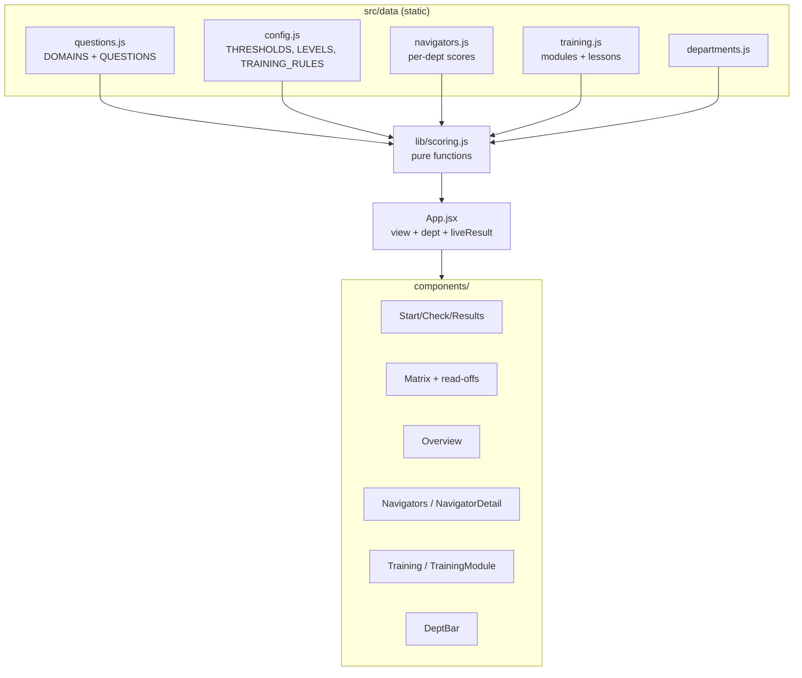
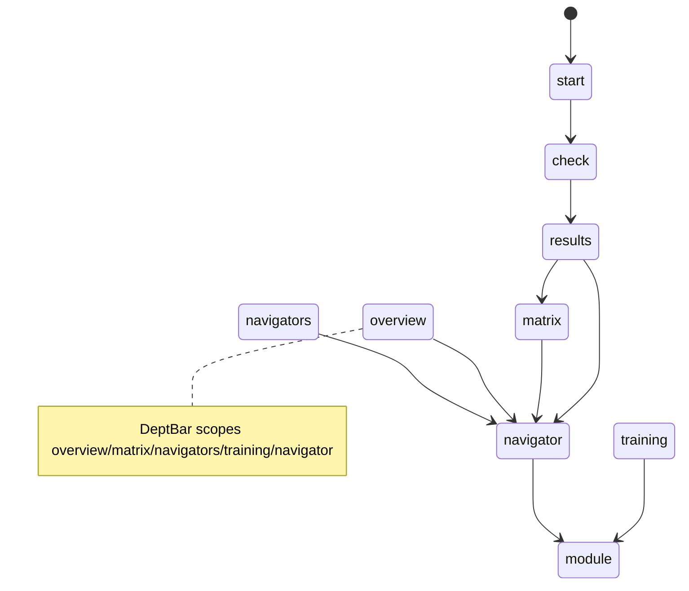

# CLAUDE.md — Knowledge Check (Project Knowledge Base)

> **Purpose of this file.** This is the single source of truth for the project: product
> spec, architecture reference, development journal, decision log, and onboarding doc in one.
> A new developer or AI agent should be able to read **only this file** and become productive.
>
> **Maintenance rule (mandatory).** No change is "done" until this file is updated. Whenever a
> feature, architecture, decision, bug, or goal changes, update the relevant section(s) **and**
> add a dated entry to [§7 Development History](#7-development-history). Keep
> [§8 Current System State](#8-current-system-state) and [§15 Current Priorities](#15-current-priorities)
> accurate at all times.
>
> **Last updated:** 2026-07-03 (F25 Call QA Test — hard rubric-graded voice test) ·
> **Doc maintainer:** Claude (AI agent) + repo owner. Assumptions are explicitly marked **[ASSUMPTION]**.

---

## Table of Contents
1. [Project Overview](#1-project-overview)
2. [Product Goals](#2-product-goals)
3. [Product Usage](#3-product-usage)
4. [Feature Inventory](#4-feature-inventory)
5. [Architecture Overview](#5-architecture-overview)
6. [Technical Decisions Log](#6-technical-decisions-log)
7. [Development History](#7-development-history)
8. [Current System State](#8-current-system-state)
9. [Codebase Knowledge](#9-codebase-knowledge)
10. [UX/UI Documentation](#10-uxui-documentation)
11. [Roadmap](#11-roadmap)
12. [Bugs & Known Issues](#12-bugs--known-issues)
13. [Lessons Learned](#13-lessons-learned)
14. [AI Agent Context](#14-ai-agent-context)
15. [Current Priorities](#15-current-priorities)

---

## 1. Project Overview

- **Project name:** Knowledge Check (repo: `QuarterKnolwdge`).
- **Product description:** A self-contained web app that runs a quarterly "knowledge check" for
  **patient navigators** (contact-centre agents who handle patient calls) and renders the
  **capability map** it produces. The check asks scenario questions ("a patient calls wanting X,
  situation is Y — what do you do?"), each tagged to a knowledge **domain**, and scores
  **per domain per person** — never a single overall grade.
- **Core mission:** Turn a team's operational knowledge into a clear, actionable capability map
  that supports readiness decisions, coaching, and training by domain.
- **Vision statement:** Become the standing instrument a contact-centre team lead uses each
  quarter to see exactly who is strong where, where the floor-wide gaps are, who can mentor whom,
  and what training to assign — across every department they run.
- **Target audience:**
  - **Primary (demo audience):** management / team leads evaluating the concept.
  - **End users (modelled):** patient navigators (take the check) and their supervisors (read the
    matrix and dashboards).
- **Key value proposition:** A lightweight, no-backend tool that converts a short scenario quiz
  into a per-domain capability matrix plus "so what" read-offs (gaps, mentors, readiness) and
  auto-assigned training — in seconds, with no install or accounts.
- **Main user problems solved:**
  1. Knowledge assessment that tests **application, not recall**.
  2. No single vanity score — **per-domain** signal that's actually actionable.
  3. Surfaces **floor-wide training priorities** and **mentorship capacity** automatically.
  4. **Auto-assigns training** to each navigator based on their weak points.
  5. Extends the same lens across **multiple departments**.

> **Context / origin.** Built from a build brief (`ClaudeCode_Build_Brief.md`) plus a team SOP
> (`Pediatrics_SOP_Updated.pdf` — the *Aizer Health Pediatric Department* operational report; the
> original `SOP Guide.pdf` is superseded by this updated version). The department SOPs are the
> **source of truth for scenario questions**; since 2026-07-02 the **6 knowledge domains** come
> from the Patient Navigator **role description** (`Patient-Navigators-Job.txt`, owner-provided):
> cross-department call handlers who classify requests, route them, schedule accurately, hold
> scope/privacy boundaries, and document cleanly.

---

## 2. Product Goals

### Short-Term Goals (current)
- Deliver a credible, self-contained **prototype to demo to management**. ✅ Done.
- Derive domains/questions from the real SOP. ✅ Done.
- Per-domain scoring → Learning/Solid/Can-Teach levels with editable thresholds. ✅ Done.
- Capability matrix (hero) with column gaps, can-teach roster, readiness tally. ✅ Done.
- Analytics dashboards (team overview + per-navigator). ✅ Done.
- Auto-assign training by weak point, with previewable mockup content. ✅ Done.
- Department dimension (Pediatrics + 3 mockup departments). ✅ Done.
- A persistent public deployment for showcasing. ✅ Done (Railway).

### Mid-Term Goals
- ✅ **Multi-department live checks:** Pediatrics and OB/GYN are now live checks. Adult Medicine
  and Behavioural Health remain mockups pending their SOPs.
- **Mentor pairing (floor-wide):** auto-match Learning ↔ Can-Teach with balanced mentor load.
- **Coverage / bus-factor risk view:** flag domains with only 0–1 teachers (single point of failure).
- **Training completion tracking:** Assigned → In progress → Done states (in-memory for the demo).

### Long-Term Vision
- A production tool with persistence, multiple SOPs/departments, historical trend (quarter over
  quarter), training ROI, and role-based access — the team lead's standing quarterly instrument.

---

## 3. Product Usage

**What users do.** A navigator takes a short scenario check; supervisors read the resulting
capability map and dashboards and act on them (assign training, plan mentorship).

**Typical workflows / user journey:**
1. **Take the check** — Start → step through ~20 domain-tagged multiple-choice scenarios → submit.
2. **See results** — per-domain % and level (Learning/Solid/Can-Teach); no single grade.
3. **Read the matrix** — sample navigators + the taker's new row, color-coded; with column gaps,
   can-teach roster, readiness tally.
4. **Explore analytics** — Team Overview (floor KPIs, distribution, cross-department strength) and
   per-navigator dashboards (strengths, growth areas, assigned training, suggested mentors).
5. **Manage training** — Training tab shows auto-assigned modules by domain cohort and by
   navigator; preview a module's mockup lesson content.
6. **Switch departments** — the department bar re-scopes the matrix/dashboards/training to
   Pediatrics (live) or one of the three mockup departments.

**Expected outcomes:** a supervisor leaves with (a) a clear capability picture per domain and
department, (b) a ranked list of training priorities, (c) named mentors, and (d) per-person
training assignments.

**Real-world use cases / ideal usage:**
- Quarterly capability review in a contact centre.
- Onboarding gap analysis for new navigators.
- Identifying who is "ready for more" (high Can-Teach count).
- Planning a single training session for a whole cohort weak in one domain.

---

## 4. Feature Inventory

> Status legend: **Complete** · **In Progress** · **Planned** · **Deprecated** · **Removed**.

### F1 — Take-the-Check Flow
- **Purpose:** Assess application of SOP knowledge via scenario MCQs.
- **User benefit:** Fast, low-stakes, domain-tagged assessment.
- **Technical implementation:** [src/components/Check.jsx](src/components/Check.jsx) — stepped,
  one scenario per step, progress bar, optional name, Back/Next, submit. Questions from
  [src/data/questions.js](src/data/questions.js).
- **Status:** Complete.
- **Dependencies:** `QUESTIONS`, `DOMAINS`.
- **Notes:** Stepped flow chosen over single-page for demo clarity.

### F2 — Multi-Signal Scoring → Level Mapping (two axes)
- **Purpose:** Convert answers into per-domain **and** per-competency scores; never one total.
- **User benefit:** Actionable, non-punitive signal on both *what* (domain) and *how* (competency).
- **Technical implementation:** `scorePerDomain(answers, questions)` and
  `scorePerCompetency(answers, questions)` in [src/lib/scoring.js](src/lib/scoring.js) average each
  option's `points` (partial credit, not binary); `scoreToLevel()` maps to the 3 levels. Thresholds
  in [src/data/config.js](src/data/config.js) (`THRESHOLDS = { learning: 60, canTeach: 85 }`).
- **Status:** Complete.
- **Dependencies:** `THRESHOLDS`, `LEVELS`, `COMPETENCIES`.
- **Notes:** `<60` Learning, `60–84` Solid, `85+` Can-Teach (same bands for both axes). Each option
  carries `points` (0–100) + an SOP-referenced `rationale`; the 100-point option is `correctOptionId`.

### F3 — Capability Matrix (hero screen)
- **Purpose:** Navigators × domains grid, color-coded by level; the centrepiece.
- **User benefit:** Whole-floor capability at a glance.
- **Technical implementation:** [src/components/Matrix.jsx](src/components/Matrix.jsx); rows from
  `buildMatrixRows()`. Live taker appears as a highlighted new row; rows are clickable to the
  navigator dashboard.
- **Status:** Complete.
- **Dependencies:** F2, `SAMPLE_NAVIGATORS`, department scope.

### F4 — Matrix Read-offs (column gaps · can-teach roster · readiness tally)
- **Purpose:** The "so what" — turn the grid into priorities.
- **User benefit:** Immediate training/mentorship signal.
- **Technical implementation:** `columnGaps()`, `canTeachRoster()`, `readinessTally()` in
  [src/lib/scoring.js](src/lib/scoring.js). `COLUMN_GAP_THRESHOLD = 0.5`.
- **Status:** Complete.

### F5 — Team Overview Dashboard
- **Purpose:** Floor-wide KPIs + capability distribution + cross-department strength.
- **User benefit:** Leadership "state of the floor" view.
- **Technical implementation:** [src/components/Overview.jsx](src/components/Overview.jsx);
  `floorStats()`, `domainDistribution()`, `departmentMatrix()`.
- **Status:** Complete.

### F6 — Navigators List + Per-Navigator Dashboard
- **Purpose:** Drill into one person's development picture.
- **User benefit:** Coaching-ready individual view.
- **Technical implementation:** [src/components/Navigators.jsx](src/components/Navigators.jsx) and
  [src/components/NavigatorDetail.jsx](src/components/NavigatorDetail.jsx) — strengths, growth
  areas, per-domain bars (worst→best), per-department strip, assigned training, suggested mentors.
- **Status:** Complete.
- **Dependencies:** F2, F8, F10, `departmentMatrix()`, `mentorSuggestions()`.

### F7 — Suggested Mentors (per navigator)
- **Purpose:** For each non-Can-Teach domain, list colleagues who can teach it.
- **User benefit:** Built-in mentorship matching at the individual level.
- **Technical implementation:** `mentorSuggestions()` in [src/lib/scoring.js](src/lib/scoring.js).
- **Status:** Complete.
- **Notes:** Floor-wide mentor *pairing* (load-balanced) is **Planned** (see Roadmap).

### F8 — Auto-Assigned Training
- **Purpose:** Assign training per navigator by weak point (Required for Learning, Stretch for Solid).
- **User benefit:** Turns the matrix into an action plan automatically.
- **Technical implementation:** `trainingForRow()`, `trainingPlan()`, `trainingByDomain()`,
  `trainingStats()` in [src/lib/scoring.js](src/lib/scoring.js); rules in `TRAINING_RULES`
  ([src/data/config.js](src/data/config.js)); [src/components/Training.jsx](src/components/Training.jsx).
- **Status:** Complete.

### F9 — Training Module Preview (mockup content)
- **Purpose:** Previewable lesson content per domain module.
- **User benefit:** Shows what a navigator would actually receive.
- **Technical implementation:** [src/data/training.js](src/data/training.js) (`TRAINING_MODULES`
  with `lessons` + `keyTakeaways`); [src/components/TrainingModule.jsx](src/components/TrainingModule.jsx)
  shows lessons, takeaways, and the auto-assigned cohort.
- **Status:** Complete (content is **mockup**, flagged in-UI; swap for real materials later).

### F10 — Department Dimension
- **Purpose:** Same domains measured across Pediatrics, OB/GYN, Adult Medicine, Behavioural Health.
- **User benefit:** Cross-department capability view; per-department training and question banks.
- **Technical implementation:** [src/data/departments.js](src/data/departments.js) — now exports
  `ASSESSED_DEPTS = ['pediatrics', 'obgyn']`, `DEFAULT_DEPT`, `isAssessed(id)`, and a back-compat
  `ASSESSED_DEPT` alias. [src/data/questions-obgyn.js](src/data/questions-obgyn.js) — 14 sanitized
  OB/GYN seed questions. `deptSamples()`, `departmentOverall()`, `departmentMatrix()`;
  [src/components/DeptBar.jsx](src/components/DeptBar.jsx) selector (shows "live" badge for all
  assessed depts). Navigator picks department at check start (`deptselect` view in `NavigatorApp`);
  can switch departments after without signing out via a nav pill (⇄) or by clicking assessed dept
  cards in the "Strength across departments" strip — clicking calls `handleDeptSelect(deptId)` which
  loads the existing result or starts the check. `NavigatorApp` pre-fetches all assessed dept results
  on mount (`allDeptResults` state) so the strip shows real scores for completed depts immediately.
  Results keyed by composite `${navigatorId}__${department}`; `getActiveQuestions(dept)` filters
  by department field. `sopContextFor(deptId)` in `api/_sop-context.js` grounds all AI features in
  the correct SOP. **All OB/GYN content is sanitized** — generic role labels only, no real provider
  names, phone numbers, or credentials (repo is public).
- **Status:** Complete (**Pediatrics** and **OB/GYN** live; Adult Medicine and Behavioural Health
  = mockup data).
- **Notes:** The 6 domain IDs are shared across all departments and are department-neutral.
  Since the 2026-07-02 redesign they mirror the Patient Navigator job itself: `intake` (Call
  Opening & Identification), `classification` (Call Classification), `routing` (Routing &
  Escalation), `scheduling` (Scheduling & Appointment Rules), `boundaries` (Scope & Privacy),
  `documentation` (Documentation & Follow-through).

### F11 — Deployment (Railway)
- **Purpose:** Persistent public URL + a place to run the Gemini proxy (which GitHub Pages can't).
- **Technical implementation:** `server.js` — Express 5 app that serves `dist/` as static SPA and
  mounts the `/api/*` handlers (same `(req, res)` signature as the Vercel originals; reads `PORT`
  from env, Railway injects it automatically). `railway.toml` — Railpack config (`buildCommand: npm
  run build`, `startCommand: npm start`, `nixpacksConfigPath: nixpacks.toml`). `nixpacks.toml` —
  overrides Railpack's default `npm ci` to `npm install` (avoids `EBADPLATFORM` failures for
  cross-platform optional esbuild packages). `vercel.json` kept for potential future Vercel use.
  Env vars set in Railway service Variables: `VITE_FIREBASE_*` (build-time, baked into bundle),
  `GEMINI_API_KEYS`, `GENERATION_SECRET` (server-only, never bundled). `"engines": { "node":
  ">=20.0.0" }` in `package.json` tells Railpack/Nixpacks to use Node 20 (vitest@4 and vite@8
  require it; Railway's default is Node 18).
- **Status:** Complete (code). **[ASSUMPTION]** Owner sets env vars in Railway project Variables
  before the first deploy (VITE_FIREBASE_* must be present at build time).
- **Notes:** Replaced GitHub Pages (no server support) and Vercel (owner chose Railway). The
  `/QuarterKnolwdge/` base-path hack is retired; app serves at root. For local `/api` dev, run
  `node server.js` after `npm run build`, or just test via Railway deploy.

### F12 — Competency Axis (9 competencies)
- **Purpose:** Measure *how* a navigator thinks/decides/communicates, across all domains.
- **User benefit:** Capability signal orthogonal to topic — surfaces e.g. weak Escalation even when
  domain scores look fine.
- **Technical implementation:** [src/data/competencies.js](src/data/competencies.js) (`COMPETENCIES`
  ×9); `scorePerCompetency()` + `competencyDistribution()` in scoring.js; competency breakdown on
  `NavigatorDetail`, competency distribution on `Overview`. Stored as `results.competencyScores`.
- **Status:** Complete.

### F13 — Two-Layer Coaching (post-check)
- **Purpose:** Immediate, specific feedback after a check — rule-based baseline + optional AI layer.
- **User benefit:** The navigator leaves knowing exactly what to reinforce and why; AI layer adds
  personalized 2–3 sentence coaching grounded in what they actually got wrong.
- **Technical implementation:** [src/components/Coaching.jsx](src/components/Coaching.jsx) — on mount,
  fires `POST /api/generate-coaching` (async) and shows a skeleton while Gemini generates; renders
  AI coaching notes per weak competency above the per-question review when ready; silently falls back
  to rule-based view if the call fails or returns nothing. Rule-based layer (competency chips +
  per-question rationale review) is always present.
  [api/generate-coaching.js](api/generate-coaching.js) — Gemini proxy (same key rotation as
  `generate-scenarios`); builds a digest of missed questions with authored rationales as grounding;
  validates output (only known competency IDs with non-empty strings); returns `{ coaching: {...} }`.
  Temperature 0.4 for consistency; only coaches competencies below `canTeach` threshold. Advisory
  only — never touches a score or Firestore.
- **Status:** Complete (Phase 2 — first AI-in-the-live-path feature).

### F15 — AI Interview Simulation (roleplay + grading)
- **Purpose:** Let navigators practice handling a patient call before a real one — low-stakes,
  repeatable, domain-targeted. After saving, Gemini grades the call and delivers a score + feedback.
- **User benefit:** Gemini acts as a patient caller; the navigator types responses exactly as they
  would on the phone. Every call is different (randomly generated scenario from the SOP). Navigators
  can discard sessions they don't want saved, or save and receive an AI score (0–100) with specific
  strengths and improvements grounded in the SOP.
- **Technical implementation:**
  - [api/interview-turn.js](api/interview-turn.js) — two-mode Gemini proxy: **init** generates
    caller scenario + opening line; **turn** continues the call in character.
  - [api/grade-interview.js](api/grade-interview.js) — new grading endpoint. Takes the full
    transcript + scenario + domain, calls `gemini-2.5-flash` at temperature 0.3 grounded in
    `SOP_CONTEXT`, returns `{ grade: { score, summary, strengths[], improvements[] } }`. Score is
    clamped 0–100 and validated before returning.
  - [src/components/Interview.jsx](src/components/Interview.jsx) — phases: `setup → loading →
    active → saving → grading → reviewed` (or `discarded` if navigator chooses not to save).
    Active phase header has two buttons: **"Save & get feedback"** (saves to Firestore, then grades)
    and **"Discard"** (ends the call without saving anything). The reviewed screen shows the score
    (color-coded green/amber/red), summary, strengths (green card), and improvements (amber card).
    Grade is written back to the Firestore interview doc via `updateInterviewGrade` so supervisors
    can see it too.
  - `updateInterviewGrade(id, grade)` added to [src/lib/db.js](src/lib/db.js).
- **Status:** Complete (Phase 1 roleplay + Phase 2 grading). Supervisor override is **Planned**.
- **Notes:** Scores are advisory — they do not feed `scorePerDomain` or the capability matrix.
  The navigator no longer picks a domain at setup (removed 2026-06-29 to cut choice friction);
  `startInterview` picks a random domain just to anchor the AI scenario, then goes straight to the call.
- **Supervisor access:** `SupervisorApp` passes `navigatorId` to `NavigatorDetail`. The "Practice
  sessions" panel shows each saved session; the header row now includes the score badge (color-coded).
  Expanding a session shows the grade breakdown (summary, what went well, areas to develop) above the
  full transcript. The panel is hidden in the navigator's own dashboard.

### F16 — "Spot the Error" QA Audit Assessment
- **Purpose:** A **scored** QA-audit assessment — navigators act as a QA auditor over AI-generated
  flawed agent transcripts, identifying each SOP violation. **Feeds the capability matrix** (changed
  2026-07-01 from advisory-only training). Offered as a top-level **alternative to the MCQ check** at
  a post-department assessment-type chooser, and also per-domain from the training plan.
- **User benefit:** A real, low-friction assessment of applied domain knowledge that moves the
  navigator's rating — finding others' mistakes tests SOP mastery more sharply than recall.
- **Two modes (both in `SpotTheError.jsx`, driven by `mode` + `domains` props):**
  - **`full`** — the Start-level alternative to MCQ: **one item per domain** across all 6 domains,
    producing a complete per-domain profile. Saved as the primary result (full replacement).
  - **`domain`** — the training-plan launch: `SPOT_ASSESSMENT_SIZE` (=5) items for **one** domain;
    merges just that domain score into the existing result.
- **Technical implementation:**
  - `api/generate-audit.js` — Gemini generates a ~10-turn Patient/Agent transcript with exactly
    one planted SOP violation, plus `errorIndex`, `hint`, and `modelExplanation` (structured JSON
    schema output, temp 0.8). Validation ensures `errorIndex` always lands on an Agent turn.
    (`hint` is now unused by the assessment UI but still returned.)
  - Pure scoring in `scoring.js`: `scoreSpotTheError(picks)` → overall share correct (0–100);
    `scoreSpotTheErrorByDomain(graded)` → `{ domainId: percent }` from `[{domainId, correct}]`.
    Click-accuracy only. Same 0–100 scale as the main check, so results feed domain scores directly.
  - `src/components/SpotTheError.jsx` — phases: `loading` (fires one `/api/generate-audit` call per
    planned item in parallel via `Promise.allSettled`, keeps whatever succeeds; full-mode domains
    that fail to generate backfill to 0) → `active` (one item at a time; **one click per item**,
    then a correct/wrong reveal + Next; each item shows its domain tag) → `review` (overall score +
    level badge, a per-domain breakdown in full mode, and a per-item list of the actual error + what
    the SOP says) → `saving` → `done`. No hints, no reflection, no AI coaching.
  - **Score feed:** `SpotTheError` calls `onComplete(domainScores, mode)`;
    `NavigatorApp.handleSpotComplete` saves the scores (full → replace whole profile; domain →
    merge just that domain), appends a `resultHistory` trend point, and records a `kind:'practice'`
    completion per assessed domain. Local state updates immediately so the dashboard/matrix reflect
    the new ratings without a round-trip.
  - **Entry:** `AssessmentTypeChooser` in `NavigatorApp` (view `typeselect`, shown after
    `deptselect`) → MCQ (`check`) or Spot the Error (`spotfull`). Per-domain launch is still the
    "Spot the Error" step on each assigned training domain in `MyTraining.jsx` (view `audit`).
  - **Coexistence:** MCQ and Spot results are stored in separate docs and both kept — a navigator
    takes either or both, and switches which one the dashboard reflects via `AssessmentBar` (see the
    2026-07-01 "MCQ + Spot the Error results coexist" history entry).
  - **Completion tracking (supervisor):** `subscribeCompletions` in `SupervisorApp` builds
    `completionMap: { [navigatorId]: Set<domainId> }`. "✓ Practiced" badges appear in
    `Training.jsx` (by-navigator section) and `NavigatorDetail.jsx` (assigned training panel).
- **Status:** Complete (scored assessment; MCQ-or-Spot chooser + full-profile mode).
- **Files:** `api/generate-audit.js`, `src/components/SpotTheError.jsx`; edited `src/lib/{scoring,
  scoring.test}.js`, `src/data/config.js`, `src/components/NavigatorApp.jsx`, `src/styles.css`.
- **Notes:** Full mode scores each domain from a single item (0 or 100), so the profile is coarse by
  design (owner's choice: 1 item/domain for speed). `api/coach-audit.js` + `POST /api/coach-audit`
  remain in the repo but are **no longer wired**. One error per transcript (multi-error = v2).
- **Audit bank (2026-07-03, pilot-feedback fix):** transcripts are now pre-generated into a
  Firestore `audits` collection with the question-bank review-gate model (draft → active →
  archived). Supervisor UI `AuditBank.jsx` (Questions tab, below the Question Bank): per-domain
  coverage read-off, pooled generation, transcript review with the planted error highlighted.
  `SpotTheError.jsx` draws shuffled `active` bank items first (instant start, no repeats within
  one assessment) and only live-generates domains the bank can't cover. Fixes the 40-70 s
  loading wait and lets unrealistic transcripts be curated out. db helpers: `subscribeAudits`,
  `getActiveAudits`, `saveDraftAudits`, `activateAudit`, `archiveAudit`, `deleteAudit`.

### F17 — Longitudinal Capability Trends & Training Impact
- **Purpose:** Quarter-over-quarter trend views for domain/competency scores and training impact.
- **User benefit:** Supervisors and navigators see whether scores are growing; training ROI is
  quantified per domain.
- **Technical implementation:** New `resultHistory` Firestore collection (append-only snapshot on
  every `saveResult`). Pure functions in `scoring.js`: `buildTrend(history, { synthesize })` →
  per-domain and overall sparkline series (prepends `TREND_SYNTH_POINTS` illustrative leading points
  when real history < 2); `trainingImpact(history, completions, domainId)` → before/after/delta;
  `teamTrend(allHistory)` → floor solidPlusRate + avgReadiness per time bucket.
  UI: `src/components/Sparkline.jsx` (inline SVG polyline, no dep); trend panel in
  `NavigatorDetail.jsx` (per-domain sparklines + delta badges, fetched via `getResultHistory`);
  team-trend widget in `Overview.jsx` (solidPlusRate + avgReadiness over time via `subscribeResultHistory`).
- **Status:** Complete.
- **Files:** new `src/components/Sparkline.jsx`; edited `src/lib/scoring.js`, `src/lib/scoring.test.js`,
  `src/lib/db.js`, `src/components/{NavigatorDetail,Overview,NavigatorApp,SupervisorApp}.jsx`.

### F18 — Evidence-Based Competency Dossier
- **Purpose:** Per-navigator view tying each competency rating to the exact SOP scenarios they
  answered — what they chose, what was best, and the authored rationale.
- **User benefit:** Turns "you're Learning in Escalation" into a specific, coaching-ready evidence
  record — "here are the 4 questions that drove that rating and what you got wrong."
- **Technical implementation:** `buildDossier(row, answers, questions, interviews, completions)` in
  `scoring.js` → `{ byCompetency, byDomain }`. Competency cards in `NavigatorDetail.jsx` are now
  expandable (clicking the header reveals the question-level evidence). `answers` and `questions`
  props thread from both role apps; `answers` is stored on the result doc by `saveResult`.
- **Status:** Complete.
- **Files:** edited `src/lib/scoring.js`, `src/lib/scoring.test.js`,
  `src/components/{NavigatorDetail,NavigatorApp,SupervisorApp}.jsx`, `src/styles.css`.

### F19 — Supervisor Action Center
- **Purpose:** Unified dashboard aggregating who needs attention and why.
- **User benefit:** Supervisors open one tab and see ranked: critical gaps, training overdue,
  declining trends, failed practice, and navigators ready for more. Each row is clickable.
- **Technical implementation:** `buildActionCenter(rows, { history, interviews, completions })` in
  `scoring.js` → five category arrays. New `src/components/ActionCenter.jsx`. Supervisor tab
  `action` + nav entry "Action Center" + render block in `SupervisorApp.jsx`. New
  `subscribeInterviews(cb, onError)` live subscription in `db.js`; passes `allInterviews` +
  `deptHistory` to ActionCenter.
- **Status:** Complete.
- **Files:** new `src/components/ActionCenter.jsx`; edited `src/lib/{scoring,scoring.test,db}.js`,
  `src/components/{SupervisorApp,Nav}.jsx`, `src/styles.css`.

### F20 — Adaptive, AI-Personalized Development Paths
- **Purpose:** Per-domain 5-step development sequences (coaching → practice → interview → module → mini-check)
  with AI reordering via Gemini.
- **User benefit:** Navigator follows a clear step-by-step path per weak domain. A "Personalize my
  path" button calls Gemini to reorder + annotate the steps based on their actual score profile.
  Mini re-check validates mastery in 4 domain-filtered questions; on completion, a new history
  snapshot is appended (moves the trend line).
- **Technical implementation:**
  - `buildDevPath(row, completions, interviews)` in `scoring.js` → per-domain `{ domainId, steps:
    [{kind, status}], percentComplete }`. Status derived from completions (by kind) + interview grades.
  - New `api/sequence-path.js` — Gemini proxy (temp 0.3, structured JSON, `validateSequenceResponse`
    exported helper). Mounted in `server.js` as `POST /api/sequence-path`. Advisory: falls back to
    rule-based order on failure. Supports `coaching`, `practice`, `interview`, `module`, and
    `minicheck` step kinds.
  - `src/components/MyTraining.jsx` rewritten: flat list → path stepper per domain; "Personalize my
    path" button calls `/api/sequence-path` and merges AI step order with computed status.
  - Mini-check mode in `src/components/Check.jsx`: `miniDomain` + `limit` props filter questions to
    one domain (using `useMemo`). On submit, writes `saveCompletion(.., kind:'minicheck')` and
    optionally `saveResult` (to add a trend point on pass).
  - `MINICHECK_SIZE = 4`, `MINICHECK_PASS = 60` in `config.js`.
- **Status:** Complete.
- **Files:** new `api/sequence-path.js`, `api/sequence-path.test.js`; edited `server.js`,
  `src/lib/{scoring,scoring.test}.js`, `src/data/config.js`, `src/components/{MyTraining,Check,NavigatorApp}.jsx`,
  `src/styles.css`.

### F21 — Mentor Matching Engine (persisted pairings + outcomes)
- **Purpose:** Load-balanced mentor-mentee pairings with Firestore persistence and outcome delta tracking.
- **User benefit:** Supervisor sees suggested pairings (Learning/Solid mentees → least-loaded Can-Teach
  mentors, capped at `MENTOR_MAX_LOAD`), assigns with one click, and tracks score improvement over time.
- **Technical implementation:**
  - `buildMentorMatches(rows, { maxLoad })` in `scoring.js` → `{ pairings, load, unmatched }`.
    Learning mentees prioritized over Solid; least-loaded mentor first; unmatched when no teacher
    or mentor at cap.
  - `pairingOutcomes(savedPairings, rows)` → enriches each pairing with `{ currentScore, delta, improved }`.
  - New `pairings` Firestore collection + `db.js` exports: `savePairing`, `subscribePairings`,
    `updatePairingStatus`. Collection rule added to `firestore.rules` (Phase 0).
  - New `src/components/Mentorship.jsx`: suggested pairings grid (Assign button → `savePairing`),
    active pairings list with delta badges, mentor capacity read-off.
  - Supervisor tab `mentorship` + nav entry "Mentorship" + render block in `SupervisorApp.jsx`.
- **Status:** Complete.
- **Files:** new `src/components/Mentorship.jsx`; edited `src/lib/{scoring,scoring.test,db}.js`,
  `src/components/{SupervisorApp,Nav}.jsx`, `firestore.rules`, `src/styles.css`.

### F22 — Real-Time Voice Practice Call (Gemini Live API)
- **Purpose:** A genuine voice phone call with the AI patient — the caller speaks, the navigator
  speaks back, both in real time, no typing. Separate from the F15 text chat (the navigator picks
  voice **or** chat at the Practice entry — they're never mixed in one UI).
- **User benefit:** The closest thing to a real call. Bidirectional streaming audio, interruptible
  (barge-in), grounded in the same persona/scenario as the chat practice. The transcript is still
  captured under the hood and graded by the existing `/api/grade-interview`, so a voice call
  produces the same score + strengths/improvements review as a chat call.
- **Why this design (vs the first attempt):** v1 bolted browser TTS + Web-Speech STT onto the chat
  UI. It felt glitchy — STT auto-sent on every pause (cutting the navigator off), the caller's text
  bubble appeared *before* its audio (spoiling the line), and chat's turn-based model had no place
  for a real call's rhythm. The owner correctly called out that chat and voice shouldn't share a
  UI. Rebuilt on the **Gemini Live API** (real-time, streaming, interruptible) as its own screen.
- **Technical implementation:**
  - **Server relay — `api/live-relay.js`** (`attachLiveRelay(server)` in `server.js`): a `ws`
    `WebSocketServer` at **`/api/live`**. Browser ⇄ relay ⇄ Gemini Live
    (`BidiGenerateContent` over WSS). The relay holds the key (never exposed to the browser),
    validates the secret via `isValidSecret()` (new non-Express helper in `_auth.js`), and builds
    the patient persona server-side with `buildSystemInstruction()` (reused from `interview-turn.js`).
    The relay start payload includes the selected department and the generated opening line so the
    Live session starts from the same fresh scenario/init output instead of inventing a colder opener.
    Model: **`gemini-3.1-flash-live-preview`** — the gemini-3 Live model, verified to open a session
    on the project keys (a `bidiGenerateContent` model; text flash models like `gemini-3.5-flash`
    can't do the real-time call). Enables `inputAudioTranscription` + `outputAudioTranscription`
    so the relay can forward a text transcript for grading. Protocol is small JSON both ways
    (`start` / `audio` / `ready` / `transcript` / `interrupted` / `turnComplete` / `error`).
  - **Client — `src/components/VoiceCall.jsx`:** gets the scenario+callerName+opening line from the
    existing `/api/interview-turn` init, opens the relay socket, captures mic via
    `getUserMedia({echoCancellation,noiseSuppression,autoGainControl})` → `ScriptProcessorNode`
    → downsample to 16kHz PCM16 → base64 → relay. Caller audio (24kHz PCM16) is decoded into
    scheduled `AudioBufferSource`s on a 24kHz `AudioContext` for gapless playback; an `interrupted`
    message flushes the queue (barge-in). An animated orb shows speaking/listening state. Live
    transcript fragments are whitespace-normalized before captions/grading. End call → coalesced
    transcript → `saveInterview` → `/api/grade-interview` → same reviewed screen as chat.
  - **Entry chooser:** `PracticeChooser` in `NavigatorApp.jsx` — the Practice tab shows two cards
    (Voice call / Text chat); `practiceMode` state routes to `<VoiceCall>` or `<Interview>` and
    resets when the navigator leaves the tab.
- **Status:** Complete. Server relay verified headlessly end-to-end (node client → relay → Gemini →
  caller audio + transcript). **In-browser mic capture/playback must be tested in Chrome/Edge** —
  not verifiable in the headless codespace; Web Audio mic capture is also Chromium-reliable, so the
  text-chat option remains the cross-browser fallback.
- **Files affected:** new `api/live-relay.js`, `src/components/VoiceCall.jsx`; edited `server.js`,
  `api/_auth.js` (added `isValidSecret`), `src/components/NavigatorApp.jsx`, `src/styles.css`,
  `package.json` (`ws` dependency).

### F23 — Adaptive Learning Feedback Loop
- **Purpose:** Make the platform progressively smarter from stored evidence without uncontrolled
  self-learning. The system analyzes historical results, question health, completions, interviews,
  and supervisor feedback, then proposes review-safe improvements.
- **User benefit:** Supervisors get explainable next-best training recommendations, question review
  signals, recurring AI-quality risks, and a proposal queue. Navigators receive coaching/path prompts
  that can use their prior practice evidence when available.
- **Technical implementation:**
  - Pure functions in [src/lib/scoring.js](src/lib/scoring.js): `buildLearningSignals`,
    `buildQuestionImprovementSuggestions`, `adaptiveTrainingRecommendations`, and `feedbackInsights`.
    These return evidence and reasons only; they never mutate scores, active questions, or training.
  - New Firestore collections via [src/lib/db.js](src/lib/db.js): `supervisorFeedback` and
    `learningProposals`, with save/subscribe/status helpers. `firestore.rules` explicitly permits
    both pilot-grade collections.
  - New supervisor UI [src/components/LearningLoop.jsx](src/components/LearningLoop.jsx), reached from
    the "Learning Loop" nav tab. It shows adaptive next steps, question improvement signals,
    supervisor feedback risks, and pending human-review proposals.
  - New [src/components/FeedbackControls.jsx](src/components/FeedbackControls.jsx) lets supervisors
    mark generated or advisory items as `helpful`, `inaccurate`, `needsAdjustment`, `approved`, or
    `rejected`. Added to Learning Loop, flagged question cards, and supervisor-visible interview
    grades.
  - Question revision suggestions create proposal records first. Approval creates a **draft** question
    (`source: 'learning-loop'`) that still must pass the existing Question Bank activation gate.
  - `api/generate-coaching.js` and `api/sequence-path.js` accept optional stored learning evidence
    (prior results, completions, interviews, feedback summaries) so advisory prose/path rationales can
    become more specific over time.
- **Status:** Complete.
- **Safety:** AI and learning-loop output is advisory. No raw check score can be edited, no generated
  question becomes active without supervisor review, and no training-plan change is silently applied.

### F24 — SOP Manager (adder / builder / refiner)
- **Purpose:** Make department SOPs live, supervisor-managed data instead of hardcoded strings —
  add, structure, refine, version, and activate SOPs from the UI. The active SOP grounds all AI
  features for its department.
- **User benefit:** Supervisors onboard a new department (Behavioral Health, Internal Medicine)
  or absorb a floor-rule change by pasting a document — no code deploy. The refiner flags every
  contradiction/outdated rule between new material and the current SOP (e.g. the BH psych-nurse →
  provider-direct routing change).
- **Technical implementation:**
  - **Firestore `sops` collection** — versioned docs `{ department, title, body, version,
    status: draft|active|archived, source: manual|ai-build|ai-refine, createdAt, activatedAt }`.
    At most one active doc per department (`activateSop` archives the rest in one batch).
    `db.js`: `subscribeSops`, `saveSopDraft`, `updateSop`, `activateSop`, `archiveSop`,
    `deleteSop`. Rule added to `firestore.rules`.
  - **[api/_sop-store.js](api/_sop-store.js)** — server-side cached reader (firebase web SDK in
    Node, named app `sop-store`, defensive init from `process.env.VITE_FIREBASE_*`, anonymous
    sign-in tolerated to fail). `getLiveSopSync(dept)` is a SYNC cache read (60s TTL, lazy
    non-blocking refresh) so `sopContextFor()` stays synchronous and none of the 7 AI handlers
    changed. Returns null → hardcoded fallback.
  - **`sopContextFor(deptId)` resolution order:** live active SOP → hardcoded dept context →
    Pediatrics. Role context (`NAVIGATOR_ROLE_CONTEXT`) is always prepended.
  - **[api/refine-sop.js](api/refine-sop.js)** — `POST /api/refine-sop`, two modes (temp 0.2,
    JSON output, key rotation, exported pure validators `validateSopRefineResponse` /
    `validateSopFile` / `validateSopAudit` + 22 tests):
    **build** `{rawText|file, department}` → `{sop:{title, body, notes[], audit}}` structures a
    raw document into the 6-domain SOP layout; **refine** `{rawText|file, currentSop,
    department}` → `{sop:{title, body, changes:[{type: contradiction|outdated|addition|
    clarification, summary}], audit}}` merges new material into the active SOP (new material
    wins, every diff flagged). **File upload (2026-07-03):** `file = { data: base64, mimeType:
    'application/pdf' }` is passed to Gemini natively as a document part (handles scanned PDFs;
    ≤10 MB); `server.js` JSON body limit raised to 20mb. **Fidelity audit:** a second Gemini
    pass (temp 0.1) compares the draft against the source and returns `audit = { omissions[],
    inventions[] }` — source rules missing from the draft and draft statements not traceable to
    the source. Best-effort (null on failure, never blocks). Text inputs capped at 48k chars.
  - **[src/components/SopManager.jsx](src/components/SopManager.jsx)** — supervisor "SOPs" tab
    (dept-scoped via DeptBar, works for non-assessed depts too). Redesigned 2026-07-03:
    drag-and-drop **upload zone** (PDF → base64 → Gemini; TXT/MD read into the paste area; Word
    → "export as PDF" hint), **active-version hero** (pulsing LIVE badge, meta chips: version /
    source / date / section count / word count), **parsed document view** (`parseSopSections`
    renders ALL-CAPS headings as numbered styled sections with rule rows instead of a raw
    `<pre>`; collapsed with a fade + "Read full document"), **version timeline** (rail-dot list
    for drafts/archived), **fidelity chips + detail panels** on AI drafts (✓ passed / ⚠ N
    findings; omissions amber, inventions red — persisted on the draft doc via `saveSopDraft`'s
    new `notes`/`changes`/`audit` fields so they survive reload). Editing the ACTIVE version
    always saves a NEW draft version — active docs are never mutated.
- **Safety:** AI output is always a **draft** the supervisor reviews and activates — the endpoint
  never writes Firestore; nothing goes live without a human click. Same review-gate philosophy as
  F14/F23.
- **Status:** Complete. Verified live: build mode structured a raw BH guide; refine mode caught
  the psych-nurse contradiction + refill-continuity addition while preserving untouched rules.
  C1 is now active in Firebase: Anonymous auth is enabled, the current Firestore rules/indexes are
  deployed, and `sops` saves are allowed for signed-in anonymous app users. `firebase.json` maps the
  deploy command to `firestore.rules` + `firestore.indexes.json`; pass `--project <id>` if the
  Firebase CLI has no active project alias.
- **Files:** new `api/{_sop-store,refine-sop,refine-sop.test}.js`,
  `src/components/SopManager.jsx`; edited `src/lib/db.js`, `api/_sop-context.js`, `server.js`,
  `firestore.rules`, `firebase.json`, `src/components/{SupervisorApp,Nav}.jsx`, `src/styles.css`.

### F25 — Call QA Test (hard rubric-graded voice test)
- **Purpose:** Turn the voice practice call into a real, reliably-graded pass/fail test scored
  against the owner-provided call quality guide (`Aizer_Health_Navigator_Quality_Guide_SOP.pdf`,
  a scanned PDF — transcribed via Gemini native PDF input).
- **User benefit:** Navigators take a graded QA test call (separate Practice-tab card, alongside
  Voice call / Text chat). They get a hard PASS/FAIL, a per-category scorecard, the exact criteria
  they lost points on, and auto-fail alerts. Supervisors see a "QA TEST · PASS/FAIL" badge on the
  session in NavigatorDetail plus the full grade breakdown.
- **Reliability design (the core of the feature):** the AI never produces a score.
  1. **Fixed binary rubric** ([api/_qa-rubric.js](api/_qa-rubric.js)): the guide's 100-point
     scorecard as structured data — 9 categories / 20 criteria (Opening 10 · Verification 10 ·
     Call Control 10 · Doc Reason 10 · Communication 15 · Active Listening 10 · Knowledge 15 ·
     Scheduling 15 · Closing 5) + 3 auto-fails (HIPAA/verification, clinical scope, conduct).
     Timing metrics from the guide (<5s answer, 11s dead air, 2-min hold) are not transcript-
     observable and are folded into observable call-control criteria instead. The guide's
     internal Closing inconsistency (5 vs 10 pts) resolved in favor of the 100-point scorecard.
  2. **Gemini returns only verdicts** (`MET`/`NOT_MET`/`NA`) per criterion at **temperature 0**
     with a **verbatim evidence quote** each ([api/grade-call-qa.js](api/grade-call-qa.js),
     `POST /api/grade-call-qa`; scored output → no lite-model fallback; one retry on malformed
     shape).
  3. **Deterministic trust gates + scoring in code** (`scoreQa`): MET without evidence that
     verifies against the transcript (normalized substring + single-turn word-set fallback) →
     NOT_MET; NA on a core (always-expected) criterion → NOT_MET; auto-fail stands only with
     verified evidence (anti-hallucination), and zeroes the score. Score = earned/applicable
     points; **pass = ≥85 (`QA_PASS_THRESHOLD`) with zero auto-fails**. Same verdicts in → same
     result out.
  4. `buildGradeProjection` maps the scorecard onto the existing interview `grade` shape
     (score/summary/strengths/improvements) so all existing supervisor UI renders it unchanged;
     the full scorecard is stored as a new `qa` field via `updateInterviewGrade(id, grade, qa)`.
- **UI:** `VoiceCall.jsx` gains a `mode='practice'|'test'` prop — test mode has its own copy
  ("graded hard, no partial credit"), grading via `/api/grade-call-qa` (60s timeout), and a
  results screen: PASS/FAIL banner, score, auto-fail cards with the quoted offending line,
  per-category bars, and a "Points you lost" list. Third `PracticeChooser` card ("Call QA Test",
  🎯) routes `practiceMode='test'`.
- **Status:** Complete. Live-verified (see the 2026-07-03 history entry): a strong fixture call
  graded 100/PASS twice with identical per-criterion verdicts; a bad fixture call (read lab
  results + gave med advice + sarcasm + no verification) triggered the auto-fails and failed at 0.
- **Notes:** QA test results do NOT feed the capability matrix — they're a separate
  certification-style record on the interview doc. Advisory practice grading (`grade-interview`)
  is unchanged. Supervisor override remains Planned.
- **Files:** new `api/{_qa-rubric,grade-call-qa,grade-call-qa.test}.js`; edited `server.js`,
  `src/lib/db.js`, `src/components/{VoiceCall,NavigatorApp,NavigatorDetail}.jsx`, `src/styles.css`.

### F14 — Question Bank + Gemini Scenario Generation (review gate)
- **Purpose:** Grow the check from the SOP; questions are live Firestore data, not a static file.
- **User benefit:** Supervisors generate, review, and curate the assessment without a code change.
- **Technical implementation:** Firestore `questions` collection (`draft`/`active`/`archived`);
  `db.js` CRUD (`subscribeQuestions`, `getActiveQuestions`, `saveDraftQuestions`, `activate/archive/
  delete/updateQuestion`, `seedQuestionsIfEmpty`); supervisor UI
  [QuestionBank.jsx](src/components/QuestionBank.jsx) + [QuestionEditor.jsx](src/components/QuestionEditor.jsx);
  server [api/generate-scenarios.js](api/generate-scenarios.js) (Gemini `gemini-2.5-flash`,
  structured JSON output, validated/repaired; rotates across multiple keys on rate-limit). Only
  **active** questions appear in the check; AI drafts require human activation.
- **Status:** Complete. Owner sets `GEMINI_API_KEYS`/`GEMINI_API_KEY` + `GENERATION_SECRET` in
  Railway for deployed AI features.

---

## 5. Architecture Overview

### Frontend Architecture
- **Framework:** React 18.3 (function components + hooks).
- **Build tool:** Vite 5.4 (`@vitejs/plugin-react`).
- **Language:** JavaScript (JSX). No TypeScript.
- **Styling:** A single hand-written stylesheet, [src/styles.css](src/styles.css) (BEM-ish class
  names, CSS variables for the palette). No CSS framework.
- **State management:** Local React state (`useState`). No Redux/Zustand/Context. [App.jsx](src/App.jsx)
  owns the **session** (role + name + navigatorId) only and routes to one of two role apps:
  [SupervisorApp.jsx](src/components/SupervisorApp.jsx) (live Firestore data) or
  [NavigatorApp.jsx](src/components/NavigatorApp.jsx) (the signed-in navigator's own data). Each role
  app owns its own `view` state and data subscriptions.
- **Routing:** None (no React Router). Navigation is a `view` string inside each role app.
  Supervisor views: `overview · matrix · navigators · navigator · training · module`. Navigator
  views: `check · dashboard · training · module`. The Start **gate** (role select → navigator
  dropdown+PIN creation/login / supervisor passcode) shows when there is no session.
- **UI systems:** Custom components in [src/components/](src/components/); shared data in
  [src/data/](src/data/); pure logic in [src/lib/scoring.js](src/lib/scoring.js).

**Folder structure**
```
QuarterKnolwdge/
├── index.html               # Vite entry HTML
├── vite.config.js           # base '/' (served at root)
├── vercel.json              # Vercel config (kept; Railway is the active host)
├── railway.toml             # Railway/Railpack config (build + start + nixpacksConfigPath)
├── nixpacks.toml            # overrides npm ci → npm install (avoids EBADPLATFORM)
├── server.js                # Express server: serves dist/ + mounts /api/* handlers
├── package.json             # scripts: dev/build/preview/test/test:watch/start; engines node>=20
├── README.md                # quick-start + tweak guide
├── CLAUDE.md                # THIS FILE — project knowledge base
├── SOP Guide.pdf            # source of truth for domains/questions
├── .env.local.example       # Firebase + Gemini env template (copy → .env.local, gitignored)
├── firestore.rules          # pilot-grade Firestore security rules (roster/results/questions)
├── api/                     # API handlers (originally Vercel serverless; now served by Express)
│   ├── generate-scenarios.js#   Gemini proxy (holds GEMINI_API_KEY; validates output)
│   ├── generate-coaching.js #   Gemini post-check coaching notes
│   ├── interview-turn.js    #   Gemini roleplay (init + turn)
│   ├── grade-interview.js   #   Gemini practice-call grading
│   ├── generate-audit.js    #   Gemini "Spot the Error" transcript
│   ├── coach-audit.js       #   Gemini audit-reflection coaching
│   ├── sequence-path.js     #   Gemini dev-path step reordering
│   ├── live-relay.js        #   WebSocket relay → Gemini Live API (real-time voice call)
│   ├── health.js            #   deploy/health check
│   ├── _gemini-client.js    #   shared getApiKeys/callGemini/geminiWithRotation (helper, not a route)
│   └── _sop-context.js      #   SOP grounding text (helper, not a route)
└── src/
    ├── main.jsx             # React root
    ├── App.jsx              # session + role routing (thin shell)
    ├── styles.css           # entire stylesheet
    ├── components/          # Nav, Start, Check, Coaching, Matrix, Overview, Navigators,
    │                        #   NavigatorDetail, Training, MyTraining, TrainingModule,
    │                        #   QuestionBank, QuestionEditor, DeptBar, SupervisorApp,
    │                        #   NavigatorApp, EmptyState, Footer,
    │                        #   Reveal + CountUp (presentation-layer motion primitives)
    ├── data/                # config, questions (DOMAINS + SEED_QUESTIONS), competencies,
    │                        #   navigators (placeholder), training, departments
    └── lib/
        ├── firebase.js      # Firebase app init + Firestore instance (defensive)
        ├── db.js            # ALL Firestore reads/writes (roster + results + questions)
        ├── session.js       # localStorage session layer (isolated, swappable for real auth)
        ├── useInView.js     # IntersectionObserver hook (scroll-reveal trigger)
        ├── useCountUp.js    # rAF count-up hook (reduced-motion aware)
        ├── scoring.js       # all scoring (2 axes), read-offs, analytics, training logic
        └── scoring.test.js  # Vitest unit tests for scoring.js
```

### Backend Architecture
- **Firebase / Firestore (pilot).** The app persists data to Cloud Firestore (free Spark tier).
  Three collections: `roster` (navigator list), `results` (submissions, now incl.
  `competencyScores`), and `questions` (supervisor-managed scenario bank: `draft`/`active`/
  `archived`) — all UUID-keyed. All Firestore access is isolated in [src/lib/db.js](src/lib/db.js);
  init in [src/lib/firebase.js](src/lib/firebase.js) (reads `VITE_FIREBASE_*` from `.env.local`).
- **Express server + `/api` handlers.** [server.js](server.js) is the Railway entry point: an
  Express 5 app that serves `dist/` as static files (SPA catch-all via `/*splat`) and mounts
  the REST Gemini handlers plus [api/health.js](api/health.js) as Express routes. The handlers use
  the same `(req, res)` Node.js signature they had as Vercel functions — no changes needed.
  `api/_gemini-client.js` keeps `GEMINI_API_KEYS` **server-side only** (never bundled), calls
  Gemini with structured-JSON/text outputs, and rotates keys on 429/403/503/500. Helper modules are
  `_`-prefixed (`api/_sop-context.js`, `api/_auth.js`). REST endpoints are gated by
  `GENERATION_SECRET` — pilot-grade.
- **No auth system** (by design for the pilot): navigators pick their name from the roster and
  create a 4-digit PIN on first sign-in when the roster row has none; returning navigators enter
  that PIN. Supervisors enter `SUPERVISOR_PASSCODE`. Session persistence is localStorage only,
  isolated in [src/lib/session.js](src/lib/session.js). Security rules in `firestore.rules` are
  pilot-grade (open per-collection) — replace with real auth before production.
- **Pre-pilot state (historical):** the original prototype was fully in-memory; then a static
  GitHub-Pages + Firestore pilot with no server; then Vercel serverless; now Railway + Express.

### Infrastructure
- **Hosting:** **Railway** — runs the Express server (`server.js`) which serves the Vite build
  and the `/api` routes from a single persistent Node.js container. Auto-deploys on push to `main`.
- **Repo:** `github.com/travis-holt/QuarterKnolwdge` (public).
- **Deployment:** Railway (Git-connected to `main`). Railpack detects Node.js; `railway.toml`
  sets `buildCommand: npm run build`, `startCommand: npm start`, and points to `nixpacks.toml`
  which overrides the install step from `npm ci` to `npm install` (prevents `EBADPLATFORM` errors
  for cross-platform optional esbuild packages). Requires `engines.node >=20.0.0` (set in
  `package.json`) because vitest@4 and vite@8 require Node 20+; Railway defaults to Node 18.
  Env vars in Railway service Variables: `VITE_FIREBASE_*` (client, build-time — must be set
  BEFORE first build), `GEMINI_API_KEYS` + `GENERATION_SECRET` (server-only, never bundled).
  **Historical:** GitHub Pages (retired — no server) → Vercel (owner chose Railway instead).
- **CI/CD:** None beyond Railway's build. **[ASSUMPTION]** No GitHub Actions.
- **Monitoring:** None (Railway console shows logs + metrics).
- **Security:** `GEMINI_API_KEYS`/`GENERATION_SECRET` are server-only Railway env vars and never
  in the bundle. No PII; sample/illustrative data only. Site is public to anyone with the URL.

### Component / data-flow diagram


### View navigation


---

## 6. Technical Decisions Log

### 2026-06-23 — Use React + Vite (not single HTML file)
- **Decision:** Build as a React 18 + Vite SPA.
- **Reasoning:** User chose it over a single-file vanilla app; gives component structure while
  staying backend-free and fast to start.
- **Alternatives considered:** Single self-contained `index.html` with inline JS.
- **Impact:** Requires Node + a build step; enables clean component decomposition.

### 2026-06-23 — Derive all domains/questions from the SOP
- **Decision:** 6 domains, 20 scenario questions sourced from `SOP Guide.pdf`.
- **Reasoning:** Brief mandates SOP as source of truth; tests real application knowledge.
- **Alternatives considered:** Invented generic domains.
- **Impact:** Content is specific and credible; re-keying to a new SOP means editing
  `questions.js` only.

### 2026-06-23 — Per-domain scoring, never a single total
- **Decision:** Scores and levels are per domain; no overall grade anywhere.
- **Reasoning:** Keep the signal actionable and domain-keyed, including when thresholds are used
  for readiness or mini-check decisions.
- **Impact:** All UI and analytics are domain-keyed.

### 2026-06-23 — Centralised tunable knobs in `config.js`
- **Decision:** Thresholds, level labels/colors, palette, and training rules live in one file.
- **Reasoning:** Brief requires thresholds/sample data/questions to be easy to find and edit.
- **Impact:** Demo tweaks are low-risk and localized.

### 2026-06-23 — Store sample data as percentages (not pre-baked levels)
- **Decision:** `SAMPLE_NAVIGATORS` hold per-domain percentages; levels are derived.
- **Reasoning:** Sample rows and the live taker flow through the same `scoreToLevel()`, keeping
  the matrix internally consistent.
- **Impact:** Changing thresholds updates sample and live rows identically.

### 2026-06-23 — Knowledge-only analytics (no invented KPIs)
- **Decision:** Dropped the "knowledge → performance (QA/CSAT/AHT)" correlation view.
- **Reasoning:** User chose to keep everything derived purely from the check; a real correlation
  would require fabricated operational metrics.
- **Alternatives considered:** Add labelled sample KPIs; a knowledge-only "risk proxy".
- **Impact:** No fabricated metrics anywhere; cleaner, more defensible story.

### 2026-06-23 — Traffic-light level colors
- **Decision:** Learning = red (`#c0392b`), Solid = amber (`#e0b13c`), Can-Teach = green (`#3e8e5a`).
- **Reasoning:** User wanted urgency encoding; green best, red worst.
- **Impact:** Applies everywhere via `LEVELS`; training cohort tags intentionally kept off this
  scale (they signal priority, not capability level).

### 2026-06-23 — Department dimension; Pediatrics live, others mockup
- **Decision:** Add 4 departments sharing the same 6 domains; Pediatrics and OB/GYN are assessed by
  the live check.
- **Reasoning:** The Pediatrics SOP covers Pediatrics; OB/GYN later received a sanitized question
  set. Adult Medicine and Behavioural Health still need their own question sets later.
- **Alternatives considered:** Fabricate checks for all departments.
- **Impact:** Cross-department views work now; mockup departments are clearly labelled.

### 2026-06-24 — Firebase pilot: roster+PIN identity, UUID keys, role-split apps
- **Decision:** No login. Navigator picks their name from a supervisor-managed roster dropdown and
  uses a 4-digit PIN (created on first sign-in when blank); supervisor enters
  `SUPERVISOR_PASSCODE`. Firestore `roster` + `results` collections are UUID-keyed. `App.jsx` is a
  thin session router delegating to `SupervisorApp` / `NavigatorApp`. All Firestore access isolated
  in `db.js`; all session access in `session.js`.
- **Reasoning:** Roster dropdown eliminates name typos/collisions; PIN stops navigators opening each
  other's dashboards; UUID keys make same-name collisions impossible; role-split apps make the
  navigator's lack of access to team views *structural*, not just hidden UI; isolating db/session
  keeps the eventual swap to real auth a one-module change.
- **Alternatives considered:** free-text name entry (typo/collision risk); single App with
  conditional rendering (weaker privacy boundary); name-keyed documents (collisions).
- **Impact:** `SAMPLE_NAVIGATORS` removed; empty states added; `scoring.js` untouched (Firestore
  rows match the existing `{name, scores}` shape exactly).

### 2026-06-24 — Defensive Firebase init (never crash without config)
- **Decision:** `firebase.js` only initialises when `VITE_FIREBASE_*` config is present, wrapped in
  try/catch; exports `isFirebaseConfigured`. All `db.js` calls are gated on it.
- **Reasoning:** Lets the full UI be built, tested, and committed *before* the owner creates the
  Firebase project — the app boots to a clean "not connected" state instead of a white-screen crash.
- **Impact:** Safe to commit now; safe to run locally; deploy is the only step that waits on config.

### 2026-06-23 — Deploy via `gh-pages` branch (not Actions)
- **Decision:** Publish `dist/` to a `gh-pages` branch with the `gh-pages` npm tool.
- **Reasoning:** The Codespaces token cannot manage Pages settings or push workflow files;
  branch-based publish works with normal repo write access.
- **Impact:** Deploys are a single manual command; `base` must stay `/QuarterKnolwdge/`.
- **Superseded 2026-06-24** by the Vercel migration (serverless functions need a server host).

### 2026-06-24 — Competency engine: 9 competencies as a second axis + points-based scoring
- **Decision:** Keep the 6 SOP domains AND add 9 competencies (capability axis), both derived from
  the same answers. Each option carries `points` (0–100, partial credit) + an SOP `rationale`
  instead of binary right/wrong. Competencies reuse the existing 3-level traffic-light system.
- **Reasoning:** Measures *how* a navigator thinks/decides/communicates, not just topic recall;
  partial credit rewards defensible judgement. Reusing levels keeps the UI consistent.
- **Alternatives considered:** replace domains with competencies (loses topic signal); a separate
  4-level Beginner→Expert scale (more config, inconsistent colours) — **[ASSUMPTION]** owner can opt
  into 4-level later.
- **Impact:** `scoring.js` functions take `questions` as a param; `results` gain `competencyScores`;
  new `Coaching` view + competency panels; tests grew 38 → 46.

### 2026-06-24 — Live Gemini scenario generation via a serverless proxy
- **Decision:** SOP→scenario generation is a live in-app feature. A server-side function holds
  the Gemini key and returns validated drafts; the question bank moves to a Firestore
  `questions` collection with a supervisor **review gate** (draft → active). Hosting migrates from
  GitHub Pages to a server platform (one place for the SPA + `/api`).
- **Reasoning:** A key can't ship in a public static bundle; generation is *authoring-time* quality
  control, so a human gate must sit between AI output and a live assessment.
- **Alternatives considered:** offline one-off generation shipped as static data (less flexible);
  client-side Gemini calls (key exposure — rejected); Cloudflare Worker / Firebase Blaze (owner
  chose Railway).
- **Impact:** New `api/*`; `db.js` gains questions CRUD; `Check`/`NavigatorApp` read the active bank
  (seed fallback); `scoring.js` is questions-parametrised. Pilot-grade endpoint auth via the
  supervisor passcode (`GENERATION_SECRET`).

### 2026-06-25 — Migrate hosting to Railway (Express server wrapping the /api handlers)
- **Decision:** Deploy on Railway instead of Vercel. Wrap the existing `api/*` handlers in an
  Express 5 server (`server.js`) that also serves the Vite build as a static SPA. Add
  `railway.toml` + `nixpacks.toml` for Railpack config.
- **Reasoning:** Owner chose Railway. The `api/*` handlers use the standard Node.js `(req, res)`
  signature which Express accepts directly — no rewrite needed. Railway runs a persistent container
  (not serverless) so Express is the natural wrapper.
- **Alternatives considered:** Vercel (owner chose Railway); Cloudflare Workers (different runtime,
  would require rewriting the handlers).
- **Impact:** New `server.js`, `railway.toml`, `nixpacks.toml`; `express` added as a dependency;
  `"start": "node server.js"` added to package.json scripts; `"engines": { "node": ">=20.0.0" }`
  added to signal Node 20 to Railpack (vitest@4 + vite@8 require it; Railway default is Node 18).
  `nixpacks.toml` overrides `npm ci` → `npm install` to avoid `EBADPLATFORM` errors for
  cross-platform optional esbuild packages (netbsd-arm64, darwin-arm64, etc.) that npm records in
  the lockfile but can't install on Linux x64. Express 5 requires named wildcards so the SPA
  catch-all is `/*splat` not `*`.

---

### 2026-06-30 — Voice practice call: Gemini Live API + WS relay, separate from chat
- **Decision:** Build the voice practice call on the **Gemini Live API** (real-time bidirectional
  streaming audio) via a server-side **WebSocket relay** at `/api/live`, as its own screen
  (`VoiceCall.jsx`) — separate from the F15 text chat, chosen by the navigator at a Practice entry
  chooser.
- **Reasoning:** A first attempt bolted one-shot Gemini TTS + browser Web-Speech STT onto the chat
  UI. It was glitchy by construction: STT auto-sent on pauses, the caller's text appeared before
  its audio, and chat's turn-based model has no rhythm for a live call. Owner correctly identified
  that chat and voice shouldn't share a UI. The Live API is purpose-built for fluid, interruptible
  voice. A relay is mandatory because the browser can't hold the Gemini key — the browser talks
  only to our server, which opens the upstream Live socket. Verified before building: the key opens
  a Live session and completes a full audio round-trip. **Model = `gemini-3.1-flash-live-preview`**
  (the gemini-3 Live model) — picked via `listModels` over the `bidiGenerateContent` set after
  confirming it opens a session; `gemini-2.5-flash-native-audio-*` are stable fallbacks. Note
  `gemini-3.5-flash` exists but is text-only (no bidi), so it can't power the voice call.
- **Alternatives considered:** one-shot TTS + browser STT bolted onto chat (built first, rejected —
  glitchy, wrong paradigm); browser `speechSynthesis` for caller voice (robotic, and still leaves
  the turn-taking problem); third-party realtime voice (ElevenLabs/Deepgram — new account, new
  billing, no benefit over Live on the existing keys).
- **Impact:** New `api/live-relay.js` (`ws` WebSocketServer attached to the Express http server) +
  `src/components/VoiceCall.jsx` (mic capture, downsample to 16kHz, 24kHz scheduled playback,
  barge-in). `ws` added as a dependency. The chat `Interview.jsx` is untouched and remains the
  reliable, cross-browser, gradeable path. **Live API has its own preview quota** — fine for a
  demo, but a heavier-traffic production rollout would need to confirm Live tier limits/billing.

---

## 7. Development History

### 2026-07-03 — F25: Call QA Test — hard rubric-graded voice test (owner-provided quality guide)
- **Context:** Owner wants the voice practice call to double as a real, RELIABLY-graded pass/fail
  test — "actually really really hard", no vague scoring — and provided the call quality guide
  (`Aizer_Health_Navigator_Quality_Guide_SOP.pdf`, scanned/no text layer; transcribed via Gemini
  native PDF input, the same mechanism F24 uses).
- **Why the old grading couldn't be the test:** `grade-interview` asks Gemini for one holistic
  0–100 against prose bands at temp 0.3 — the same call can plausibly score 68 or 81 across runs.
  The fix is structural, not prompt-tuning: **the model classifies, the code scores.**
- **What was built:**
  - `api/_qa-rubric.js` — the guide's 100-point scorecard as data: 9 categories / 20 binary
    criteria + 3 auto-fails (HIPAA/verification · clinical scope · conduct), `QA_PASS_THRESHOLD
    = 85`, and the pure pipeline: `verifyEvidence` (fragment-split, role-label-stripped
    normalized matching), `validateQaResponse`, `scoreQa` (trust gates + deterministic math),
    `buildGradeProjection` (maps the scorecard onto the existing interview `grade` shape).
    Guide quirks resolved: timing metrics (<5s answer, 11s dead air) aren't transcript-observable
    → folded into observable call-control criteria; Closing 5-vs-10 contradiction → 5 (the
    100-point scorecard is authoritative).
  - `api/grade-call-qa.js` (`POST /api/grade-call-qa`) — Gemini returns ONLY per-criterion
    MET/NOT_MET/NA verdicts + verbatim evidence quotes at **temperature 0** (structured JSON,
    no lite-model fallback, one retry on malformed shape). Trust gates in code: MET with
    unverifiable evidence → NOT_MET; NA on a core criterion → NOT_MET; an auto-fail stands only
    with verified evidence (anti-hallucination) and zeroes the score. Pass = ≥85, zero auto-fails.
  - UI: `VoiceCall.jsx` `mode='test'` — hard-test copy, QA grading (60s timeout), results screen
    with PASS/FAIL banner, auto-fail cards (quoted offending line), per-category bars, "Points
    you lost" list. Third `PracticeChooser` card (🎯 Call QA Test). `updateInterviewGrade(id,
    grade, qa)` stores the full scorecard on the interview doc; supervisor `NavigatorDetail`
    shows a "QA TEST · PASS/FAIL" badge (grade breakdown renders via the existing panel).
- **Live verification (real keys):** a strong fixture call graded **twice with identical verdicts
  on all 20 criteria** (the determinism claim, demonstrated); a bad fixture call (read lab
  results, gave med advice, sarcasm, no verification) → score 0, FAIL. First smoke run exposed
  two evidence-gate fairness bugs — model quotes stitched from multiple turns / prefixed with
  role labels were being rejected, and auto-fail evidence was filtered the same way — fixed by
  fragment-splitting `verifyEvidence` (any genuine 2+ word fragment verifies) + a
  single-contiguous-quote prompt rule.
- **Verification:** `npm test` → **290 passing** (10 files; +28 QA pipeline tests);
  `npm run build` → clean; `node --check` on both new api files; live smoke test above.
- **Files:** new `api/{_qa-rubric,grade-call-qa,grade-call-qa.test}.js`; edited `server.js`,
  `src/lib/db.js`, `src/components/{VoiceCall,NavigatorApp,NavigatorDetail}.jsx`,
  `src/styles.css`, `CLAUDE.md`.
- **Status:** Complete. QA test results do not feed the capability matrix (separate
  certification-style record). Supervisor grade override remains the planned backstop.

### 2026-07-03 — Gemini quota diagnosis + flash-lite overflow lane (free-tier stopgap)
- **Context:** Owner asked why the pilot exhausted the 4-key rotation so fast despite low daily
  volume. Live key probes (tiny generateContent bursts against the real keys) established the
  facts: (1) the 4 keys ARE independent quota pools — key #0 rate-limited while keys 1-3 kept
  returning 200, so rotation works; (2) **the free-tier limit is now 5 RPM per project per model**
  (the 429 body reports `generate_content_free_tier_requests limit=5` — Google's Dec-2025 quota
  cut halved the old 10), so the whole pool is ~20 requests/min; (3) exhaustion was per-minute
  burst pressure (a pre-audit-bank Spot = 6 heavy calls/min from ONE navigator; a practice chat =
  1 call per message), never the daily cap; (4) `gemini-2.5-flash-lite` has a **separate**
  per-model quota bucket on the same keys but its free tier intermittently 503s ("high demand") —
  a cushion, not guaranteed capacity.
- **What changed (all stopgap until paid-tier billing is approved for full deployment):**
  - `api/_gemini-client.js` — `MODEL` + new `LITE_MODEL` (`gemini-2.5-flash-lite`) are exported;
    `callGemini` takes a `model` param; `geminiWithRotation` accepts `models: [...]` and tries
    every key on the primary model first, then every key on each fallback model (per-model quota
    buckets). Default stays single-model — no behavior change for handlers that don't opt in.
    New `quotaInfo()` parses the 429 body so Railway logs now say WHICH quota tripped
    (metric, limit value, per-minute vs per-DAY) instead of a bare status code.
  - `api/interview-turn.js` — init + turn calls opt into `models: [MODEL, LITE_MODEL]` (roleplay
    is conversational, unscored; a lighter model beats a 429 mid-call).
  - `api/generate-coaching.js` — same opt-in (advisory prose; client silently drops it on 429).
  - Scored/authoring endpoints (grading, scenario/audit generation, refine-sop, sequence-path)
    deliberately do NOT fall back — quality gate kept.
  - **Follow-up (same day): per-key cooldown.** A key that 429s now sits out for the
    `retryDelay` Gemini's 429 body specifies (default 30 s when absent), per model, so
    concurrent/subsequent requests skip known-limited keys instead of wasting a round-trip
    re-learning it. Module-level `cooldowns` Map + exported `resetCooldowns()` test hook.
    If every key+model is cooling, the rotation returns `exhausted` instantly with zero
    network calls (callers already map that to 429 "try again shortly"). Latency win only —
    capacity is unchanged. +4 cooldown tests (skip, healthy-key routing, retryDelay expiry,
    per-model independence).
- **Path to real capacity (owner decision):** enable billing on one Google project (Tier 1 ≈
  hundreds+ RPM; ~$1-2/day at pilot volume), put that key first in `GEMINI_API_KEYS`, keep free
  keys behind it as rotation backup. Zero code change needed. Free-tier stacking is confirmed
  a dead end (5 RPM per extra account).
- **Verification:** `npm test` → **262 passing** (9 files; +5 model-fallback and +4 cooldown
  rotation tests); `npm run build` → clean; `node --check` on the 3 edited api files → OK.
- **Files:** `api/{_gemini-client,_gemini-client.test,interview-turn,generate-coaching}.js`,
  `CLAUDE.md`.
- **Status:** Complete.

### 2026-07-03 — Pilot-feedback pass (6-7 navigator soft launch)
- **Context:** The owner launched the webapp to 6-7 navigators and collected feedback
  ("Knowledge Check Webapp Bugs And Feature Tweaks.docx", untracked). This pass addressed 6 of
  the 9 items; the remaining 3 are: add more keys to `GEMINI_API_KEYS` in Railway (owner action,
  no code), colour-scheme feedback (content unknown — needs specifics), and Railway cold-start
  (infra-side; the in-repo part was fixed here via code-splitting).
- **1 · Practice caller switched language mid-call** (one navigator's chat "turned into indian"):
  `buildSystemInstruction()` in `api/interview-turn.js` had NO language rule, so nothing stopped
  Gemini drifting into Hindi at roleplay temperatures. Added a CRITICAL English-only rule (covers
  BOTH the text chat and the voice call — the live relay reuses the same persona builder) and an
  "everything in English" line in the init prompt.
- **2 · Voice/chat practice review never appeared:** grading failures in `VoiceCall.jsx` and
  `Interview.jsx` were swallowed (console.error → reviewed screen with a bare "—"), and the
  transcript/docId were discarded so nothing could be retried. Both components now keep the saved
  transcript + doc id, explain the failure ("the reviewer may be busy"), and offer a **"Try the
  review again"** button that re-calls `/api/grade-interview` and writes the grade back to the
  interview doc. `VoiceCall` also resets stale grade state when starting a new call.
- **3 · "Spot the Error" was slow (40–70 s) with unrealistic scenarios → pre-generated audit
  bank:** new Firestore `audits` collection (same draft→active review-gate model as the question
  bank). `db.js`: `subscribeAudits`, `getActiveAudits(dept)`, `saveDraftAudits`, `activateAudit`,
  `archiveAudit`, `deleteAudit` (+3 db tests). New supervisor UI `AuditBank.jsx` (rendered under
  the Question Bank in the Questions tab): per-domain active-coverage read-off, pooled generation
  (2 concurrent via `runPooled`, now exported from `apiFetch.js`), full-transcript review with the
  planted error highlighted, activate/archive/delete. `SpotTheError.jsx` now draws items from the
  bank first (instant, shuffled, no repeat within an assessment) and only live-generates domains
  the bank can't cover. `generate-audit.js` prompt gained REALISM RULES (specific ordinary
  requests grounded in SOP visit types/queues, natural phone speech, plausible rushed-agent
  mistakes — not cartoonish ones, near-miss distractor turns, English only). Rule added to
  `firestore.rules` — deployed to `quarterly-knowledge-check` on 2026-07-03.
- **4 · MCQ best answer too obvious:** `generate-scenarios.js` prompt gained a DISTRACTOR QUALITY
  block — every wrong option must be a plausible near-miss failing on a specific SOP detail, all
  options the same length/tone (no longest-answer tell), at least one distractor more
  cautious-sounding than the best answer, two-plus options tempting without SOP knowledge.
  Existing weak questions still need regeneration + curation through the Question Bank.
- **5 · Navigators couldn't review answers / see history:** new `MyHistory.jsx` + "My history"
  navigator tab. Panel 1: attempt history from `resultHistory` (first navigator-facing read of
  it) — every snapshot for the active dept, newest first, per-domain level chips. Panel 2:
  answer-by-answer review of the latest MCQ from the stored `answers` on the result doc (same
  rendering as post-check Coaching; answers to since-retired questions are skipped with a note).
- **6 · Welcome page slow to appear:** code-split at both seams. `App.jsx` lazy-loads
  `SupervisorApp`/`NavigatorApp` via `React.lazy` + `Suspense`; `Start.jsx` imports
  `firebase.js`/`db.js` **dynamically** (roster fetch + PIN save) so the Firebase SDK leaves the
  entry chunk. Entry JS: **889 kB → 197 kB** (62 kB gzip); Firebase (684 kB) + each role app now
  load as separate lazy chunks. Railway cold-start remains a possible second cause (infra).
- **Verification:** `npm test` → **253 passing** (9 files; +3 audit-bank db tests);
  `npm run build` → clean, chunks split as above; `node --check` on the 3 edited api handlers.
- **Files:** new `src/components/{AuditBank,MyHistory}.jsx`; edited `api/{interview-turn,
  generate-audit,generate-scenarios}.js`, `src/components/{VoiceCall,Interview,SpotTheError,
  SupervisorApp,NavigatorApp,Nav,Start,App}.jsx`, `src/lib/{db,db.test,apiFetch}.js`,
  `firestore.rules`, `src/styles.css`, `CLAUDE.md`.
- **Status:** Complete (code). Owner actions: deploy rules; generate + activate audit transcripts
  per domain in the new bank; add more Gemini keys; report what the colour-scheme feedback was.

### 2026-07-03 — F24 upgrade: PDF upload, fidelity audit, SOP tab redesign
- **Context:** Owner review of the first SOP manager: "bland and generic", questioned whether
  "Build with AI" can be trusted, and flagged the missing file-upload option. All three addressed
  in one pass (scope approved by owner).
- **PDF upload:** `/api/refine-sop` now accepts `file` (base64 PDF ≤10 MB) as the source for both
  modes, passed to Gemini **natively as a document part** — no text-extraction library, works on
  scanned PDFs. TXT/MD files are read client-side into the paste area; Word gets an
  "export as PDF" hint. `server.js` JSON limit 1mb → 20mb. New pure `validateSopFile`.
- **Fidelity audit (the trust answer):** every AI draft now gets a second Gemini pass (temp 0.1)
  comparing the draft against the source: `audit = { omissions[], inventions[] }`. Shown on the
  draft as a chip (✓ passed / ⚠ N findings) with amber/red detail panels; persisted on the draft
  doc (new `notes`/`changes`/`audit` fields in `saveSopDraft`) so the report survives reload.
  Best-effort — audit failure returns null and never blocks the draft. New pure `validateSopAudit`.
- **Redesign (`SopManager.jsx` + `.sops*`/`.sopdoc*`/`.sop-*` CSS rewritten):** drag-and-drop
  upload zone; active-version hero with pulsing LIVE badge + meta chips; SOP bodies rendered as a
  **parsed document** (ALL-CAPS headings → numbered styled sections, rules as marked rows) with
  collapse/fade instead of a grey `<pre>`; drafts/archived as a **version timeline** with status
  dots; spinner status line during AI runs; reduced-motion safe.
- **Verification:** `npm test` → **250 passing** (9 files; +12 for the new validators);
  `npm run build` → clean; **live smoke test**: posted the real in-repo `SOP Guide.pdf` (115 KB)
  through build mode → structured 6-domain SOP + 3 review notes + audit reporting **8 omissions /
  0 inventions** — the audit correctly caught provider-affiliation details the restructuring
  dropped, demonstrating exactly the trust layer the owner asked for.
- **Files affected:** `api/refine-sop.js`, `api/refine-sop.test.js`, `server.js`,
  `src/lib/db.js`, `src/components/SopManager.jsx`, `src/styles.css`, `CLAUDE.md`.
- **Status:** Complete.

### 2026-07-02 — Navigator self-created PINs
- **What changed:** Supervisors now add navigators by name only. A roster row with a blank `pin`
  prompts the navigator to create a 4-digit PIN at the Start gate after choosing their name; that
  PIN is saved back through `updateRosterEntry`. Existing PIN rows still use the old PIN check.
- **Why:** Navigators should be able to create their own passcodes instead of relying on a
  supervisor-assigned code.
- **Tests:** Added component coverage for first-login PIN creation and existing-PIN login, plus a
  `db.js` check that `addToRoster` can create blank-PIN rows.
- **Files affected:** `src/components/Start.jsx`, `src/components/Navigators.jsx`,
  `src/lib/db.js`, `src/components/components.test.jsx`, `src/lib/db.test.js`, `README.md`,
  `CLAUDE.md`.
- **Status:** Complete.

### 2026-07-02 — Welcome page premium redesign
- **What changed:** Reworked the Start gate from generic explanatory copy to a premium first
  screen: product-name hero, concise readiness/capability language, stable summary chips, an
  animated lightweight capability-map preview, stronger role cards, and overflow-safe domain tiles.
- **Why:** The old opening line ("development and fit, not pass/fail") no longer matched how the
  check is being used, and made the page feel generic.
- **Follow-up 2026-07-02:** Removed the variable scenario-count chip, changed the eyebrow to
  "Knowledge & Adaptability", animated the map preview bars, and fixed long domain labels colliding
  with blurbs at tablet/mobile widths.
- **Verification:** `npm test` → **238 passing**; `npm run build` → clean (existing large-chunk
  warning only).
- **Files affected:** `src/components/Start.jsx`, `src/styles.css`, `CLAUDE.md`.
- **Status:** Complete.

### 2026-07-02 — Firebase deploy manifest for Firestore rules/indexes
- **What changed:** Added root `firebase.json` pointing Firestore deploys at `firestore.rules`
  and `firestore.indexes.json`.
- **Why:** The local rules already allow the new `sops` collection, but the live project still
  needs the pending C1 deploy. Without `firebase.json`, `firebase deploy --only
  firestore:rules,firestore:indexes` may not know which local files to publish from this repo.
- **Verification:** `firebase.cmd deploy --project quarterly-knowledge-check --only
  firestore:rules,firestore:indexes` completed successfully; `node scripts/reset-pilot-data.mjs
  --delete` then completed cleanly on retry (first pass hit a transient `resultHistory`
  permission-denied while rules propagated).
- **Status:** Complete. C1 is active in the live Firebase project.

### 2026-07-02 — F24: SOP Manager (adder / builder / refiner)
- **What changed:** Department SOPs moved from hardcoded strings to live, supervisor-managed,
  versioned Firestore data with AI-assisted authoring. See the F24 feature entry (§4) for the full
  design. Highlights:
  - New `sops` Firestore collection + `db.js` CRUD (`subscribeSops`, `saveSopDraft`, `updateSop`,
    `activateSop` — batch-archives the previous active version — `archiveSop`, `deleteSop`) +
    `firestore.rules` entry.
  - New `api/_sop-store.js`: the Express server now reads Firestore (first time ever) via the
    firebase web SDK with defensive init and a 60s sync cache, so `sopContextFor()` stays
    synchronous and zero AI-handler call sites changed. Resolution: live active SOP → hardcoded
    context → Pediatrics.
  - New `POST /api/refine-sop` (build = structure raw document into the 6-domain layout; refine =
    merge new material into the current SOP with typed change flags). `validateSopRefineResponse`
    exported pure; `server.js` JSON limit 100kb → 1mb.
  - New supervisor "SOPs" tab (`SopManager.jsx`): active/draft/archived versions, inline confirms,
    import panel (verbatim / Build with AI / Refine), proposal preview with change chips.
- **Verification:** `npm test` → **238 passing** (9 files; +10 refine-sop tests); `npm run build`
  → clean; `node --check` on all new/edited api files; **live smoke test** against a local server
  + real Gemini keys: 401/400 validation paths, build mode (structured a raw BH guide, flagged the
  thin intake section), refine mode (caught the psych-nurse → provider-direct contradiction,
  added the refill-continuity rule, preserved all untouched rules, left crisis routing alone).
- **Known gate:** resolved. The live project now has Anonymous auth enabled and current
  `firestore.rules` + `firestore.indexes.json` deployed (wired by root `firebase.json`).
- **Files affected:** new `api/{_sop-store,refine-sop,refine-sop.test}.js`,
  `src/components/SopManager.jsx`; edited `src/lib/db.js`, `api/_sop-context.js`, `server.js`,
  `firestore.rules`, `firebase.json`, `src/components/{SupervisorApp,Nav}.jsx`, `src/styles.css`,
  `CLAUDE.md`.
- **Status:** Complete.

### 2026-07-02 — Domain redesign: 6 job-aligned Patient Navigator domains (+ pilot data reset)
- **Context:** The owner provided a comprehensive Patient Navigator role description (cross-
  department inbound call handlers: classify → route → schedule → protect scope/privacy →
  document; Peds/OB-GYN/BH/IM; Intermedia + eCW + Teams). The old 6 domains were pediatric-SOP-
  shaped ("Sites & Routing", "Provider Matching", "Insurance & Eligibility") and didn't match the
  job. Decisions taken with the owner: use 6 new domains (not the 7 capability areas verbatim —
  "adaptability under complexity" belongs to the competency axis), reset pilot data, domains
  before the SOP-manager feature.
- **New DOMAINS** (`src/data/questions.js`): `intake` — Call Opening & Identification (dept-
  adaptive lookup: parent-phone-first for Peds, DOB-first for adult depts, family accounts);
  `classification` — Call Classification (scheduling vs clinical question vs refill vs lab vs
  urgent vs wrong-department vs needs-approval); `routing` — Routing & Escalation (TE queues,
  dept sub-routing, soft transfers, urgent paths); `scheduling` — Scheduling & Appointment Rules;
  `boundaries` — Scope & Privacy (no advice/results/promises, caller authorization);
  `documentation` — Documentation & Follow-through (TE destination + fields, reason fields,
  entry conventions). Refills are deliberately NOT a domain — a refill call exercises
  classification + routing + documentation, so it appears as scenario content across domains.
- **Seed banks rewritten:** Pediatrics **21** questions (best old questions re-tagged/re-IDed,
  new ones authored for intake/classification/boundaries/documentation from the role doc — e.g.
  multi-child family calls, refill→PEDS Encounters queue with HIGH PRIORITY when out, no promised
  approvals, complete refill-TE fields). OB/GYN **16** questions (sanitized as before — role
  labels only) encoding the current floor routing table: pregnant/pregnancy-related → **OB
  Portal**, non-pregnant GYN visit issue → **PSS OB**, established MFM patient → **the MFM
  coordinator**; plus DOB-first lookup and third-party privacy scenarios. Total seed 32 → **37**.
- **`src/data/training.js`:** all 6 modules rewritten for the new domains (still flagged mockup).
- **`api/_sop-context.js`:** new exported `NAVIGATOR_ROLE_CONTEXT` (distilled from the role
  description, sanitized: OB names → role labels; BH psych-nurse routing treated as outdated per
  the doc — questions/refills go provider-direct). `sopContextFor(deptId)` now prepends it to the
  department SOP, so all 7 AI features ground in the real role model + current routing rules.
- **Pilot data reset** (owner-approved): new `scripts/reset-pilot-data.mjs` (web SDK +
  `.env.local`, dry-run by default, `--delete` to execute, per-collection permission tolerance).
  Deleted live `results` (5) and the old `questions` bank (23). `resultHistory`/`completions`/
  `pairings` were blocked by the then-deployed old rules (unauthenticated access denied) —
  *(resolved later the same day: after the C1 activation — see the "Firebase deploy manifest"
  entry above — the script was re-run and all collections cleared).* New bank auto-seeds from
  `ALL_SEED_QUESTIONS` on next app load. Old `interviews` docs keep old domain tags (render as
  raw ids — cosmetic; clear manually if desired).
- **Also:** `stress/quota-probe.mjs` domain list updated. Tests derive from `DOMAINS`
  dynamically, so no test-file changes were needed.
- **Files affected:** `src/data/{questions,questions-obgyn,training}.js`, `api/_sop-context.js`,
  `stress/quota-probe.mjs`, new `scripts/reset-pilot-data.mjs`, `CLAUDE.md`.
- **Verification:** `npm test` → **228 passing** (8 files); `npm run build` → clean (known
  large-bundle warning); `node --check api/_sop-context.js` → OK; reset script dry-run + delete
  executed against the live project.
- **Next (agreed with owner):** SOP manager (adder/builder/refiner) — Firestore `sops`
  collection + supervisor editor UI + AI refine endpoint + DB-backed `sopContextFor`.
- **Status:** Complete.

### 2026-07-01 — Pre-rollout hardening (C1/C4/H1/H2/M1/H3) + stress harness + load results
- **Context:** Readiness audit ahead of a ~20-navigator rollout flagged the privacy/role model as
  UI-only. This pass closes the top items and adds a repeatable stress harness that measures real
  Gemini-quota and concurrency ceilings.
- **C1 — Firebase Anonymous Auth + hardened rules:** `src/lib/firebase.js` now signs every visitor
  in with `signInAnonymously` and exports an `authReady` promise that **never rejects** (a failed
  sign-in logs and resolves `false` so the app keeps working under the current open rules).
  `src/lib/db.js` gates every read/write behind `authReady` (via aliased `fb*` primitives wrapped in
  auth-gated versions — zero call-site churn) and defers every `onSnapshot` behind `authReady` via a
  new `liveQuery()` helper. `firestore.rules` rewritten to require `request.auth != null` on all 9
  collections, with a documented SAFE DEPLOY ORDER (enable Anonymous auth → ship app code → THEN
  deploy rules). **Honest limit:** anonymous auth has no per-user identity, so this stops anonymous
  internet scraping but not a determined signed-in navigator — real Auth + role claims is still the
  next step. `db.test.js` updated (mock `authReady`; 5 subscription tests made async).
- **C4 — stop broadcasting all results to navigators:** new `getFloorScores()` returns a one-time,
  minimized `{ name, scores }` projection (drops peers' raw `answers`, competency detail,
  navigatorId). `NavigatorApp` uses it instead of the full-collection `subscribeResults` live stream.
  Residual (peers' scores still reach the client for mentor matching) noted for future server-side
  computation.
- **H1 — `firestore.indexes.json`** declaring the `resultHistory (navigatorId, department)`
  composite index `getResultHistory` requires (`firebase deploy --only firestore:indexes`).
- **H2 — visible save-failure + retry:** `NavigatorApp` surfaces a banner instead of swallowing
  `saveResult` failures; `persistResult`/`retrySave` wrap all three save sites (MCQ, Spot, mini-check).
- **M1 — in-progress check persistence:** `Check.jsx` takes a `persistKey`, restoring/saving answers
  + step to `sessionStorage` (survives refresh); cleared on submit/cancel; step clamped to the live
  bank. Wired for the main MCQ check only.
- **H3 — bounded Spot fan-out:** `SpotTheError` full-profile generation runs through a `runPooled`
  limiter (max 2 concurrent `/api/generate-audit`) instead of firing all 6 at once.
- **Stress harness (new `stress/` + `playwright.stress.config.js`):** `stress/quota-probe.mjs`,
  `stress/voice-ws-probe.mjs`, `stress/load.spec.js`. Scripts: `test:stress`, `stress:quota`,
  `stress:voice`. NOTE: Node `fetch`/`ws` must target `127.0.0.1` not `localhost` (undici picks IPv6
  `::1`; the server listens IPv4).
- **Measured ceilings (live keys, 2026-07-01):**
  - **Gemini generateContent rotation:** clean 100% up to **8 concurrent** heavy calls; first
    `429 "All Gemini keys are rate-limited"` at **12 concurrent**; majority-fail by 16–20 (each heavy
    call ~11–23s). ⇒ with H3 (~2 calls/navigator) ~**4 navigators** can start a full Spot at once;
    coaching (1/navigator) tolerates ~**8 simultaneous** MCQ finishes before falling back to
    rule-based. The MCQ check uses NO AI in its critical path, so it never breaks.
  - **Voice relay (`/api/live`):** 5/5 concurrent sessions reached `ready` with no server errors, but
    only 1/5 delivered caller audio in-window — the Gemini **Live preview** tier is the bottleneck,
    not the relay. ⇒ cap concurrent voice calls to a few, or leave off preview.
  - **20 concurrent navigators, full MCQ+coaching:** **20/20 completed end-to-end**, ~126s wall, no
    crashes; AI endpoints degraded gracefully (429/400 → fallback). Observed non-blocking console
    signal: `getInterviews: Missing or insufficient permissions` in the LIVE project — reinforces that
    Anonymous auth must be enabled and the new rules deployed together.
- **Gates:** `npm test` → **228 passing** (8 files); `npm run build` → clean.
- **Files:** `src/lib/{firebase,db,db.test}.js`, `firestore.rules`, new `firestore.indexes.json`,
  `src/components/{NavigatorApp,Check,SpotTheError}.jsx`, new `stress/*` +
  `playwright.stress.config.js`, `package.json`, `CLAUDE.md`.
- **Status:** Code complete + stress-validated. **Owner action to activate C1:** enable Anonymous
  auth in the Firebase console, confirm the deployed app still reads data, THEN
  `firebase deploy --only firestore:rules,firestore:indexes`. *(Completed 2026-07-02 — see the
  "Firebase deploy manifest" entry: Anonymous auth enabled, rules + indexes deployed, verified
  live.)*

### 2026-07-01 — Playwright end-to-end test harness added
- **What changed:** Added Playwright so browser flows can actually be verified locally (the app's
  Firebase/Gemini/Web-Audio paths were previously "not verifiable headlessly").
  - `@playwright/test` dev dependency + Chromium browser installed (browsers live in the user-level
    `ms-playwright` cache, not the repo).
  - `playwright.config.js` — `testDir: './e2e'`, headless Chromium, and a `webServer` that runs
    `npm run build && npm start` and waits on `/api/health` (so tests hit the real Express server +
    `/api` routes + `.env.local`, exactly like Railway). `reuseExistingServer: true`.
  - `e2e/smoke.spec.js` — Start gate renders + wrong supervisor passcode is rejected.
  - `e2e/supervisor.spec.js` — signs in with the public pilot passcode (`0200`) and confirms the
    management shell loads, exercising the **live Firebase subscriptions** end to end.
  - `e2e/navigator.spec.js` — signs in as a real test navigator (roster name + PIN), reaches the
    MCQ/Spot chooser, completes an MCQ end to end (→ coaching → dashboard), and — the headline
    coverage — **takes a full live-Gemini Spot the Error assessment, then an MCQ, and asserts both
    results coexist and the dashboard toggle switches between them**. This is the browser proof of the
    "MCQ + Spot coexist" feature.
  - `vite.config.js` — Vitest `include` pinned to `src/**` + `api/**` so it ignores `e2e/` (which
    uses `@playwright/test`, not Vitest). `npm run test:e2e` runs the Playwright suite.
  - `.gitignore` — Playwright artifacts (`test-results/`, `playwright-report/`, …).
- **Gates now:** `npm test` (228 Vitest unit) · `npm run test:e2e` (6 Playwright e2e) · `npm run build`.
- **Note:** the navigator specs write to live Firestore and the Spot journey calls live Gemini, so
  they need `.env.local` (Firebase + `GEMINI_API_KEYS`). The navigator credential is a pre-deploy
  test account; the supervisor passcode is the public pilot one. Swap both before any real rollout.
- **Files affected:** new `playwright.config.js`, `e2e/{smoke,supervisor,navigator}.spec.js`; edited
  `package.json`, `vite.config.js`, `.gitignore`, `CLAUDE.md`.
- **Verification:** `npm run test:e2e` → **6 passed** (incl. the live take-both-and-switch journey);
  `npm test` → **228 passed** (unchanged).
- **Status:** Complete.

### 2026-07-01 — MCQ + Spot the Error results coexist (take/switch either)
- **What changed:** A navigator can now hold **both** an MCQ result and a Spot the Error result per
  department, take the other type after finishing one, and switch which one their dashboard reflects
  — instead of the second overwriting the first (owner request: "keep both separately", entry point
  on the dashboard).
  - **Storage (`db.js`):** result docs are now keyed by assessment type — MCQ keeps the legacy
    `${navigatorId}__${department}` key (full back-compat); Spot the Error uses
    `${navigatorId}__${department}__spot`. New `resultDocId()` helper; `getResult` and `saveResult`
    take an `assessmentType` param (`'mcq'` default) and stamp `assessmentType` on the doc + history
    snapshot; `clearResult` now deletes both docs (+ the legacy plain-id doc for pediatrics).
  - **Navigator (`NavigatorApp.jsx`):** single `ownResult` state replaced by `resultsByType`
    `{ mcq, spot }` + `activeType`; `ownResult` is derived. `handleDeptSelect` loads both types and
    defaults the view to the most recent. New `AssessmentBar` on the dashboard: a **MCQ ⇄ Spot
    toggle** (when both exist) + a **"Take the other / Retake"** button → the chooser. `handleSubmit`
    writes `mcq`; `handleSpotComplete` writes `spot` in full mode and merges into the **active** type
    in training mode; the mini-check likewise re-saves the active type. The chooser badges which types
    are already completed.
  - **Supervisor (`SupervisorApp.jsx`):** `subscribeResults` now returns up to two docs per
    navigator+department, so results are **deduped to the most recent** per navigator+department
    before building the matrix / cross-dept strip — the matrix still shows one current row per person.
  - **Tests:** `db.test.js` `clearResult` cases updated for dual-doc deletion (228 passing).
- **Known limitation:** `resultHistory` now interleaves MCQ and Spot snapshots, so trend lines mix
  both assessment types (not filtered by type yet). Acceptable for the pilot.
- **Files affected:** `src/lib/{db,db.test}.js`, `src/components/{NavigatorApp,SupervisorApp}.jsx`,
  `src/styles.css`, `CLAUDE.md`.
- **Verification:** `npm test` → **228 passing** (8 files); `npm run build` → clean. Browser
  click-through (take both, toggle, supervisor dedup) not run headlessly.
- **Status:** Complete.

### 2026-07-01 — Ponytail installed for Codex usage reduction (local only — NOT an app change)
- **What changed:** Installed `DietrichGebert/ponytail` for the repo owner's Codex environment to
  bias future agent work toward smaller, reused, stdlib/native-first changes. Because `git` is not
  available on this Windows PATH, the repo was downloaded as a GitHub zip to
  `~/.codex/marketplaces/ponytail-main`, registered as a local Codex marketplace, and installed as
  `ponytail@ponytail` version `4.8.4`.
  - **Mode:** `full` was initialized via Ponytail's activation hook, which emitted `PONYTAIL:FULL`
    and wrote the plugin data mode flag.
  - **Important:** This is user-level Codex tooling only. It changes how future agents choose
    implementations; it does not change the app, its runtime, or deploy output.
- **Files affected:** `CLAUDE.md` only.
- **Status:** Complete.

### 2026-07-01 — Assessment-type chooser: MCQ vs. full-profile Spot the Error
- **What changed:** Added a top-level choice of assessment. After a navigator picks a department,
  a new `typeselect` view (`AssessmentTypeChooser` in `NavigatorApp.jsx`) offers **Multiple choice**
  (the existing MCQ `check`) or **Spot the Error** (a new full-profile assessment, view `spotfull`).
  Both feed the capability matrix.
  - `SpotTheError.jsx` generalised to two modes via `domains` (array) + `mode` props:
    **`full`** = one item per domain across all 6 (backfills a failed-gen domain to 0 for a complete
    profile); **`domain`** = the existing `SPOT_ASSESSMENT_SIZE`-item single-domain training launch.
    Each item now carries its own `domainId` (shown as a tag); the review adds a per-domain breakdown
    in full mode. `onComplete` now hands back a `{ domainId: percent }` map + the mode.
  - `scoring.js` — new pure `scoreSpotTheErrorByDomain(graded)` (`[{domainId,correct}]` →
    `{domainId: percent}`); 2 tests added (`scoring.test.js`, 226 → 228).
  - `NavigatorApp.jsx` — `handleAuditComplete(domainId, score)` replaced by
    `handleSpotComplete(domainScores, mode)`: full → replace the whole profile and land on the
    dashboard; domain → merge just that domain and return to training. `handleDeptSelect`'s no-result
    branch now routes to `typeselect` (was `check`); the MCQ `check` cancel returns to `typeselect`;
    the dept switcher is hidden during `spotfull` (as it already was during `check`).
  - `styles.css` — per-domain breakdown rows on the results screen.
- **Design choices (with owner):** full-profile covers **all domains, 1 item each** (fast, coarse
  0/100 per domain); chooser sits **after** department selection.
- **Files affected:** `src/lib/{scoring,scoring.test}.js`, `src/components/{SpotTheError,NavigatorApp}.jsx`,
  `src/styles.css`, `CLAUDE.md`.
- **Verification:** `npm test` → **228 passing** (8 files); `npm run build` → clean (known large
  main-bundle warning only). Browser click-through against live Gemini keys not run headlessly.
- **Status:** Complete.

### 2026-07-01 — F16 "Spot the Error" → scored, matrix-feeding assessment
- **What changed:** Converted "Spot the Error" from advisory-only training into a real, scored
  assessment whose result feeds the per-domain capability rating (owner request). Design decisions
  taken with the owner: **feed the domain score**, **multiple items** (`SPOT_ASSESSMENT_SIZE = 5`),
  **click-accuracy scoring only** (no AI grading).
  - `src/lib/scoring.js` — new pure `scoreSpotTheError(picks)` → share of items found correctly
    (0–100), on the same scale as the main check. 3 tests added (`scoring.test.js`, 223 → 226).
  - `src/data/config.js` — `SPOT_ASSESSMENT_SIZE = 5`.
  - `src/components/SpotTheError.jsx` — rewritten as an item-by-item assessment: `loading` (fires
    N `/api/generate-audit` calls in parallel via `Promise.allSettled`, keeps what succeeds) →
    `active` (one click per item, correct/wrong reveal + Next) → `review` (score + level badge +
    per-item breakdown) → `saving` → `done`. Removed the hint/shake, the reflection textarea, and
    the AI-coaching step (those were training affordances). No longer calls `saveCompletion`
    itself — the parent orchestrates the save.
  - `src/components/NavigatorApp.jsx` — `handleAuditComplete(domainId, score)` is now async and
    merge-saves the domain score into the result doc (overwrites only that domain, preserves
    competency scores + answers, appends a `resultHistory` trend point) and records a
    `kind:'practice'` completion — mirroring the mini-check merge pattern. Updates local `ownResult`/
    `allDeptResults` immediately so the dashboard/matrix reflect the new rating without a round-trip.
  - `src/styles.css` — assessment styles (progress pill, wrong-pick red reveal, per-item feedback,
    results scorecard with level-coloured score, per-item review list).
- **Not touched but now dead:** `api/coach-audit.js` + the `POST /api/coach-audit` route are no
  longer wired (reflection step removed). Left in place; flagged in F16 notes.
- **Files affected:** `src/lib/{scoring,scoring.test}.js`, `src/data/config.js`,
  `src/components/{SpotTheError,NavigatorApp}.jsx`, `src/styles.css`, `CLAUDE.md`.
- **Verification:** `npm test` → **226 passing** (8 test files); `npm run build` → clean (known
  large main-bundle warning only). Browser click-through of the assessment flow not run headlessly.
- **Status:** Complete.

### 2026-07-01 — Learning Loop: trim inline feedback chips to signal-only
- **What changed:** `FeedbackControls` (the inline chips on adaptive next steps, question
  improvement signals, flagged questions, and supervisor-visible interview grades) no longer renders
  **Approve** / **Reject**. It now shows only **Helpful / Inaccurate / Adjust**. Approve/Reject were
  ambiguous inline — they only logged a `supervisorFeedback` status string and did nothing
  actionable, yet visually implied they approved the recommendation. Those two actions belong solely
  to proposals in the Learning Loop **Human review queue**, where Approve actually creates a draft
  question and advances the proposal. `feedbackInsights` still treats `approved` as a positive status
  (tolerates any legacy docs); no scoring/feedback-math change.
- **Files affected:** `src/components/FeedbackControls.jsx`, `CLAUDE.md`.
- **Verification:** `npm test` → **223 passing** (8 test files); `npm run build` → clean.
- **Status:** Complete.

### 2026-07-01 — Learning Loop click feedback UX fix
- **What changed:** Feedback and proposal buttons in the Learning Loop now show visible state instead
  of failing silently. `FeedbackControls` displays `Saving...`, then `Saved`, or `Could not save`.
  `LearningLoop` and `QuestionBank` show queued/approved/rejected status messages and surface Firestore
  save errors so local misconfiguration or network issues are obvious.
- **Why:** In localhost testing, clicking Helpful/Inaccurate/Queue Proposal appeared to do nothing
  because the original implementation wrote to Firestore without any success or error affordance.
- **Files affected:** `src/components/{FeedbackControls,LearningLoop,QuestionBank}.jsx`,
  `src/styles.css`, `CLAUDE.md`.
- **Verification:** `npm test` → **223 passing** (8 test files); `npm run build` → clean with the
  known large main-bundle warning.
- **Status:** Complete.

### 2026-07-01 — Learning Loop dead recomputation cleanup
- **What changed:** Removed an unused `computeQuestionHealth(questions, results)` call inside
  `buildLearningSignals()`. Question health is still computed by `buildQuestionImprovementSuggestions()`;
  this only removes redundant work from the Learning Loop render path.
- **Files affected:** `src/lib/scoring.js`, `CLAUDE.md`.
- **Verification:** `npm test` → **223 passing** (8 test files).
- **Status:** Complete.

### 2026-07-01 — Adaptive learning feedback loop (controlled intelligence layer)
- **What changed:** Added a controlled, human-reviewed learning loop that uses stored data to produce
  explainable recommendations and improvement proposals without silently changing production logic.
  - `src/lib/scoring.js`: new pure helpers `buildLearningSignals`, `buildQuestionImprovementSuggestions`,
    `adaptiveTrainingRecommendations`, and `feedbackInsights`. They analyze result history, current
    answers, question health, completions, interviews, and supervisor feedback, returning ranked
    evidence and reasons only.
  - `src/lib/db.js` + `firestore.rules`: added `supervisorFeedback` and `learningProposals`
    collections. Feedback records store target type/id, status, note/context, and timestamp.
    Proposals store type/title/target/payload/reasons/status and require supervisor review.
  - New UI: `LearningLoop.jsx` supervisor tab plus `FeedbackControls.jsx`. Supervisors can review
    adaptive next steps, queue training/question proposals, mark advisory output helpful/inaccurate/
    needs-adjustment/approved/rejected, and approve or reject pending proposals.
  - Question improvement loop: flagged question-health signals can be queued as revision proposals;
    approving a question proposal creates a draft question only (`source: 'learning-loop'`), preserving
    the existing activation gate.
  - AI prompt improvement: `generate-coaching` and `sequence-path` accept optional learning evidence
    (prior results, completions, interviews, feedback summaries) so advisory coaching/path rationales
    can become more specific over time.
- **Files affected:** `src/lib/{scoring,scoring.test,db,db.test}.js`, `firestore.rules`,
  `api/{generate-coaching,sequence-path}.js`, `src/components/{LearningLoop,FeedbackControls,
  SupervisorApp,Nav,QuestionBank,NavigatorDetail,Coaching,MyTraining}.jsx`, `src/styles.css`,
  `CLAUDE.md`.
- **Verification:** `npm test` → **223 passing** (8 test files); `node --check` on
  `api/generate-coaching.js` and `api/sequence-path.js`; `npm run build` → clean with the known
  large main-bundle warning.
- **Status:** Complete.

### 2026-07-01 — Doc consistency fix (stale department references)
- **What changed:** Corrected two stale lines in this CLAUDE.md and de-duplicated the global file.
  - §14 "Common pitfalls" said *"the live check only assesses Pediatrics (`ASSESSED_DEPT`)"* — now
    correctly states **Pediatrics and OB/GYN** are assessed (`ASSESSED_DEPTS` / `isAssessed(id)`),
    consistent with F10 and §8.
  - §9 data-modules list undersold `src/data/departments.js` (`DEPARTMENTS`, `ASSESSED_DEPT`) — now
    lists the real exports (`ASSESSED_DEPTS`, `DEFAULT_DEPT`, `isAssessed`, `departmentName`, with
    `ASSESSED_DEPT` as a back-compat alias), verified against the source.
  - The user-global `C:\Users\t.1223\CLAUDE.md` held a full stale copy of this project's knowledge
    base (2026-06-24: "Quarterly Knowledge Check", GitHub Pages, Pediatrics-only, 38 tests, Firebase
    "in design"), which injected contradictory context every session. Replaced with a short pointer
    to this authoritative file.
- **Files affected:** `CLAUDE.md` (§9, §14, this entry); `C:\Users\t.1223\CLAUDE.md` (global — now a pointer).
- **Verification:** exports confirmed via grep of `src/data/departments.js`; docs-only change (no code touched).
- **Status:** Complete.

### 2026-06-30 — Local Codespace migration bundle guide
- **What changed:** Added a local migration guide and bundle script for moving the full Codespace
  state to a local machine before Codespace quota expires. The guide explicitly calls out the
  important ignored/local files that are not recoverable from GitHub alone: `.env.local`,
  `roo-code-settings.json`, `OB GYN SOP.pdf`, `Pediatrics_SOP_Updated.pdf`, in-repo `.claude/`, and
  user-level `/home/codespace/.claude` + `/home/codespace/.codex` state. The script writes private
  timestamped tarballs under `migration-bundles/`, includes `.git` and ignored local files, excludes
  regenerable `node_modules`, emits a manifest plus SHA-256 checksums, and ignores bundle output in
  `.gitignore` so private archives are not committed by accident.
- **Files affected:** new `LOCAL_MIGRATION.md`, new `scripts/create-migration-bundles.sh`,
  `.gitignore`, `CLAUDE.md`.
- **Verification:** `bash -n scripts/create-migration-bundles.sh`.
- **Status:** Complete.

### 2026-06-30 — Live voice call freshness pass: opener, department, transcript quality
- **What changed:** The real-time voice call now carries the generated `openingLine` from
  `/api/interview-turn` into the `/api/live` WebSocket start payload, and the relay includes it in
  the Gemini Live system instruction. `buildSystemInstruction()` is now department-aware, so OB/GYN
  voice calls no longer inherit the old pediatric-hardcoded caller context. `VoiceCall.jsx` also
  normalizes streaming transcription fragments before showing captions or saving/grading the call,
  avoiding glued-together words from raw Live API transcript chunks.
- **Why:** The call could feel stale because the init endpoint generated a fresh opener that the
  Live session ignored, forcing Gemini to invent a second opener from colder context. Department
  hardcoding also made non-pediatric calls feel less current. Cleaner transcript assembly improves
  both live captions and the transcript sent to grading.
- **Files affected:** `api/interview-turn.js`, `api/live-relay.js`, `src/components/VoiceCall.jsx`,
  `api/api-handlers.test.js`, `CLAUDE.md`.
- **Verification:** `node --check api/interview-turn.js`; `node --check api/live-relay.js`;
  `npm test` → **210 passing** (8 test files). Browser mic/playback still needs Chrome/Edge
  confirmation because Web Audio capture is not verifiable in the headless codespace.
- **Status:** Complete.

### 2026-06-30 — Add Codex bootstrap file for new-chat context
- **What changed:** Added a tracked root `AGENTS.md` that tells new Codex sessions to read
  `CLAUDE.md` first, treat it as the project source of truth, inspect relevant live files before
  editing, preserve the main architecture boundaries, and update `CLAUDE.md` with any project
  change. Removed `AGENTS.md` from `.gitignore` so this bootstrap travels with the repo instead of
  being a fragile local-only file.
- **Why:** New chats do not automatically inherit conversation memory. A Codex-native bootstrap
  file gives each fresh session a reliable first instruction without duplicating the full project
  knowledge base.
- **Files affected:** `AGENTS.md`, `.gitignore`, `CLAUDE.md`.
- **Verification:** Docs/bootstrap-only change; no runtime tests needed.
- **Status:** Complete.

### 2026-06-30 — Fix: dev-path/action-center contract bugs + stale README claims
- **What changed:** Fixed several follow-on issues discovered during a full repo orientation pass:
  - `api/sequence-path.js` had its `validateSecret` guard inverted, so valid "Personalize my path"
    calls returned before responding. The handler now matches the other Gemini endpoints.
  - Adaptive paths now treat `interview` as a supported AI-sequenced step kind end to end:
    `validateSequenceResponse`, the Gemini prompt, `MyTraining.jsx` labels/actions, and navigator
    evidence loading all know about practice-call steps.
  - Mini-check completions no longer count as Spot-the-Error practice completions. Passed
    mini-check result saves preserve/merge existing answer and competency context instead of
    replacing competency scores with a 4-question subset.
  - `buildActionCenter` now returns the fields its UI renders (`score`, `interviewId`,
    `canTeachCount`) and only treats practice completions as clearing required practice training.
  - `NavigatorDetail` now passes real completion records into `trainingImpact` and `buildDossier`.
  - Replaced undefined `var(--border)` CSS references with the existing `--line` token.
  - Updated `README.md` to reflect Railway + Express API, current AI endpoints, and Pediatrics +
    OB/GYN live-check scope instead of the older Vercel/Pediatrics-only description.
- **Files affected:** `api/sequence-path.js`, `api/sequence-path.test.js`, `api/_auth.js`,
  `src/lib/{scoring,scoring.test}.js`, `src/components/{ActionCenter,MyTraining,NavigatorApp,NavigatorDetail,SupervisorApp}.jsx`,
  `src/styles.css`, `README.md`, `CLAUDE.md`.
- **Verification:** `npm test` → **208 passing** (8 test files); `npm run build` → clean with the
  known large main-bundle warning (~891 kB minified JS).
- **Status:** Complete.

### 2026-06-30 — Fix: voice call dropped on first mic frame (deprecated `mediaChunks` format)
- **What changed:** With audio finally flowing (after the suspended-AudioContext fix), the Gemini
  Live session closed the instant the first mic frame arrived: `code 1007 — realtime_input.
  media_chunks is deprecated. Use audio, video, or text instead.` The relay was forwarding mic
  audio as `realtimeInput: { mediaChunks: [{mimeType, data}] }`, which newer Live models
  (`gemini-3.1-flash-live-preview`) reject. Changed to the current single-Blob form
  `realtimeInput: { audio: { mimeType: 'audio/pcm;rate=16000', data } }` in `api/live-relay.js`.
  This also explains the earlier "no caller audio": the session died right after `ready`, before
  the opening line could stream back.
- **How it was found:** added server-side `[live-relay]` logs + an on-screen "caller audio chunks"
  counter and live captions in `VoiceCall.jsx`; the relay log showed the exact 1007 close reason.
  (Also surfaced an operational gotcha: a stale `npm start` left port 3000 bound, so later
  `npm start`s hit `EADDRINUSE` and the browser kept hitting old code — kill with `pkill -f server.js`.)
- **Verification:** new headless test (`relay-audio-test.mjs`, PORT 3100) sends mic frames through
  the relay after `ready` — session now **survives** and streams **182KB** of caller audio +
  transcript back (previously closed 1007 with 0 audio). `npm test` → 206; `node --check` OK.
- **Files affected:** `api/live-relay.js` (format fix), `src/components/VoiceCall.jsx` (live
  captions), `src/styles.css`. **Owner confirmed working in Chrome** (full call: heard the caller,
  spoke back, saw captions). The temporary diagnostics (on-screen chunk counter, per-frame
  console logs) were removed in the same pass — kept the lifecycle/error logs in `live-relay.js`
  (connect/disconnect/upstream-closed) since those are useful ops signal in Railway logs, and kept
  live captions in `VoiceCall.jsx` as real UX, not just a diagnostic.
- **Status:** Complete. Real-time voice practice call works end to end.

### 2026-06-30 — Fix: voice call connected but mic/audio were silent (suspended AudioContext)
- **What changed:** After the previous env-loading fix, the voice call reached the active screen
  but produced no audio either direction — mic didn't engage, no caller audio played. Root cause:
  `VoiceCall.jsx` created both `AudioContext`s (`inCtx`/`outCtx`) **after** awaiting a network
  round-trip (scenario generation) and the mic permission prompt. By that point Chrome's autoplay
  policy had very likely started both contexts in `'suspended'` state — and a suspended context
  renders **no** audio at all: `ScriptProcessorNode.onaudioprocess` never fires (mic never sends),
  and scheduled `AudioBufferSource`s for caller playback just sit queued (silence). Neither
  direction logs an error; it just does nothing, which matches exactly what was reported.
- **Fix:** explicit `await Promise.all([inCtx.resume(), outCtx.resume()])` immediately after
  creating the contexts in `startCall()`. `resume()` still succeeds here because it's running
  inside the same gesture chain as the "Start voice call" click (promise/async chains without a
  `setTimeout` don't break Chrome's transient-activation window for `resume()`, even though the
  *initial* suspended-or-not state was already decided unfavorably). Added a guard: if either
  context still isn't `'running'` after resume, show "Audio is blocked by the browser — click
  again" and return to setup, rather than silently failing a second time.
- **Files affected:** `src/components/VoiceCall.jsx`.
- **Verification:** `npm test` → 206 passing; `npm run build` → clean. **Not browser-verified** —
  audio-context suspend/resume behavior can't be exercised in the headless codespace; needs an
  owner test in Chrome/Edge to confirm mic + playback now work.
- **Status:** Complete (code); awaiting browser confirmation.

### 2026-06-30 — F22: Real-time voice practice call (Gemini Live API) — replaced the TTS first attempt
- **Context:** An earlier attempt this session bolted one-shot Gemini TTS (`/api/speak`) + browser
  Web-Speech STT onto the chat `Interview.jsx`. It felt glitchy (auto-send on pauses, caller text
  appearing before its audio, no call rhythm). Owner flagged that chat + voice in one UI was the
  wrong call. That attempt was **fully reverted** (`git checkout` of `Interview.jsx`/`server.js`;
  `api/speak.js` + `src/lib/pcmAudio.js` + its test deleted) and rebuilt on the Live API.
- **What changed:** New real-time voice call as its own screen, with a chooser separating it from
  the text chat.
  - **`api/live-relay.js` (new):** `ws` `WebSocketServer` at `/api/live`, attached to the Express
    http server via `attachLiveRelay(server)` in `server.js`. Relays browser ⇄ Gemini Live
    (`BidiGenerateContent` WSS) so the key stays server-side. Builds the patient persona with
    `buildSystemInstruction()` (reused from `interview-turn.js`), validates the secret with the new
    `isValidSecret()` helper in `_auth.js`, model
    `gemini-3.1-flash-live-preview`, with input+output transcription enabled.
    Small JSON protocol (`start`/`audio`/`ready`/`transcript`/`interrupted`/`turnComplete`/`error`).
  - **`src/components/VoiceCall.jsx` (new):** mic capture (`getUserMedia` → `ScriptProcessorNode`
    → downsample 16kHz PCM16 → relay), gapless 24kHz playback via scheduled `AudioBufferSource`s,
    barge-in flush on `interrupted`, speaking/listening orb, end → `saveInterview` →
    `/api/grade-interview` → same reviewed screen as the chat call.
  - **`src/components/NavigatorApp.jsx`:** `PracticeChooser` (voice vs chat) + `practiceMode` state
    routing the Practice tab to `<VoiceCall>` or `<Interview>`; resets on leaving the tab via a
    `useEffect` placed **with the other hooks above the early returns** (a first cut put it after
    the `deptselect`/`loading` early returns, which violated the Rules of Hooks — clicking a
    department changed the hook count between renders and blanked the page; fixed by hoisting it).
  - **`src/styles.css`:** `.practice-choice*` cards + `.voicecall*` orb/pulse (reduced-motion safe).
  - **`package.json`:** `ws` added.
  - **Local-dev env fix (`load-env.js`):** `node server.js` never loaded `.env.local` (only Vite
    did, for build-time `VITE_*`), so a plain local `npm start` ran with **no `GEMINI_API_KEYS`** →
    every `/api/*` AI call 500'd "not configured" → the voice/chat call showed "Could not set up
    the call scenario." New `load-env.js` (imported first by `server.js`) calls native
    `process.loadEnvFile('.env.local')` when present — no-op on Railway (vars injected, file
    absent) and on Node < 20.12 (guarded). Reminder: `/api` (incl. the `/api/live` WS) only runs
    under `npm start`/Railway — **not** `npm run dev` (Vite, no proxy configured).
- **Model note:** initially built on `gemini-2.5-flash-native-audio-preview-09-2025`, then
  switched to **`gemini-3.1-flash-live-preview`** (gemini-3 Live) after a `listModels` check showed
  it available + a setup handshake confirmed it. `gemini-3.5-flash` was raised as a candidate but
  it's text-only (no `bidiGenerateContent`) so it can't drive the voice call; it was also 503-ing
  ("high demand") on the free tier at the time, a reason the REST `MODEL` stayed on `gemini-2.5-flash`.
- **Verification:** `npm test` → **206 passing** (8 test files — back to pre-attempt count after
  removing `pcmAudio.test.js`); `npm run build` → clean; `node --check api/live-relay.js`,
  `server.js` → OK. **Live API verified before and after building:** (1) `listModels` — enumerated
  the `bidiGenerateContent` models on the key; (2) full-turn probe — setup → text prompt → 163KB
  audio + output transcript; (3) **relay round-trip** on the final gemini-3 Live model — node
  client → our `/api/live` relay → Gemini → `ready` + 250KB caller audio + transcript, key never
  leaving the server. In-browser mic capture/playback is **not** verifiable in the headless
  codespace and must be tested in Chrome/Edge.
- **Status:** Complete. Server relay live-verified; **owner confirmed working end-to-end in
  Chrome** (mic, caller voice, captions) after two follow-on fixes — see the two 2026-06-30
  history entries above this one (suspended `AudioContext` + deprecated `realtimeInput.mediaChunks`
  format).

### 2026-06-30 — Fix: "Personalize my path" button did nothing (instant-abort bug)
- **What changed:** `MyTraining.jsx` called `apiFetch('/api/sequence-path', {...})` with no
  `timeoutMs` argument. `apiFetch` did `setTimeout(() => controller.abort(), undefined)`, and a
  `setTimeout` with an `undefined` delay fires on the next tick (treated as 0 ms) — so the
  `AbortController` aborted the fetch before it could complete. The `AbortError` was swallowed by
  the silent `catch` in `handlePersonalize`, so the button just reset and nothing visible happened.
  Two fixes: (1) pass a 25 s timeout at the call site (matches the other Gemini-backed callers);
  (2) root-cause guard — `apiFetch`'s `timeoutMs` now defaults to `30_000`, so any future caller
  that omits it gets a sane timeout instead of an instant abort.
- **Files affected:** `src/components/MyTraining.jsx`, `src/lib/apiFetch.js`, `CLAUDE.md`.
- **Verification:** `npm run build` → clean.
- **Status:** Complete.

### 2026-06-30 — Added ARCHITECTURE.md (maintenance/panic guide — docs only)
- **What changed:** New top-level `ARCHITECTURE.md` written for the "something is down in 6 months
  and I need to know where to look" moment. Plain-language, non-exhaustive, aimed at a non-expert
  maintainer. Sections: (1) what the app does, (2) the stack, (3) 3 end-to-end data flows
  (take-the-check, supervisor dashboard, AI feature), (4) **the seams** — the 5 connection points
  that actually break (browser→Firestore, browser→Railway `/api`, server→Gemini, Railway hosting,
  the fake PIN/passcode auth boundary), each with "what failure looks like" + "what to check first",
  (5) a load-bearing-vs-peripheral file map, (6) a literal down-the-checklist debug + rollback guide,
  (7) an honest "risky smells" list (fake auth + open Firestore rules, browser-talks-to-DB-directly,
  SOP PDFs, 21-feature scope creep, no CI). Read-only documentation pass — **no `src/`, `api/`,
  config, or build file was touched.**
- **Files affected:** new `ARCHITECTURE.md`; `CLAUDE.md` (this entry).
- **Verification:** N/A (docs only; grounded in a direct read of `server.js`, `src/lib/{db,firebase,
  apiFetch,session}.js`, `src/data/config.js`, `api/_gemini-client.js`, `api/_auth.js`,
  `api/generate-coaching.js`, `src/components/{Start,App}.jsx`, `firestore.rules`, and the role-app
  subscription wiring — not assumptions).
- **Status:** Complete.

### 2026-06-30 — Drop the branch/PR ceremony (main-first workflow)
- **What changed:** Removed the feature-branch enforcement from the in-repo SAW harness. This is a
  solo project with no CI and Railway auto-deploy on push to `main`, so the branch → PR → self-merge
  loop was pure ceremony — every PR was reviewed by no one and merged seconds later. Work now commits
  straight to `main`.
  - `.claude/settings.json` — removed three hooks: the "you're on main" UserPromptSubmit warning, the
    "block push to main" PreToolUse blocker, and the "/pre-pr before gh pr create" reminder. **Kept**
    the commit-format reminder and the block-push-with-uncommitted-changes guard (cheap insurance,
    not branch ceremony).
  - `CLAUDE.md` §14 — harness bullet rewritten to describe the main-first flow; the `/start-work`,
    `/pre-pr`, `/end-work` slash commands still exist but are optional (they don't fire on their own).
    §14 "Required workflows" already described committing + pushing to `main` directly, so it's now
    consistent rather than contradicted by the hooks.
- **Rationale:** A branch only earns its keep when something gates the merge (a reviewer or CI). With
  neither, branches added 4 steps around a 1-step push. If `npm test` ever runs as a GitHub Actions
  check on PRs, revisit — at that point the PR gate becomes worth the ceremony.
- **Files affected:** `.claude/settings.json`, `CLAUDE.md`.
- **Status:** Complete.

### 2026-06-29 — F17–F21: Longitudinal trends, dossier, action center, adaptive dev paths, mentor matching
- **What changed:** Five new capability-platform features turning Knowledge Check into the standing
  quarterly instrument described in the vision. All builds are complete; no mockup stubs.
  - **F17 — Longitudinal trends:** new `resultHistory` Firestore collection (append-only snapshot
    on every `saveResult`); `buildTrend`, `trainingImpact`, `teamTrend` pure functions; `Sparkline.jsx`
    (inline SVG, no dep); trend panel in `NavigatorDetail` (per-domain sparklines + delta badges,
    lazy-fetched on mount); team-trend widget in `Overview` (floor solidPlusRate + avgReadiness);
    `subscribeResultHistory` live subscription wired into `SupervisorApp`.
  - **F18 — Evidence dossier:** `buildDossier` maps each answered question to its competency,
    recording what was chosen vs best answer + rationale; competency cards in `NavigatorDetail` are
    now expandable; `answers` + `questions` threaded from both role apps.
  - **F19 — Action center:** `buildActionCenter` produces 5 category arrays (critical gaps, training
    overdue, declining trends, failed practice, ready-for-more); new `ActionCenter.jsx` supervisor
    tab + `subscribeInterviews` live subscription in `SupervisorApp`.
  - **F20 — Adaptive dev paths:** `buildDevPath` computes 5-step paths per weak domain (coaching →
    practice → module → mini-check) with done/next/todo status; `MyTraining.jsx` rewritten as a
    path stepper with "Personalize my path" button that calls the new `api/sequence-path.js` Gemini
    endpoint (temp 0.3, structured JSON, `validateSequenceResponse` tested); mini-check mode in
    `Check.jsx` via `miniDomain` + `limit` props (domain-filtered, saves completion + history point
    on pass); `minicheck` view wired in `NavigatorApp`.
  - **F21 — Mentor matching:** `buildMentorMatches` load-balances Learning/Solid mentees to
    least-loaded Can-Teach mentors (capped at `MENTOR_MAX_LOAD = 3`); `pairingOutcomes` enriches
    saved pairings with score delta; `pairings` Firestore collection + `savePairing` /
    `subscribePairings` / `updatePairingStatus`; new `Mentorship.jsx` supervisor tab.
  - **Foundation (Phase 0):** `resultHistory` + `pairings` Firestore rules added; `MENTOR_MAX_LOAD`,
    `MINICHECK_SIZE`, `MINICHECK_PASS`, `TREND_SYNTH_POINTS` added to `config.js`.
  - **Tests:** 197 → **206** (8 test files); added `sequence-path.test.js` (9 tests for
    `validateSequenceResponse`); 9 new `buildTrend`/`trainingImpact`/`teamTrend` tests; 5 dossier
    tests; 8 action-center tests; 6 dev-path tests; 5 mentor-match tests; 3 pairing-outcomes tests.
- **Files affected:** new `src/components/{Sparkline,ActionCenter,Mentorship}.jsx`,
  `api/sequence-path.js`, `api/sequence-path.test.js`; edited `src/lib/{scoring,scoring.test,db}.js`,
  `src/data/config.js`, `src/components/{NavigatorDetail,Overview,MyTraining,Check,NavigatorApp,SupervisorApp,Nav}.jsx`,
  `src/styles.css`, `firestore.rules`, `server.js`.
- **Verification:** `npm test` → **206 passing** (8 test files); `npm run build` → clean;
  `node --check api/sequence-path.js` → OK.
- **Status:** Complete.

### 2026-06-29 — Practice call: remove the domain picker (choice-friction cleanup)
- **What changed:** The Practice call (`Interview.jsx`) setup screen used to make the navigator pick
  one of 6 domains before starting. Removed the picker — the setup screen is now just a one-line
  description + "Start practice call". `startInterview` picks a random domain client-side purely to
  anchor the AI scenario (the API still requires a valid `domainId`; practice scores are advisory and
  never feed the matrix, so the specific domain is cosmetic). First of a planned set of
  choice-friction cleanups requested by the owner.
- **Scope note:** "Spot the Error" was intentionally left alone — its domain comes from the
  navigator's training plan context (a "Practice scenario" button per assigned weak domain), which is
  meaningful, not a free picker.
- **Files affected:** `src/components/Interview.jsx`, `CLAUDE.md`.
- **Verification:** `npm run build` → clean.
- **Status:** Complete.

### 2026-06-29 — Fix: navigator duplicated in supervisor cross-department strip
- **What changed:** The "Strength by department" strip (`departmentMatrix`) in the supervisor
  Overview listed a navigator who took two departments as **two separate rows** (one per result
  doc). Root cause: `SupervisorApp` mapped *each* `activeResults` doc into its own `departmentMatrix`
  sample, and a navigator with two dept checks has two result docs (composite keys
  `${navigatorId}__pediatrics` and `${navigatorId}__obgyn`). Fixed by grouping `activeResults` by
  `navigatorId` and merging each navigator's dept scores into a single sample before calling
  `departmentMatrix` — so one navigator = one row with all their department columns populated.
- **Scope note:** The main capability Matrix (`deptRows`/`buildMatrixRows`) was already correct —
  it filters to one department, so it never double-listed. Only the cross-department strip was affected.
- **Files affected:** `src/components/SupervisorApp.jsx`.
- **Verification:** `npm test` → 158 passing; `npm run build` → clean.
- **Status:** Complete.

### 2026-06-23 — Initial prototype build
- **What changed:** Scaffolded Vite+React app; data layer (`config`, `questions`, `navigators`);
  `scoring.js`; components Start/Check/Results/Matrix/Nav; full stylesheet; README.
- **Files affected:** entire initial `src/` tree, `package.json`, `vite.config.js`, `index.html`.
- **Reason:** Deliver the lean prototype from the brief.
- **Result:** End-to-end flow working; 6 domains / 20 questions; matrix + read-offs. (commit `2f72cf1`)

### 2026-06-23 — Analytics dashboards
- **What changed:** Added Team Overview, Navigators list, per-navigator dashboard; `floorStats`,
  `domainDistribution`, `mentorSuggestions`; clickable matrix rows; nav tabs.
- **Files affected:** `App.jsx`, `Nav.jsx`, new `Overview.jsx`/`Navigators.jsx`/`NavigatorDetail.jsx`,
  `scoring.js`, `styles.css`. *(Folded into subsequent commits.)*
- **Reason:** Make it useful to management beyond a raw matrix.
- **Result:** Floor + individual analytics; mentor suggestions.

### 2026-06-23 — Auto-assign training
- **What changed:** `training.js` catalog, `TRAINING_RULES`, training logic, Training tab,
  per-navigator "Assigned training".
- **Files affected:** `data/training.js`, `data/config.js`, `lib/scoring.js`, `components/Training.jsx`,
  `NavigatorDetail.jsx`, `Nav.jsx`, `App.jsx`, `styles.css`.
- **Reason:** Turn weak points into assigned action.
- **Result:** Required/Stretch assignments by weak point.

### 2026-06-23 — Previewable mockup training modules
- **What changed:** Added lesson content + key takeaways to each module; module preview screen;
  Preview buttons; "assigned because <domain> is at <level>" reasons.
- **Files affected:** `data/training.js`, new `components/TrainingModule.jsx`, `Training.jsx`,
  `NavigatorDetail.jsx`, `App.jsx`, `styles.css`. (commit `2041a08`)
- **Reason:** Make training previewable for the demo.
- **Result:** Clickable, previewable modules with cohorts.

### 2026-06-23 — Traffic-light level colors
- **What changed:** Recolored `LEVELS` to red/amber/green.
- **Files affected:** `data/config.js`. (commit `3d4e5d0`)
- **Reason:** Urgency encoding requested by user.
- **Result:** Consistent traffic-light coloring app-wide.

### 2026-06-23 — Department dimension
- **What changed:** Added `departments.js`; restructured `navigators.js` to per-department scores;
  `deptSamples`/`departmentOverall`/`departmentMatrix`; `DeptBar`; cross-department grid in
  Overview; per-department strip in NavigatorDetail.
- **Files affected:** new `data/departments.js`, `data/navigators.js`, `lib/scoring.js`, new
  `components/DeptBar.jsx`, `App.jsx`, `Overview.jsx`, `Matrix.jsx`, `Navigators.jsx`,
  `Training.jsx`, `NavigatorDetail.jsx`, `styles.css`. (commit `13fa39b`)
- **Reason:** Measure strength across departments.
- **Result:** Department-scoped app; Pediatrics live, 3 mockup departments.

### 2026-06-23 — Deployment to GitHub Pages
- **What changed:** Set Vite `base` for builds; published `dist/` to `gh-pages`.
- **Files affected:** `vite.config.js`; `gh-pages` branch.
- **Reason:** Stable public showcase URL.
- **Result:** Live at https://travis-holt.github.io/QuarterKnolwdge/.

### 2026-06-23 — Added this CLAUDE.md knowledge base
- **What changed:** Created the comprehensive project knowledge base.
- **Files affected:** `CLAUDE.md`.
- **Reason:** Permanent project memory + onboarding doc.
- **Result:** Single source of truth established (this file).

### 2026-06-23 — First automated tests (scoring.js)
- **What changed:** Added Vitest as the test runner and a unit-test suite covering all 18 exports
  of `lib/scoring.js` (scoring, level mapping, matrix build, read-offs, department views, training
  assignment, mentor suggestions). Added `test`/`test:watch` npm scripts. Fixtures are built from
  the real data modules and level boundaries are asserted relative to `THRESHOLDS`, so the tests
  survive future tuning of the config "knobs".
- **Files affected:** new `src/lib/scoring.test.js`, `package.json` (scripts + `vitest` devDep).
- **Reason:** Pay down the top technical-debt item — the pure logic was highly testable and had
  zero coverage.
- **Result:** 38 tests passing (`npm test`); production build unaffected (test file is excluded
  from the app bundle).

> **Note on dates:** all work above was completed in a single session dated **2026-06-23**.
> Git commit short-SHAs are referenced where a discrete commit exists; some incremental work was
> folded into later commits.

### 2026-06-24 — Post-review robustness fixes (subscription errors + duplicate names)
- **What changed:** Two issues found in a systematic code review were fixed.
  1. **Silent Firestore subscription errors (moderate):** `subscribeRoster` and `subscribeResults`
     in `db.js` now accept an optional `onError` callback (defaulting to `console.error`).
     `SupervisorApp.jsx` passes a shared handler that sets `subscribeError` state and renders a
     red banner: *"Lost connection to the database — data may be stale."* `NavigatorApp.jsx` logs
     the error (mentor suggestions silently stop updating — non-critical for the pilot).
  2. **Duplicate navigator names (minor):** `AddNavigatorForm` in `Navigators.jsx` now receives
     the live `roster` prop and performs a case-insensitive name-equality check before calling
     `addToRoster`. Shows *"A navigator with that name already exists."* inline.
- **Files affected:** `src/lib/db.js`, `src/components/SupervisorApp.jsx`,
  `src/components/NavigatorApp.jsx`, `src/components/Navigators.jsx`, `src/styles.css`
  (`.subscribe-error` banner style added).
- **Verification:** `npm test` → 38 passing; `npm run build` → clean.

### 2026-06-24 — Firebase pilot design complete; implementation plan written
- **What happened:** Full design session completed. Spec and implementation plan written,
  reviewed, and committed.
- **Key decisions locked:**
  - **Persistence:** Firebase/Firestore (free Spark tier). Two collections: `roster` + `results`,
    both UUID-keyed (never name-keyed — no typo/collision risk).
  - **Identity:** Navigator selects name from supervisor-managed roster dropdown + creates a
    4-digit PIN if none exists yet (otherwise enters the existing PIN). Supervisor enters hardcoded
    passcode from `config.js`.
  - **Role split:** `navigator` (own dashboard: per-domain breakdown, strengths/gaps, mentor
    suggestions, assigned training) and `supervisor` (full matrix/overview/training, live via
    `onSnapshot`).
  - **Session:** `src/lib/session.js` owns all localStorage state; exposes `{ role, name,
    navigatorId }` contract; swappable for real auth with no downstream changes.
  - **Sample data:** `SAMPLE_NAVIGATORS` removed. Matrix starts empty; fills with real submissions.
  - **Roster management:** Supervisor adds navigators by name in the Navigators tab; each
    navigator creates their PIN at first sign-in. Roster shows all members including "Not yet taken"
    state.
- **Design doc:** `docs/superpowers/specs/2026-06-24-firebase-pilot-design.md`
- **Implementation plan:** `docs/superpowers/plans/2026-06-24-firebase-pilot-plan.md`
- **Status:** Design complete. (Implementation followed — see next entry.)

### 2026-06-24 — Firebase pilot IMPLEMENTED (all code, awaiting Firebase config)
- **What changed:** Built the entire Firebase pilot end to end (Phases 1–9 of the plan). The app is
  now a role-based multi-user webapp backed by Firestore.
  - **New libs:** `src/lib/firebase.js` (defensive init — never crashes the app if config is
    absent), `src/lib/db.js` (all Firestore reads/writes: roster + results), `src/lib/session.js`
    (isolated localStorage session).
  - **Start gate** (`Start.jsx`): role select → navigator (roster dropdown + PIN create/login) /
    supervisor (passcode). Existing PINs are validated against the roster entry; blank PINs are
    set by the navigator through `updateRosterEntry`; passcode against `SUPERVISOR_PASSCODE`.
  - **Role split:** `App.jsx` reduced to a thin session/role router. New `SupervisorApp.jsx`
    (live `onSnapshot` results + roster, full management views) and `NavigatorApp.jsx` (own
    dashboard + my-training only; structurally no route to team views).
  - **Roster management:** `Navigators.jsx` gained an "Add navigator" form (name → `addToRoster`)
    and shows "Not yet taken" for roster members without a submission.
  - **Navigator privacy:** `NavigatorDetail` renders mentor names as plain text (no drill-in) and
    hides the back button when used as a navigator's own dashboard; `TrainingModule` hides the
    cohort list for navigators (`showCohort={false}`); new `MyTraining.jsx` for the navigator's
    own plan. `Check.jsx` gained `hideName`/`greetingName` (navigator is already identified).
  - **Sample data removed:** `SAMPLE_NAVIGATORS` deleted; matrix starts empty and fills from
    Firestore. New `EmptyState.jsx` covers no-submissions, non-assessed-department, and
    not-configured cases. `Footer.jsx` extracted (sample-data wording removed). `Results.jsx`
    removed (navigator now lands directly on the richer dashboard).
  - **Config/setup:** `SUPERVISOR_PASSCODE` added to `config.js`; `.env.local.example` and
    `firestore.rules` added; `firebase` SDK added to `package.json`.
- **Files affected:** new `src/lib/firebase.js`, `src/lib/db.js`, `src/lib/session.js`,
  `src/components/{SupervisorApp,NavigatorApp,Start,Navigators,Nav,Check,NavigatorDetail,
  TrainingModule,MyTraining,EmptyState,Footer,Matrix}.jsx`, `src/App.jsx`, `src/data/{config,
  navigators}.js`, `src/styles.css`, `.env.local.example`, `firestore.rules`, `package.json`.
  `src/lib/scoring.js` and `scoring.test.js` unchanged.
- **Verification:** `npm test` → 38 passing; `npm run build` → clean; `npm run dev` → all modules
  transform and serve (200). Defensive Firebase init verified to not crash without config.
- **Status:** Code complete and **deployed to GitHub Pages**. Firebase project is live (`quarterly-knowledge-check`); `.env.local` is configured; supervisor and navigator flows verified working end-to-end.

### 2026-06-24 — Competency engine + Gemini scenario generation on Vercel (Phases 1a–1d)
- **What changed:** Turned the check into a two-axis, scenario-based competency platform that grows
  its own question bank from the SOP via Gemini.
  - **1a — Vercel migration:** `vite.config.js` base → `/`; added `vercel.json` + `api/health.js`;
    retired the gh-pages base-path hack.
  - **1b — Competency engine:** new `src/data/competencies.js` (9 competencies). All 18 seed
    questions upgraded to per-option `points`+`rationale` and `competencies` tags (and renamed
    `QUESTIONS` → `SEED_QUESTIONS`, with a back-compat alias). `scoring.js` refactored:
    `scorePerDomain(answers, questions)` is now points-based, new `scorePerCompetency()` +
    `competencyDistribution()`, `buildMatrixRows()` carries both axes. New `Coaching.jsx`
    (rule-based post-check feedback); competency panels on `NavigatorDetail` + `Overview`;
    `db.saveResult` stores `competencyScores`. Tests 38 → **46**.
  - **1c — Question bank in Firestore:** new `questions` collection + `db.js` CRUD
    (`subscribeQuestions`, `getActiveQuestions`, `saveDraftQuestions`, `activate/archive/delete/
    updateQuestion`, `seedQuestionsIfEmpty`). `Check`/`NavigatorApp` read the **active** bank (seed
    fallback). New supervisor `QuestionBank.jsx` + `QuestionEditor.jsx` (review gate) + "Questions"
    nav tab. `firestore.rules` extended.
  - **1d — Gemini generation:** `api/generate-scenarios.js` (gemini-2.5-flash, structured JSON,
    validate/repair, multi-key rotation on 429/503) + `api/_sop-context.js`. Supervisor "Generate"
    → drafts → review → activate. (2.0-flash returns a free-tier limit of 0 on the project keys, so
    2.5-flash is used.)
- **Files affected:** new `api/{generate-scenarios,health,_sop-context}.js`, `vercel.json`,
  `src/data/competencies.js`, `src/components/{Coaching,QuestionBank,QuestionEditor}.jsx`; edited
  `src/lib/{scoring,scoring.test,db}.js`, `src/data/questions.js`,
  `src/components/{Check,NavigatorApp,SupervisorApp,NavigatorDetail,Overview,Nav}.jsx`,
  `src/styles.css`, `vite.config.js`, `firestore.rules`, `.env.local.example`.
- **Verification:** `npm test` → **46 passing**; `npm run build` → clean; `npm run dev` → 200;
  `node --check` on all `api/*` → OK.
- **Status:** Code complete. **[ASSUMPTION]** Awaiting owner to link Vercel + set `GEMINI_API_KEY`
  / `GENERATION_SECRET`; until then the in-app Generate button is the only feature that needs the
  backend — the rest runs on the existing Firebase config.

### 2026-06-25 — Railway deployment: Express server + build fixes
- **What changed:** Migrated hosting from Vercel → Railway. Three rounds of build fixes were
  needed before the Railway pipeline passed.
  - **Migration:** `server.js` (Express 5, serves `dist/` + mounts `/api/*` handlers),
    `railway.toml` (Railpack config: build + start + nixpacksConfigPath), `express` dep +
    `"start"` script + `"engines": {"node":">=20.0.0"}` in `package.json`.
  - **Express 5 wildcard fix:** SPA catch-all initially written as `app.get('*', …)`. Express 5
    (path-to-regexp v8) rejects a bare `*` wildcard — requires a named param. Changed to
    `app.get('/*splat', …)`.
  - **Node version (Round 1):** Railway defaulted to Node 18; vitest@4 + vite@8 require Node 20+.
    Fixed: added `"engines": {"node":">=20.0.0"}` to `package.json` to tell Nixpacks/Railpack to
    select Node 20.
  - **Lockfile sync (Round 2):** Previous partial `npm install` runs left the lockfile missing
    esbuild@0.28.1 entries. Fixed: wiped `node_modules` + `package-lock.json` and ran a clean
    `npm install` to fully regenerate the lockfile with both esbuild@0.21.5 (vite@5 dep) and
    esbuild@0.28.1 (vitest@4 dep).
  - **EBADPLATFORM (Round 3):** The clean lockfile includes all platform-specific esbuild
    optional packages (netbsd-arm64, darwin-arm64, win32-x64, …). `npm ci` on Railway's Linux
    x64 fails when it encounters packages for incompatible platforms, even if they're optional.
    Fixed: `nixpacks.toml` overrides Railpack's install step from `npm ci` to `npm install`, which
    gracefully skips incompatible optional packages.
- **Files affected:** new `server.js`, `railway.toml`, `nixpacks.toml`; `package.json`,
  `package-lock.json`.
- **Verification:** `npm test` → 46 passing; `node --check server.js` OK; pushed to `main`;
  Railway build in progress (nixpacks.toml override awaiting confirmation).
- **Status:** Code complete; awaiting Railway deploy confirmation.

### 2026-06-25 — Full SOP context + remove GENERATION_SECRET requirement
- **What changed:** Two improvements to the Gemini scenario generation pipeline.
  1. **Full SOP context (`api/_sop-context.js`):** replaced the old distilled ~50-line summary with
     the complete final SOP ("Pediatrics Department.pdf" — 12 pages). Now includes every provider's
     exact booking rules (slot durations, double-booking constraints, demographic comfort, specialist
     schedules), the full referral decision tree (PE UTD/not-UTD × in/out-of-Aizer's 5 specialties ×
     emergency/non-emergency), Sally Carilli escalation triggers, all insurance indicators and
     plan-specific rules, immunization/lab routing with nurse schedules, arrival instruction nuances,
     family/sibling booking mechanics, and the full contact directory. Gemini now has sufficient
     grounding to generate high-specificity scenario questions for every domain.
  2. **Remove GENERATION_SECRET env var requirement (`api/generate-scenarios.js`):** the server now
     falls back to `SUPERVISOR_PASSCODE` (imported from `src/data/config.js`) when `GENERATION_SECRET`
     is not set. The client already sends `SUPERVISOR_PASSCODE` as the secret — there was never a
     meaningful distinction. Eliminates the need for an extra Railway Variable.
- **Files affected:** `api/_sop-context.js` (full rewrite), `api/generate-scenarios.js`
  (import `SUPERVISOR_PASSCODE`; fallback logic replacing the hard error).
- **Verification:** `node --check api/generate-scenarios.js` → OK; `node --check api/_sop-context.js` → OK.
- **Status:** Complete. `GEMINI_API_KEYS` (already set in Railway) is the only server-side variable
  needed for generation to work; no `GENERATION_SECRET` required.

### 2026-06-25 — SOP replaced with Pediatrics_SOP_Updated.pdf (pure replacement)
- **What changed:** `api/_sop-context.js` fully replaced using **only** content from
  `Pediatrics_SOP_Updated.pdf` (Aizer Health Organization Operational Procedures v1.0). No content
  from the old `SOP Guide.pdf` is carried forward.
  - **Providers:** Correct names and details — Dina Faiden (formerly Donna Deck, not Dick), Lazar
    Khaimov, Robin Aschkenasy, Tamar Dachoh, Chana Heintz, Lily Namanworth — with languages and
    patient caps exactly as in the updated document.
  - **New appointment types:** Tongue Tie (within 5 weeks; refer out if child is older), Weight Check
    (TE to Sally Carilli if PE up to date), Lactation (30 min OV; Robin/Tamar/Chana only), Early
    Intervention (TE to PEDS TELEPHONE ENCOUNTER queue), WIC forms (TE or OV with reason "HEMO").
  - **Full 9-scenario TE guide:** step-by-step for lab results (black lock rule), medical questions,
    shots/immunizations, ENT/nutritionist, referrals, controlled substance follow-ups, digital imaging,
    specialty care (Vision/Speech/PT-OT/Podiatry = transfer only, no TE), and medication refills
    (HIGH PRIORITY tag if patient is completely out).
  - **PE frequency calculator and consequences block** per the new SOP.
  - Source reference in §1 updated from `SOP Guide.pdf` to `Pediatrics_SOP_Updated.pdf`.
- **Files affected:** `api/_sop-context.js` (full rewrite), `CLAUDE.md` (§1 + §7).
- **Verification:** `node --check api/_sop-context.js` → OK; `npm test` → 46 passing.
- **Status:** Complete. All AI features (scenario generation, coaching, interview, audit) now ground
  against the updated SOP only.

### 2026-06-25 — Interview caller consistency fix
- **What changed:** Gemini was hallucinating inconsistent facts mid-call (e.g., stating a birthday
  of August 2017 in one turn, then saying "he just turned 6" two turns later). Root cause: at
  temperature 0.8 the model generated factual answers fresh each turn without cross-checking its own
  history.
  - Added a `CRITICAL` consistency rule to `buildSystemInstruction` in `api/interview-turn.js`:
    Gemini is now explicitly told to check its prior turns before answering any factual question about
    the caller (names, dates, ages, insurance, provider, reason for calling, etc.).
  - Reduced turn temperature from 0.8 → 0.5 to reduce free-form generation that diverges from the
    established conversation history.
- **Files affected:** `api/interview-turn.js`.
- **Verification:** `node --check api/interview-turn.js` → OK; `npm test` → 46 passing.
- **Status:** Complete.

### 2026-06-26 — OB/GYN live check: multi-department architecture (F10 Phase 2)
- **What changed:** Made OB/GYN a genuine live check alongside Pediatrics. Navigators now pick
  their department at check-start; results, questions, and all AI features are scoped per dept.
  **Hard constraint met:** all authored OB/GYN content uses sanitized generic role labels only
  (no real names, phone numbers, or portal credentials — the repo is public).
  1. **`src/data/departments.js`:** added `ASSESSED_DEPTS = ['pediatrics', 'obgyn']`,
     `DEFAULT_DEPT`, `isAssessed(id)` helper; kept `ASSESSED_DEPT` as back-compat alias.
  2. **`src/data/questions.js`:** domain names/blurbs neutralized (IDs unchanged);
     `SEED_QUESTIONS_OBGYN` imported + re-exported; `ALL_SEED_QUESTIONS` combined export added;
     `department: 'pediatrics'` injected on all Pediatrics seed questions.
  3. **New `src/data/questions-obgyn.js`:** 14 sanitized OB/GYN seed questions across all 6
     domain IDs; generic role labels only ("the MFM nurse", "the MFM director", etc.).
  4. **`api/_sop-context.js`:** added `SOP_CONTEXT_OBGYN` (sanitized OB/GYN grounding distilled
     from the owner-provided SOP), `SOP_CONTEXTS` map, `sopContextFor(deptId)` accessor; kept
     `SOP_CONTEXT` back-compat alias.
  5. **`api/generate-scenarios.js`:** already used `sopContextFor` (done in previous session).
  6. **`api/interview-turn.js`, `api/grade-interview.js`, `api/generate-audit.js`:** switched from
     `SOP_CONTEXT` to `sopContextFor(department)`, extracted `department = 'pediatrics'` from
     request body.
  7. **`src/lib/db.js`:** `getActiveQuestions(dept)` filters by dept; `saveResult` and `getResult`
     use composite key `${navigatorId}__${department}` (with Pediatrics legacy fallback);
     `clearResult(id, dept)` likewise; `seedQuestionsIfEmpty` seeds `ALL_SEED_QUESTIONS`;
     `saveDraftQuestions` stamps dept on each draft; all doc comments updated.
  8. **`src/lib/scoring.js`:** `departmentMatrix` now uses `liveResult.department ?? 'pediatrics'`
     (was hardcoded to `ASSESSED_DEPT`); removed now-unused `ASSESSED_DEPT` import.
  9. **`src/lib/scoring.test.js`:** updated `departmentMatrix` live-taker test, added OB/GYN
     live-taker case, legacy-no-dept case, and new `isAssessed` test suite. **46 → 50 tests**.
  10. **`src/components/NavigatorApp.jsx`:** added `activeDept` state + `deptselect` view (dept
      picker with "Live check" badge cards); all DB calls and API features scoped to `activeDept`;
      seed fallback per dept via `SEED_BY_DEPT` map.
  11. **`src/components/SupervisorApp.jsx`:** uses `deptIsAssessed(selectedDept)` and `DEFAULT_DEPT`;
      seeds `ALL_SEED_QUESTIONS`; filters `activeResults` by dept for the matrix; `handleGenerate`
      + `saveDraftQuestions` pass `selectedDept`; `handleResetResult` passes dept.
  12. **`src/components/DeptBar.jsx`:** `isAssessed(d.id)` for live badge (both depts now show it);
      updated note text.
  13. **`src/components/QuestionBank.jsx`:** filters displayed questions by `selectedDept` prop.
  14. **`src/components/Interview.jsx`, `SpotTheError.jsx`:** accept `department` prop and pass to
      all API call bodies.
  15. **`src/components/Check.jsx`:** `deptName` prop surfaces in the greeting line.
  16. **`src/styles.css`:** `.dept-select` styles added (department picker card grid).
- **Files affected:** `src/data/departments.js`, `src/data/questions.js`,
  **new** `src/data/questions-obgyn.js`, `api/_sop-context.js`, `api/interview-turn.js`,
  `api/grade-interview.js`, `api/generate-audit.js`, `api/generate-scenarios.js`,
  `src/lib/db.js`, `src/lib/scoring.js`, `src/lib/scoring.test.js`,
  `src/components/{NavigatorApp,SupervisorApp,DeptBar,QuestionBank,Interview,SpotTheError,Check}.jsx`,
  `src/styles.css`, `CLAUDE.md`.
- **Verification:** `npm test` → **50 passing**; `npm run build` → clean; `node --check` on all
  4 edited API handlers → OK. OB/GYN content grep confirmed zero leaked names/phone numbers.
- **Status:** Complete.

### 2026-06-26 — Question Health / SOP Drift flags
- **What changed:** Added automatic health indicators to every active question in the Question Bank.
  After a question has been answered 10+ times, a colored health dot appears next to it:
  green (healthy ≥20% correct), red (Review Required <20% correct). A question with <10 responses
  shows a gray dot ("not enough data yet").
  - **`saveResult` in `db.js`:** now stores an `answers: { [questionId]: optionId }` field on every
    result doc. Legacy docs without the field are silently skipped by the health computation.
  - **`NavigatorApp.jsx`:** passes the raw `answers` map (already available in `handleSubmit`)
    as the new 6th argument to `saveResult`.
  - **`computeQuestionHealth(questions, results)` in `scoring.js`:** pure function that iterates
    result docs with `answers`, counts responses and correct picks per question, and derives
    `{ responseCount, correctCount, correctRate, canTeachCount, canTeachFailCount, status }` for
    each question. Also tracks "Can-Teach signal" — when navigators who scored ≥85 in that question's
    domain also get it wrong, the alert text says "X of Y Can-Teach navigators also missed this —
    the SOP may not match floor practice."
  - **`QuestionBank.jsx`:** accepts new `results` prop; calls `computeQuestionHealth(active, results)`;
    renders health indicator in each active question's header row. Flagged questions get a subtle
    red-tint border + an alert banner above the scenario text with the specific stats.
  - **`SupervisorApp.jsx`:** passes `deptResults` (already filtered to active roster + selected dept)
    to `QuestionBank`.
  - **`styles.css`:** new `.qhealth`, `.qhealth__dot--{healthy,review,insufficient}`, `.qhealth__badge`,
    `.qhealth__alert`, `.qbank__item.is-flagged` rules.
  - **`scoring.test.js`:** 10 new tests for `computeQuestionHealth` covering: insufficient threshold,
    healthy boundary, review flag, legacy-doc skipping, missing-question skipping, can-teach tracking,
    multi-question independence, empty inputs.
- **Files affected:** `src/lib/{scoring,scoring.test,db}.js`,
  `src/components/{NavigatorApp,QuestionBank,SupervisorApp}.jsx`, `src/styles.css`.
- **Verification:** `npm test` → **60 passing**; `npm run build` → clean.
- **Status:** Complete.

### 2026-06-26 — Navigator department switcher UX fix
- **What changed:** Navigators were previously locked to the department they picked at login —
  there was no way to switch to another department (e.g., to see OB/GYN results after taking
  Pediatrics) without signing out and back in. Fixed in two layers:
  1. **Nav pill:** `Nav.jsx` accepts `activeDeptName` + `onChangeDept` props and renders a small
     pill button (warm clay accent style) showing the current dept name with a ⇄ icon. Hidden
     during `check` and `coaching` views so navigators can't abandon mid-quiz. `NavigatorApp.jsx`
     passes these through an updated `Shell` component; clicking calls `handleChangeDept` which
     resets dept-specific state and returns to `deptselect`.
  2. **Clickable dept cards:** `NavigatorDetail.jsx` accepts a new `onChangeDept(deptId)` prop.
     In the "Strength across departments" `deptstrip`, assessed non-current dept cards render as
     `<button>` elements (`is-switchable` class) — clicking jumps directly to that dept via
     `handleDeptSelect`, which checks for an existing result and lands on `dashboard` or `check`.
     Non-assessed depts stay as `<div>` (not clickable). An assessed dept with no result yet
     shows "Take the check →" as its label instead of "— not assessed". `isAssessed` imported
     from `departments.js` in `NavigatorDetail`.
  - **`styles.css`:** `.nav__dept-switch` pill + `.deptstrip__item.is-switchable` hover/press
    states (lift + accent border on hover).
- **Files affected:** `src/components/{Nav,NavigatorDetail,NavigatorApp}.jsx`, `src/styles.css`.
- **Verification:** `npm test` → 60 passing; `npm run build` → clean.
- **Status:** Complete.

### 2026-06-26 — Rebrand to Cruciby — Forged Under Pressure *(reverted 2026-06-29)*
- **What changed:** Full product rebrand from "Quarterly Knowledge Check" to **Cruciby — Forged Under Pressure**.
- **Status:** Reverted — see entry below.

### 2026-06-28 — `generate-audit` validation refactor + extra API-handler tests
- **What changed:** Extracted the response-validation logic of `api/generate-audit.js` into a pure,
  exported `validateAuditResponse(parsed)` helper (returns `{ data }` | `{ error }`; no I/O), and
  routed the handler through it — behaviour and status codes unchanged. Added two more `api/` test
  files on top of the 2026-06-26 audit pass: `api/generate-audit.test.js` (covers
  `validateAuditResponse` — valid shape, incomplete transcript, bad/missing errorIndex, Patient-turn
  fallback to nearest Agent turn, sanitisation) and `api/_gemini-client.test.js` (`getApiKeys` env
  parsing + `geminiWithRotation` with a stubbed `fetch`). Tests **130 → 158** (7 test files).
  Also added the ponytail agent-tooling files to `.gitignore`.
- **Files affected:** `api/generate-audit.js`; **new** `api/generate-audit.test.js`,
  `api/_gemini-client.test.js`; `.gitignore`; `package-lock.json`.
- **Verification:** `npm test` → **158 passing**; `npm run build` → clean.
- **Status:** Complete.

### 2026-06-26 — Code-audit pass: DRY cleanup, test coverage expansion, Vite CVE patch
- **What changed:** Systematic code-quality pass driven by a 6-agent audit. All 16 tasks completed.
  1. **`src/data/questions.js`:** exported `domainName(id)` helper; removed 9 identical inline copies
     from 9 component files (`Coaching`, `Check`, `Matrix`, `MyTraining`, `NavigatorDetail`,
     `Overview`, `QuestionBank`, `Training`, `TrainingModule`).
  2. **`src/lib/scoring.js`:** `scorePerDomain` and `scorePerCompetency` now default `answers` to `{}`
     (previously crashed on `undefined` input). `earnedPoints` already had an `options?.` guard
     (added in prior session). Fixes a latent crash if called with no arguments.
  3. **`src/lib/apiFetch.js` (new):** shared client helper encapsulating AbortController timeout,
     Content-Type header, `SUPERVISOR_PASSCODE` injection, error-body parsing, and `AbortError` name
     preservation. Used by `Interview.jsx`, `SpotTheError.jsx`, `Coaching.jsx`, `SupervisorApp.jsx`.
  4. **`api/_auth.js` (new):** `validateSecret(req, res)` — shared secret-validation helper for all
     6 Gemini handlers (replaces the identical 3-line block copy-pasted across them). The
     `GENERATION_SECRET || SUPERVISOR_PASSCODE` fallback now lives in one place.
  5. **`api/_gemini-client.js`:** added startup validation (warn if no keys configured); truncates
     error-body before logging to cap log noise.
  6. **`Coaching.jsx`:** standardised from `.then()/.catch()` to `async/await` for consistency with
     the rest of the codebase; replaced raw fetch with `apiFetch`.
  7. **Vite:** upgraded from 5.4.11 → **5.4.21** (latest v5 patch — fixes 3 CVEs: `server.fs.deny`
     bypass, path traversal, NTLMv2 hash disclosure).
  8. **Test coverage (130 tests, 5 test files):**
     - `scoring.test.js`: 9 new malformed-input edge-case tests (`undefined answers`, missing
       `options` field, unknown `domainId`, unknown competency tag, etc.).
     - `src/lib/session.test.js` (new, 12 tests): localStorage round-trips, overwrite behaviour,
       corrupt JSON graceful return, unavailability handling via `vi.stubGlobal`.
     - `api/api-handlers.test.js` (new, 30 tests): `sanitize` (generate-scenarios), `buildDigest`
       (generate-coaching), `buildSystemInstruction` + `buildContents` (interview-turn) — all now
       exported with `export` keyword.
     - `src/components/components.test.jsx` (new, 15 tests, `@vitest-environment jsdom`):
       `EmptyState` pure render, `Footer` pure render, `Nav` supervisor/navigator tabs, active-state
       class, click handlers, dept-switch pill show/hide.
     - `src/lib/db.test.js` (new, 18 tests): Firebase + Firestore fully mocked via `vi.hoisted()`;
       tests composite-key construction in `saveResult`/`clearResult`, data shapes, legacy fallback
       reads, `subscribeRoster` mapping and error-callback routing.
  9. **Test infrastructure:** `@testing-library/react`, `@testing-library/jest-dom`, `jsdom` added
     as devDeps; `src/test-setup.js` (jest-dom/vitest extension + `afterEach(cleanup)`); `test`
     config in `vite.config.js` (`setupFiles`); `@vitest-environment jsdom` pragma in component tests.
  10. **Fragile test fixes** (from prior audit): `readinessTally` empty-matrix case, `trainingPlan`
      named-navigator positional assertion, `mentorSuggestions` redundant `if` guard removed.
- **Files affected:** `src/data/questions.js`; `src/lib/{scoring,scoring.test,session.test,db.test}.js`;
  **new** `src/lib/{apiFetch,session.test,db.test}.js`; **new** `api/{_auth,api-handlers.test}.js`;
  **new** `src/components/components.test.jsx`, `src/test-setup.js`; edited
  `src/components/{Coaching,Interview,SpotTheError,SupervisorApp}.jsx`; all 6 Gemini `api/*.js`
  handlers; `api/_gemini-client.js`; `vite.config.js`; `package.json`/`package-lock.json`.
- **Verification:** `npm test` → **130 passing** (5 test files); `npm run build` → clean;
  `node --check` on all 6 Gemini handlers + `_auth.js` → OK.
- **Status:** Complete.

### 2026-06-29 — Rename back to Knowledge Check; logo removed
- **What changed:** Reverted the 2026-06-26 Cruciby rebrand and the 2026-06-28 logo addition.
  The displayed product name is **Knowledge Check** everywhere; no logo image is rendered. The
  git repo name (`QuarterKnolwdge`) is unchanged. During the push a rebase conflict was resolved:
  the remote had added a favicon link alongside the Cruciby title — the favicon was kept, the name
  was changed.
  - `index.html` — `<title>` → `Knowledge Check`; favicon `<link>` retained from remote commit.
  - `Nav.jsx` — logo `` removed; brand button text → `Knowledge Check`.
  - `Footer.jsx` — footer line → `Knowledge Check` (tagline removed).
  - `Start.jsx` — logo `` removed; eyebrow → `Knowledge Check` (tagline removed).
  - `CLAUDE.md` — header, §1, §7 rebrand entry updated.
  - **Note:** `styles.css` retains dead `@keyframes logo-float` / `.start__logo` / `.nav__logo`
    rules from the 2026-06-28 commit — harmless but can be cleaned up.
- **Files affected:** `index.html`, `src/components/{Nav,Footer,Start}.jsx`, `CLAUDE.md`.
- **Verification:** `npm run build` → clean.
- **Status:** Complete.

### 2026-06-29 — ponytail agent tooling installed (local only — NOT an app change)
- **What changed:** Installed the **ponytail** token-reduction plugin
  (github.com/DietrichGebert/ponytail) for the repo owner's Claude Code environment. **No repo/app
  file changed** — it lives entirely in `~/.claude/` (runtime in `~/.claude/plugins/ponytail/`,
  hook wiring in `~/.claude/settings.json`). The app's `.gitignore` already treats ponytail as
  "agent tooling, not part of the app." Documented here only so future agents know it's active.
  - **Mechanism:** a `SessionStart` hook injects ponytail's "laziness ladder" ruleset (favour
    reuse / stdlib / one-liners over new abstractions) into context **autonomously every session**
    — no trigger needed; default mode `full`. A `UserPromptSubmit` hook tracks mode.
  - **Control (typed as a normal prompt):** `/ponytail lite|full|ultra|off`, or `stop ponytail`
    / `normal mode` to disable. Statusline shows `[PONYTAIL:<MODE>]`.
- **Files affected:** none in-repo (this §7 note + the §14 bullet are the only repo edits).
- **Status:** Complete. See also the `ponytail-installed` agent memory.

### 2026-06-29 — SAFe Agentic Workflow harness installed (in-repo `.claude/`, tailored to this stack)
- **What changed:** Installed a tailored adaptation of the **SAFe Agentic Workflow** harness
  (github.com/bybren-llc/safe-agentic-workflow) into the repo's `.claude/` directory. This is
  **agent-workflow tooling, not an app change** — no `src/`, `api/`, or build file was touched.
  SAW ships for a Linear + Docker + Postgres-RLS + Stripe + multi-reviewer team stack; every piece
  was rewritten for this project's actual stack (React/Vite + Firebase + Railway + Vitest, solo dev,
  `main` branch, gates `npm test` / `npm run build`). ~40 irrelevant SAW files (Linear sync, Docker
  deploy, RLS/Stripe skills, remote-rollback, etc.) were intentionally **not** copied.
  - **Commands (8)** in `.claude/commands/`: `start-work`, `end-work`, `pre-pr`, `check-workflow`,
    `quick-fix`, `retro`, `search-pattern`, `update-docs` — all reference npm gates and `main`, no Linear.
  - **Agents (5)** in `.claude/agents/`: `fe-developer`, `qas`, `system-architect`, `tech-writer`,
    `rte` — grounded in this codebase's modules, conventions, and the CLAUDE.md-update rule.
  - **Skills (4)** in `.claude/skills/`: `safe-workflow`, `pattern-discovery`, `testing-patterns`,
    `git-advanced` — added alongside the existing BizOps/dev skills already in that dir (untouched).
    `.gitignore` line 9 (`skills/`) normally keeps skills out of git by repo convention, but for
    codespace-migration safety they were **force-added** (`git add -f .claude/skills`) in a follow-up
    commit, so all 57 skill files (the 4 harness skills + existing BizOps/dev packs) are now committed.
  - **Config:** `.claude/team-config.json` (real values, no placeholders), `.claude/settings.json`
    (guardrail hooks: warn on `main`, block push-to-`main`, block push with uncommitted changes,
    remind `/pre-pr` before `gh pr create`, session-end uncommitted-work check), `.claude/README.md`.
  - **Incidental fix:** `src/components/components.test.jsx` Footer test still asserted the old
    "Cruciby" brand name (stale since the 2026-06-29 rename) — updated to "Knowledge Check".
  - **Sensitive files excluded + gitignored:** `roo-code-settings.json` (holds a live Cloudflare
    API key) and `OB GYN SOP.pdf` / `Pediatrics_SOP_Updated.pdf` (likely patient/provider PII) were
    **not** committed — this is a public repo. All three were added to `.gitignore` and must be
    preserved by manual download before the codespace expires. (`SOP Guide.pdf` was already tracked
    pre-session and is left as-is.)
- **Files affected:** new `.claude/{README.md,team-config.json,settings.json}`,
  `.claude/commands/*.md` (8), `.claude/agents/*.md` (5), `.claude/skills/**` (4 harness skills +
  existing packs, force-added); edited `.gitignore`,
  `src/components/components.test.jsx` (Cruciby→Knowledge Check), `CLAUDE.md`.
- **Delivery:** branch `chore/install-saw-harness` → PR #1 (3 commits: harness, skills, gitignore).
- **Verification:** `npm test` → **158 passing** (Footer test fixed); harness is config/docs only.
- **Status:** Complete.

### 2026-06-26 — Remove Gemini/AI branding from UI
- **What changed:** Stripped all visible references to "Gemini" and "AI" from the navigator and
  supervisor-facing UI. The underlying features are unchanged; only the labels are removed.
  - `Coaching.jsx` — removed "AI" badge from the personalised coaching heading (skeleton + loaded state).
  - `SpotTheError.jsx` — removed "AI Coach" badge above the coaching reply text.
  - `Interview.jsx` — replaced "Gemini plays a patient caller" with "A simulated patient caller will join";
    "get an AI score" → "get a score"; "Gemini is scoring your performance" → "Reviewing your performance".
  - `QuestionBank.jsx` — removed the `via {source}` tag that showed "via gemini" on generated question cards.
- **Files affected:** `src/components/{Coaching,Interview,SpotTheError,QuestionBank}.jsx`.
- **Verification:** `npm run build` → clean.
- **Status:** Complete.

### 2026-06-26 — Craft pass: shared Gemini client + latent CSS-var bug fix
- **What changed:** A focused quality refactor from a craft review (no behaviour changes to the
  happy path; one latent rendering bug fixed).
  1. **Extracted `api/_gemini-client.js`** — `getApiKeys`, `callGemini`, `geminiWithRotation`, the
     `ROTATABLE` set, and the `MODEL` constant were copy-pasted across all 6 Gemini handlers and had
     **diverged** (two handlers had a clean `geminiWithRotation` helper; three inlined the loop; one
     tracked auth failures the others lacked). Now one module. `geminiWithRotation(keys, body,
     {label})` returns a normalized result the caller maps to HTTP: `{ok:true,text}` |
     `{ok:false,reason:'fatal',status}` (→502) | `{ok:false,reason:'auth'}` (→500, used by
     generate-coaching) | `{ok:false,reason:'exhausted'}` (→429). Every handler's existing status
     codes and error strings were preserved. All 6 handlers (`generate-scenarios`,
     `generate-coaching`, `interview-turn`, `grade-interview`, `generate-audit`, `coach-audit`) now
     import from it.
  2. **Latent CSS-var bug fixed.** The interview score colours used `var(--can-teach)` /
     `var(--solid)` / `var(--learning)` and some new CSS used `var(--level-canteach)` etc. — **none
     of those variables were ever defined** (the matrix colours cells via inline JS from
     `LEVELS[…].color`, not CSS vars), so the score colours silently fell back to default text
     colour. Fixed by defining `--level-learning/solid/canteach` in `styles.css :root` (kept in sync
     with `LEVELS`) and routing both `Interview.jsx` and `NavigatorDetail.jsx` through a new
     `interviewScoreColor(score)` helper in `config.js`.
  3. **Magic score-bands centralised.** The 75/60 green/amber/red thresholds (duplicated in two
     components) moved to `INTERVIEW_SCORE_BANDS` + `interviewScoreColor()` in `config.js`. This is a
     separate scale from the capability `THRESHOLDS` (60/85) by design — documented in config.
  4. **Prompt input caps.** `grade-interview.js` now caps the transcript at 40 turns × 1500 chars
     each; `coach-audit.js` caps the reflection + model explanation at 2000 chars each. Bounds the
     token budget and trims the prompt-injection surface (output is advisory, but cheap insurance).
  5. **Redundant condition** `phase === 'loading' || (phase === 'loading' && genError)` in
     `SpotTheError.jsx` simplified to `phase === 'loading'`.
- **Files affected:** new `api/_gemini-client.js`; edited all 6 `api/*` Gemini handlers,
  `src/data/config.js`, `src/styles.css`, `src/components/{Interview,NavigatorDetail,SpotTheError}.jsx`.
- **Verification:** `npm test` → 46 passing; `npm run build` → clean; `node --check` on all handlers
  → OK; runtime `import()` smoke-test of all 6 handlers + the shared client → resolves;
  `interviewScoreColor` returns the right band var for 80/65/40/null; confirmed no `--can-teach`
  refs remain and `--level-*` vars are in the built bundle.
- **Status:** Complete.

### 2026-06-25 — Interview discard option + AI grading after save (F15 Phase 2)
- **What changed:** Two navigator-requested additions to the practice call feature.
  1. **Discard option:** the single "End call" button is replaced by two header buttons —
     **"Save & get feedback"** (primary) and **"Discard"** (ghost). Discarding shows a
     "Session discarded — nothing was saved" screen and calls `reset()` without touching Firestore.
  2. **AI grading:** after saving, the client calls the new `POST /api/grade-interview` endpoint
     and transitions through a `grading` phase (spinner + "Reviewing your call…"). The `reviewed`
     screen shows: a large color-coded score (green ≥75, amber ≥60, red <60), a 2–3 sentence
     summary, a "What you did well" card (green left-border, 2–4 bullets), and a "What to work on"
     card (amber left-border, 2–4 bullets). Grade is also written back to the Firestore interview
     doc via `updateInterviewGrade` so supervisors see it in the navigator's Practice sessions panel.
  - **New file:** `api/grade-interview.js` — Gemini proxy (temp 0.3, structured JSON schema,
    same key rotation pattern). Grounds judgment solely in `SOP_CONTEXT`; clamps score 0–100;
    validates output before returning `{ grade: { score, summary, strengths[], improvements[] } }`.
  - **`server.js`:** new `POST /api/grade-interview` route; dead `createRequire` import removed.
  - **`src/lib/db.js`:** `updateInterviewGrade(id, grade)` added.
  - **`NavigatorDetail.jsx`:** interview-log header row shows a score badge (color-coded); expanded
    body shows the full grade breakdown (score, summary, strengths, improvements) above the transcript.
  - **`styles.css`:** new rules for discard glyph variant, `interview__end-actions` flex group,
    grading spinner, review screen (`interview__review`, `interview__score-card`, `interview__feedback-card`),
    score badge (`interview-log__score-badge`), and grade breakdown (`interview-log__grade*`).
- **Files affected:** new `api/grade-interview.js`; edited `server.js`, `src/lib/db.js`,
  `src/components/{Interview,NavigatorDetail}.jsx`, `src/styles.css`.
- **Verification:** `npm test` → 46 passing; `npm run build` → clean; `node --check` on both
  `api/grade-interview.js` and `server.js` → OK.
- **Status:** Complete.

### 2026-06-25 — Code review: findings documented
- **What reviewed:** F13 (AI Coaching), F15 (Interview), F16 (Spot the Error + completions), Roster
  CRUD, and the interview consistency fix. Full checklist pass across all 5 API handlers, `server.js`,
  `db.js`, `SpotTheError`, `Interview`, `Coaching`, `MyTraining`, `firestore.rules`.
- **No blocking findings.** Moderate and minor findings documented:
  - **◆ Dead import** — `createRequire` imported in `server.js:6` but never used.
  - **◆ DRY violation** — `getApiKeys`, `callGemini`, `geminiWithRotation`, and `ROTATABLE` duplicated
    identically across all 5 `api/` handlers. Should be extracted to `api/_gemini-client.js`. The
    `generate-coaching.js` version has richer `authFailures` tracking that the other 4 lack.
  - **â—† Zero test coverage** for new features (F13, F15, F16): `SpotTheError`, `Interview`,
    `Coaching`, `MyTraining`, the three new API handlers, and four new `db.js` exports.
  - **â—‡ Redundant condition** in `SpotTheError.jsx:157`:
    `if (phase === 'loading' || (phase === 'loading' && genError))` → simplifies to
    `if (phase === 'loading')`.
  - **◇ Prompt injection** — `navigatorAnswer` / `modelExplanation` / `name` inserted verbatim into
    the `coach-audit` Gemini prompt. Output is advisory-only; blast radius = one coaching note
    visible to the attacker only. Low severity for pilot; add length cap + session token before
    production.
- **Recommendation:** ship as-is; address DRY extraction and dead import before the next feature
  cycle; test coverage is the highest unresolved tech debt.
- **No files changed** (findings only — no fixes in this session).

### 2026-06-25 — Premium "refined-light" visual overhaul (design system + motion)
- **What changed:** A non-functional, presentation-layer redesign elevating the app to a polished
  SaaS feel while keeping the warm ivory/clay identity (chosen over a dark theme for trust/fit).
  No business logic, data shapes, or routing changed.
  - **Design tokens (`styles.css` `:root`):** extended palette (surfaces, ink tiers, accent
    strong/deep), an elevation scale (`--shadow-xs…lg`, `--shadow-glow`, focus `--ring`), gradient
    tokens (`--grad-accent` etc.), glass tokens (`--glass-bg/border/blur`), a radius scale, and
    motion tokens (`--ease-out/spring`, `--dur-1/2/3`). All **existing variable names preserved**
    so the rest of the sheet kept working.
  - **Atmosphere:** layered warm radial mesh on `body`, a slow-drifting ambient glow
    (`body::before`, `ambient-drift`), and an ultra-faint SVG-noise overlay (`body::after`).
  - **Type:** Inter loaded via `index.html` (system-font fallback retained); tighter display scale.
  - **Primitives:** layered `.card` (top-sheen `::before`, `--interactive` lift, `--glass`
    variant), gradient `.btn--primary` with spring press + `:focus-visible` ring, animated
    `.linkbtn` underline, frosted sticky `.nav` with gradient app-mark, elevated dept pills, depth
    on tags/chips/inputs, global input focus rings.
  - **Motion utilities (new, dependency-free):** `src/lib/useInView.js` (IntersectionObserver),
    `src/lib/useCountUp.js` (rAF ease-out), and components `src/components/Reveal.jsx` +
    `CountUp.jsx`. CSS helpers `.reveal/.is-in`, `.view-enter`, `.stagger > *`. **No animation
    library added** (bundle already large; CSS + tiny hooks cover the brief).
  - **Screens:** Start gate (gradient hero, glass role cards w/ icons + hover reveal, staggered
    domain list, skeleton loading state), Matrix (depth pills + cell hover, row hover, live-row
    glow, staggered read-offs), Overview (KPI widgets with **count-up** + accent rail, gradient
    bars), plus `view-enter`/`stagger` entrances on Navigators/NavigatorDetail/Training/MyTraining/
    Coaching/Check/QuestionBank/TrainingModule and a premium `EmptyState` (glyph) + `.skeleton`
    loaders.
  - **A11y/perf:** `prefers-reduced-motion` neutralises animations **and delays**; animations use
    transform/opacity (GPU); color still paired with text labels.
- **Files affected:** new `src/lib/{useInView,useCountUp}.js`, `src/components/{Reveal,CountUp}.jsx`;
  edited `index.html`, `src/styles.css`, and `src/components/{Start,Matrix,Overview,EmptyState,
  NavigatorDetail,Navigators,Training,MyTraining,Coaching,Check,QuestionBank,TrainingModule}.jsx`
  (Nav restyled via CSS only).
  `lib/scoring.js`, data modules, and `scoring.test.js` untouched.
- **Verification:** `npm test` → **46 passing**; `npm run build` → clean; built app serves 200
  (root + CSS); new tokens/fonts confirmed in the bundle.
- **Status:** Complete (code). Presentation-only; safe to deploy with the rest.

### 2026-06-25 — Roster CRUD: edit, deactivate, reset with confirmation gate
- **What changed:** Filled the CRUD gap in the roster layer — previously navigators could be added
  but not edited, deactivated, or had their result cleared. Explicitly excluded fabricated
  performance editing, permissions, and bulk operations (see §6 decisions for rationale).
  - **`db.js`:** three new exports — `updateRosterEntry(id, patch)` (name/PIN patch),
    `setRosterStatus(id, 'active'|'inactive')` (soft deactivation), `clearResult(navigatorId)`
    (deletes result so navigator can retake; roster entry untouched).
  - **`Navigators.jsx`:** rewritten. Cards are now `<div>` (not `<button>`) with an explicit "View
    dashboard →" button inside, removing the invalid button-in-button HTML. Each card gets a
    "Manage" button revealing: **Edit name/PIN** (inline form, pre-filled, dup check excluding self),
    **Reset result** (only if they have a result), and **Deactivate** / **Reactivate**. All
    destructive actions (deactivate, reset, reactivate) require an inline confirmation prompt before
    executing. Inactive navigators shown in a separate "Inactive" section at the bottom of the tab
    with a dashed, de-emphasised card style.
  - **`SupervisorApp.jsx`:** four new handlers (`handleUpdateNavigator`, `handleDeactivateNavigator`,
    `handleReactivateNavigator`, `handleResetResult`). Inactive navigators are now filtered out of
    `activeResults` before `buildMatrixRows` — deactivated team members don't skew floor gaps,
    can-teach tallies, or training cohorts.
  - **`Start.jsx`:** navigator dropdown in the sign-in gate now filters out `status === 'inactive'`
    roster members so deactivated navigators can't sign in.
  - **`styles.css`:** new `.nav-card__footer`, `.nav-card__manage*`, `.nav-card__confirm*`,
    `.nav-card__edit-form`, `.nav-card--inactive`, `.nav-inactive-section*` rules.
- **Design decisions held:** score editing refused (preserves measurement integrity); permissions
  refused (no auth system to back it); bulk actions refused (pilot scale doesn't warrant the risk);
  activity history deferred to the quarter-over-quarter roadmap item.
- **Files affected:** `src/lib/db.js`, `src/components/Navigators.jsx`, `src/components/SupervisorApp.jsx`,
  `src/components/Start.jsx`, `src/styles.css`.
- **Verification:** `npm test` → **46 passing**; `npm run build` → clean.
- **Status:** Complete.

### 2026-06-25 — Interview transcripts in supervisor NavigatorDetail
- **What changed:** Supervisors can now read a navigator's practice session transcripts from
  within the navigator's detail panel.
  - **`SupervisorApp.jsx`:** computes `selectedNavigatorId = roster.find(m => m.name === selected)?.id`
    and passes it as `navigatorId` to `<NavigatorDetail>`.
  - **`NavigatorDetail.jsx`:** accepts optional `navigatorId` prop; adds `useState`/`useEffect`
    to fetch `getInterviews(navigatorId)` on mount (sorted newest-first). New "Practice sessions"
    panel renders a collapsible list — domain tag, caller name, response count, date — with
    an expandable transcript view (patient lines left, navigator lines right with accent tint).
    Panel is hidden when `navigatorId` is absent (navigator's own dashboard in `NavigatorApp`).
  - **`styles.css`:** `.interview-log*` rules for the supervisor panel.
- **Files affected:** `src/components/NavigatorDetail.jsx`, `src/components/SupervisorApp.jsx`,
  `src/styles.css`.
- **Verification:** `npm test` → 46 passing; `npm run build` → clean.
- **Status:** Complete.

### 2026-06-25 — AI interview simulation: roleplay phase
- **What changed:** Navigators can now practice handling a patient call in the "Practice" tab.
  Gemini acts as a patient caller — the navigator types responses turn by turn, and Gemini stays
  in character using a `system_instruction` seeded with the caller's scenario and SOP context.
  - **New file:** `api/interview-turn.js` — two-mode handler: init call generates a scenario +
    opening line via structured JSON schema (temperature 0.9 for variety); subsequent turn calls
    reconstruct the full conversation history into Gemini's alternating `user`/`model` format
    (with a synthetic `BEGIN_CALL` seed turn so the patient opens the call) and continue as the
    patient at temperature 0.8.
  - **`server.js`:** new `POST /api/interview-turn` route.
  - **`src/components/Interview.jsx`:** setup → loading → active (chat bubbles, typing-dots
    animation, auto-scroll, 20 s AbortController timeout per call) → saving → done. Transcript
    saved to Firestore on "End call"; non-blocking (failure doesn't block the done screen).
  - **`src/lib/db.js`:** `saveInterview` and `getInterviews` added; `INTERVIEWS` collection
    constant; header comment updated to reflect all four collections.
  - **`src/components/Nav.jsx`:** "Practice" tab added for navigator role.
  - **`src/components/NavigatorApp.jsx`:** `Interview` imported; `interview` view wired in.
  - **`src/styles.css`:** full chat UI — setup domain grid, header card, scrollable chat window,
    patient/navigator bubbles (different alignment + colors), typing-dot animation,
    input row, done screen.
- **Design decision:** Open-answer scores are advisory only and do not feed the capability matrix.
  Phase 2 (criterion-based grading + supervisor override) is planned but not yet built — the
  roleplay phase ships first as the high-value, low-risk piece.
- **Files affected:** new `api/interview-turn.js`, `src/components/Interview.jsx`; edited
  `server.js`, `src/lib/db.js`, `src/components/{Nav,NavigatorApp}.jsx`, `src/styles.css`.
- **Verification:** `npm test` → 46 passing; `npm run build` → clean; `node --check
  api/interview-turn.js` → OK.
- **Status:** Complete (roleplay only).

### 2026-06-25 — "Spot the Error" QA audit training + completion tracking (F16)
- **What changed:** Added the "Flight Simulator" QA audit exercise to the training section.
  Navigators read an AI-generated flawed agent transcript, click the error message, write a
  reflection, receive AI coaching, and earn a completion badge. Supervisors see "✓ Practiced"
  badges on the training dashboard and navigator detail panels.
  - **New API files:** `api/generate-audit.js` (Gemini generates flawed transcript + errorIndex +
    hint + modelExplanation via structured JSON schema, temp 0.8); `api/coach-audit.js` (Gemini
    coaches the navigator's written reflection, temp 0.4 — advisory only, never blocks).
  - **New component:** `src/components/SpotTheError.jsx` — 7-phase flow with shake animation on
    wrong clicks, hint reveal, reflection textarea, AI coaching skeleton, model-answer reveal,
    and non-blocking Firestore save.
  - **New Firestore collection:** `completions` — `{ navigatorId, name, domainId, completedAt }`.
    `db.js` gained `saveCompletion`, `getCompletions`, `subscribeCompletions`.
  - **`server.js`:** two new POST routes (`/api/generate-audit`, `/api/coach-audit`).
  - **`firestore.rules`:** `completions` + `interviews` collections added (both `allow read, write: if true`).
  - **`MyTraining.jsx`:** rewritten to accept `onStartAudit` + `completedDomains`; each training
    item now has "Practice Scenario" / "Practice again" button + "✓ Practiced" badge.
  - **`NavigatorApp.jsx`:** `SpotTheError` imported + `audit` view wired; `getCompletions` fetched
    on mount; `handleAuditComplete` updates local `completedDomains` Set immediately on done.
  - **`SupervisorApp.jsx`:** `subscribeCompletions` live subscription added; `completionMap`
    derived; passed to `Training` (with `roster`) and `NavigatorDetail`.
  - **`Training.jsx`:** `completionMap` + `roster` props; `hasPracticed(name, domainId)` helper;
    "✓ Practiced" badge in by-navigator assignments.
  - **`NavigatorDetail.jsx`:** `completedDomains` prop; badge in "Assigned training" panel.
  - **`styles.css`:** full SpotTheError UI (transcript bubbles, shake animation, hint box, reflect
    panel, coaching panel, model-answer block, done screen); practiced badges.
- **Verification:** `npm test` → 46 passing; `npm run build` → clean; `node --check` on both new
  API files → OK.
- **Status:** Complete.

### 2026-06-25 — Generative AI coaching (Phase 2, first feature)
- **What changed:** Added a second coaching layer that runs Gemini asynchronously after a navigator
  submits a check — producing a 2–3 sentence personalised coaching note per weak competency, grounded
  in the authored option rationales (not free-form SOP knowledge). The rule-based layer is unchanged
  and always present as the baseline/fallback.
  - **New file:** `api/generate-coaching.js` — Gemini proxy (same key rotation + `SUPERVISOR_PASSCODE`
    gate as `generate-scenarios`). Builds a concise digest of only the missed/partial questions with
    their chosen rationale vs best rationale as grounding context. Calls `gemini-2.5-flash` at
    temperature 0.4. Validates output: only known competency IDs with non-empty strings kept. Returns
    `{ coaching: { [compId]: "note" } }`. Advisory only — never writes to Firestore or affects scores.
  - **`server.js`:** new `POST /api/generate-coaching` route.
  - **`Coaching.jsx`:** fires the fetch on mount; shows an `AI`-badged skeleton card while loading;
    renders coaching notes (one item per weak competency, accent-rail style) above the per-question
    review when ready; silently omits the section if the call fails or returns empty.
  - **`styles.css`:** new `.coaching__ai*` rules (badge, skeleton, list, item, comp label, note).
- **Files affected:** new `api/generate-coaching.js`; edited `server.js`, `src/components/Coaching.jsx`,
  `src/styles.css`.
- **Verification:** `npm test` → **46 passing**; `npm run build` → clean; `node --check
  api/generate-coaching.js` → OK; `node --check server.js` → OK.
- **Status:** Complete. Deploys on next push to `main`.

### 2026-06-28 — Branding integration: Logo and favicon *(logo reverted 2026-06-29)*
- **What changed:** Added a favicon (`public/favicon.png`) + logo (`public/logo.png`) for the
  Cruciby branding. Favicon link added to `index.html`; logo `` tags added to `Nav.jsx` and
  `Start.jsx`; `@keyframes logo-float` + `.start__logo`/`.nav__logo` CSS added to `styles.css`.
- **Status:** Partially reverted 2026-06-29 — favicon retained; logo `` tags removed from
  Nav.jsx and Start.jsx; `public/logo.png` and the float CSS remain in the repo (orphaned).

---

## 8. Current System State

- **Working end to end (logic + UI):** supervisor adds navigators / generates+curates questions
  (per department) → navigators sign in → **pick department** (Pediatrics or OB/GYN) → **choose an
  assessment type** (MCQ scenario check **or** full-profile Spot the Error) → take it → MCQ lands on
  **coaching**, Spot lands on its results/dashboard → per-domain (+ per-competency for MCQ) results
  persist to Firestore (composite key `${navigatorId}__${department}`) **and** to the append-only
  `resultHistory` collection (powers trend views) → supervisor matrix/overview update live per dept
  → navigator/training dashboards → **switch departments** → practice interview → per-domain "Spot
  the Error" assessment → path stepper + mini re-check per weak domain → supervisor Action Center +
  Mentorship tabs → practice call offered as **voice (real-time) or text chat, plus the graded
  Call QA Test** → navigator "My history" tab (attempt history + answer review). Build clean,
  tests green (`npm test` → **290 passing**, 10 test files).
- **Existing functionality:** features F1–F25 (see [§4](#4-feature-inventory)) are **Complete** in
  code. F17 adds longitudinal trends + Sparkline. F18 adds dossier evidence per competency. F19
  adds the supervisor Action Center. F20 adds AI-sequenced dev paths + mini re-check. F21 adds
  the mentor matching engine with persisted pairings + outcome tracking. F22 adds a real-time
  voice practice call (Gemini Live API via a WebSocket relay), alongside the existing text chat.
  F23 adds the controlled adaptive learning loop: supervisor feedback, learning proposals,
  question-improvement signals, and explainable next-best training recommendations. F25 adds the
  hard rubric-graded Call QA Test (pass/fail voice test against the owner's call quality guide).
- **SOP grounding:** Pediatrics AI features ground against `Pediatrics_SOP_Updated.pdf`; OB/GYN AI
  features ground against the sanitized `SOP_CONTEXT_OBGYN` in `api/_sop-context.js` (faithful to
  OB/GYN workflow but with generic role labels — no PII; repo is public). `SOP Guide.pdf` superseded.
- **Interview caller consistency:** `api/interview-turn.js` turn temperature reduced to 0.5 and a
  `CRITICAL` consistency rule added to the system instruction — callers no longer hallucinate
  contradictory facts mid-call. The shared caller system prompt is department-aware; the voice-call
  relay also passes the generated opening line into Gemini Live so the spoken opener matches the
  fresh scenario init.
- **Department switching (navigator UX):** navigators can switch departments without signing out.
  A ⇄ pill in the nav bar (hidden mid-check) returns to the dept picker. Assessed dept cards in
  the "Strength across departments" strip are clickable buttons — clicking jumps directly to that
  dept's dashboard (if result exists) or check (if not). All assessed dept results are pre-fetched
  on mount so the strip shows real scores, not "Take the check →", for depts already completed.
- **Experimental / mockup:**
  - Training **content** is mockup (flagged in UI). Logic is real.
  - **Adult Medicine and Behavioural Health** are not assessed; **Pediatrics and OB/GYN** are live.
- **Test coverage:** **290 tests** across **10 test files**: `scoring.test.js` (all 26 exports
  including F17–F21 functions: buildTrend, trainingImpact, teamTrend, buildDossier, buildActionCenter,
  buildDevPath, buildMentorMatches, pairingOutcomes, buildLearningSignals,
  buildQuestionImprovementSuggestions, adaptiveTrainingRecommendations, feedbackInsights +
  malformed-input edge cases), `session.test.js`,
  `db.test.js` (incl. audit-bank helpers), `api/api-handlers.test.js`, `api/generate-audit.test.js`,
  `api/_gemini-client.test.js`, `api/sequence-path.test.js` (9 tests for `validateSequenceResponse`),
  `api/refine-sop.test.js`, `api/grade-call-qa.test.js` (28 tests for the QA-test rubric pipeline),
  `src/components/components.test.jsx`. The F22 voice call (relay + Web Audio) is verified by live
  end-to-end probe rather than unit tests — audio I/O isn't unit-testable headlessly. Role-app
  integration tests remain the only other untested area.
- **Client fetch layer:** `src/lib/apiFetch.js` — shared helper for all `/api` calls (AbortController
  timeout, SUPERVISOR_PASSCODE injection, Content-Type, error-body parsing). Used by Interview.jsx,
  SpotTheError.jsx, Coaching.jsx, and SupervisorApp.jsx.
- **Server secret validation:** `api/_auth.js` — shared `validateSecret(req, res)` helper used by
  the REST Gemini handlers; centralises the `GENERATION_SECRET || SUPERVISOR_PASSCODE` fallback logic.
- **Branding:** product name is **Knowledge Check** everywhere in the UI. `public/favicon.png`
  is active (linked in `index.html`). `public/logo.png` exists in the repo but is no longer
  referenced. `styles.css` has orphaned `.start__logo`/`.nav__logo`/`logo-float` rules from
  the 2026-06-28 commit — safe to delete in a future cleanup pass.
- **Known code quality items (non-blocking, from code review 2026-06-25):**
  - ~~Dead import `createRequire` in `server.js:6`~~ — **removed 2026-06-25**.
  - ~~`getApiKeys`/`callGemini`/`geminiWithRotation` duplicated across all `api/` handlers~~ —
    **extracted to `api/_gemini-client.js` 2026-06-26** (REST Gemini handlers now import it).
  - ~~Redundant condition in `SpotTheError.jsx:157`~~ — **simplified 2026-06-26**.
  - ~~Interview score colours referenced undefined CSS vars (`--can-teach`/`--solid`/`--learning`)~~
    — **fixed 2026-06-26**: `--level-*` vars now defined in `:root`; colours come from
    `interviewScoreColor()` in `config.js`.
  - ~~`SUPERVISOR_PASSCODE` duplicated across 6 handlers~~ — **extracted to `api/_auth.js` 2026-06-26**.
  - ~~AbortController/fetch pattern duplicated across 4 client components~~ — **extracted to
    `src/lib/apiFetch.js` 2026-06-26**.
  - ~~Mixed `.then()` vs `async/await` in Coaching.jsx~~ — **standardised to `async/await` 2026-06-26**.
- **Active integrations:** **Firebase / Firestore** (live) + **Gemini via Railway Express server**
  (`GEMINI_API_KEYS` set in Railway Variables; all 7 REST AI endpoints live + the `/api/live`
  WebSocket relay for the real-time voice call).
- **Deployment status:** **Railway** (Git-connected to `main`). Railway auto-deploys on push.
  `VITE_FIREBASE_*` and `GEMINI_API_KEYS` confirmed set in Railway Variables. No `GENERATION_SECRET`
  needed — server falls back to `SUPERVISOR_PASSCODE`.
- **Question health:** active questions in the Question Bank now show a colored health dot once
  they hit 10+ responses. Sub-20% correct rate triggers a "Review Required" flag with a "Can-Teach
  signal" if expert-level navigators are also failing — the Reverse QA feature. Raw `answers` are
  now stored on every new result doc; legacy docs (pre-this-change) are skipped silently.
- **Counts (today):** 6 domains (job-aligned 2026-07-02: intake · classification · routing ·
  scheduling · boundaries · documentation) · 9 competencies · 21 Pediatrics + 16
  OB/GYN = **37** seed questions (bank grows in Firestore per dept) · 4 departments (**Pediatrics
  + OB/GYN live**, 2 mockup) · **290** unit tests (10 test files) · **11** Firestore collections
  (`roster`, `results`, `resultHistory`, `questions`, `audits`, `interviews`, `completions`,
  `pairings`, `supervisorFeedback`, `learningProposals`, `sops`) ·
  **10** REST serverless functions (`generate-scenarios`, `generate-coaching`, `interview-turn`,
  `grade-interview`, `grade-call-qa`, `generate-audit`, `coach-audit`, `sequence-path`,
  `refine-sop`, `health`) +
  **1** WebSocket relay (`live-relay.js` → `/api/live`) · **4** shared API helpers
  (`api/_gemini-client.js`, `api/_auth.js`, `api/_sop-store.js`, `api/_qa-rubric.js`) · **1**
  shared client fetch helper (`src/lib/apiFetch.js`).

---

## 9. Codebase Knowledge

### Important modules
- **[src/lib/scoring.js](src/lib/scoring.js)** — all pure logic. Exports:
  - `scorePerDomain(answers, questions?)` → `{ [domainId]: percent }` (points-based; defaults to seed)
  - `scorePerCompetency(answers, questions?)` → `{ [competencyId]: percent|null }` (null = untagged)
  - `scoreToLevel(pct)` → `'learning'|'solid'|'canTeach'`; `levelFor(pct)` → full descriptor
  - `buildMatrixRows(samples, liveResult)` → rows `{ name, isLive, scores, levels,
    competencyScores, competencyLevels }`
  - `columnGaps(rows)`, `canTeachRoster(rows)`, `readinessTally(rows)`
  - `floorStats(rows)`, `domainDistribution(rows)`, `competencyDistribution(rows)`, `findRow(rows, name)`
  - `deptSamples(samples, deptId)`, `departmentOverall(scores)`, `departmentMatrix(samples, live)`
  - `trainingForRow(row)`, `trainingPlan(rows)`, `trainingByDomain(rows)`, `trainingStats(rows)`
  - `mentorSuggestions(rows, name)`
  - **Note:** `scorePerDomain`/`scorePerCompetency` take the active `questions` bank as a param;
    components pass the Firestore active bank, falling back to `SEED_QUESTIONS`.
- **[src/App.jsx](src/App.jsx)** — thin session router only. Reads `getSession()` on mount;
  routes to `<Start>`, `<SupervisorApp>`, or `<NavigatorApp>` based on `session.role`. All view
  state, Firestore subscriptions, and data live inside the role apps.

### Data modules (the "knobs")
- **[src/data/config.js](src/data/config.js):** `THRESHOLDS`, `LEVELS`, `LEVEL_ORDER`,
  `COLUMN_GAP_THRESHOLD`, `TRAINING_RULES`, `PALETTE`.
- **[src/data/questions.js](src/data/questions.js):** `DOMAINS` (`{id,name,blurb}` — since
  2026-07-02 the 6 job-aligned ids: `intake`, `classification`, `routing`, `scheduling`,
  `boundaries`, `documentation`), `SEED_QUESTIONS` (`{id, domainId, competencies:[id], scenario,
  options:[{id,text,points,rationale}], correctOptionId}`); `QUESTIONS` is a back-compat alias of
  `SEED_QUESTIONS`. The seed seeds Firestore on first run and is the offline fallback; the live
  bank is the `questions` collection.
- **[src/data/competencies.js](src/data/competencies.js):** `COMPETENCIES` (9 × `{id,name,blurb}`),
  `competencyName(id)`, `COMPETENCY_IDS` (Set, for validating tags).
- **[src/data/navigators.js](src/data/navigators.js):** placeholder only — `SAMPLE_NAVIGATORS`
  was removed in the Firebase pilot. Navigator data now comes from Firestore.
- **[src/data/training.js](src/data/training.js):** `TRAINING_MODULES`
  (`{domainId, title, blurb, estMinutes, lessons:[{title,points[]}], keyTakeaways[]}`);
  `moduleForDomain(id)`.
- **[src/data/departments.js](src/data/departments.js):** `DEPARTMENTS`, `ASSESSED_DEPTS`
  (`['pediatrics','obgyn']`), `DEFAULT_DEPT`, `isAssessed(id)`, `departmentName(id)`; `ASSESSED_DEPT`
  kept as a back-compat alias.

### Key shapes
```js
// matrix row (two axes)
{ name, isLive,
  scores: {domainId: pct}, levels: {domainId: 'learning'|'solid'|'canTeach'},
  competencyScores: {competencyId: pct}, competencyLevels: {competencyId: level} }
// department-matrix row (cross-department)
{ name, isLive, depts: { [deptId]: { overall, level } | null } }   // null = not assessed
// question (Firestore `questions` doc + seed)
{ domainId, competencies:[id], scenario, options:[{id,text,points,rationale}],
  correctOptionId, status:'draft'|'active'|'archived', source, createdAt }
// training assignment
{ domainId, level, priority: 'Required'|'Stretch', goal, module }
```

### Database schemas / API endpoints / env vars
- **Firestore collections** (UUID-keyed; levels never stored — always derived client-side):
  - `roster/{uuid}` → `{ name, pin, createdAt }` — navigator list; blank `pin` means the navigator
    creates it on first sign-in.
  - `results/{key}` → `{ name, navigatorId, department, assessmentType, scores:{domainId:pct},
    competencyScores:{compId:pct}, answers, submittedAt }`. Key is `${navigatorId}__${department}`
    for MCQ (legacy back-compat) and `${navigatorId}__${department}__spot` for Spot the Error, so a
    navigator can hold **both** an MCQ and a Spot result per department. Supervisor views dedupe to
    the most-recent per navigator+department. Older docs may lack `competencyScores`/`assessmentType`
    (tolerated; treated as MCQ).
  - `questions/{uuid}` → the question shape above. Only `status:'active'` appears in the check.
  - `supervisorFeedback/{uuid}` → `{ targetType, targetId, status, note, context, createdAt }`.
    Status is one of `helpful`, `inaccurate`, `needsAdjustment`, `approved`, `rejected`.
  - `learningProposals/{uuid}` → `{ type, title, target, payload, reasons, status, createdAt,
    reviewedAt }`. Proposals are review-only; approving a question proposal creates a draft, not an
    active question.
  - `sops/{uuid}` → `{ department, title, body, version, status: 'draft'|'active'|'archived',
    source: 'manual'|'ai-build'|'ai-refine', createdAt, activatedAt? }`. At most one active doc per
    department; the active body grounds the server's AI features (read via `api/_sop-store.js`).
- **Serverless endpoints:**
  - `POST /api/generate-scenarios` `{ domainId, count, secret }` → `{ questions }` (validated drafts).
  - `POST /api/generate-coaching` `{ answers, questions, competencyScores, name, completions?,
    interviews?, priorResults?, feedbackSummary?, secret }` → `{ coaching: { [compId]: string } }`
    (personalised AI notes per weak competency; optional stored learning evidence makes notes more
    specific over time; advisory only).
  - `POST /api/interview-turn` `{ domain, secret }` (init, no scenario) → `{ scenario, callerName, reply }`. `{ domain, scenario, callerName, history, navigatorMessage, secret }` (turn) → `{ reply }`.
  - `POST /api/grade-interview` `{ domain, scenario, transcript, name, secret }` → `{ grade: { score:number(0–100), summary:string, strengths:string[], improvements:string[] } }`. Gemini reviews the full transcript against the SOP; temp 0.3 for consistency. Advisory only.
  - `POST /api/generate-audit` `{ domain, secret }` → `{ transcript, errorIndex, hint, modelExplanation }` (~10-turn flawed transcript for the "Spot the Error" exercise).
  - `POST /api/coach-audit` `{ domain, modelExplanation, navigatorAnswer, name, secret }` → `{ reply }` (warm 2–3 sentence mentor coaching note; advisory only).
  - `POST /api/refine-sop` — `{ mode:'build', rawText, department, secret }` → `{ sop: { title, body, notes[] } }` (structures a raw document into the 6-domain SOP layout); `{ mode:'refine', rawText, currentSop, department, secret }` → `{ sop: { title, body, changes:[{type, summary}] } }` (merges new material into the active SOP, flagging contradictions/outdated rules/additions/clarifications). Output is always saved client-side as a draft — the endpoint never writes Firestore.
  - `GET /api/health` → `{ ok }`.
- **WebSocket endpoint:**
  - `WS /api/live` — real-time voice practice call relay (F22). Client sends `{type:'start',
    secret, callerName, scenario, department, openingLine}` then streams `{type:'audio', data}`
    (base64 PCM16 @16kHz mic frames); relay forwards to Gemini Live and streams back
    `{type:'ready'|'audio'|'transcript'|'interrupted'|'turnComplete'|'error'}`. Key held
    server-side; persona built via `buildSystemInstruction()`. Model
    `gemini-3.1-flash-live-preview`.
- **Env vars:** client (gitignored `.env.local`, build-time) `VITE_FIREBASE_*`; **server-only**
  (Railway service Variables — never `VITE_`-prefixed) `GEMINI_API_KEYS` (comma-separated; rotated on
  rate-limit) or single `GEMINI_API_KEY`. `GENERATION_SECRET` is optional — server falls back to
  `SUPERVISOR_PASSCODE` when not set. **VITE_FIREBASE_* must be in Railway Variables before the
  first build** — they're baked into the JS bundle at build time.
- **db.js API** (the only Firestore surface): roster — `addToRoster`, `getRoster`,
  `subscribeRoster(cb,onError?)`, `updateRosterEntry(id,patch)`, `setRosterStatus(id,status)`;
  results — `getResult(navigatorId, department?, assessmentType?)`,
  `saveResult(navigatorId, name, scores, competencyScores?, department?, answers?, assessmentType?)`,
  `clearResult(navigatorId, department?)` (deletes both MCQ + Spot docs),
  `subscribeResults(cb,onError?)`; questions — `subscribeQuestions(cb,onError?)`,
  `getActiveQuestions()`, `seedQuestionsIfEmpty(seed)`, `saveDraftQuestions(drafts, source?)`,
  `updateQuestion(id,patch)`, `activateQuestion(id)`, `archiveQuestion(id)`, `deleteQuestion(id)`;
  interviews — `saveInterview(navigatorId, name, domainId, scenario, callerName, transcript)`,
  `getInterviews(navigatorId)`, `updateInterviewGrade(id, grade)`;
  completions — `saveCompletion(navigatorId, name, domainId)`, `getCompletions(navigatorId)`,
  `subscribeCompletions(cb, onError?)`; learning loop — `saveSupervisorFeedback`,
  `subscribeSupervisorFeedback`, `saveLearningProposal`, `updateLearningProposalStatus`,
  `subscribeLearningProposals`; SOPs — `subscribeSops`, `saveSopDraft`, `updateSop`,
  `activateSop(id, department)` (batch-archives the previous active version), `archiveSop`,
  `deleteSop`.
- **Secrets:** `SUPERVISOR_PASSCODE` is in the repo (pilot-acceptable); `GEMINI_API_KEYS` is a
  server-only Railway Variable, never committed or bundled.

### Build & run
```bash
npm install          # install deps
npm run dev          # local dev (http://localhost:5173, base '/'); /api NOT available here
npm run build        # production build to dist/ (base '/')
npm start            # run the Express server locally (serves dist/ + /api); needs .env.local
npm run preview      # preview the production build (Vite only, no /api)
npm test             # run the Vitest unit suite once (CI-style)
npm run test:watch   # run Vitest in watch mode
npm run test:e2e     # run the Playwright browser tests (auto-builds + starts the server; needs .env.local)
# first-time e2e setup: npm i (installs @playwright/test) && npx playwright install chromium
# deploy: push to main → Railway auto-deploys. Set env vars in Railway service Variables.
# To test /api locally: npm run build && npm start (uses server.js + .env.local for secrets)
```

---

## 10. UX/UI Documentation

- **Design tone:** premium "refined-light" — calm, professional, credible, but visibly polished
  (Stripe/Notion/Attio register). Elevated from the original flat look on 2026-06-25 (see §7) while
  keeping the warm ivory/clay identity; a dark theme was explicitly rejected for trust/fit.
- **Palette (core in `config.js` `PALETTE`; full token set in `styles.css` `:root`):**
  - Background ivory `#f4eee1`; surface `#fffdf7` (+ `--surface-2/3`); ink `#23201b` (+ soft/faint).
  - Warm clay accent `#c4744f` (+ `--accent-strong/deep`); used as `--grad-accent` on primary
    buttons, the nav mark, KPI values/rails, and progress/readiness bars.
  - **Depth system:** elevation scale (`--shadow-xs…lg`, `--shadow-glow`), focus `--ring`, glass
    tokens (`--glass-bg/border/blur`), radius scale, and a top-sheen on cards.
  - **Atmosphere:** warm radial mesh + slow ambient-glow drift + faint SVG noise on `body`.
- **Level colors (traffic-light, `LEVELS`):** Learning red `#c0392b`, Solid amber `#e0b13c`,
  Can-Teach green `#3e8e5a` (unchanged — priority/level encoding kept off the brand gradient).
- **Motion:** tokens `--ease-out/spring`, `--dur-1/2/3`; CSS helpers `.reveal/.is-in`,
  `.view-enter`, `.stagger > *`; dependency-free hooks `useInView`/`useCountUp` + `Reveal`/`CountUp`
  components (no animation library). KPIs count up; sections fade/stagger in on view; bars animate
  their width. All gated by `prefers-reduced-motion` (durations **and** delays neutralised).
- **Component/style system:** single [src/styles.css](src/styles.css) (~2.2k lines), BEM-ish class
  names (`.matrix__cell`, `.kpi__value`, `.deptbar__pill`, …), CSS variables, responsive grids.
- **Layout rules:** centered max-width container (`--maxw: 1100px`); layered cards with hairline
  borders + multi-layer warm shadow; the **matrix is the visual centrepiece**.
- **Start gate:** premium product-name hero with stable summary chips, animated capability-map
  preview, and role-entry cards; no scenario-count chip or "development and fit, not pass/fail"
  positioning on the welcome screen.
- **Key user flows:** see [§3](#3-product-usage) and the view diagram in [§5](#5-architecture-overview).
- **Navigation:** top `Nav` tabs (Overview · Take the check · Matrix · Navigators · Training) +
  `DeptBar` department selector on data views.
- **Accessibility:** options use `role="radio"`/`aria-checked`; buttons for clickable rows; color is
  paired with text labels (level names) so meaning isn't color-only. **[ASSUMPTION]** No formal a11y
  audit performed yet.
- **Branding:** none (brief forbids real company names/logos). All data is illustrative.
- **Screenshots:** none stored in-repo. Live reference: https://travis-holt.github.io/QuarterKnolwdge/.

---

## 11. Roadmap

### Planned
- Multi-department **live** checks (a question set per department, each from its own SOP).
- Training **completion tracking** ✅ done (F16 "Spot the Error" closes this item with Firestore-persisted completions + supervisor checkmarks).

### Next Priority
- **Mentor pairing (floor-wide):** load-balanced Learning ↔ Can-Teach matches.
- **Coverage / bus-factor:** flag domains with 0–1 teachers (single point of failure).

### Future Ideas
- Quarter-over-quarter **trend** + training ROI narrative.
- **Leadership one-pager export** (print/PDF) for skip-levels.
- Filters by site/shift/tenure (would require richer data).

### Nice-to-Have
- In-app threshold sliders to demo level re-banding live.
- Heatmap intensity toggle (show % inside matrix cells).

### Technical Debt
- **262 tests** across 9 test files as of 2026-07-03. **Role-app integration tests** (`SupervisorApp`,
  `NavigatorApp`, `App`) remain the only untested area — adding those is the next coverage priority.
- ~~Components, role apps, and API handlers untested~~ — **resolved 2026-06-26**: component tests
  (jsdom + Testing Library), API handler pure-function tests, and db.js mocked tests all added.
- ~~`getApiKeys`/`callGemini`/`geminiWithRotation` duplicated 6×~~ — **extracted to
  `api/_gemini-client.js` 2026-06-26**; REST Gemini handlers import it.
- ~~**Dead import:** `createRequire` imported in `server.js:6`~~ — removed 2026-06-25.
- ~~**Redundant condition** in `SpotTheError.jsx:157`~~ — simplified 2026-06-26.
- ~~`SUPERVISOR_PASSCODE` secret validation duplicated 6×~~ — **extracted to `api/_auth.js` 2026-06-26**.
- ~~AbortController/fetch pattern duplicated 4×~~ — **extracted to `src/lib/apiFetch.js` 2026-06-26**.
- No CI/CD (manual deploys via Railway push). A GitHub Actions step running `npm test` on PR
  would catch regressions.
- Single large `styles.css` — fine for now; revisit if it keeps growing.
- Repo name typo `QuarterKnolwdge` is in the Railway/GitHub remote URL — don't rename without
  updating Railway's Git integration.

---

## 12. Bugs & Known Issues

- **~~No persistence~~ (resolved):** results persist in Firestore and survive reloads.
- **~~Silent Firestore subscription errors~~ (resolved 2026-06-24):** `subscribeRoster` and
  `subscribeResults` now accept an `onError` callback; `SupervisorApp` shows a red banner on
  connection loss instead of silently staling.
- **~~Duplicate navigator names~~ (resolved 2026-06-24):** `AddNavigatorForm` performs a
  case-insensitive check against the live roster before writing; blocks duplicates with an inline
  error message.
- **Passcode/PIN are client-side (pilot):** `SUPERVISOR_PASSCODE` is in the public repo and PINs are
  readable/writable in Firestore by signed-in pilot clients; a determined user could bypass the gate. *Severity: low for a trusted pilot.*
  *Mitigation:* documented; must move to real auth before production.
- **Visible PINs in Navigators tab:** supervisor can see set navigator PINs in plain text and blank
  rows show "Not set yet." *Severity: low.* A "Show PIN" toggle could be added before any broader
  rollout.
- **Silent save failure for navigator:** if `saveResult` fails after submission, the navigator sees
  their results from local state but the supervisor's matrix doesn't update. *Severity: low for
  pilot.* A future toast notification would improve this.
- **Non-assessed departments are empty:** Adult Medicine and Behavioural Health are not assessed yet;
  they show an empty state until SOP-backed question sets exist. *Severity: low (intended for pilot).*
- **~~Pages deploy is manual~~ (resolved):** Railway auto-deploys on push to `main`; no manual
  gh-pages step needed.
- **Mockup departments can be mistaken for real data** if the "illustrative mockup data" note is
  overlooked. *Severity: low.* *Mitigation:* DeptBar shows the note.
- **~~Interview caller hallucinating facts~~ (resolved 2026-06-25):** Gemini was generating
  caller facts (age, birthday) fresh each turn at temperature 0.8 instead of recalling what it had
  already stated. Fixed: consistency rule added to `buildSystemInstruction`; temperature lowered to 0.5.
- **No known functional bugs** in scoring/read-offs after the 2026-06-30 contract-fix pass.

---

## 13. Lessons Learned

- **Codespaces dev server is not a showcase channel.** The forwarded `:5173` port 502s when the
  Codespace sleeps. Lesson: deploy to a persistent host (GitHub Pages) for any demo.
- **Codespaces `GITHUB_TOKEN` is scope-limited.** It cannot change Pages settings or push workflow
  files (`workflow` scope). Lesson: use the `gh-pages` branch publish flow, not an Actions deploy,
  in this environment.
- **Project Pages need a `base` path.** Assets 404 unless Vite `base` = `/<repo>/`. Set it only on
  `build` so local dev stays at `/`.
- **One source of truth for derived values pays off.** Storing sample navigators as percentages
  (not levels) kept the matrix consistent when thresholds and traffic-light colors changed.
- **Resolve contradictory requirements explicitly.** "Knowledge → performance link" vs
  "knowledge-only" conflicted; surfacing it avoided building a view that needed fabricated KPIs.
- **Keep priority encoding separate from capability encoding.** Training Required/Stretch tags were
  deliberately kept off the red/amber/green scale to avoid confusion with levels.
- **Railway defaults to Node 18; modern tooling needs 20+.** vitest@4 and vite@8 both require
  Node 20+. Set `"engines": {"node":">=20.0.0"}` in `package.json` — Nixpacks/Railpack reads it.
- **`npm ci` and cross-platform lockfiles don't mix.** When a lockfile is generated on one OS/CPU,
  it records optional packages for all platforms (esbuild has ~27 platform variants). `npm ci` on
  Railway then fails with `EBADPLATFORM` for incompatible ones. Fix: override the install command
  to `npm install` via `nixpacks.toml` — it skips incompatible optional packages gracefully.
- **Partial `npm install` updates don't always sync the lockfile.** After upgrading packages,
  do a clean wipe (`rm -rf node_modules package-lock.json`) before `npm install` to guarantee
  the lockfile reflects all transitive deps cleanly. Partial runs leave gaps.
- **Express 5 requires named wildcards.** A bare `*` in `app.get('*', …)` crashes at startup
  with `PathError: Missing parameter name`. Use `/*splat` (or any `/*name` form) instead.

---

## 14. AI Agent Context

**Read this before changing anything.**

- **Active tooling (not part of the app):** the repo owner runs **ponytail** (token-reduction
  "lazy senior dev" plugin) in Claude Code (`~/.claude/`) and Codex (`~/.codex/`) user-level
  environments, not in this repo. It auto-injects a "favour reuse / stdlib / one-liners over new
  abstractions" ruleset every session (default mode `full`). Adjust via `/ponytail
  lite|full|ultra|off` or disable with `stop ponytail`. It shapes *how* code is written here; it
  changes nothing about the app.

- **In-repo harness (`.claude/`):** this repo carries a tailored **SAFe Agentic Workflow** harness
  (commands, agents, skills) — see the 2026-06-29 §7 entry and
  [.claude/README.md](.claude/README.md). It's workflow scaffolding for AI sessions, not app code.
  Key touch-points: the `fe-developer`/`qas`/`tech-writer`/`system-architect`/`rte` agents and the
  auto-loaded `safe-workflow`/`pattern-discovery`/`testing-patterns`/`git-advanced` skills.
  **Branch ceremony removed 2026-06-30** — this is a solo, auto-deploy, no-CI project, so work is
  committed straight to `main` (Railway deploys on push). The branch/PR slash commands
  (`/start-work`, `/pre-pr`, `/end-work`) still exist but are optional; the only remaining
  `.claude/settings.json` hooks are a commit-format reminder and a block on pushing with
  uncommitted changes. All gates are `npm test` + `npm run build`.

- **Project conventions:**
  - All tunable values live in [src/data/config.js](src/data/config.js). Prefer editing data files
    over hard-coding in components.
  - Keep all scoring/analytics logic **pure** and in [src/lib/scoring.js](src/lib/scoring.js).
    Components render; they don't compute business logic.
  - Levels are an enum: `'learning' | 'solid' | 'canTeach'`. Use `scoreToLevel()`/`LEVELS`, never
    re-derive bands inline.
  - Domains are referenced by `id`; question/training/navigator data all key on the same domain ids.
- **Coding standards:** React function components + hooks; ES modules; 2-space indent; descriptive
  comments at the top of data/logic files explaining intent and how to edit.
- **Naming conventions:** components `PascalCase.jsx`; data/logic `camelCase.js`; CSS BEM-ish
  (`block__element`, `--modifier`/`is-active`).
- **Architectural patterns:** single-`App` view router (string `view` state); department scope and
  `liveResult` live in `App` and flow down as props; no global store.
- **Common pitfalls:**
  - **Never** `VITE_`-prefix `GEMINI_API_KEYS` — that would bundle the keys into the public client.
    They are server-only env vars used by `/api`.
  - The `/api` routes only run under `npm start` (Express) or on Railway — plain `npm run dev`
    (Vite only) won't serve them. To test Generate locally: `npm run build && npm start`.
  - Scoring takes the active `questions` bank as a param — don't re-import a static list inside the
    scoring path; pass the bank through (seed fallback is fine).
  - Keep the two axes distinct: domains = topic, competencies = capability. Both reuse `scoreToLevel`.
  - Don't invent operational KPIs — the product is **knowledge-only** by decision.
  - The live check assesses **Pediatrics and OB/GYN** (`ASSESSED_DEPTS`; use `isAssessed(id)`);
    Adult Medicine and Behavioural Health are mockups.
- **Required workflows:**
  1. Make the change. 2. `npm test` (green) **and** `npm run build` (clean); `node --check` any
     edited `api/*`. 3. Update **this CLAUDE.md** (relevant section + a §7 history entry). 4. Commit
     (Co-Authored-By: Claude). 5. Push to `main` (Railway auto-deploys).
  - When you touch `lib/scoring.js` (or the data it reads), update/extend `scoring.test.js` too.
- **Important assumptions:** Firebase pilot is live. Gemini generation is code-complete; `GEMINI_API_KEYS`
  is set in Railway Variables — generation should be live after the next deploy. `GENERATION_SECRET`
  is not required (server falls back to `SUPERVISOR_PASSCODE`). No real patient data or company
  branding. Auth is PIN/passcode (pilot-grade); must move to real auth before production.
- **To re-key the check to a different SOP:** edit `DOMAINS` in `questions.js`, refresh
  `api/_sop-context.js`, and either edit `SEED_QUESTIONS` or generate a new bank in the Question Bank
  UI; competencies + everything else follow automatically.

---

## 15. Current Priorities

1. **Maintain this CLAUDE.md** on every change (highest standing priority).
2. **Role-app integration tests** — the only remaining coverage gap. `SupervisorApp`, `NavigatorApp`,
   and `App` are the untested area; adding those is the next coverage milestone.
3. **Supervisor grade override** — allow supervisors to adjust the AI-given score on a saved practice session.

**Active work items:**
- **Pilot-feedback follow-ups (2026-07-03):** generate + activate audit transcripts per domain in
  the new Audit Bank (Questions tab) so
  Spot the Error starts instantly; get the specifics of the colour-scheme feedback (item was
  recorded without detail).
- **Gemini capacity (2026-07-03 diagnosis):** free tier is **5 RPM per key per model** (probed
  live; the 4 keys are confirmed independent projects → ~20 RPM pool). Real fix = enable billing
  on one Google project and put that key first in `GEMINI_API_KEYS` (~$1-2/day at pilot volume;
  no code change). Until approved, the flash-lite overflow lane (chat turns + coaching) and the
  audit bank are the stopgaps; more free accounts add only 5 RPM each.
- **Question bank regeneration** — the reset bank holds only the 37 seeds; supervisors should
  generate + activate additional scenarios per new domain via the Question Bank UI (the
  generation prompt now enforces distractor quality — regenerating also addresses the
  "too obvious" pilot feedback).
- **SOP content** — paste the real Pediatrics / OB/GYN SOPs (and later Behavioral Health /
  Internal Medicine) into the new SOPs tab and activate, taking grounding control away from the
  hardcoded `_sop-context.js` fallbacks. Note: live SOPs in Firestore may hold real provider
  names (not in the public repo), but rules are pilot-grade — treat PII accordingly until real
  auth lands.

**Blockers:**
- Adult Medicine and Behavioural Health remain mockup — each needs an owner-provided SOP before
  they can become live checks.
- Real training materials needed to replace mockup module content.

**Upcoming milestones:**
- ✅ First automated tests for `scoring.js` — done 2026-06-23 (Vitest, now 46 tests).
- ✅ Firebase pilot implemented + deployed live — done 2026-06-24.
- ✅ Competency engine + Gemini scenario generation (code) — done 2026-06-24.
- ✅ Railway deployment: Express server + build fixes — done 2026-06-25.
- ✅ Full SOP context + GENERATION_SECRET removed — done 2026-06-25.
- ✅ Generative AI coaching (Phase 2, first feature) — done 2026-06-25.
- ✅ AI interview simulation (roleplay phase) — done 2026-06-25.
- ✅ "Spot the Error" QA audit training + completion tracking (F16) — done 2026-06-25.
- ✅ SOP replaced with Pediatrics_SOP_Updated.pdf — done 2026-06-25.
- ✅ Interview caller consistency fix — done 2026-06-25.
- ✅ Interview discard option + AI grading after save (F15 Phase 2) — done 2026-06-25.
- ✅ Craft pass: shared `api/_gemini-client.js` + latent CSS-var fix — done 2026-06-26.
- ✅ OB/GYN live check (multi-department) — done 2026-06-26.
- ✅ Question Health / SOP Drift flags — done 2026-06-26 (60 tests).
- ✅ Navigator department switching UX — done 2026-06-26 (nav pill + clickable dept cards + all-dept pre-fetch).
- ✅ Code-audit pass: DRY cleanup + test coverage expansion — done 2026-06-26 (130 tests, 5 test files,
  `apiFetch` helper, `_auth.js` helper, Vite v5.4.21 CVE patch, `scorePerDomain/scorePerCompetency`
  default-args defensive fix).
- ✅ F17–F21: longitudinal trends, dossier, action center, adaptive dev paths, mentor matching — done
  2026-06-29 (206 tests, 8 test files, new `sequence-path` endpoint, `resultHistory` + `pairings` collections).
- ✅ Contract-fix pass: sequence auth, dev-path interview wiring, action-center fields, mini-check
  evidence preservation, README/current-doc cleanup — done 2026-06-30 (208 tests, 8 test files).
- Role-app integration tests (`SupervisorApp`, `NavigatorApp`, `App`) — next coverage priority.
- Supervisor grade override for practice sessions — next interview feature.

---

*End of CLAUDE.md — keep it current. If you changed the project and didn't update this file, the
change isn't done.*
